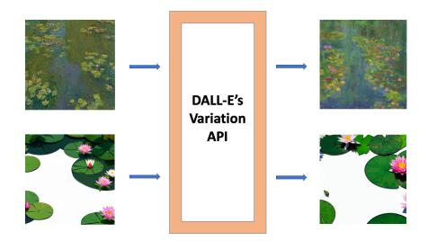

# 面向扩散模型的黑盒成员推断攻击
Towards Black-Box Membership Inference Attack for Diffusion Models

## 文档说明

- GitHub PDF：[2024-arxiv-towards-black-box-membership-inference-diffusion-models.pdf](https://github.com/DeliciousBuding/DiffAudit-Research/blob/main/references/materials/black-box/2024-arxiv-towards-black-box-membership-inference-diffusion-models.pdf)
- 对应报告：[论文报告：Towards Black-Box Membership Inference Attack for Diffusion Models](https://www.feishu.cn/docx/C8qcdxXjpoK3VyxMCzGcxUaOnXg)
- 开源实现：[lijingwei0502/diffusion_mia](https://github.com/lijingwei0502/diffusion_mia)
- 整理说明：本稿基于 born-digital Markdown 导出结果整理，保留论文主干章节、关键公式与关键图，供飞书中连续阅读与检索。

---

# Towards Black-Box Membership Inference Attack for Diffusion Models

Jingwei Li, Jing Dong, Tianxing He, Jingzhao Zhang

## Abstract

Given the rising popularity of AI-generated art and the associated copyright concerns, identifying whether an artwork was used to train a diffusion model is an important research topic. The paper studies this problem from the perspective of membership inference attacks. It points out that previous attacks for diffusion models usually require access to internal denoising components such as the U-Net, which is unrealistic for proprietary systems. To address this limitation, the authors propose REDIFFUSE, a black-box attack that uses only the image-to-image variation API. The main idea is that repeated variation of a member image will on average stay closer to the original image. The paper validates this idea on DDIM, Stable Diffusion, and Diffusion Transformer.

## 1. Introduction

Diffusion models are now widely used for unconditional image generation, text-to-image generation, and image-to-image editing. Their practical success also intensifies concerns about copyright, privacy, and whether a particular image has been used during training. The paper frames this concern as a membership inference problem: decide whether a target image was part of the training set of a diffusion model.

Prior work has already shown that members tend to yield lower loss or more accurate noise prediction. However, most of these methods still require internal model access, especially access to the U-Net or equivalent intermediate denoising outputs. This restriction makes them hard to apply to commercial systems that only provide API access.

The paper therefore studies a stricter black-box setting based on the variation API. The central observation is that if a target image has been seen during training, repeated variation outputs tend to remain in a smaller attraction region around the original image. Based on this intuition, the authors propose REDIFFUSE.

## 2. Related Works

The paper reviews three strands of related work. The first is the development of diffusion models, including DDPM, DDIM, Stable Diffusion, and Diffusion Transformer. The second is the broader literature on membership inference for classifiers, embedding models, and generative models. The third is existing MIA work on diffusion models, including loss-based and intermediate-noise-based attacks. The key distinction emphasized by this paper is that earlier diffusion MIA methods still rely on internal denoiser outputs, while REDIFFUSE only assumes black-box access to a variation API.

## 3. Preliminary

For DDPM, the paper recalls the forward and reverse process:

$$<equation>q(x_t \mid x_{t-1}) = \mathcal{N}\!\left(x_t;\sqrt{1-\beta_t}\,x_{t-1},\beta_t\mathbf{I}\right)</equation>$$

$$<equation>p_{\theta}(x_{t-1}\mid x_t) = \mathcal{N}\!\left(x_{t-1};\mu_{\theta}(x_t,t),\Sigma_{\theta}(x_t,t)\right)</equation>$$

For DDIM, the sampling rule becomes

$$<equation>x_{t-1}=\phi_{\theta}(x_t,t)=\sqrt{\bar{\alpha}_{t-1}}\left(\frac{x_t-\sqrt{1-\bar{\alpha}_t}\,\epsilon_{\theta}(x_t,t)}{\sqrt{\bar{\alpha}_t}}\right)+\sqrt{1-\bar{\alpha}_{t-1}}\,\epsilon_{\theta}(x_t,t)</equation>$$

Stable Diffusion moves diffusion into latent space:

$$<equation>z_{t-1}\sim p_{\theta}(z_{t-1}\mid z_t,\tau_{\theta}(y)), \qquad x=\mathrm{Decoder}(z_0)</equation>$$

Diffusion Transformer keeps the same training and sampling logic as DDIM, while replacing the U-Net backbone with a transformer-based denoiser.

## 4. Algorithm Design

### 4.1 The variation API for Diffusion Models

The paper formalizes the variation API `V_{\theta}(x,t)` as a black-box interface that first adds `t`-step Gaussian noise to an image and then denoises it through the reverse process:

$$<equation>x_t = \sqrt{\bar{\alpha}_t}x + \sqrt{1-\bar{\alpha}_t}\,\epsilon</equation>$$

$$<equation>V_{\theta}(x,t)=\Phi_{\theta}(x_t,0)=\phi_{\theta}(\cdots\phi_{\theta}(\phi_{\theta}(x_t,t),t-1),0)</equation>$$

This definition matches practical image-to-image variation services and avoids any access to internal noise prediction.

### 4.2 REDIFFUSE

The key intuition is that for training images, the prediction error around the target point is closer to an unbiased estimator. Starting from the DDIM loss

$$<equation>L(\theta)=\mathbb{E}_{\epsilon\sim\mathcal{N}(0,\mathbf{I})}\left[\left\|\epsilon-\epsilon_{\theta}\!\left(\sqrt{\bar{\alpha}_t}x_0+\sqrt{1-\bar{\alpha}_t}\epsilon,t\right)\right\|^2\right]</equation>$$

the paper argues that for member images, repeated variation outputs will average back toward the original image. The attack therefore queries the variation API `n` times, averages the outputs, and compares the average reconstruction with the original image.

Figure 1 shows the full REDIFFUSE pipeline: repeated black-box queries, averaged reconstruction, and threshold-based membership decision.

The attack rule is

$$<equation>\hat{x}=\frac{1}{n}\sum_{i=1}^{n}\hat{x}_i, \qquad f(x)=\mathbf{1}[D(x,\hat{x})<\tau]</equation>$$

For DDIM and Diffusion Transformer, the paper uses the difference image `v = x - \hat{x}` and a ResNet-18 proxy classifier. For Stable Diffusion, it directly uses SSIM as the similarity function.

The paper further provides a concentration-style bound:

$$<equation>\mathbb{P}(\|\hat{x}-x\|\ge\beta)\le d\exp\!\left(-n\min_i\Psi_{X_i}^{*}\!\left(\frac{\beta\sqrt{\bar{\alpha}_t}}{\sqrt{d(1-\bar{\alpha}_t)}}\right)\right)</equation>$$

This bound is used to justify why increasing the averaging number can reduce reconstruction error for member images.

### 4.3 MIA on Other Diffusion Models

The paper extends the same idea to Stable Diffusion and Diffusion Transformer. For Stable Diffusion, the variation API is defined in latent space:

$$<equation>z=\mathrm{Encoder}(x), \quad z_t=\sqrt{\bar{\alpha}_t}z+\sqrt{1-\bar{\alpha}_t}\epsilon, \quad \hat{z}=\Phi_{\theta}(z_t,0), \quad \hat{x}=\mathrm{Decoder}(\hat{z})</equation>$$

For Diffusion Transformer, the attack remains unchanged except that the U-Net is replaced by a transformer-based denoiser.

## 5. Experiments

### 5.1 Setup

The evaluation covers DDIM, Diffusion Transformer, and Stable Diffusion. DDIM is trained on CIFAR-10, CIFAR-100, and STL10-Unlabeled with `T = 1000`, `k = 100`, `t = 200`, and `n = 10`. Diffusion Transformer is trained on ImageNet at `128 x 128` and `256 x 256`, with `t = 150`, `k = 50`, and `n = 10`. Stable Diffusion uses `stable-diffusion-v1-4`, with LAION-5B as members and COCO2017-val as non-members, under both ground-truth text and BLIP-generated text.

The baselines are Loss, SecMI, PIA, and PIAN. Metrics are AUC, ASR, and TP at `FPR = 1%`.

### 5.2 Main Results

On DDIM, REDIFFUSE reaches AUC `0.96`, `0.98`, and `0.96` on CIFAR-10, CIFAR-100, and STL10. On Diffusion Transformer, it reaches AUC `0.98` on ImageNet `128 x 128` and `0.97` on ImageNet `256 x 256`. On Stable Diffusion, it achieves AUC `0.81` with ground-truth text and `0.82` with BLIP-generated text. The paper emphasizes that these results outperform prior baselines while requiring strictly weaker access assumptions.

The paper also studies the effect of averaging number, diffusion step, and sampling interval. Averaging improves DDIM and Diffusion Transformer, while Stable Diffusion is less sensitive because its reconstructions are already comparatively stable.

## 6. An Application to DALL-E 2's API

The paper includes an online black-box case study on DALL-E 2 because DALL-E 2 provides a variation API. Since its training data is undisclosed, the authors use famous paintings as approximate members and images generated by Stable Diffusion 3 from the same titles as non-members.

Figure 6 illustrates the central observation of the online experiment: the DALL-E 2 variation API changes famous paintings less than matched non-member images, suggesting that API behavior alone may reveal training participation.

The reported results are:

- `AUC = 76.2`, `ASR = 74.5` with `L1` distance
- `AUC = 88.3`, `ASR = 81.4` with `L2` distance

The paper explicitly notes that this evaluation is only approximate because the true DALL-E 2 training set is unknown.

## 7. Conclusion, Limitations and Future Directions

The paper concludes that REDIFFUSE provides a practical black-box membership inference attack for diffusion models by using only the variation API. It argues that this makes the method relevant for proprietary diffusion services that do not reveal internal denoising states.

At the same time, the paper acknowledges several limitations. The theoretical analysis depends on strong assumptions about local unbiased prediction error. The online DALL-E 2 experiment uses approximate rather than verified members. The attack also becomes weaker when the diffusion step is too high. These limitations leave room for more realistic black-box evaluations and stronger theory in future work.
