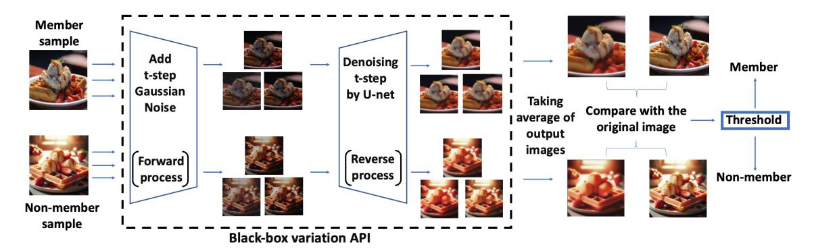
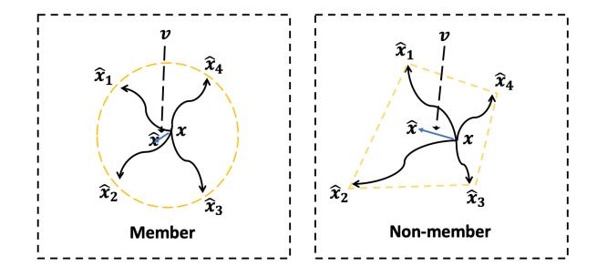

process (denoted as pθ) gradually reconstructs the image from noise.

$$q(x_t \mid x_{t-1}) = \mathcal{N}\left(x_t; \sqrt{1 - \beta_t} x_{t-1}, \beta_t \mathbf{I}\right),$$
  
$$p_{\theta}(x_{t-1} \mid x_t) = \mathcal{N}\left(x_{t-1}; \mu_{\theta}(x_t, t), \Sigma_{\theta}(x_t, t)\right),$$

where µθ(·) and Σθ(·) are the mean and covariance of the denoised image parameterized by the model parameters θ, and βt is a noise schedule that controls the amount of noise added at each step.

Denoising Diffusion Implicit Model (DDIM) DDIM modifies the sampling process to improve efficiency while maintaining high-quality image generation. Unlike DDPM, which requires a large number of denoising steps, DDIM uses a non-Markovian process to accelerate sampling.

$$x_{t-1} = \phi_{\theta}(x_t, t) = \sqrt{\bar{\alpha}_{t-1}} \left( \frac{x_t - \sqrt{1 - \bar{\alpha}_t} \epsilon_{\theta}(x_t, t)}{\sqrt{\bar{\alpha}_t}} \right) + \sqrt{1 - \bar{\alpha}_{t-1}} \epsilon_{\theta}(x_t, t),$$

where α¯t = Qt k=0 αk, αt + βt = 1 and ϵθ(xt, t) is the noise predicted by the model at step t. This formulation requires fewer sampling steps without compromising the quality of the generated images.

Stable Diffusion Stable Diffusion leverages a variational autoencoder (VAE) [\(Kingma & Welling,](#page-9-0) [2013\)](#page-9-0) to encode images into a latent space and perform diffusion in this compressed space. The model uses a text encoder to guide the diffusion process, enabling text-to-image generation:

$$z_{t-1} \sim p_{\theta}(z_{t-1} \mid z_t, \tau_{\theta}(y)), \quad x = \text{Decoder}(z_0),$$

where x represents the output image, zt represents the latent variable at step t, and the text conditioning τθ(y) is incorporated into the denoising process to generate the image. This approach significantly reduces computational costs and allows for high-quality image synthesis from textual descriptions.

Diffusion Transformer Diffusion Transformer leverages the Vision Transformer [\(Dosovitskiy,](#page-8-0) [2020\)](#page-8-0) structure to replace the U-net architecture traditionally used in diffusion models for noise prediction. Its training and sampling methods remain consistent with DDIM, with the only difference being the replacement of noise prediction network ϵθ with ϵ θ˜, where ˜θ represents a Vision Transformer-based architecture. This approach further enhances the generation quality and ensured that the model possesses good scalability properties.

## 4. Algorithm Design

In this section, we introduce our algorithm. We begin by discussing the definition of variation API and the limitations of previous membership inference attack methods. In our formulations, we assume DDIM as our target model. The formulations for DDPM are highly similar and we omit it for brevity. We will discuss the generalization to the latent diffusion model in Section [4.3.](#page-4-0)

## 4.1. The variation API for Diffusion Models

Most previous works on membership inference attacks against diffusion models aim to prevent data leakage and hence rely on thresholding the model's training loss. For instance, [Hu & Pang](#page-8-1) [\(2023\)](#page-8-1) involves a direct comparison of image losses, while [Duan et al.](#page-8-2) [\(2023\)](#page-8-2); [Kong et al.](#page-9-1) [\(2023\)](#page-9-1) evaluates the accuracy of the model's noise prediction at initial or intermediate steps. However, the required access to the model's internal U-net structure prevents applications from copyright protection because most servers typically provide only black-box API access.

In contrast, our method represents a step towards blackbox MIA, as we do not directly access the model's internal structure. Instead, we rely solely on the variation API, which takes an input image and returns the corresponding output image. Below, we formalize the definition of the variation API used in our algorithm.

Definition 4.1 (The variation API). We define the variation API Vθ(x, t) of a model as follows. Suppose we have an input image x, and the diffusion step of the API is t. The variation API randomly adds t-step Gaussian noise ϵ ∼ N (0, I) to the image and denoises it using the DDIM sampling process ϕθ(xt, t), returning the reconstructed image Vθ(x, t). The details are as follows:

$$x_t = \sqrt{\bar{\alpha}_t} x + \sqrt{1 - \bar{\alpha}_t} \epsilon,$$

$$V_{\theta}(x, t) = \Phi_{\theta}(x_t, 0) = \phi_{\theta}(\cdots \phi_{\theta}(\phi_{\theta}(x_t, t), t - 1), 0).$$

This definition aligns with the image-to-image generation method of the diffusion model, making access to this API practical in many setups [\(Lugmayr et al.,](#page-9-2) [2022;](#page-9-2) [Saharia](#page-9-3) [et al.,](#page-9-3) [2022a;](#page-9-3) [Wu & De la Torre,](#page-10-0) [2023\)](#page-10-0). Some APIs provide the user with a choice of t, while others do not and use the default parameter. We will discuss the influence of different diffusion steps in Section [5.5,](#page-6-0) showing that the attack performances are relatively stable and not sensitive to the selection of t. We also note that for the target model, we can substitute ϕθ(xt, 0) with other sampling methods, such as the Euler-Maruyama Method [\(Mao,](#page-9-4) [2015\)](#page-9-4) or Variational Diffusion Models [\(Kingma et al.,](#page-9-5) [2021\)](#page-9-5).

## 4.2. Algorithm

In this section, we present the intuition of our algorithm. We denote ∥ · ∥ as the L2 operator norm of a vector and T = {1, 2, . . . , T} as the set of diffusion steps. The key insight is derived from the training loss function of a fixed

Figure 1: The overview of REDIFFUSE. We independently input the image to the variation API n times with diffusion step t. We take the average of the output images and compare them with the original ones. If the difference is below a certain threshold, we determine that the image is in the training set.

.

sample x0 and a time step t ∈ T :

$$L(\theta) = \mathbb{E}_{\epsilon \sim \mathcal{N}(0, \mathbf{I})} \left[ \left\| \epsilon - \epsilon_{\theta} \left( \sqrt{\bar{\alpha}_{t}} x_{0} + \sqrt{1 - \bar{\alpha}_{t}} \epsilon, t \right) \right\|^{2} \right]$$

Denote xt = √ α¯tx0 + √ 1 − α¯tϵ, we assume that the denoise model is expressive enough (the neural network's dimensionality significantly exceeds that of the image data) such that for the input x0 ∈ R d and time step t ∈ T , the Jacobian matrix ∇θϵθ(xt, t) is full rank (≥ d). This suggests that the model can adjust the predicted noise ϵθ(xt, t) locally in any direction. Then for a well trained model, we would have ∇θL(θ) = 0. This implies

$$\Rightarrow \nabla_{\theta} \epsilon_{\theta}(x_t, t)^T \mathbb{E}_{\epsilon \sim \mathcal{N}(0, \mathbf{I})} \left[ \epsilon - \epsilon_{\theta} (x_t, t) \right] = 0,$$
  
$$\Rightarrow \mathbb{E}_{\epsilon \sim \mathcal{N}(0, \mathbf{I})} \left[ \epsilon - \epsilon_{\theta} (x_t, t) \right] = 0.$$

This is intuitive because if the neural network noise prediction exhibits a high bias, the network can adjust to fit the bias term, further reducing the training loss.

Therefore, for images in the training set, we expect the network to provide an unbiased noise prediction. Since the noise prediction is typically inaccessible in practical applications, we use the reconstructed sample xˆ as a proxy. By leveraging the unbiasedness of noise prediction, we show that averaging over multiple independent reconstructed samples xˆi can significantly reduce estimation error (see Theorem [4.2\)](#page-3-0). However, for images not in the training set, the neural network may not provide an unbiased prediction at these points. The intuition is illustrated in Figure [2.](#page-3-1)

With the above intuition, we introduce the details of our algorithm. We independently apply the variation API n times with our target image x as input, average the output images, and then compare the average result xˆ with the original image. We will discuss the impact of the averaging number n in Section [5.5.](#page-6-0) We then evaluate the difference between the images using an indicator function:

$$f(x) = \mathbf{1} \left[ D(x, \hat{x}) < \tau \right] .$$

Figure 2: The intuition of our algorithm design. We denote x as the target image, xˆi as the i-th image generated by the variation API, and xˆ as the average image of them. For member image x, the difference v = x − xˆ will be smaller after averaging due to xi being an unbiased estimator.

Our algorithm classifies a sample as being in the training set if D(x, xˆ) is smaller than a threshold τ , where D(x, xˆ) represents the difference between the two images. It can be calculated using traditional functions, such as the SSIM metric [\(Wang et al.,](#page-10-1) [2004\)](#page-10-1). Alternatively, we can train a neural network as a proxy. In Section [5,](#page-4-1) we will introduce the details of D(x, xˆ) used in our experiment.

Our algorithm is outlined in Algorithm [1,](#page-4-2) and we name it REDIFFUSE. The key ideas of our algorithm are illustrated in Figure [1,](#page-3-2) and we also provide some theoretical analysis in Theorem [4.2](#page-3-0) to support it.

Analysis We give a short analysis to justify why averaging over n samples in REDIFFUSE can reduce the prediction error for training data. We have the following theorem showing that if we use the variation API to input a member x ∼ Dtraining, then the error ∥xˆ − x∥ from our method will be small with high probability.

Theorem 4.2. *Suppose the DDIM model can learn a parameter* θ *such that, for any* x ∼ D*training with dimension* d*, the prediction error* ϵ − ϵθ( √ α¯tx + √ 1 − α¯tϵ, t) *is a ran-*