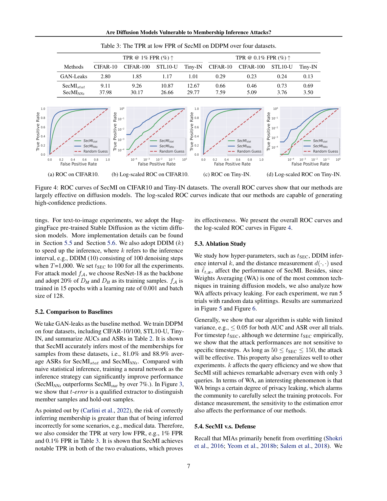

# 扩散模型是否易受成员推断攻击？
Are Diffusion Models Vulnerable to Membership Inference Attacks?

## 文档说明

- GitHub PDF：[2023-icml-secmi-membership-inference-diffusion-models.pdf](https://github.com/DeliciousBuding/DiffAudit/blob/main/references/materials/gray-box/2023-icml-secmi-membership-inference-diffusion-models.pdf)
- 对应报告：[论文报告：Are Diffusion Models Vulnerable to Membership Inference Attacks?](https://www.feishu.cn/docx/ALF5d68CpoIXePxkUUBcnJ0cnPb)
- 开源实现：[jinhaoduan/SecMI](https://github.com/jinhaoduan/SecMI)
- 整理说明：本稿基于 born-digital Markdown 导出结果整理，保留原论文章节主干，并尽量保留关键公式与关键图。

---

## 1. 论文定位

这篇论文是扩散模型成员推断方向的奠基性灰盒工作。文章的意义不只是提出一个新攻击器，而是先系统验证既有生成模型成员推断方法在扩散模型上的失效，再给出与扩散训练目标直接对齐的替代攻击思路。因此，它更适合作为灰盒路线的主论文，而不是单一技巧论文。

## 2. 核心问题

作者要回答的核心问题可以分成两层。第一层是现象判断：扩散模型是否真的缺乏成员泄露，还是既有攻击方法观测错了对象。第二层是机制判断：如果泄露存在，最可靠的成员信号究竟应落在何处。论文的回答是，扩散模型并不天然规避成员推断；真正有效的信号来自 step-wise posterior estimation error，也就是模型在特定时间步上拟合前向后验的误差。

## 3. 威胁模型与前提

论文采用 query-based 的灰盒设定。攻击者掌握候选样本 `x_0`，可以对目标扩散模型执行 deterministic reverse 与 deterministic denoise，或得到与此等价的中间状态，从而计算单样本 `t-error`。攻击者不需要参数梯度，也不需要知道真实训练集划分；但是若使用 `SecMI_NNs`，则需要额外采样一小部分 member / hold-out 样本来训练攻击模型。该设定显著强于只见最终图像的黑盒 API，因此论文结论的外推边界必须明确限定在“中间时间步可访问”这一前提上。

## 4. 方法总览

论文的基本直觉是，成员样本在训练中被“记住”得更充分，因此模型在某个时间步上对它的后验估计误差通常更小。作者先从扩散模型的训练目标出发，把成员泄露问题落到 posterior matching 误差上；随后借助 deterministic reverse 和 deterministic denoise，把原本难以解析计算的单样本 posterior estimation error 近似成可直接求值的 `t-error`；最后再基于该信号做成员判定。

与既有 GAN/VAE 攻击不同，`SecMI` 不比较最终生成样本与训练样本的距离，也不依赖判别器输出。它观察的是扩散模型在中间时间步上的局部拟合误差，因此攻击对象从“最终生成质量”转向了“过程中的后验估计能力”。这一点正是论文最重要的结构性变化。

## 5. 方法概览 / 流程

完整流程可以写成一条误差抽取链。给定待测样本后，攻击者先选择固定的 `t_{\mathrm{sec}}`；然后把样本推进到对应时间步，并通过 deterministic reverse 得到该步的中间状态；接着再执行一步 deterministic denoise，计算往返前后的偏差；最后把这个偏差作为统计量或误差图，分别输入 `SecMI_stat` 或 `SecMI_NNs`，输出成员判定。论文还专门分析了时间步选择，发现 `50 \le t_{\mathrm{sec}} \le 150` 时攻击通常都较稳定。

## 6. 关键技术细节

从训练目标看，扩散模型在每一步都在拟合前向扩散的真实后验，其单步目标可写为：

$$
\ell_t = \mathbb{E}_q \left[\frac{1}{2\sigma_t^2}\left\| \tilde{\mu}_t(x_t, x_0) - \mu_\theta(x_t, t) \right\|^2 \right].
$$

该式说明，单步后验均值估计误差本来就是扩散训练直接优化的对象。因此，一旦成员样本因为过拟合而被拟合得更充分，它在某些时间步上的误差就更可能偏小。论文正是把这一观察转化为成员推断的可操作信号。

困难在于真实 posterior estimation error 涉及随机扩散链条，直接求解代价很高。为此，作者改用 deterministic reverse 与 deterministic denoise 的近似组合，定义：

$$
\tilde{\ell}_{t,x_0} = \left\| \psi_\theta\!\left(\phi_\theta(\tilde{x}_t, t), t\right) - \tilde{x}_t \right\|^2.
$$

这个 `t-error` 在实现上足够简单，却保留了论文真正需要的比较信息。实验中，hold-out 样本的 `t-error` 普遍大于 member 样本，且当 `t` 更靠近 0 时，这种差距更明显。作者的解释是，较小时间步包含更多与原图相关的信息，因此更容易暴露记忆程度差异。

基于这个信号，最简单的成员判定规则为：

$$
\mathcal{M}(x_0,\theta) = \mathbf{1}\!\left[\tilde{\ell}_{t_{\mathrm{sec}},x_0} \le \tau \right].
$$

这就是 `SecMI_stat`。而 `SecMI_NNs` 则进一步利用像素级绝对误差图：

$$
\mathcal{M}(x_0,\theta) = \mathbf{1}\!\left[f_{\mathcal{A}}\!\left(\left|\psi_\theta\!\left(\phi_\theta(\tilde{x}_t, t), t\right) - \tilde{x}_t\right|\right) \le \tau \right].
$$

前者证明单个标量已经包含成员信号，后者说明误差图空间分布还能继续提升攻击性能。这种“先证明信号存在，再提高利用效率”的写法，使论文的方法链条比较完整。

## 7. 实验设置

DDPM 场景覆盖 CIFAR-10、CIFAR-100、STL10-U 和 Tiny-ImageNet，并把各自训练集按 `50%/50%` 划分为 member 与 hold-out。文本到图像场景中，LDM 在 Pokemon 和 COCO2017-val 上评估，Stable Diffusion v1-4 / v1-5 则用 Laion-aesthetic-5plus 与 COCO2017-val 组成成员与非成员对照。实验指标采用 `ASR`、`AUC`、`TPR@1%FPR` 和 `TPR@0.1%FPR`，这与高风险 MIA 评估中强调低误报区间的做法一致。

实现上，论文统一取 `t_{\mathrm{sec}} = 100`，采用 `DDIM(k)` 降低查询代价，并在 `SecMI_NNs` 中使用 ResNet-18 作为攻击模型，训练数据为少量 member / hold-out 子集。基线包括 LOGAN、TVD、Over-Representation、Monte-Carlo Set 和 GAN-Leaks。这样的设置使论文既能回答“旧方法是否有效”，也能回答“新信号是否显著更强”。

## 8. 主要结果

首先，旧生成模型 MIA 在 DDPM 上大多失效。论文对 CIFAR-10 的系统比较显示，除极少数设置外，既有方法整体接近随机；但 `SecMI_stat` 和 `SecMI_NNs` 的 `ASR` 已分别达到 `0.811` 与 `0.888`。这一步很关键，因为它把“方法更强”建立在“旧观测对象选错了”之上，而不是简单宣称自己调参更好。

其次，`SecMI` 在 DDPM 四个数据集上表现稳定。按论文汇总结果，`SecMI_stat` 的平均 `ASR/AUC` 为 `0.810/0.881`，`SecMI_NNs` 为 `0.889/0.949`。在更严格的低误报区间，`SecMI_NNs` 的 `TPR@1%FPR` 最高达到 `37.98%`，`TPR@0.1%FPR` 最高达到 `7.59%`。这说明该方法不是只在宽松阈值下有效，而是在高置信度判断下也保留了可利用信号。

第三，方法能够迁移到文本到图像模型，但效果会随着任务复杂度上升而下降。LDM 在 Pokemon 与 COCO2017-val 上分别达到 `0.891` 与 `0.875` 的 `AUC`；而 Stable Diffusion v1-4 / v1-5 的 `AUC` 分别为 `0.707` 与 `0.701`。尤其在 COCO2017-val 上，prompt 缺失会使效果明显下降，但使用 BLIP 生成伪 prompt 后又能回升，说明侧信息质量直接影响攻击强度。

这张图对阅读整篇论文很关键，因为它把总体 ROC 与 log-scale 低 FPR 区域同时放在一个视图里。对于团队展示，它能直接回答“这不是只在平均意义上可分，而是在低误报要求下也有成员信号”。

## 9. 优点

论文最大的优点是把攻击信号与扩散训练目标直接对齐，避免了把旧生成模型假设生搬硬套到扩散模型上。第二，实验范围覆盖 DDPM、LDM 和 Stable Diffusion，说明现象并非只在 toy setting 上成立。第三，作者同时报告平均指标与低 FPR 指标，使风险表述更接近真实成员推断场景。

## 10. 局限与有效性威胁

局限同样比较明确。最重要的是访问假设偏强，现实产品往往不会开放中间时间步结果。其次，`SecMI_NNs` 依赖少量带标签的攻击训练数据，方法成本高于单纯阈值规则。再次，防御实验的结论并不充分，因为 DP-SGD、强正则和 RandAugment 让 DDPM 训练失败，不能据此直接推出“防御有效”。最后，文本到图像实验对 prompt 的依赖表明，攻击性能并不只由模型记忆程度决定，还与条件侧信息是否准确强相关。

## 11. 对 DiffAudit 的价值

这篇论文对 DiffAudit 的意义首先在于路线定位。它为灰盒成员推断提供了第一篇能够作为主基准的论文，明确告诉我们：如果可以访问扩散中间状态，那么最自然的观测量是 `t-error` 一类的 step-wise posterior estimation error。其次，它也给出路线边界：当产品接口无法提供这类中间状态时，就不应继续把 `SecMI` 当成原样可部署方法，而应转向更弱访问假设的后续论文。最后，在研究叙事上，它是解释灰盒路线为何成立的最佳入口，因为它先证明旧方法无效，再说明新信号为什么有效。

## 12. 关键图使用方式

本稿只保留 1 张图，即 ROC 主结果图。展示稿中最重要的是回答“扩散模型到底有没有被可靠区分出来”，因此优先保留结果图而不是方法图。方法部分已经可以通过文字与公式清楚说明，继续加入流程图并不能显著提升理解效率，反而会挤占展示空间。

## 13. 复现评估

从论文层面看，复现 `SecMI` 需要五类关键资产：目标模型权重、严格成员 / 非成员划分、deterministic reverse / denoise 推理接口、固定的 `t_{\mathrm{sec}}` 与 `DDIM(k)` 参数，以及文本到图像场景下的 prompt 获取方案。真正的结构性阻塞是中间状态接口而不是攻击分类器本身，因为没有这类接口就无法得到与论文定义一致的 `t-error`。因此，若要在 DiffAudit 中落地，最短路径应是先完成 DDPM 上的 `SecMI_stat` 原型，再逐步增加 `SecMI_NNs`、prompt 替代和大模型迁移。

## 14. 写回总索引用摘要

这篇论文研究扩散模型上的成员推断风险，核心判断是：扩散模型并不天然安全，只是传统 GAN/VAE 攻击没有抓住扩散训练过程中的真正泄露接口。

作者提出 `SecMI`，通过 deterministic reverse 与 deterministic denoise 近似单样本在某个时间步上的 posterior estimation error，并用 `t-error` 执行阈值版或神经网络版成员判定。结果显示，该方法在 DDPM 上效果显著，在 LDM 与 Stable Diffusion 上也保持高于随机的可分性。

它对 DiffAudit 的价值在于确立了灰盒路线的基准接口与边界：如果具备中间时间步观测能力，`SecMI` 是必须对齐的主论文；如果不具备，就需要明确转向更弱访问假设的方法，而不能直接套用本文结论。
