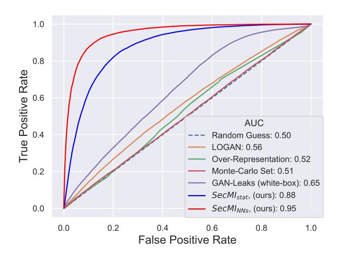
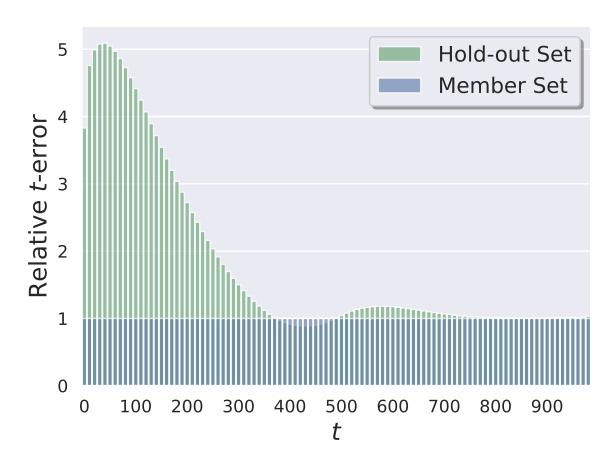
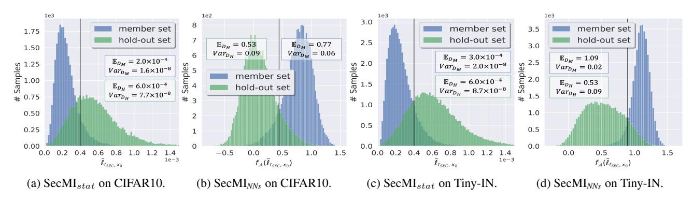
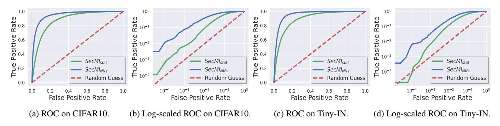
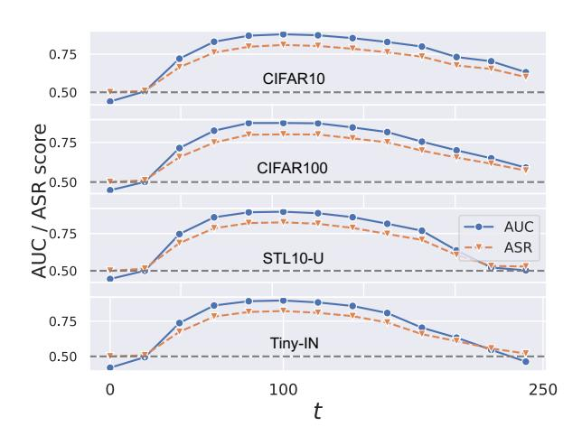
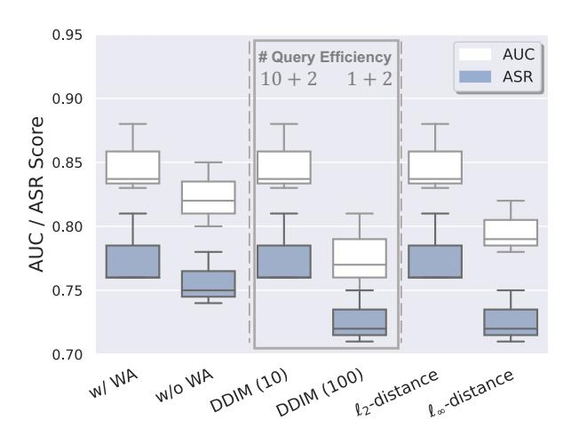
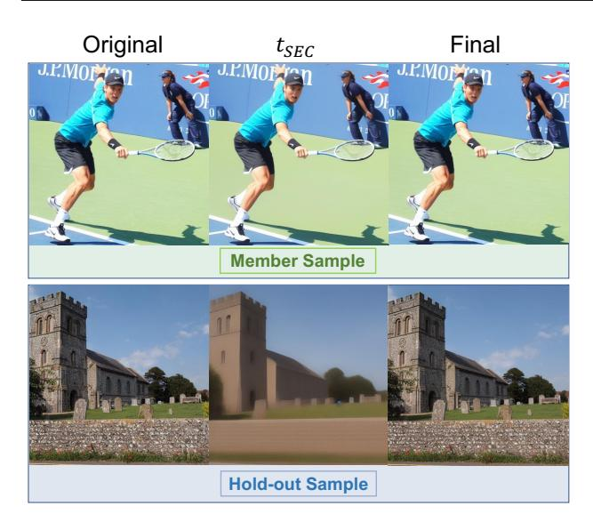
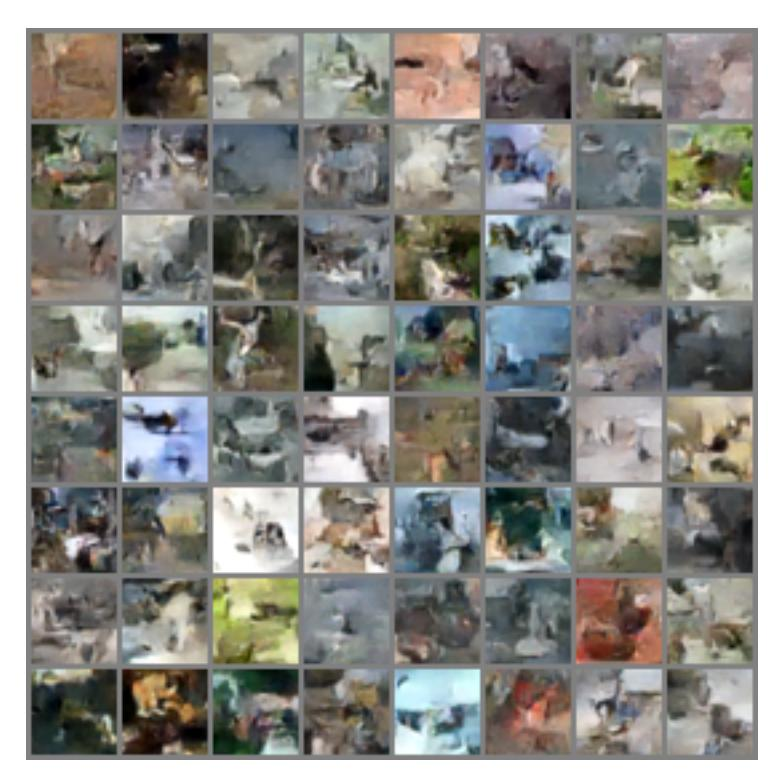
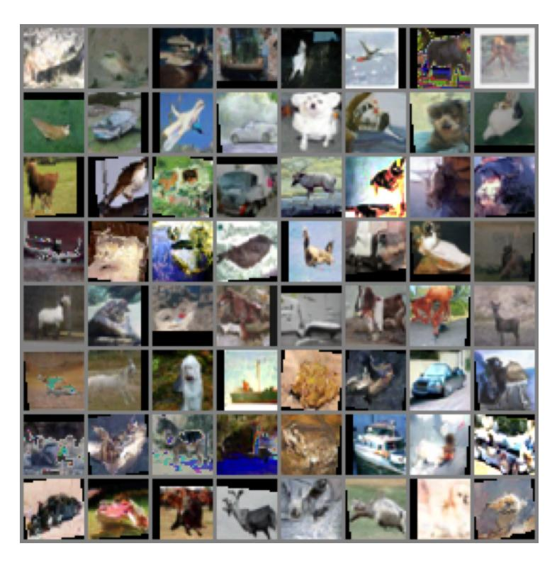

# Are Diffusion Models Vulnerable to Membership Inference Attacks?

Jinhao Duan 1 Fei Kong 2 Shiqi Wang 3 Xiaoshuang Shi 2 Kaidi Xu 1

## Abstract

Diffusion-based generative models have shown great potential for image synthesis, but there is a lack of research on the security and privacy risks they may pose. In this paper, we investigate the vulnerability of diffusion models to Membership Inference Attacks (MIAs), a common privacy concern. Our results indicate that existing MIAs designed for GANs or VAE are largely ineffective on diffusion models, either due to inapplicable scenarios (e.g., requiring the discriminator of GANs) or inappropriate assumptions (e.g., closer distances between synthetic samples and member samples). To address this gap, we propose *Step-wise Error Comparing Membership Inference* (SecMI), a query-based MIA that infers memberships by assessing the matching of forward process posterior estimation at each timestep. SecMI follows the common overfitting assumption in MIA where member samples normally have smaller estimation errors, compared with hold-out samples. We consider both the standard diffusion models, e.g., DDPM, and the text-to-image diffusion models, e.g., Latent Diffusion Models and Stable Diffusion. Experimental results demonstrate that our methods precisely infer the membership with high confidence on both of the two scenarios across multiple different datasets. Code is available at [https:](https://github.com/jinhaoduan/SecMI) //github.[com/jinhaoduan/SecMI](https://github.com/jinhaoduan/SecMI).

## 1. Introduction

Recently, diffusion models [\(Song & Ermon,](#page-11-0) [2019;](#page-11-0) [Song](#page-11-1) [et al.,](#page-11-1) [2020b;](#page-11-1) [Ho et al.,](#page-9-0) [2020\)](#page-9-0) have dominated the image generation fields. Large-scale diffusion models, such as Stable Diffusion [\(Rombach et al.,](#page-10-0) [2022\)](#page-10-0), DALLE-2 [\(Ramesh](#page-10-1)

*Proceedings of the* 40 th *[International Conference on Machine](#page-10-1) Learning*[, Honolulu, Hawaii, USA. PMLR 202, 2023. Copyright](#page-10-1) [2023 by the author\(s\).](#page-10-1)

[et al.,](#page-10-1) [2022\)](#page-10-1), Imagen [\(Saharia et al.,](#page-10-2) [2022\)](#page-10-2), achieve remarkable fidelity and utility in text-to-image generation. Images generated by these models are full of diversity and creativity, which may profoundly change the way of human creation.

However, tremendous privacy risks [\(Bommasani et al.,](#page-9-1) [2021\)](#page-9-1) and copyright disputes [\(Ihalainen,](#page-9-2) [2018\)](#page-9-2) are emerging, with the deployment of these generative models. For example, previous works demonstrate that GANs [\(Goodfellow](#page-9-3) [et al.,](#page-9-3) [2020\)](#page-9-3)/VAEs [\(Kingma & Welling,](#page-10-3) [2013\)](#page-10-3)-based generative models suffer from privacy leaking [\(Hayes et al.,](#page-9-4) [2017\)](#page-9-4) and data reconstruction [\(Zhang et al.,](#page-11-2) [2020\)](#page-11-2) issues, yet we are still unaware of whether diffusion models have similar concerns. On the other side, artists are getting unions against commercial large-scale generative models recently [\(BBC,](#page-9-5) [2022;](#page-9-5) [CNN,](#page-9-6) [2022;](#page-9-6) [WashingtonPost,](#page-11-3) [2022\)](#page-11-3), since the creations of human artists may be exploited unauthorizedly. Lots of security assessments and risk screening need to be addressed before releasing these models.

Membership Inference Attacks (MIAs) [\(Shokri et al.,](#page-10-4) [2016\)](#page-10-4) is one of the most common privacy risks that associated with various privacy concerns. For a given pre-trained model, MIAs aim to identify the membership of a single sample as *member sample* that comes from the member set (training set), or as *hold-out sample* that comes from the hold-out set. Although MIAs have been well explored in the classic classification models and conventional generative models, related works on diffusion models are still missing in the literature. In this paper, we intend to answer the following question:

*Are diffusion-based generative models vulnerable to MIAs?*

We first summarize existing MIAs designed for conventional generative models and evaluate their performances in the diffusion model setting. Specifically, we summarize five MIAs and make them available to the diffusion models by either training shadow models [\(Shokri et al.,](#page-10-5) [2017\)](#page-10-5) or providing the required information in an alternative manner. Our results indicate that these methods are largely ineffective for diffusion models due to various potential reasons, such as more standard and stronger evaluations with larger member sets, limited exploitation of the specific properties of diffusion models, and inappropriate assumptions, i.e., synthetic images are closer to member images [\(Hu & Pang,](#page-9-7) [2021;](#page-9-7) [Chen et al.,](#page-9-8) [2020;](#page-9-8) [Mukherjee et al.,](#page-10-6) [2021\)](#page-10-6). The lack-

1Drexel University 2[University of Electronic Science and Tech](#page-10-1)nology of China 3[AWS AI Lab. Correspondence to: Kaidi Xu](#page-10-1) <[kx46@drexel.edu](#page-10-1)>.

ing of effective MIAs may cause a false sense of security for diffusion models.

To mitigate this gap, we consider designing MIAs by leveraging the specific properties of diffusion models. Our motivation derives from the learning objectives where diffusion models are trained to match the forward process posterior distribution at each timestep with a parameterized model ϵθ [\(Ho et al.,](#page-9-0) [2020\)](#page-9-0). Recall that it is commonly known that membership privacy leaking benefits from the overfitting issue [\(Shokri et al.,](#page-10-5) [2017;](#page-10-5) [Yeom et al.,](#page-11-4) [2018a\)](#page-11-4): member samples normally are memorized "better" than hold-out samples. Therefore a natural assumption regarding the membership exposure to the diffusion models is that member samples may have smaller posterior estimation errors compared with hold-out samples.

Based on that, we propose Step-wise Error Comparing Membership Inference (SecMI) to investigate the privacy leaking of diffusion models. SecMI is a query-based MIA that only relies on the inference results and can be applied to various diffusion models. We study three popular diffusion models: DDPM [\(Ho et al.,](#page-9-0) [2020\)](#page-9-0), Latent Diffusion Models (LDMs) [\(Rombach et al.,](#page-10-0) [2022\)](#page-10-0), and Stable Diffusion, across multiple popular datasets, including CIFAR-10/100 [\(Krizhevsky et al.,](#page-10-7) [2009\)](#page-10-7), STL10-Unlabeled (STL10-U) [\(Coates et al.,](#page-9-9) [2011\)](#page-9-9), Tiny-ImageNet (Tiny-IN) for DDPM, Pokemon [\(Pinkney,](#page-10-8) [2022\)](#page-10-8) and COCO2017 val [\(Lin et al.,](#page-10-9) [2014\)](#page-10-9) for LDMs, and Laion [\(Schuhmann](#page-10-10) [et al.,](#page-10-10) [2022\)](#page-10-10) for Stable Diffusion. Our contributions can be summarized as the following:

- To the best of our knowledge, this is the first work that investigates the vulnerability of diffusion models on MIAs. We summarize conventional MIAs and evaluate their performances on diffusion models. Results show that they are largely ineffective.
- We propose SecMI, a query-based MIA relying on the error comparison of the forward process posterior estimation. We apply SecMI on both the standard diffusion model, e.g., DDPM, and the state-of-the-art text-to-image diffusion model, e.g., Stable Diffusion.
- We evaluate SecMI across multiple datasets and report attack performance, including the True-Positive Rate (TPR) at low False-Positive Rate (FPR) [\(Carlini et al.,](#page-9-10) [2022\)](#page-9-10). Experimental results show that SecMI precisely infers the membership across all the experiment settings (≥ 0.80 avg. Attack Success Rate (ASR) and ≥ 0.85 avg. Area Under Receiver Operating Characteristic (AUC)).

## 2. Related Works

Generative Diffusion Models Different from Generative Adversarial Networks (GAN) [\(Goodfellow et al.,](#page-9-3) [2020;](#page-9-3) [Yuan & Moghaddam,](#page-11-5) [2020;](#page-11-5) [Yuan et al.,](#page-11-6) [2023\)](#page-11-6), diffusion models refer to specific latent variable models that approximate the real data distribution by matching a diffusion process with a parameterized reverse process [\(Sohl-Dickstein](#page-10-11) [et al.,](#page-10-11) [2015;](#page-10-11) [Ho et al.,](#page-9-0) [2020\)](#page-9-0). The diffusion process and reverse process can be either the continuous Langevin dynamics [\(Song & Ermon,](#page-11-0) [2019\)](#page-11-0) or the discrete Markov chains [\(Ho et al.,](#page-9-0) [2020\)](#page-9-0), which are proven to be equivalent to the variance-preserving (VP) SDE in [\(Song et al.,](#page-11-1) [2020b\)](#page-11-1). Various diffusion models are proposed for speeding up inference [\(Song et al.,](#page-11-7) [2020a;](#page-11-7) [Salimans & Ho,](#page-10-12) [2022;](#page-10-12) [Dockhorn et al.,](#page-9-11) [2022;](#page-9-11) [Xiao et al.,](#page-11-8) [2022;](#page-11-8) [Watson et al.,](#page-11-9) [2022;](#page-11-9) [Rombach et al.,](#page-10-0) [2022;](#page-10-0) [Meng et al.,](#page-10-13) [2021\)](#page-10-13), conditional generation [\(Dhariwal & Nichol,](#page-9-12) [2021;](#page-9-12) [Ho & Salimans,](#page-9-13) [2022;](#page-9-13) [Meng et al.,](#page-10-13) [2021\)](#page-10-13), and multi-modality generative tasks, such as audio synthesis [\(Kong et al.,](#page-10-14) [2020\)](#page-10-14).

Membership Inference Privacy Membership Inference Attack [\(Shokri et al.,](#page-10-4) [2016\)](#page-10-4) has been widely explored for classification models. MIAs can be recognized as blackbox attacks [\(Shokri et al.,](#page-10-5) [2017;](#page-10-5) [Salem et al.,](#page-10-15) [2019;](#page-10-15) [Yeom](#page-11-10) [et al.,](#page-11-10) [2018b;](#page-11-10) [Sablayrolles et al.,](#page-10-16) [2019;](#page-10-16) [Song & Mittal,](#page-11-11) [2020;](#page-11-11) [Choquette-Choo et al.,](#page-9-14) [2021;](#page-9-14) [Hui et al.,](#page-9-15) [2021;](#page-9-15) [Truex et al.,](#page-11-12) [2019;](#page-11-12) [Salem et al.,](#page-10-17) [2018;](#page-10-17) [Pyrgelis et al.,](#page-10-18) [2017\)](#page-10-18) and white-box attacks [\(Nasr et al.,](#page-10-19) [2019;](#page-10-19) [Rezaei & Liu,](#page-10-20) [2020\)](#page-10-20), depending on the accessibility to the target models. [\(Choquette-Choo](#page-9-14) [et al.,](#page-9-14) [2021\)](#page-9-14) shows that logits are not necessary for MIA and proposes a label-only attack. [\(Carlini et al.,](#page-9-10) [2022\)](#page-9-10) reveals that MIA should be evaluated with strict metrics due to the fact that correctly and incorrectly inferring a membership are not equally important. [\(Sablayrolles et al.,](#page-10-16) [2019\)](#page-10-16) proves that black-box MIA can approximate white-box MIA performance under certain assumptions on the model weights distribution. In this paper, we mainly consider the query-based settings, i.e., only access to the query results of diffusion models.

Similarly, in terms of generative models, [\(Hayes et al.,](#page-9-4) [2017\)](#page-9-4) reveals that memberships can be effectively identified by the logits of the discriminator from GANs. [\(Hilprecht et al.,](#page-9-16) [2019\)](#page-9-16) proposes the Monte Carlo score for black-box MIA, and the Reconstruction Attack for VAE by leveraging the reconstruction loss item. The Monte Carlo score measures the distance between synthetic samples and member samples, which is further adopted by several works [\(Hu & Pang,](#page-9-7) [2021;](#page-9-7) [Chen et al.,](#page-9-8) [2020;](#page-9-8) [Mukherjee et al.,](#page-10-6) [2021\)](#page-10-6).

Concurrently, [\(Hu & Pang,](#page-9-17) [2023;](#page-9-17) [Wu et al.,](#page-11-13) [2022;](#page-11-13) [Carlini](#page-9-18) [et al.,](#page-9-18) [2023\)](#page-9-18) also investigate the MIA issues in diffusion models. [\(Wu et al.,](#page-11-13) [2022\)](#page-11-13) assumes that the member set and the hold-out set come from different distributions, which makes their MIAs much easier. Our paper follows the common "MI security game protocol" [\(Hu & Pang,](#page-9-17) [2023;](#page-9-17) [Carlini](#page-9-18) [et al.,](#page-9-18) [2023\)](#page-9-18) where the member set and the hold-out set are in the same distribution. [\(Hu & Pang,](#page-9-17) [2023\)](#page-9-17) infers mem-

Table 1: Taxonomy of MIAs against generative models over the previous works and our work. All the methods are evaluated on DDPM trained with a 50% training split of the CIFAR-10 dataset as the member set and take the rest of the training split as the hold-out set. DMs stands for Diffusion Models.

| Attack Type | Method                                    | Discriminator | Generator | Synthetic | Applicable to DMs | ASR to DMs ↑ |  |
|-------------|-------------------------------------------|---------------|-----------|-----------|-------------------|--------------|--|
| -           | Random Guess                              | %             | %         | %         | YES               | 0.500        |  |
| White-box   | GAN-Leaks (white-box) (Chen et al., 2020) | %             | □         | %         | NO                | 0.615†       |  |
|             | Shadow Model + LOGAN                      | %             | %         | "         | YES               | 0.544        |  |
|             | Shadow Model + TVD                        | %             | %         | "         | YES               | 0.089‡       |  |
| Black-box   | Over-Representation (Hu & Pang, 2021)     | %             | %         | "         | YES               | 0.532        |  |
|             | Monte-Carlo Set (Hilprecht et al., 2019)  | %             | %         | "         | YES               | 0.505        |  |
|             | GAN-Leaks (black-box) (Chen et al., 2020) | %             | %         | "         | YES               | 0.507        |  |
|             | LOGAN (Hayes et al., 2017)                | ■             | %         | %         | NO                | -            |  |
| Query-based | TVD (Mukherjee et al., 2021)              | ■             | %         | %         | NO                | -            |  |
|             | SecMIstat (ours)                          | %             | ■         | %         | YES               | 0.811        |  |
|             | SecMINNs (ours)                           | %             | ■         | %         | YES               | 0.888        |  |

": with access %: without access □: white-box access ■: black-box access

bership by comparing the loss values of member samples and hold-out samples. [\(Carlini et al.,](#page-9-18) [2023\)](#page-9-18) discloses that training data extraction and MIAs are both feasible for diffusion models. They share a similar loss-based MIA idea with [\(Hu & Pang,](#page-9-17) [2023\)](#page-9-17) and further incorporate with the powerful LiRA [\(Carlini et al.,](#page-9-10) [2022\)](#page-9-10) to improve the attack performance. Different from that, our method identifies membership by assessing the posterior estimation with deterministic sampling and reversing, which achieves much stronger performances with the simple threshold inference strategy.

## 3. Preliminary Analysis

In this section, we formally define the membership inference problem and investigate whether existing MIAs designed for GANs or VAE work for diffusion models.

### 3.1. Problem Statement

*Membership Inference* (MI) aims to predict whether or not a specific sample is used as a training sample. Given a model fθ parameterized by weights θ and dataset D = {x1, · · · , xn} drawn from data distribution q*data*, we follow the common assumption [\(Sablayrolles et al.,](#page-10-16) [2019;](#page-10-16) [Carlini](#page-9-10) [et al.,](#page-9-10) [2022\)](#page-9-10) where D is split into two subsets, D*M* and D*H*, and D = D*M* ∪ D*H*. fθ is solely trained on D*M*. In this case, D*M* is the *member set* of fθ and D*H* is the *hold-out set*. Each sample xi is equipped with a membership identifier mi , where mi = 1 if xi ∼ D*M*; otherwise mi = 0. The attacker only has access to D while having no knowledge about D*M* and D*H*. An attack algorithm M is designed to

Figure 1: Comparing the TPR v.s. FPR of prior MIAs designed for generative models. Evaluations are conducted on DDPM with half of the CIFAR-10 training split as the member set and the other half as the hold-out set. Prior MIAs are largely ineffective on DDPM.

predict whether or not xi is in D*M*:

$$\mathcal{M}(\boldsymbol{x}_i, \theta) = \mathbb{1}\left[\mathbb{P}(m_i = 1 | \theta, \boldsymbol{x}_i) \ge \tau\right] \tag{1}$$

where M(xi , θ) = 1 means xi comes from D*M*, 1[A] = 1 if A is true, and τ is the threshold. For the generative model scenario, we reuse θ as the weights of generator G and let pθ(x) denote the generative distribution where generated sample x ∼ pθ(x|z) given latent code z.

Evaluation Metrics. Following the most convincing met-

† : GAN-leaks (white-box) is computationally infeasible for diffusion models. Here is the theoretical performance upper-bound of GAN-leaks, by generating the precise latent code of generated data through DDIM.

‡ : [\(Mukherjee et al.,](#page-10-6) [2021\)](#page-10-6) measures the attack efficiency by calculating the upper bound Total Variation Distance (TVD ∈ [0, 1], a higher value means better attack performance).

rics used in MIAs [\(Carlini et al.,](#page-9-10) [2022;](#page-9-10) [Choquette-Choo](#page-9-14) [et al.,](#page-9-14) [2021\)](#page-9-14), we measure the performance of MIAs with Attack Success Rate (ASR), Area Under Receiver Operating Characteristic (AUC), and True-Positive Rate (TPR) at extremely low False-Positive Rate (FPR), e.g., TPR@1%/0.1% FPR.

### 3.2. Evaluating Existing MIAs on Diffusion Models

As summarized in Table [1,](#page-2-0) we consider five different MIAs designed for generative models: LOGAN [\(Hayes](#page-9-4) [et al.,](#page-9-4) [2017\)](#page-9-4), TVD [\(Mukherjee et al.,](#page-10-6) [2021\)](#page-10-6), Over-Representation [\(Hu & Pang,](#page-9-7) [2021\)](#page-9-7), Monte-Carlo Set [\(Hil](#page-9-16)[precht et al.,](#page-9-16) [2019\)](#page-9-16), and GAN-Leaks [\(Chen et al.,](#page-9-8) [2020\)](#page-9-8), as summarized in Table [1.](#page-2-0) Since LOGAN and TVD require access to the discriminator of GANs, we train Shadow Models [\(Shokri et al.,](#page-10-5) [2017\)](#page-10-5) to make them available to diffusion models. All the methods are evaluated on DDPM [\(Ho et al.,](#page-9-0) [2020\)](#page-9-0) trained over CIFAR-10 [\(Krizhevsky et al.,](#page-10-7) [2009\)](#page-10-7) with 50% training split as the member set and the rest as the hold-out set. Also, we choose StyleGAN2 [\(Karras et al.,](#page-9-19) [2020\)](#page-9-19) as the Shadow Model.

The ROC curves of these methods are presented in Figure [1.](#page-2-1) For black-box MIAs that only require the query results of the generator, only LOGAN shows marginal effectiveness on diffusion models while other MIAs are largely ineffective. The original white-box GAN-leaks requires the full gradient to optimize the latent code, which is computationally infeasible for diffusion models. Here we calculate its theoretical upper bound by providing the latent codes generated by DDIM [\(Song et al.,](#page-11-7) [2020a\)](#page-11-7). In this setting, the white-box GAN-leaks shows certain effectiveness.

### 3.3. Analytical Insights

We summarize the potential reasons for the limited success of existing methods in diffusion models:

Stronger Evaluations. Previous works [\(Hayes et al.,](#page-9-4) [2017;](#page-9-4) [Chen et al.,](#page-9-8) [2020;](#page-9-8) [Hilprecht et al.,](#page-9-16) [2019;](#page-9-16) [Hu & Pang,](#page-9-17) [2023\)](#page-9-17) adopt very limited member set size (e.g., ≤ 10% of the training split of D) while we employ a size of 50%. It is known that MIAs benefit from overfitting [\(Shokri et al.,](#page-10-5) [2017;](#page-10-5) [Yeom et al.,](#page-11-4) [2018a\)](#page-11-4). Smaller member set may exacerbate overfitting, which amplifies the effect of these methods.

Diffusion Models Generalize Better. Prior works mainly assume that a sample that "occurred" in a higher frequency when sampling from the generator, is more likely to be in the member set:

$$\mathbb{P}(m_i = 1 | \theta_G, \boldsymbol{x}_i) \propto \mathbb{P}(\boldsymbol{x}_i | \theta_G). \tag{2}$$

However, this holds when the generative distribution overfits the member set, i.e., d(pθ, p*DM* ) < d(pθ, p*DH* ) where d(·, ·) is a distance measurement and pθ, p*DM* , p*DH* are generative

distribution, member distribution, and hold-out distribution, respectively. To measure it, we estimate d(pθ, p*DM* ) and d(pθ, p*DH* ) by calculating the FIDs [\(Heusel et al.,](#page-9-20) [2017\)](#page-9-20) between 25,000 synthetic images and 25,000 member/hold-out samples, and we get 9.66 v.s. 9.85, which shows diffusion models have no distinct bias toward the member samples.

Limited Exploitation of Diffusion Models. Existing MIAs were primarily designed for GANs or VAEs, and thus do not take into account the specific properties of diffusion models.

## 4. Methodology

In this section, we provide the first MIA design for diffusion models exploiting the step-wise forward process posterior estimation.

### 4.1. Notations

We follow the common notations of diffusion models [\(Ho](#page-9-0) [et al.,](#page-9-0) [2020\)](#page-9-0) where we denote by q(x0) the real data distribution and pθ(x0) the latent variable model approximating q(x0) with noise-prediction model ϵθ parameterized by weights θ. Diffusion models consist of the T-step diffusion process q(xt|xt−1) and the denoising process pθ(xt−1|xt),(1 ≤ t ≤ T), with the following transitions:

$$q(\boldsymbol{x}_{t}|\boldsymbol{x}_{t-1}) = \mathcal{N}(\boldsymbol{x}_{t}; \sqrt{1-\beta_{t}}\boldsymbol{x}_{t-1}, \beta_{t}\boldsymbol{\mathbf{I}})$$

$$p_{\theta}(\boldsymbol{x}_{t-1}|\boldsymbol{x}_{t}) = \mathcal{N}(\boldsymbol{x}_{t-1}; \mu_{\theta}(\boldsymbol{x}_{t}, t), \Sigma_{\theta}(\boldsymbol{x}_{t}, t))$$
(3)

where β1, · · · , βT is a variance schedule. The forward sampling at arbitrary time step t can be obtained by

$$q(\boldsymbol{x}_t|\boldsymbol{x}_0) = \mathcal{N}(\boldsymbol{x}_t; \sqrt{\bar{\alpha}_t}\boldsymbol{x}_0, (1-\bar{\alpha}_t)\mathbf{I}), \tag{4}$$

where αt = 1 − βt and α¯t = Qt s=1 αs.

## 4.2. Exposing Membership via Step-Wise Error Comparison

[\(Sablayrolles et al.,](#page-10-16) [2019\)](#page-10-16) demonstrates that the Bayes optimal performance of MIA can be approximated as

$$\mathcal{M}_{opt}(\boldsymbol{x}, \boldsymbol{\theta}) = \mathbb{1}\left[\ell(\boldsymbol{\theta}, \boldsymbol{x}) \le \tau\right],\tag{5}$$

under a mild assumption on the model weights distribution, where τ is the threshold and ℓ is the loss function, i.e., the cross-entropy loss for classification tasks. Eq. [\(5\)](#page-3-0) reveals that membership can be exposed by measuring how well θ is learned on data point x.

For diffusion models, a similar metric can also be derived from the learning objective. Recall that diffusion models are trained to optimize the variational bound pθ(x0) by matching the forward process posteriors at each step t:

$$\ell_t = \mathbb{E}_q \left[ \frac{1}{2\sigma_t^2} ||\tilde{\mu}_t(\boldsymbol{x}_t, \boldsymbol{x}_0) - \mu_{\theta}(\boldsymbol{x}_t, t)||^2 \right], \quad (6)$$

where µ˜t(xt, x0) is the mean of the posterior distribution q(xt−1|xt, x0) and µθ(xt, t) refers to the estimation. || · ||2 refers to the mean squared error (MSE). Eq. [\(6\)](#page-3-1) indicates that the local estimation error of single data point x0 at timestep t is

$$\ell_{t,\boldsymbol{x}_0} = ||\hat{\boldsymbol{x}}_{t-1} - \boldsymbol{x}_{t-1}||^2, \tag{7}$$

where xt−1 ∼ q(xt−1|xt, x0) and xˆt−1 ∼ pθ(xˆt−1|xt) (we omit 1 2σ 2 t since it is constant). A natural assumption regarding the membership exposure is that samples from the member set D*M* may have smaller estimation errors at step t, compared with samples from the hold-out set D*H*:

$$\ell_{t,\boldsymbol{x}_m} \le \ell_{t,\boldsymbol{x}_h}, \ 1 \le t \le T, \tag{8}$$

where xm ∼ D*M* and xh ∼ D*H*.

However, the above quantity is intractable since it involves q(xt−1|xt, x0) and pθ(xˆt−1|xt). Due to the essence of non-deterministic diffusion and denoising processes, i.e., the Markov Chain, it is intractable to calculate their analytical solutions. Although estimating it with Monte Carlo sampling is possible, it is time-consuming for diffusion models requiring multi-step denoising, e.g., T = 1,000. Inspired by recent works on deterministic reversing and sampling from diffusion models [\(Song et al.,](#page-11-7) [2020a;](#page-11-7) [Kim et al.,](#page-10-21) [2022;](#page-10-21) [Song et al.,](#page-11-1) [2020b\)](#page-11-1), we consider approximate Eq. [\(7\)](#page-4-0) with deterministic processes:

$$\mathbf{x}_{t+1} = \phi_{\theta}(\mathbf{x}_t, t)$$

$$= \sqrt{\bar{\alpha}_{t+1}} f_{\theta}(\mathbf{x}_t, t) + \sqrt{1 - \bar{\alpha}_{t+1}} \epsilon_{\theta}(\mathbf{x}_t, t),$$
(9)

$$\mathbf{x}_{t-1} = \psi_{\theta}(\mathbf{x}_t, t)$$

$$= \sqrt{\bar{\alpha}_{t-1}} f_{\theta}(\mathbf{x}_t, t) + \sqrt{1 - \bar{\alpha}_{t-1}} \epsilon_{\theta}(\mathbf{x}_t, t),$$
(10)

where

$$f_{\theta}(\boldsymbol{x}_{t},t) = \frac{\boldsymbol{x}_{t} - \sqrt{1 - \bar{\alpha}_{t}} \epsilon_{\theta}(\boldsymbol{x}_{t},t)}{\sqrt{\bar{\alpha}_{t}}}.$$
 (11)

We denote by Φθ(xs, t) the deterministic reverse, i.e., from xs to xt (s < t), and Ψθ(xt, s) the deterministic denoise process, i.e., from xt to xs:

$$\mathbf{x}_{t} = \Phi_{\theta}(\mathbf{x}_{s}, t) = \phi_{\theta}(\cdots \phi_{\theta}(\phi_{\theta}(\mathbf{x}_{s}, s), s+1), t-1)$$

$$\mathbf{x}_{s} = \Psi_{\theta}(\mathbf{x}_{t}, s) = \psi_{\theta}(\cdots \psi_{\theta}(\psi_{\theta}(\mathbf{x}_{t}, t), t-1), s+1)$$
(12)

Then, we define t-*error* as the approximated posterior estimation error at step t.

Definition 4.1 (t-*error*). For given sample x0 ∼ D and the deterministic reverse result x˜t = Φθ(x0, t) at timestep t, the approximated posterior estimation error at step t is defined as t-*error*:

$$\tilde{\ell}_{t,\boldsymbol{x}_0} = ||\psi_{\theta}(\phi_{\theta}(\tilde{\boldsymbol{x}}_t, t), t) - \tilde{\boldsymbol{x}}_t||^2.$$
(13)

Figure 2: Comparisons of t-*errors* for samples from the member and hold-out sets. Since the magnitudes are different at each step t, we set the t-*errors* of member set as 1 at every timestep and report the relative sizes of t-*errors* of Hold-out Set. It is shown that samples from the hold-out set have higher t-*errors* compared with samples from the member set, proving that t-*error* is an effective metric for identifying memberships.

We prove that ˜ℓt,x0 is converged to ℓt,x0 when the diffusion model is converged to the learning objective, i.e., ˜ℓt,x0 → ℓt,x0 , when ||ϵθ(xt, t) − ϵ||2 → 0 at any timestep t, where ϵ ∼ N (0,I) (the "noise-prediction" loss in [\(Ho et al.,](#page-9-0) [2020\)](#page-9-0):

$$\Delta_{t,\boldsymbol{x}_{0}} = \ell_{t,\boldsymbol{x}_{0}} - \tilde{\ell}_{t,\boldsymbol{x}_{0}}$$

$$= ||\epsilon_{\theta}(\boldsymbol{x}_{t},t) - \epsilon||^{2}$$

$$- ||\sqrt{1 - \bar{\alpha}_{t}}(\epsilon_{\theta}(\tilde{\boldsymbol{x}}_{t},t) - \epsilon_{\theta}(\phi_{\theta}(\tilde{\boldsymbol{x}}_{t},t),t+1))||^{2}.$$
(14)

It is shown that ∆t,x0 → 0 when ||ϵθ(xt, t) − ϵ||2 → 0 at any timestep t.

Figure [2](#page-4-1) presents the relative scales of t-*error* at each timestep for D*M* and D*H*. We show that samples from the hold-out set normally have larger t-*errors* compared with member samples, which verifies the membership exposure assumption in Eq. [\(8\)](#page-4-2). Besides, this phenomenon is getting distinct as t approaches 0. One of the possible reasons is that xT is an approximated Gaussian Noise that contains almost zero information about the member sample while x0 is the member sample. A smaller t triggers more "memory" about member samples, which results in serious privacy leaking.

#### 4.3. Error Comparing Based Membership Inference

Our analysis indicates that comparing the approximated step-wise posterior estimation error, i.e., t-*error*, is effective for identifying memberships. In this section, we design two strategies to infer membership by leveraging t*error*: the statistic-based inference, SecMIstat, and the neu-

Table 2: Performance of SecMI on DDPM across four datasets. It is shown that both of the two variants achieve significant performances in all the settings.

|                            |        |                  |                | CIFAR-10       | CIFAR-100      |                | STL10-U        |                | Tiny-IN        |                | Average        |                |
|----------------------------|--------|------------------|----------------|----------------|----------------|----------------|----------------|----------------|----------------|----------------|----------------|----------------|
| Method                     | θ      | # Query          | ASR↑           | AUC↑           | ASR↑           | AUC↑           | ASR↑           | AUC↑           | ASR↑           | AUC↑           | ASR↑           | AUC↑           |
| GAN-Leaks†                 | □      | ≥ 1000 × 2       | 0.615          | 0.646          | 0.513          | 0.459          | 0.566          | 0.535          | 0.545          | 0.457          | 0.560          | 0.524          |
| SecMIstat ‡ SecMINNs | ■ ■ | 10 + 2 10 + 2 | 0.811 0.888 | 0.881 0.951 | 0.798 0.872 | 0.868 0.940 | 0.809 0.892 | 0.881 0.950 | 0.821 0.903 | 0.894 0.956 | 0.810 0.889 | 0.881 0.949 |

□: white-box access ■: black-box access

‡: We are aware that it is unfair to directly compare SecMI*NNs* with other methods since it is evaluated on a slightly smaller member set and hold-out set. Here just to show the effectiveness of our method.

Figure 3: The ˜ℓtSEC,x0 and fA( ˜ℓtSEC,x0 ) distributions for samples from member set and hold-out set. It is clear that t-*error* is a desirable indicator for membership identification. The vertical black line refers to the selected threshold τ for each figure.

ral networks-based inference, SecMI*NNs*.

We denote by tSEC the selected timestep for error comparing. For each sample x0 ∼ D, we calculate the corresponding t*error*, ˜ℓtSEC,x0 , based on Eq. [\(13\)](#page-4-3). For SecMIstat, we predict membership as the following:

$$\mathcal{M}(x_0, \theta) = \mathbb{1}\left[\tilde{\ell}_{t_{\text{SEC}}, \boldsymbol{x}_0} \le \tau\right],\tag{15}$$

where τ is the threshold. For SecMI*NNs*, we adopt an attack model fA to infer membership. Specifically, fA takes the pixel-wise absolute value of estimation error as the input and predicts the confidence of being a member sample. We use a 1-output classification model as the backbone of fA and train it in a binary classification manner. We randomly sample a small subset of D*M* and D*H* as its training data. The membership is predicted as the following:

$$\mathcal{M}(\boldsymbol{x}_0, \theta) = \mathbb{1}\left[f_{\mathcal{A}}(|\psi_{\theta}(\phi_{\theta}(\tilde{\boldsymbol{x}}_t, t), t) - \tilde{\boldsymbol{x}}_t|) \le \tau\right]. \quad (16)$$

It is worth noting that although we only adopt the estimation error at a single timestep when predicting membership, experimental results show that this is already effective. We may leave how to fuse multi-step errors for better membership inference in the future.

## 4.4. Generalization to Various Diffusion Models

SecMI can be easily adapted to other popular diffusion models. To prove that, we provide the adaption to Latent Diffusion Models. We leave the implementation details in Appendix [A.](#page-12-0)

## 5. Experiments

In this section, we evaluate the performance of SecMI across various datasets and settings.

#### 5.1. Experimental Setup

Datasets and Diffusion Models. For all the datasets, we randomly select 50% of the training samples as D*M* and use the rest of the training samples as D*H*. For example, CIFAR-10 contains 50,000 images in the training set, so we have 25,000 images for D*M* and another 25,000 images for D*H*. We summarize the adopted diffusion models and datasets in Appendix [B.](#page-12-1) In addition to the text-to-image settings, we adopt the image captions provided by the dataset organizers as the prompts.

Implementation Details. We train DDPM from scratch with the default hyper-parameters, except for the data split-

†: GAN-Leaks is computationally infeasible for diffusion models. Here are the theoretical results by providing the exact latent codes.

|                       |               | TPR @ 1% FPR (%) ↑ |                |                | TPR @ 0.1% FPR (%) ↑ |              |              |              |  |
|-----------------------|---------------|--------------------|----------------|----------------|----------------------|--------------|--------------|--------------|--|
| Methods               | CIFAR-10      | CIFAR-100          | STL10-U        | Tiny-IN        | CIFAR-10             | CIFAR-100    | STL10-U      | Tiny-IN      |  |
| GAN-Leaks             | 2.80          | 1.85               | 1.17           | 1.01           | 0.29                 | 0.23         | 0.24         | 0.13         |  |
| SecMIstat SecMINNs | 9.11 37.98 | 9.26 30.17      | 10.87 26.66 | 12.67 29.77 | 0.66 7.59         | 0.46 5.09 | 0.73 3.76 | 0.69 3.50 |  |

Table 3: The TPR at low FPR of SecMI on DDPM over four datasets.

Figure 4: ROC curves of SecMI on CIFAR10 and Tiny-IN datasets. The overall ROC curves show that our methods are largely effective on diffusion models. The log-scaled ROC curves indicate that our methods are capable of generating high-confidence predictions.

tings. For text-to-image experiments, we adopt the HuggingFace pre-trained Stable Diffusion as the victim diffusion models. More implementation details can be found in Section [5.5](#page-7-0) and Section [5.6.](#page-8-0) We also adopt DDIM (k) to speed up the inference, where k refers to the inference interval, e.g., DDIM (10) consisting of 100 denoising steps when T=1,000. We set tSEC to 100 for all the experiments. For attack model fA, we choose ResNet-18 as the backbone and adopt 20% of D*M* and D*H* as its training samples. fA is trained in 15 epochs with a learning rate of 0.001 and batch size of 128.

#### 5.2. Comparison to Baselines

We take GAN-leaks as the baseline method. We train DDPM on four datasets, including CIFAR-10/100, STL10-U, Tiny-IN, and summarize AUCs and ASRs in Table [2.](#page-5-0) It is shown that SecMI accurately infers most of the memberships for samples from these datasets, i.e., 81.0% and 88.9% average ASRs for SecMIstat and SecMI*NNs*. Compared with naive statistical inference, training a neural network as the inference strategy can significantly improve performance (SecMI*NNs* outperforms SecMI*stat* by over 7%.). In Figure [3,](#page-5-1) we show that t-*error* is a qualified extractor to distinguish member samples and hold-out samples.

As pointed out by [\(Carlini et al.,](#page-9-10) [2022\)](#page-9-10), the risk of correctly inferring membership is greater than that of being inferred incorrectly for some scenarios, e.g., medical data. Therefore, we also consider the TPR at very low FPR, e.g., 1% FPR and 0.1% FPR in Table [3.](#page-6-0) It is shown that SecMI achieves notable TPR in both of the two evaluations, which proves

its effectiveness. We present the overall ROC curves and the log-scaled ROC curves in Figure [4.](#page-6-1)

#### 5.3. Ablation Study

We study how hyper-parameters, such as tSEC, DDIM inference interval k, and the distance measurement d(·, ·) used in ˜ℓt,x, affect the performance of SecMI. Besides, since Weights Averaging (WA) is one of the most common techniques in training diffusion models, we also analyze how WA affects privacy leaking. For each experiment, we run 5 trials with random data splittings. Results are summarized in Figure [5](#page-7-1) and Figure [6.](#page-7-2)

Generally, we show that our algorithm is stable with limited variance, e.g., ≤ 0.05 for both AUC and ASR over all trials. For timestep tSEC, although we determine tSEC empirically, we show that the attack performances are not sensitive to specific timesteps. As long as 50 ≤ tSEC ≤ 150, the attack will be effective. This property also generalizes well to other experiments. k affects the query efficiency and we show that SecMI still achieves remarkable adversary even with only 3 queries. In terms of WA, an interesting phenomenon is that WA brings a certain degree of privacy leaking, which alarms the community to carefully select the training protocols. For distance measurement, the sensitivity to the estimation error also affects the performance of our methods.

#### 5.4. SecMI v.s. Defense

Recall that MIAs primarily benefit from overfitting [\(Shokri](#page-10-4) [et al.,](#page-10-4) [2016;](#page-10-4) [Yeom et al.,](#page-11-10) [2018b;](#page-11-10) [Salem et al.,](#page-10-17) [2018\)](#page-10-17). We

Figure 5: AUC and ASR of SecMIstat v.s. timestep, among four datasets. The attack performances are stable and not sensitive to the selection of timestep tSEC.

Table 4: Evaluations in resisting data augmentations.

|                                                                | SecMIstat      |                | SecMINNs       |                |
|----------------------------------------------------------------|----------------|----------------|----------------|----------------|
| Method                                                         | ASR↑           | AUC↑           | ASR↑           | AUC↑           |
| No Augmentation                                                | 0.964          | 0.912          | 0.972          | 0.928          |
| w/ RandomHorizontalFlip† w/ Cutout (DeVries & Taylor, 2017) | 0.811 0.961 | 0.881 0.908 | 0.888 0.992 | 0.951 0.973 |
| w/ RandAugment (Cubuk et al., 2020) ‡                       | 0.533          | 0.530          | -              | -              |

† RandomHorizontalFlip is the default augmentation for diffusion models.

investigate how data augmentation, one of the most popular methods in resisting overfitting, affects the performance of SecMI. Specifically, we study Cutout [\(DeVries & Tay](#page-9-21)[lor,](#page-9-21) [2017\)](#page-9-21), RandomHorizontalFlip. Results are summarized in Table [4.](#page-7-3) It is shown that the attack performance increased significantly when no augmentation is applied to the diffusion model. After applying mild data augmentation, e.g., Cutout and RandomHorizontalFlip, the ASR and AUC get decreased to a certain degree.

We also try to examine SecMI with stronger privacypreserving methods and training tricks, including DP-SGD [\(Abadi et al.,](#page-9-23) [2016\)](#page-9-23), ℓ2 regularization, and stronger data augmentation such as RandAugment [\(Cubuk et al.,](#page-9-22) [2020\)](#page-9-22). We follow the same training settings as before but solely apply these techniques during model training. Experimental results show that DDPM training with these strong defense methods even failed to converge. For instance, with ℓ2 regularization, the trained DDPM can only generate random and meaningless information. Similarly, applying RandAugment will make the generated data full of distortions, which makes it valueless to evaluate our methods. Some generated images under the above settings are provided in Appendix [C.](#page-12-2)

Figure 6: Ablation studies of hyper-parameters and the sensitivity to the randomness. Models are evaluated by SecMIstat on the CIFAR-10 dataset.

#### 5.5. Evaluations on Latent Diffusion Models (LDMs)

We conduct experiments on text-to-image diffusion models in this section. Specifically, we adopt the Huggingface pretrained stable-diffusion-v1-4 as the backbone and fine-tune 15,000 and 150,000 steps over Pokemon and COCO2017- Val, respectively. Both two datasets are not considered during the Stable Diffusion pre-training phase. We study the sensitivity to ground-truth prompts, i.e., whether adopting empty prompts or prompts generated from other sources (e.g., BLIP [\(Li et al.,](#page-10-22) [2022\)](#page-10-22)) during the attack will affect performances.

Results are summarized in Table [5.](#page-8-1) It is shown that our method achieves superior attack performances on both two datasets, which proves that SecMI generalizes well to the sophisticated diffusion models. In terms of the sensitivity to ground-truth prompts, we show that the actual influences vary among different tasks. For the Pokemon dataset, only a marginal drop (around 0.03) can be observed when equipped with empty prompts. We believe this is because the Pokrmon dataset has highly centralized images and text (they are all the characters of PokemonGo with a very uniform style), which makes the generation less sensitive to the prompt.

In contrast, we show that empty prompts will largely affect (around 0.15) the attack performance over the COCO2017 val set. However, with pseudo-prompts generated by BLIP, this drop can be almost mitigated (around 0.05). We believe it is because of the diversity and variety of the COCO2017 val images (i.e., diverse backgrounds, objects, and events), which makes the generation more sensitive to the prompt. This indicates that our SecMI is applicable when the attacker can't get access to the ground-truth prompts.

We also provide visualization results in Figure [7,](#page-8-2) by directly

‡ RandAugment makes diffusion models fail to converge.

Figure 7: Visualization results of image reconstruction from a member sample and a hold-out sample at the tSEC-th step and the final step.

reconstructing the reverse results at the tSEC-th step and the final step, to show the qualitative differences between member samples and hold-out samples.

### 5.6. Evaluations on Stable Diffusion

We conduct experiments on the original Stable Diffusion, i.e., stable-diffusion-v1-4 and v1-5 provided by Huggingface, without further fine-tuning or other modifications. Specifically, we randomly sample 2500 images from Laionaesthetic images with aesthetic scores greater than 5 (Laionaesthetic-5plus) as the member set and randomly sample 2500 images from COCO2017-val as the hold-out set.

As shown in Table [6,](#page-8-3) our method achieves notable attack performances on both stable-diffusion-v1-4 and v1-5. It indicates that SecMI is still effective for large-scale pre-training scenarios, which sheds light on applying our method in the real world.

## 6. Conclusion

In this paper, we investigate whether diffusion models are vulnerable to MIAs. Specifically, we first summarize existing MIAs and show that most of them are largely ineffective for diffusion models. Then, to mitigate this gap, we propose Step-wise Error Comparing Membership Inference (SecMI), based on the step-wise posterior matching of diffusion models. We evaluate SecMI on both standard diffusion models, e.g., DDPM, and state-of-the-art text-to-image models, e.g., Stable Diffusion. Experimental results across multiple datasets demonstrate the effectiveness of our method.

Table 5: Evaluations on LDMs. Models are evaluated by SecMIstat.

| Dataset                          | Prompt                                          |                         | AUC↑                    | TPR@1%FPR (%) ↑       |
|----------------------------------|-------------------------------------------------|-------------------------|-------------------------|-----------------------|
| Ground-truth Pokemon Empty |                                                 | 0.821 0.782          | 0.891 0.860          | 7.20 11.06         |
| COCO2017-val                     | Ground-truth Empty BLIP (Li et al., 2022) | 0.803 0.663 0.750 | 0.875 0.720 0.820 | 13.98 6.04 9.40 |

Table 6: Evaluations on Stable Diffusion. Models are evaluated by SecMIstat.

| Victim Model           | AUC   | ASR   | TPR@1%FPR (%) |
|------------------------|-------|-------|---------------|
| stable-diffusion-v1-4† | 0.707 | 0.664 | 18.47         |
| stable-diffusion-v1-5  | 0.701 | 0.661 | 18.58         |

† stable-diffusion-v1-4 is trained in less than 1 epoch over the Laion-aesthetic-5plus dataset. The real attack performance should be scaled.

Our research reveals that current diffusion models suffer from serious privacy issues. We hope that our work can inspire the community and encourage more privacy considerations.

## Limitations

Despite SecMI showing great attack performances on various diffusion models and datasets, there are some limitations when applied in the physical world: 1) diffusion models are normally provided as black-box API services and it is less possible the attacker will access the intermediate results of the victim diffusion models, while SecMI requires the access to these results; 2) SecMI is only evaluated on public data, the effectiveness and sensitivity to a given demographic (or a subgroup of a dataset) is not investigated yet; 3) although MIA is one of the most common privacy concern in academia, the scope of MIA is limited in the real world.

## Ethics and Broader Impacts

This paper proposes a membership inference attack algorithm, which is a threat to privacy for current diffusion models. To mitigate any possible abuse caused by this paper, all the experiments are conducted on public datasets and common model architectures. Figures presented in this paper are licensed under the Creative Commons 4.0 License, which is allowed to be distributed.

Despite there are limitations when applying our method in the physical world, it is still possible that our paper will cause privacy risks. However, we believe our paper acts more like an alert to the generative model community. We encourage more privacy and security considerations before releasing diffusion models to the public.

## References

- Abadi, M., Chu, A., Goodfellow, I., McMahan, H. B., Mironov, I., Talwar, K., and Zhang, L. Deep learning with differential privacy. In *Proceedings of the 2016 ACM SIGSAC conference on computer and communications security*, pp. 308–318, 2016.
- BBC. "Art is dead Dude" - the rise of the AI artists stirs debate. 2022. URL [https://www](https://www.bbc.com/news/technology-62788725).bbc.com/news/ [technology-62788725](https://www.bbc.com/news/technology-62788725).
- Bommasani, R., Hudson, D. A., Adeli, E., Altman, R., Arora, S., von Arx, S., Bernstein, M. S., Bohg, J., Bosselut, A., Brunskill, E., et al. On the opportunities and risks of foundation models. *arXiv preprint arXiv:2108.07258*, 2021.
- Carlini, N., Chien, S., Nasr, M., Song, S., Terzis, A., and Tramer, F. Membership inference attacks from first principles. In *2022 IEEE Symposium on Security and Privacy (SP)*, pp. 1897–1914. IEEE, 2022.
- Carlini, N., Hayes, J., Nasr, M., Jagielski, M., Sehwag, V., Tramer, F., Balle, B., Ippolito, D., and Wallace, E. ` Extracting training data from diffusion models. *arXiv preprint arXiv:2301.13188*, 2023.
- Chen, D., Yu, N., Zhang, Y., and Fritz, M. Gan-leaks: A taxonomy of membership inference attacks against generative models. In *Proceedings of the 2020 ACM SIGSAC conference on computer and communications security*, pp. 343–362, 2020.
- Choquette-Choo, C. A., Tramer, F., Carlini, N., and Papernot, N. Label-only membership inference attacks. In *International conference on machine learning*, pp. 1964– 1974. PMLR, 2021.
- CNN. AI won an art contest, and artists are furious. 2022. URL https://www.cnn.[com/2022/09/03/](https://www.cnn.com/2022/09/03/tech/ai-art-fair-winner-controversy/index.html) [tech/ai-art-fair-winner-controversy/](https://www.cnn.com/2022/09/03/tech/ai-art-fair-winner-controversy/index.html) [index](https://www.cnn.com/2022/09/03/tech/ai-art-fair-winner-controversy/index.html).html.
- Coates, A., Ng, A., and Lee, H. An analysis of singlelayer networks in unsupervised feature learning. In *Proceedings of the fourteenth international conference on artificial intelligence and statistics*, pp. 215–223. JMLR Workshop and Conference Proceedings, 2011.
- Cubuk, E. D., Zoph, B., Shlens, J., and Le, Q. V. Randaugment: Practical automated data augmentation with a reduced search space. In *Proceedings of the IEEE/CVF conference on computer vision and pattern recognition workshops*, pp. 702–703, 2020.
- DeVries, T. and Taylor, G. W. Improved regularization of convolutional neural networks with cutout. *arXiv preprint arXiv:1708.04552*, 2017.

- Dhariwal, P. and Nichol, A. Diffusion models beat gans on image synthesis. *Advances in Neural Information Processing Systems*, 34:8780–8794, 2021.
- Dockhorn, T., Vahdat, A., and Kreis, K. [Score-Based Gen](https://openreview.net/forum?id=CzceR82CYc)[erative Modeling with Critically-Damped Langevin Dif](https://openreview.net/forum?id=CzceR82CYc)[fusion.](https://openreview.net/forum?id=CzceR82CYc) In *International Conference on Learning Representations*, 2022.
- Goodfellow, I., Pouget-Abadie, J., Mirza, M., Xu, B., Warde-Farley, D., Ozair, S., Courville, A., and Bengio, Y. Generative adversarial networks. *Communications of the ACM*, 63(11):139–144, 2020.
- Hayes, J., Melis, L., Danezis, G., and De Cristofaro, E. Logan: Membership inference attacks against generative models. *arXiv preprint arXiv:1705.07663*, 2017.
- Heusel, M., Ramsauer, H., Unterthiner, T., Nessler, B., and Hochreiter, S. Gans trained by a two time-scale update rule converge to a local nash equilibrium. *Advances in neural information processing systems*, 30, 2017.
- Hilprecht, B., Harterich, M., and Bernau, D. Monte carlo ¨ and reconstruction membership inference attacks against generative models. *Proc. Priv. Enhancing Technol.*, 2019 (4):232–249, 2019.
- Ho, J. and Salimans, T. Classifier-free diffusion guidance. *arXiv preprint arXiv:2207.12598*, 2022.
- Ho, J., Jain, A., and Abbeel, P. Denoising diffusion probabilistic models. *Advances in Neural Information Processing Systems*, 33:6840–6851, 2020.
- Hu, H. and Pang, J. Membership inference attacks against gans by leveraging over-representation regions. In *Proceedings of the 2021 ACM SIGSAC Conference on Computer and Communications Security*, pp. 2387–2389, 2021.
- Hu, H. and Pang, J. Membership inference of diffusion models. *arXiv preprint arXiv:2301.09956*, 2023.
- Hui, B., Yang, Y., Yuan, H., Burlina, P., Gong, N. Z., and Cao, Y. Practical blind membership inference attack via differential comparisons. *arXiv preprint arXiv:2101.01341*, 2021.
- Ihalainen, J. Computer creativity: Artificial intelligence and copyright. *Journal of Intellectual Property Law & Practice*, 13(9):724–728, 2018.
- Karras, T., Laine, S., Aittala, M., Hellsten, J., Lehtinen, J., and Aila, T. Analyzing and improving the image quality of stylegan. In *Proceedings of the IEEE/CVF conference on computer vision and pattern recognition*, pp. 8110– 8119, 2020.

- Kim, G., Kwon, T., and Ye, J. C. Diffusionclip: Textguided diffusion models for robust image manipulation. In *Proceedings of the IEEE/CVF Conference on Computer Vision and Pattern Recognition*, pp. 2426–2435, 2022.
- Kingma, D. P. and Welling, M. Auto-encoding variational bayes. *arXiv preprint arXiv:1312.6114*, 2013.
- Kong, Z., Ping, W., Huang, J., Zhao, K., and Catanzaro, B. Diffwave: A versatile diffusion model for audio synthesis. *arXiv preprint arXiv:2009.09761*, 2020.
- Krizhevsky, A., Hinton, G., et al. Learning multiple layers of features from tiny images. 2009.
- Li, J., Li, D., Xiong, C., and Hoi, S. Blip: Bootstrapping language-image pre-training for unified vision-language understanding and generation. In *International Conference on Machine Learning*, pp. 12888–12900. PMLR, 2022.
- Lin, T.-Y., Maire, M., Belongie, S., Hays, J., Perona, P., Ramanan, D., Dollar, P., and Zitnick, C. L. Microsoft coco: ´ Common objects in context. In *Computer Vision–ECCV 2014: 13th European Conference, Zurich, Switzerland, September 6-12, 2014, Proceedings, Part V 13*, pp. 740– 755. Springer, 2014.
- Meng, C., He, Y., Song, Y., Song, J., Wu, J., Zhu, J.-Y., and Ermon, S. Sdedit: Guided image synthesis and editing with stochastic differential equations. In *International Conference on Learning Representations*, 2021.
- Mukherjee, S., Xu, Y., Trivedi, A., Patowary, N., and Ferres, J. L. privgan: Protecting gans from membership inference attacks at low cost to utility. *Proc. Priv. Enhancing Technol.*, 2021(3):142–163, 2021.
- Nasr, M., Shokri, R., and Houmansadr, A. Comprehensive privacy analysis of deep learning: Passive and active white-box inference attacks against centralized and federated learning. In *IEEE symposium on security and privacy (SP)*. IEEE, 2019.
- Pinkney, J. N. M. Pokemon blip captions. [https://huggingface](https://huggingface.co/datasets/lambdalabs/pokemon-blip-captions/).co/datasets/ [lambdalabs/pokemon-blip-captions/](https://huggingface.co/datasets/lambdalabs/pokemon-blip-captions/), 2022.
- Pyrgelis, A., Troncoso, C., and De Cristofaro, E. Knock knock, who's there? membership inference on aggregate location data. *arXiv preprint arXiv:1708.06145*, 2017.
- Ramesh, A., Dhariwal, P., Nichol, A., Chu, C., and Chen, M. Hierarchical text-conditional image generation with clip latents. *arXiv preprint arXiv:2204.06125*, 2022.

- Rezaei, S. and Liu, X. Towards the infeasibility of membership inference on deep models. *arXiv preprint arXiv:2005.13702*, 2020.
- Rombach, R., Blattmann, A., Lorenz, D., Esser, P., and Ommer, B. High-resolution image synthesis with latent diffusion models. In *Proceedings of the IEEE/CVF Conference on Computer Vision and Pattern Recognition*, pp. 10684–10695, 2022.
- Sablayrolles, A., Douze, M., Schmid, C., Ollivier, Y., and Jegou, H. White-box vs black-box: Bayes optimal strate- ´ gies for membership inference. In *International Conference on Machine Learning*, pp. 5558–5567. PMLR, 2019.
- Saharia, C., Chan, W., Saxena, S., Li, L., Whang, J., Denton, E., Ghasemipour, S. K. S., Ayan, B. K., Mahdavi, S. S., Lopes, R. G., et al. Photorealistic text-to-image diffusion models with deep language understanding. *arXiv preprint arXiv:2205.11487*, 2022.
- Salem, A., Zhang, Y., Humbert, M., Berrang, P., Fritz, M., and Backes, M. Ml-leaks: Model and data independent membership inference attacks and defenses on machine learning models, 2018.
- Salem, A., Zhang, Y., Humbert, M., Fritz, M., and Backes, M. Ml-leaks: Model and data independent membership inference attacks and defenses on machine learning models. In *Annual Network and Distributed System Security Symposium (NDSS)*, 2019.
- Salimans, T. and Ho, J. [Progressive Distillation for Fast](https://openreview.net/forum?id=TIdIXIpzhoI) [Sampling of Diffusion Models.](https://openreview.net/forum?id=TIdIXIpzhoI) In *International Conference on Learning Representations*, 2022.
- Schuhmann, C., Beaumont, R., Vencu, R., Gordon, C., Wightman, R., Cherti, M., Coombes, T., Katta, A., Mullis, C., Wortsman, M., et al. Laion-5b: An open large-scale dataset for training next generation image-text models. *arXiv preprint arXiv:2210.08402*, 2022.
- Shokri, R., Stronati, M., Song, C., and Shmatikov, V. Membership inference attacks against machine learning models, 2016.
- Shokri, R., Stronati, M., Song, C., and Shmatikov, V. Membership inference attacks against machine learning models. In *2017 IEEE symposium on security and privacy (SP)*, pp. 3–18. IEEE, 2017.
- Sohl-Dickstein, J., Weiss, E., Maheswaranathan, N., and Ganguli, S. Deep unsupervised learning using nonequilibrium thermodynamics. In *International Conference on Machine Learning*, pp. 2256–2265. PMLR, 2015.

- Song, J., Meng, C., and Ermon, S. Denoising diffusion implicit models. *arXiv preprint arXiv:2010.02502*, 2020a.
- Song, L. and Mittal, P. Systematic evaluation of privacy risks of machine learning models. *arXiv preprint arXiv:2003.10595*, 2020.
- Song, Y. and Ermon, S. Generative modeling by estimating gradients of the data distribution. *Advances in neural information processing systems*, 32, 2019.
- Song, Y., Sohl-Dickstein, J., Kingma, D. P., Kumar, A., Ermon, S., and Poole, B. Score-based generative modeling through stochastic differential equations. *arXiv preprint arXiv:2011.13456*, 2020b.
- Truex, S., Liu, L., Gursoy, M. E., Yu, L., and Wei, W. Demystifying membership inference attacks in machine learning as a service. *IEEE Transactions on Services Computing*, 2019.
- WashingtonPost. He made a children's book using AI. Then came the rage. 2022. URL [https:](https://www.washingtonpost.com/technology/2023/01/19/ai-childrens-\book-controversy-chatgpt-midjourney/) //www.washingtonpost.[com/technology/](https://www.washingtonpost.com/technology/2023/01/19/ai-childrens-\book-controversy-chatgpt-midjourney/) [2023/01/19/ai-childrens-](https://www.washingtonpost.com/technology/2023/01/19/ai-childrens-\book-controversy-chatgpt-midjourney/)\book[controversy-chatgpt-midjourney/](https://www.washingtonpost.com/technology/2023/01/19/ai-childrens-\book-controversy-chatgpt-midjourney/).
- Watson, D., Chan, W., Ho, J., and Norouzi, M. [Learning](https://openreview.net/forum?id=VFBjuF8HEp) [Fast Samplers for Diffusion Models by Differentiating](https://openreview.net/forum?id=VFBjuF8HEp) [Through Sample Quality.](https://openreview.net/forum?id=VFBjuF8HEp) In *International Conference on Learning Representations*, 2022.
- Wu, Y., Yu, N., Li, Z., Backes, M., and Zhang, Y. Membership inference attacks against text-to-image generation models. *arXiv preprint arXiv:2210.00968*, 2022.
- Xiao, Z., Kreis, K., and Vahdat, A. [Tackling the Generative](https://openreview.net/forum?id=JprM0p-q0Co) [Learning Trilemma with Denoising Diffusion GANs.](https://openreview.net/forum?id=JprM0p-q0Co) In *International Conference on Learning Representations*, 2022.
- Yeom, S., Giacomelli, I., Fredrikson, M., and Jha, S. Privacy risk in machine learning: Analyzing the connection to overfitting. In *2018 IEEE 31st Computer Security Foundations Symposium (CSF)*, pp. 268–282. IEEE, 2018a.
- Yeom, S., Giacomelli, I., Fredrikson, M., and Jha, S. Privacy risk in machine learning: Analyzing the connection to overfitting. In *IEEE 31st Computer Security Foundations Symposium (CSF)*. IEEE, 2018b.
- Yuan, C. and Moghaddam, M. Attribute-aware generative design with generative adversarial networks. *Ieee Access*, 8:190710–190721, 2020.
- Yuan, C., Marion, T., and Moghaddam, M. Dde-gan: Integrating a data-driven design evaluator into generative adversarial networks for desirable and diverse concept generation. *Journal of Mechanical Design*, 145(4):041407, 2023.

Zhang, Y., Jia, R., Pei, H., Wang, W., Li, B., and Song, D. The secret revealer: Generative model-inversion attacks against deep neural networks. In *Proceedings of the IEEE/CVF conference on computer vision and pattern recognition*, pp. 253–261, 2020.

## A. Generalization to Latent Diffusion Model (LDM)

For the Latent Diffusion Model (LDM), the calculation of t-*error* is similar to DDPM, except the intermediate latent variables are in the latent space and the reverse process is conditioned by text embeddings. Specifically, we denote by V the Variational Autoencoders (VAEs) utilized to encode the original image into the latent space, i.e., v0 = V (x0), x0 ∼ D, and denote by C the text condition. The diffusion process and the denoising process can be derived as:

$$q(\boldsymbol{v}_{t}|\boldsymbol{v}_{t-1}) = \mathcal{N}(\boldsymbol{v}_{t}; \sqrt{1-\beta_{t}}\boldsymbol{v}_{t-1}, \beta_{t}\boldsymbol{\mathbf{I}})$$

$$p_{\boldsymbol{\theta}}(\boldsymbol{v}_{t-1}|\boldsymbol{v}_{t}) = \mathcal{N}(\boldsymbol{v}_{t-1}; \mu_{\boldsymbol{\theta}}(\boldsymbol{v}_{t}, t, C), \Sigma_{\boldsymbol{\theta}}(\boldsymbol{v}_{t}, t)).$$
(17)

Then t-*error* can be rewrite as:

$$\tilde{\ell}_{t,\boldsymbol{v}_0} = ||\psi_{\boldsymbol{\theta}}(\phi_{\boldsymbol{\theta}}(\tilde{\boldsymbol{v}}_t, t, C), t, C) - \tilde{\boldsymbol{v}}_t||^2,$$
(18)

where we reuse the symbols ϕθ and ψθ as the deterministic reverse and sampling regarding vt:

$$\mathbf{v}_{t+1} = \phi_{\boldsymbol{\theta}}(\mathbf{v}_t, t, C)$$

$$= \sqrt{\bar{\alpha}_{t+1}} f_{\boldsymbol{\theta}}(\mathbf{v}_t, t, C) + \sqrt{1 - \bar{\alpha}_{t+1}} \epsilon_{\boldsymbol{\theta}}(\mathbf{v}_t, t, C),$$
(19)

$$v_{t-1} = \psi_{\boldsymbol{\theta}}(\boldsymbol{v}_t, t, C)$$

$$= \sqrt{\bar{\alpha}_{t-1}} f_{\boldsymbol{\theta}}(\boldsymbol{v}_t, t, C) + \sqrt{1 - \bar{\alpha}_{t-1}} \epsilon_{\boldsymbol{\theta}}(\boldsymbol{v}_t, t, C),$$
(20)

where

$$f_{\theta}(\boldsymbol{v}_{t}, t, C) = \frac{\boldsymbol{v}_{t} - \sqrt{1 - \bar{\alpha}_{t}} \epsilon_{\theta}(\boldsymbol{v}_{t}, t, C)}{\sqrt{\bar{\alpha}_{t}}}.$$
(21)

# B. Adopted Diffusion Models and Datasets

Adopted diffusion models and datasets, along with the data splittings, are summarized in Table [7.](#page-12-3)

| Model                   | Dataset       | Resolution | # Member | # Hold-out | Cond. |
|-------------------------|---------------|------------|----------|------------|-------|
| DDPM                    | CIFAR-10      | 32         | 25,000   | 25,000     | -     |
|                         | CIFAR-100     | 32         | 25,000   | 25,000     | -     |
|                         | STL10-U       | 32         | 50,000   | 50,000     | -     |
|                         | Tiny-ImageNet | 32         | 50,000   | 50,000     | -     |
| Latent Diffusion Model  | Pokemon       | 512        | 416      | 417        | text  |
|                         | COCO2017-Val  | 512        | 2,500    | 2,500      | text  |
| Stable Diffusion V1-4/5 | Laion         | 512        | 2500     | 2500       | text  |

Table 7: Adopted diffusion models and datasets.

# C. Failed Defensive Training Results

We show some sampling images of defensive training results from Figure [8](#page-13-0) and [9.](#page-13-1) The generated results are vague and unrealistic due to the aggressive regularization or data argumentation applied to the training process. Subsequently, images from whatever member or hold-out set will be reconstructed at a low quality, rendering them unworthy to conduct MIA.

Figure 8: Sampling results at the 800,000th step from DDPM trained with ℓ2 regularization.

Figure 9: Sampling results at the 800,000th step from DDPM trained with RandAugment.