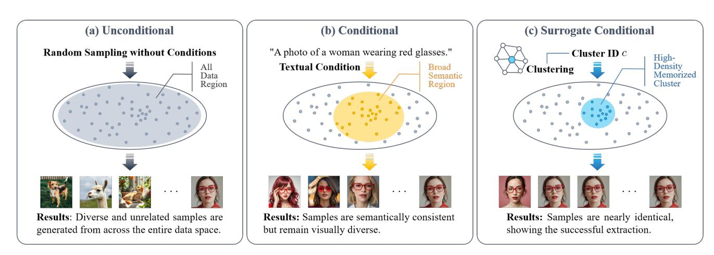
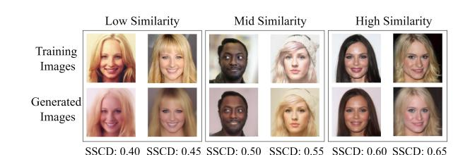

# SIDE：利用代理条件从扩散模型提取训练数据精修笔记

SIDE: Surrogate Conditional Data Extraction from Diffusion Models

## 文档说明

- GitHub PDF：[2024-arxiv-side-extracting-training-data-unconditional-diffusion-models.pdf](https://github.com/DeliciousBuding/DiffAudit/blob/main/references/materials/gray-box/2024-arxiv-side-extracting-training-data-unconditional-diffusion-models.pdf)
- 对应展示稿：[SIDE：利用代理条件从扩散模型提取训练数据](../../../gray-box/2024-arxiv-side-extracting-training-data-unconditional-diffusion-models-report.md)
- 开源实现：暂未找到官方代码
- 整理说明：本稿基于同目录 born-digital Markdown 精修，保留方法逻辑、关键公式、主实验数字和附录黑盒结论，便于后续继续压缩或写回索引

## 摘要精修

论文讨论的是训练数据提取，而不是标准成员推断。作者关注一个被广泛接受但并不牢靠的判断：无条件扩散模型因为没有 prompt 或类别标签，攻击者很难把采样过程引向某个局部区域，因此比条件模型更安全。SIDE 的核心贡献就是打破这个前提。

作者提出先从目标模型自己生成的样本中恢复聚类结构，再把聚类中心当作 surrogate condition。对小模型，攻击者训练时间相关分类器，并在反向去噪里加条件梯度；对大模型，则通过 LoRA 在伪标签合成数据上训练一个轻量条件模型。实验显示，SIDE 不仅能从所谓“安全”的无条件扩散模型中抽出训练数据，还经常超过已有条件提取基线。

## 1. 问题定义与威胁模型

主体攻击是白盒：攻击者可访问目标 DPM 参数、采样器和中间 score 相关量，但没有原始训练集标签。额外资源包括预训练特征提取器、由目标模型生成的合成图像，以及训练代理分类器或 LoRA 的算力。论文附录确实扩展到黑盒查询情形，但那部分只是 proof-of-concept，不应与主体结果混为一谈。

作者真正要回答的问题是：如果无条件扩散模型内部同样形成了稳定簇结构，那么“无标签”是否真的会阻断提取。论文的结论是否定的。只要攻击者能把这些簇显式化，并把它们重新接入采样过程，无条件模型照样可以被定向推向记忆样本所在的高密度区域。

## 2. SIDE 的两阶段方法

SIDE 的第一阶段是构造代理条件。攻击者先从目标模型采样合成图像，送入预训练特征提取器，再用 K-means 聚类，并用 cosine similarity 过滤掉 cohesion 过低的簇。剩余簇的中心就是 surrogate condition，它们本质上是模型内部隐式标签的外显化。

第二阶段是利用代理条件执行提取。小模型使用时间相关分类器做 guidance，大模型使用 LoRA 条件化。两条路径的共同目标都是在每个反向步把采样轨迹往目标簇对应的高密度区域拉近，而不是像无条件采样那样在整个数据空间中漫游。

这张图把论文的核心机制讲得很清楚。普通条件模型虽然有文本或类标签，但语义区域太宽；SIDE 则先识别“高密度记忆簇”，再把簇 ID 当条件，条件更窄，因此更容易逼近重复样本。

## 3. 关键公式与理论点

结合正文与 Algorithm 1，可以把 SIDE 的引导过程写成

$$
dx=\left[f(x,t)-g(t)^2\left(\nabla_x \log p_t^\theta(x)+\lambda \nabla_x \log p_t^\theta(y_I \mid x)\right)\right]dt+g(t)dw,
$$

其中 `\lambda` 是 guidance scale。需要说明的是，born-digital Markdown 抽取出的式子漏掉了 `\lambda`，但正文文字和算法输入项都表明实现时存在该系数，因此这里属于基于原文上下文的保守修正。

论文还引入分布级 memorization divergence，

$$
\mathcal{M}(\mathcal{D};p_\theta,\epsilon)=D_{\mathrm{KL}}(q_\epsilon \Vert p_\theta), \qquad
q_\epsilon(x)=\frac{1}{N}\sum_{x_i\in\mathcal{D}}\mathcal{N}(x\mid x_i,\epsilon^2 I),
$$

用来说明“条件越能隔离某个高密度子分布，记忆越容易被放大”。在此基础上，作者把 class label、caption、random label 和 cluster information 统一到 informative label 框架下，并给出理论结论：若条件模型更好地拟合某个子分布，则它相对该子分布的 memorization divergence 不会高于无条件模型。

最后，论文提出 AMS 和 UMS 来刻画命中率与 unique extraction：

$$
\mathrm{AMS}(\mathcal{D}_1,\mathcal{D}_2,\alpha,\beta)=
\frac{\sum_{x_i\in\mathcal{D}_1}\mathcal{F}(x_i,\mathcal{D}_2,\alpha,\beta)}{N_G},
\qquad
\mathrm{UMS}(\mathcal{D}_1,\mathcal{D}_2,\alpha,\beta)=
\frac{\left|\bigcup_{x_i\in\mathcal{D}_1}\phi(x_i,\mathcal{D}_2,\alpha,\beta)\right|}{N_G}.
$$

AMS 更像“撞到多少次”，UMS 更像“撞到多少个不同训练样本”。这两个指标比单独报告 `95th percentile SSCD` 更适合解释训练数据提取的真实强度。

## 4. 实验结果摘录

实验覆盖 CIFAR-10、CelebA-HQ-FI、CelebA-25000、CelebA、ImageNet 和 LAION-5B。对于高分辨率数据，作者报告 low / mid / high 三档相似度下的 AMS / UMS，并额外给出 `95th percentile SSCD`。最关键的结论是 SIDE 在六个数据集上全部超过 Carlini UnCond 和 Carlini Cond。

几个最值得保留的数字如下：

| 数据集 | 关键结果 |
| --- | --- |
| CelebA-25000 | low-similarity AMS 从 Carlini Cond 的 `8.712%` 提升到 SIDE 的 `20.527%` |
| CelebA-HQ-FI | mid-similarity AMS / UMS 从 `1.310% / 0.554%` 提升到 `2.227% / 0.842%` |
| ImageNet | low-similarity AMS 从 `0.152%` 提升到 `0.443%` |
| LAION-5B | `95th percentile SSCD` 从 `0.253` 提升到 `0.394` |

样例图的作用是把 low、mid、high 三档相似度可视化。它不能替代表 1 的定量证据，但能直观看到作者如何把“语义相似”与“更高保真度的近复制”区分开来。

## 5. 黑盒附录与局限

附录中的 Query-Based SIDE 使用遗传算法在黑盒 API 上搜索输入提示。结果显示，攻击确实能逐步提高分数，但代价很大：到 `800` 代时总查询数达到 `40,000`，low / mid / high 的 AMS 分别只有 `2.85% / 1.21% / 0.42%`，对应的 high-similarity UMS 仅为 `0.010%`。这说明黑盒扩展更像可行性展示，而不是今天就能复用的主力基线。

另外两点也需要保留。第一，论文还讨论了投毒微调后的 Extended SIDE，这已经切换到另一种攻击模型。第二，AMS / UMS 虽然解释力强，但它们不是当前社区通用标准，因此做横向对比时必须注明口径。

## 6. 对 DiffAudit 的落点

这篇论文最适合被放在 gray-box 路线的桥接位置。它虽然不是直接可落地的灰盒实现，但它揭示了一个非常重要的事实：side information 不必来自显式接口，也可以来自模型自生成样本中的内部聚类结构。

对 DiffAudit 后续工作，SIDE 至少有三层价值。第一，它可以作为 threat modeling 背景，提醒我们不要把“无条件”误判为“低风险”。第二，它提供了 AMS / UMS 这组更适合训练数据提取的指标设计参考。第三，它为后续讨论 beyond-membership 的训练样本提取叙事提供了理论支点，但真正进入工程实现前仍需要先把白盒假设降到更接近现有仓库的访问边界。
