# An Efficient Membership Inference Attack for the Diffusion Model by Proximal Initialization

Fei Kong1 Jinhao Duan2 RuiPeng Ma1 Hengtao Shen1 Xiaofeng Zhu1 Xiaoshuang Shi1∗ Kaidi Xu2 ∗

> 1University of Electronic Science and Technology of China 2Drexel University

kong13661@outlook.com xsshi2013@gmail.com kx46@drexel.edu

# Abstract

Recently, diffusion models have achieved remarkable success in generating tasks, including image and audio generation. However, like other generative models, diffusion models are prone to privacy issues. In this paper, we propose an efficient query-based membership inference attack (MIA), namely Proximal Initialization Attack (PIA), which utilizes groundtruth trajectory obtained by ϵ initialized in t = 0 and predicted point to infer memberships. Experimental results indicate that the proposed method can achieve competitive performance with only two queries on both discrete-time and continuous-time diffusion models. Moreover, previous works on the privacy of diffusion models have focused on vision tasks without considering audio tasks. Therefore, we also explore the robustness of diffusion models to MIA in the text-to-speech (TTS) task, which is an audio generation task. To the best of our knowledge, this work is the first to study the robustness of diffusion models to MIA in the TTS task. Experimental results indicate that models with mel-spectrogram (image-like) output are vulnerable to MIA, while models with audio output are relatively robust to MIA. Code is available at <https://github.com/kong13661/PIA>.

# 1 Introduction

Recently, the diffusion model [\[13,](#page-9-0) [38,](#page-10-0) [37\]](#page-10-1) has emerged as a powerful approach in the field of generative tasks, achieving notable success in image generation [\[30,](#page-10-2) [31\]](#page-10-3), audio generation [\[28,](#page-10-4) [21\]](#page-9-1), video generation [\[43,](#page-11-0) [14\]](#page-9-2), and other domains. However, like other generative models such as GANs [\[11\]](#page-9-3) and VAEs [\[20\]](#page-9-4), the diffusion model may also be exposed to privacy risks [\[1\]](#page-8-0) and copyright disputes [\[15\]](#page-9-5). Dangers such as privacy leaks [\[27\]](#page-10-5) and data reconstruction [\[49\]](#page-11-1) may compromise the model. Recently, some researchers have explored this topic [\[9,](#page-9-6) [26,](#page-10-6) [16,](#page-9-7) [3\]](#page-9-8), demonstrating that diffusion models are also vulnerable to privacy issues.

Membership Inference Attacks (MIAs) are the most common privacy risks [\[35\]](#page-10-7). MIAs can cause privacy concerns directly and can also contribute to privacy issues indirectly as part of data reconstruction. Given a pre-trained model, MIA aims to determine whether a sample is in the training set or not.

Generally speaking, MIA relies on the assumption that a model fits the training data better [\[44,](#page-11-2) [35\]](#page-10-7), resulting in a smaller training loss. Recently, several MIA techniques have been proposed for diffusion models [\[9,](#page-9-6) [26,](#page-10-6) [16\]](#page-9-7). We refer to the query-based methods proposed in [\[26,](#page-10-6) [16\]](#page-9-7) as Naive Attacks because they directly employ the training loss for the attack. However, unlike GANs or VAEs, the

∗Equal corresponding author

Figure 1: A overview of PIA. First, a sample is an input into the target model to generate ϵ at time 0. Next, we combine the original sample with ϵ0 and input them into the target model to generate ϵ at time t. After that, we input all three variables into a metric and use a threshold to determine if the sample belongs to the training set.

training loss for diffusion models is not deterministic because it requires the generation of Gaussian noise. The random Gaussian noise may not be the one in which diffusion model fits best. This can negatively impact the performance of the MIA attack. To address this issue, the concurrent work SecMI [\[9\]](#page-9-6) adopts an iterative approach to obtain the deterministic x at a specific time t, but this requires more queries, resulting in longer attack times. As models grow larger, the time required for the attack also increases, making time an important metric to consider.

To reduce the time consumption, inspired by DDIM and SecMI, we proposed a Proximal Initialization Attack (PIA) method, which derives its name from the fact that we utilize the diffusion model's output at time t = 0 as the noise ϵ. PIA is a query-based MIA that relies solely on the inference results and can be applied not only to discrete time diffusion models [\[13,](#page-9-0) [30\]](#page-10-2) but also to continuous time diffusion models [\[38\]](#page-10-0). We evaluate the effectiveness of our method on three image datasets, CIFAR10 [\[22\]](#page-10-8), CIFAR100 and TinyImageNet for DDPM and on two images dataset, COCO2017 [\[24\]](#page-10-9) and Laion5B [\[34\]](#page-10-10) for Stable DIffuion, as well as three audio datasets, LJSpeech [\[18\]](#page-9-9), VCTK [\[19\]](#page-9-10), and LibriTTS [\[47\]](#page-11-3).

To our knowledge, recent research on MIA of diffusion models has only focused on image data, and there has been no exploration of diffusion models in the audio domain. However, audio, such as music, encounters similar copyright and privacy concerns as those in the image domain [\[6,](#page-9-11) [39\]](#page-10-11). Therefore, it is essential to conduct privacy research in the audio domain to determine whether audio data is also vulnerable to attacks and to identify which types of diffusion models are more robust against privacy attacks. To investigate the robustness of MIA on audio data, we conduct experiments using Naive Attack, SecMI [\[9\]](#page-9-6), and our proposed method on three audio models: Grad-TTS [\[28\]](#page-10-4), DiffWave [\[21\]](#page-9-1), and FastDiff [\[17\]](#page-9-12). The results suggest that the robustness of MIA on audio depends on the output type of the model.

Our contributions can be summarized as follows:

- We propose a query-based MIA method called PIA. Our method employs the output at t = 0 as the initial noise and the errors between the forward and backward processes as the attack metric. We generalize the PIA on both discrete-time and continuous-time diffusion models.
- Our study is the first to evaluate the robustness of MIA on audio data. We evaluate the robustness of MIA on three TTS models (Grad-TTS, DiffWave, FastDiff) and three TTS datasets (LJSpeech, VCTK, Libritts) using Naive Attack, SecMI, and our proposed method.
- Our experimental results demonstrate that PIA achieves similar AUC performance and higher TPR @ 1% FPR performance compared to SecMI while being 5-10 times faster, with only one additional query compared to Naive Attack. Additionally, our results suggest that, for text-to-speech audio tasks, models that output audio have higher robustness against MIA attacks than those that output mel-spectrograms, which are the image-like output. Based on our findings, we recommend using generation models that output audio to reduce privacy risks in audio generation tasks.

# 2 Related Works and Background

Generative Diffusion Models Generative diffusion models have recently achieved significant success in both image [\[29,](#page-10-12) [30\]](#page-10-2) and audio generation tasks [\[17,](#page-9-12) [5,](#page-9-13) [28\]](#page-10-4). Unlike GANs [\[11,](#page-9-3) [46,](#page-11-4) [45\]](#page-11-5), which consist of a generator and a discriminator, diffusion models generate samples by fitting the inverse process of a diffusion process from Gaussian noise. Compared to GANs, diffusion models typically produce higher quality samples and avoid issues such as checkerboard artifacts [\[32,](#page-10-13) [8,](#page-9-14) [10\]](#page-9-15). A diffusion process is defined as xt = √ αtxt−1 + √ βtϵt, ϵt ∼ N (0, I), where αt + βt = 1 and βt increases gradually as t increases, so that eventually, xt approximates a random Gaussian noise. In the reverse diffusion process, x ′ t still follows a Gaussian distribution, assuming the variance remains the same as in the forward diffusion process, and the mean is defined as µ˜t = √ at xt − √ βt 1−a¯t ¯ϵθ(xt, t) , where α¯t = Qt k=0 αk and α¯t + β¯ t = 1. The reverse diffusion process becomes xt−1 = µ˜t + √ βtϵ, ϵ ∼ N (0, I). One can obtain a loss function [Eq. \(1\)](#page-2-0) by minimizing the distance between the predicted and groundtruth distributions. [\[38\]](#page-10-0) transforms the discrete-time diffusion process into a continuous-time process and uses SDE ( Stochastic Differential Equation) to express the diffusion process. To accelerate the generation process, several methods have been proposed, such as [\[33,](#page-10-14) [7,](#page-9-16) [40\]](#page-10-15). DDIM [\[36\]](#page-10-16) is another popular method that proposes a forward process different from diffusion process with the same loss function as DDPM, allowing it to reuse the model trained by DDPM while achieving higher generation speed.

$$L = \mathbb{E}_{x_0, \bar{\boldsymbol{\epsilon}}_t} \left[ \left\| \bar{\boldsymbol{\epsilon}}_t - \boldsymbol{\epsilon}_{\theta} \left( \sqrt{\bar{\alpha}_t} x_0 + \sqrt{1 - \bar{\alpha}_t} \bar{\boldsymbol{\epsilon}}_t, t \right) \right\|^2 \right]. \tag{1}$$

Membership Inference Privacy Different from conventional adversarial attacks [\[41,](#page-11-6) [42,](#page-11-7) [48\]](#page-11-8), Membership inference attack (MIA) [\[35\]](#page-10-7) aims to determine whether a sample is part of the training data. It can be formally described as follows: given two sets, the training set Dt and the hold-out set Dh, a target model m, and a sample x that either belongs to Dt or Dh, the goal of MIA is to find a classifier or function f(x, m) that determines which set x belongs to, with f(x, m) ∈ {0, 1} and f(x, m) = 1 indicating that x ∈ Dt and f(x, m) = 0 indicating that x ∈ Dh. If a membership inference attack method utilizes a model's output obtained through queries to attack the model, it is called query-based attack[\[9,](#page-9-6) [26,](#page-10-6) [16\]](#page-9-7). Typically, MIA is based on the assumption that training data has a smaller loss compared to hold-out data. MIA for generation tasks, such as GANs [\[27\]](#page-10-5) and VAEs [\[12,](#page-9-17) [4\]](#page-9-18), has also been extensively researched.

Recently, several MIA methods designed for diffusion models have been proposed. [\[26\]](#page-10-6) proposed a method that directly employs the training loss [Eq. \(1\)](#page-2-0) and find a specific t with maximum distinguishability. Because they directly use the training loss, we refer to this method as Naive Attack. SecMI [\[9\]](#page-9-6) improves the attack effectiveness by iteratively computing the t-error, which is the error between the DDIM sampling process and the inverse sampling process at a certain moment t.

Threat model We follow the same threat model as [\[9\]](#page-9-6), which needs to access intermediate outputs of diffusion models. This is a query-based attack without the knowledge of model parameters but not fully end-to-end black-box. In scenarios such as inpainting [\[25\]](#page-10-17), and classification [\[23\]](#page-10-18), they also employ the intermediate output of the diffusion model. These works utilize a pre-trained model on a huge dataset to do other tasks, such as inpainting, and classification without fine-tuning. To meet these requirements, future service providers might consider opening up APIs for intermediate outputs. Our work is applicable to such scenarios.

# 3 Methodology

In this section, we introduce DDIM, a variant of DDPM, and provide a proof that if we know any two points in the DDIM framework, xk and x0, we can determine any other point xt. We then propose a new MIA method that utilizes this property to efficiently obtain xt−t ′ and its corresponding predicted sample x ′ t−t ′ . We compute the difference between these two points and use it to determine if a sample is in the training set. Specifically, samples with small differences are more likely to belong to the training set. An overview of this proposed method is shown in [Fig. 1.](#page-1-0)

#### 3.1 Preliminary

Denoising Diffusion Implicit Models To accelerate the inference process of diffusion models, DDIM defines a new process that shares the same loss function as DDPM. Unlike the DDPM process, which adds noise from x0 to xT , DDIM defines a diffusion process from xT to x1 by using x0. The process is described in [Eq. \(2\)](#page-3-0) and [Eq. \(3\).](#page-3-1) The distribution qσ (xT | x0) is the same as in DDPM.

$$q_{\sigma}\left(\boldsymbol{x}_{1:T} \mid \boldsymbol{x}_{0}\right) := q_{\sigma}\left(\boldsymbol{x}_{T} \mid \boldsymbol{x}_{0}\right) \prod_{t=2}^{T} q_{\sigma}\left(\boldsymbol{x}_{t-1} \mid \boldsymbol{x}_{t}, \boldsymbol{x}_{0}\right), \tag{2}$$

$$q_{\sigma}\left(\boldsymbol{x}_{t-1} \mid \boldsymbol{x}_{t}, \boldsymbol{x}_{0}\right) = \mathcal{N}\left(\sqrt{\bar{\alpha}_{t-1}}x_{0} + \sqrt{1 - \bar{\alpha}_{t-1} - \sigma_{t}^{2}} \cdot \frac{\boldsymbol{x}_{t} - \sqrt{\bar{\alpha}_{t}}x_{0}}{\sqrt{1 - \bar{\alpha}_{t}}}, \sigma_{t}^{2}\boldsymbol{I}\right). \tag{3}$$

The denoising process defined by DDIM is described below:

$$p(\boldsymbol{x}_{t'} \mid \boldsymbol{x}_{t}) = p(\boldsymbol{x}_{t'} \mid \boldsymbol{x}_{t}, \boldsymbol{x}_{0} = \overline{\boldsymbol{\mu}}(\boldsymbol{x}_{t}))$$

$$= \mathcal{N}\left(\boldsymbol{x}_{t'}; \frac{\sqrt{\bar{\alpha}_{t'}}}{\sqrt{\bar{\alpha}_{t}}} \left(\boldsymbol{x}_{t} - \left(\sqrt{1 - \bar{\alpha}_{t}} - \frac{\sqrt{\bar{\alpha}_{t}}}{\sqrt{\bar{\alpha}_{t'}}} \sqrt{1 - \bar{\alpha}_{t'} - \sigma_{t}^{2}}\right) \boldsymbol{\epsilon}_{\boldsymbol{\theta}}(\boldsymbol{x}_{t}, t)\right), \sigma_{t}^{2} \boldsymbol{I}\right)$$

$$(4)$$

#### 3.2 Finding Groundtruth Trajectory

In this section, we will first demonstrate that if we know xk and x0, we can determine any other xt. Then, we will provide the method for obtaining xk.

Theorem 1 *The trajectory of* {xt} *is determined if we know* x0 *and any other point* xk *when* σt = 0 *under DDIM framework.*

Proof *In DDIM definition, if standard deviation* σt = 0*, the process adding noise becomes determined. So [Eq.](#page-3-1)* (3) *can be rewritten to [Eq.](#page-3-2)* (5)*.*

$$\boldsymbol{x}_{t-1} = \sqrt{\bar{\alpha}_{t-1}} \boldsymbol{x}_0 + \sqrt{1 - \bar{\alpha}_{t-1}} \cdot \frac{\boldsymbol{x}_t - \sqrt{\bar{\alpha}_t} \boldsymbol{x}_0}{\sqrt{1 - \bar{\alpha}_t}}.$$
 (5)

*Assuming that we know any point* xk*. [Eq.](#page-3-2)* (5) *can be rewritten as* xt−1− √ √ α¯t−1x0 1−α¯t−1 = xt− √ α¯tx0 1−α¯t *. By applying this equation recurrently, we can obtain [Eq.](#page-3-3)* (6)*. In other words, we can obtain any point* xt *except* xk*.* √

$$\boldsymbol{x}_{t} = \sqrt{\bar{\alpha}_{t}}\boldsymbol{x}_{0} + \sqrt{1 - \bar{\alpha}_{t}} \cdot \frac{\boldsymbol{x}_{k} - \sqrt{\bar{\alpha}_{k}}\boldsymbol{x}_{0}}{\sqrt{1 - \bar{\alpha}_{k}}}.$$
 (6)

We call the trajectory obtained from xk *groundtruth trajectory*.

Assuming that the point is xk = √ a¯kx0 + √ 1 − a¯kϵk, to find a better groundtruth trajectory, we choose k = 0 since the choice of k is arbitrary, and approximate ϵ¯0 using [Eq. \(7\).](#page-3-4)

$$\epsilon_{\theta} \left( \sqrt{\bar{a}_0} \boldsymbol{x}_0 + \sqrt{1 - \bar{a}_0} \overline{\epsilon}_0, 0 \right) \approx \epsilon_{\theta} \left( \boldsymbol{x}_0, 0 \right).$$
 (7)

This choice is intuitive. First, α¯0 is very close to 1, making the approximation in [Eq. \(7\)](#page-3-4) valid. Second, the time t = 0 is the closest timing to the original sample, so the model is likely to fit it better.

#### 3.3 Exposing Membership via Groundtruth Trajectory and Predicted Point

Our approach assumes that the training set's samples have a smaller loss, similar to many other MIAs, meaning that the training samples align more closely with the groundtruth trajectory. We measure the distance between any groundtruth point xt−t ′ and the predicted point x ′ t−t ′ using the ℓp-norm, which can be expressed by [Eq. \(8\).](#page-3-5) Here, x ′ t−t ′ denotes the point predicted by the model from xt. To apply this attack, we need to select a specific time t − t ′ , and we choose the time t ′ = t − 1 since it is the closest. However, we will demonstrate later that the choice of t ′ is not significant in discrete-time diffusion.

$$d_{t-t'} = \| \boldsymbol{x}_{t-t'} - \boldsymbol{x}'_{t-t'} \|_{p}.$$
 (8)

To predict x ′ t−t ′ from the groundtruth point xt, we apply the deterministic version (σt = 0) of the DDIM denoising process [Eq. \(4\).](#page-3-6)

We use method described in [Section 3.2](#page-3-7) to obtain the groundtruth point xt and xt−t ′ . We then insert these points into [Eq. \(8\),](#page-3-5) giving us a simpler formula:

$$\frac{\sqrt{1-\bar{\alpha}_{t-t'}}\sqrt{\bar{\alpha}_t}-\sqrt{1-\bar{\alpha}_t}\sqrt{\bar{\alpha}_{t-t'}}}{\sqrt{\bar{\alpha}_t}} \left\| \bar{\boldsymbol{\epsilon}}_0 - \boldsymbol{\epsilon}_{\boldsymbol{\theta}} \left( \sqrt{\bar{a}_t} \boldsymbol{x}_0 + \sqrt{1-\bar{a}_t} \bar{\boldsymbol{\epsilon}}_0, t \right) \right\|_p.$$

If we ignore the coefficient, t ′ disappears. Finally, the metric ignoring the coefficient reduces to [Eq. \(9\),](#page-4-0) where samples with smaller Rt,p are more likely to be training samples.

$$R_{t,p} = \left\| \boldsymbol{\epsilon}_{\boldsymbol{\theta}} \left( \boldsymbol{x}_{0}, 0 \right) - \boldsymbol{\epsilon}_{\boldsymbol{\theta}} \left( \sqrt{\bar{a}_{t}} \boldsymbol{x}_{0} + \sqrt{1 - \bar{a}_{t}} \boldsymbol{\epsilon}_{\boldsymbol{\theta}} \left( \boldsymbol{x}_{0}, 0 \right), t \right) \right\|_{p}. \tag{9}$$

Since ϵ is initialized in time t = 0, we call our method Proximal Initialization Attack (PIA).

Normalization The values of ϵθ (x0, 0) may not conform to a standard normal distribution, so we use [Eq. \(10\)](#page-4-1) to normalize them. N represents the number of elements in the sample, such as h × w for an image. We refer to this method as PIAN (PIA Normalized). Although this normalization cannot guarantee that ˆϵθ (x0, 0) ∼ N (0, I), we deem it reasonable since each element of ϵ¯t in the training loss [Eq. \(1\)](#page-2-0) is identically and independently distributed.

$$\hat{\boldsymbol{\epsilon}}_{\boldsymbol{\theta}}\left(\boldsymbol{x}_{0},0\right) = \frac{\boldsymbol{\epsilon}_{\boldsymbol{\theta}}(\boldsymbol{x}_{0},0)}{\mathbb{E}_{\boldsymbol{x}\sim\mathcal{N}\left(0,1\right)}\left(|\boldsymbol{x}|\right)\frac{\|\boldsymbol{\epsilon}_{\boldsymbol{\theta}}(\boldsymbol{x}_{0},0)\|_{1}}{N}} = N\sqrt{\frac{\pi}{2}} \frac{\boldsymbol{\epsilon}_{\boldsymbol{\theta}}(\boldsymbol{x}_{0},0)}{\|\boldsymbol{\epsilon}_{\boldsymbol{\theta}}(\boldsymbol{x}_{0},0)\|_{1}}.$$
(10)

To apply our attack, we first evaluate the value of Rt,p on a sample, and use an indicator function:

$$f(x,m) = \mathbb{1}[R_{t,p} < \tau].$$
 (11)

This indicator means we consider whether a sample is in the training set if Rt,p is smaller than a threshold τ . Rt,p is obtained from ϵθ (x0, 0) (PIA) or ˆϵθ (x0, 0) (PIAN).

#### 3.4 For Continuous-Time Diffusion Model

Recently, some diffusion models are trained with continuous time. As demonstrated in [\[38\]](#page-10-0), the diffusion process with continuous time can be defined by a stochastic differential equation (SDE) as dxt = ft (xt)dt + gtdwt, where wt is a Brownian process. One of the reverse process is dxt = ft (xt) − 1 2 g 2 t + σ 2 t ∇xt log pt(xt) dt + σtdw. When σt = 0, this formula becomes an ordinary differential equation (ODE): dxt = ft (xt) − 2 g 2 t ∇xt log pt(xt) dt. Continuous-time diffusion model train an sθ to approximate ∇xt log pt(xt), so the loss function will be:

$$L = \mathbb{E}_{\boldsymbol{x}_{0}, \boldsymbol{x}_{t} \sim p(\boldsymbol{x}_{t} \mid \boldsymbol{x}_{0}) \bar{p}(\boldsymbol{x}_{0})} \left[ \left\| \boldsymbol{s}_{\boldsymbol{\theta}} \left( \boldsymbol{x}_{t}, t \right) - \nabla_{\boldsymbol{x}_{t}} \log p \left( \boldsymbol{x}_{t} \mid \boldsymbol{x}_{0} \right) \right\|^{2} \right].$$

Replacing ∇xt log pt(xt) with sθ (xt, t), the inference procedure become the following equation:

$$d\mathbf{x}_t = \left(\mathbf{f}_t(\mathbf{x}_t) - \frac{1}{2}g_t^2 \mathbf{s}_{\theta}(\mathbf{x}_t, t)\right) dt.$$
 (12)

The distribution p(xt|x0) is typically set to be the same as in DDPM for continuous-time diffusion models. Therefore, the loss of the continuous-time diffusion model and the loss of the concretediffusion model [Eq. \(1\)](#page-2-0) are similar. Since DDPM and the diffusion model described by SDE share a similar loss, our method can be applied to continuous-time diffusion models. However, due to the different diffusion process, Rt,p differs from [Eq. \(9\).](#page-4-0) From [Eq. \(12\),](#page-4-2) we obtain the following equation: xt−t ′ − xt ≈ dxt = ft (xt) − 1 2 g 2 t sθ (xt, t) dt. By substituting this equation into [Eq. \(8\),](#page-3-5) we obtain the following equation:

$$\|\boldsymbol{x}_{t-t'} - \boldsymbol{x}'_{t-t'}\|_{p} \approx \left\| \left( \boldsymbol{f}_{t}(\boldsymbol{x}_{t}) - \frac{1}{2} g_{t}^{2} \boldsymbol{s}_{\boldsymbol{\theta}} \left( \boldsymbol{x}_{t}, t \right) \right) dt + \boldsymbol{x}_{t} - \boldsymbol{x}'_{t-t'} \right\|_{p}.$$
 (13)

Table 1: Performance of different methods on Grad-TTS. TPR@x% is the abbreviation for TPR@x% FPR.

| LJspeech  |      |            | VCTK |            |      | LibriTTS   |       |
|-----------|------|------------|------|------------|------|------------|-------|
| Method    | AUC  | TPR@1% FPR | AUC  | TPR@1% FPR | AUC  | TPR@1% FPR | Query |
| NA [26]   | 99.4 | 93.6       | 83.4 | 6.1        | 90.2 | 9.1        | 1     |
| SecMI [9] | 99.5 | 94.0       | 87.0 | 14.8       | 93.9 | 19.7       | 60+2  |
| PIA       | 99.6 | 94.2       | 87.8 | 20.6       | 95.4 | 30.0       | 1+1   |
| PIAN      | 99.3 | 95.7       | 88.1 | 19.6       | 93.4 | 44.7       | 1+1   |

Table 2: Performance of the different methods on DDPM.

|        |      | CIFAR10    |      | TN-IN      |      | CIFAR100   |       |
|--------|------|------------|------|------------|------|------------|-------|
| Method | AUC  | TPR@1% FPR | AUC  | TPR@1% FPR | AUC  | TPR@1% FPR | Query |
| NA     | 84.7 | 6.85       | 84.9 | 10.0       | 82.3 | 9.6        | 1     |
| SecMI  | 88.1 | 9.11       | 89.4 | 12.7       | 87.6 | 11.1       | 10+2  |
| PIA    | 88.5 | 13.7       | 89.6 | 17.1       | 89.4 | 19.6       | 1+1   |
| PIAN   | 87.8 | 31.2       | 88.2 | 32.8       | 86.5 | 22.2       | 1+1   |

By ignoring the high-order infinitesimal term xt−x ′ t−t ′ in [Eq. \(13\),](#page-4-3) we can obtain ∥xt−t ′−x ′ t−t ′∥p ≈ ft (xt) − 2 g 2 t sθ (xt, t) dt p dt. We ignore dt and use the following attack metric:

$$R_{t,p} = \left\| \boldsymbol{f}_t(\boldsymbol{x}_t) - \frac{1}{2} g_t^2 \boldsymbol{s}_{\boldsymbol{\theta}} \left( \boldsymbol{x}_t, t \right) \right\|_p, \tag{14}$$

where xt is obtained from the output of sθ(x0, 0), similar to the discrete-time diffusion case.

# 4 Experiment

In this section, we evaluate the performance of PIA and PIAN and robustness of TTS models across various datasets and settings. The detailed experimental settings, including datasets, models, and hyper-parameter settings can be found in Appendix A.

#### 4.1 Evaluation Metrics

We follow the most convincing metrics used in MIAs [\[3\]](#page-9-8), including AUC, the True Positive Rate (TPR) when the False Positive Rate (FPR) is 1%, i.e., TPR @ 1% FPR, and TPR @ 0.1% FPR.

#### 4.2 Proximal Initialization Attack Performance

We train TTS models on the LJSpeech, VCTK, and LibriTTS datasets. We summarize the AUC and TPR @ 1% FPR results on GradTTS, a continuous-time diffusion model, in [Table 1.](#page-5-0) We employ NA to denote Naive Attack. Compared to SecMI, PIA and PIAN achieve slightly better AUC performance, and significantly higher TPR @ 1% FPR performance, i.e., 5.4% higher for PIA and 10.5% higher for PIAN on average. However, our proposed method only requires 1 + 1 queries, just one more query than Naive Attack, and has a computational consumption of only 3.2% of SecMI. Both methods outperform SecMI and Naive Attack.

Table 3: Performance of different methods on stable diffusion.

|              |              | Laion5       |              | Laion5 w/o text |              | Laion5 Blip text |             |
|--------------|--------------|--------------|--------------|-----------------|--------------|------------------|-------------|
| Method       | AUC          | TPR@1% FPR   | AUC          | TPR@1% FPR      | AUC          | TPR@1% FPR       | Query       |
| NA           | 66.3         | 14.8         | 65.2         | 13.3            | 68.2         | 16.2             | 1           |
| SecMI PIA | 69.1 70.5 | 16.1 18.1 | 71.6 73.9 | 14.5 19.8    | 71.6 73.3 | 17.8 20.2     | 10+2 1+1 |
| PIAN         | 56.7         | 4.8          | 58.8         | 3.2             | 55.3         | 3.2              | 1+1         |

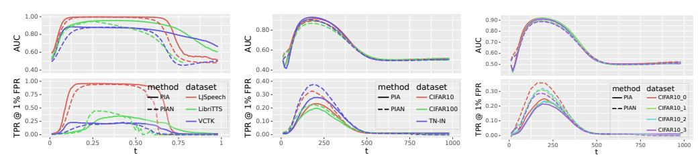

- (a) The results of PIA and PIAN on Grad-TTS for different values of t and different datasets.
- (b) The results of PIA and PIAN on DDPM for different values of t and different datasets.
- (c) The results of PIA and PIAN on DDPM for different values of t and different CIFAR10 splits.

Figure 2: The performance of PIA and PIAN as t varies. The top row shows the results for AUC, and the bottom row shows the results for TPR @ 1% FPR.

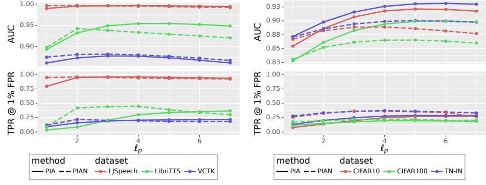

- (a) The results of PIA and PIAN on Grad-TTS for different values of ℓp-norm.
- (b) The results of PIA and PIAN on DDPM for different values of ℓp-norm.

Figure 3: The performance of our method as ℓp-norm varies. The top row shows the results for AUC, and the bottom row displays the results for TPR @ 1% FPR.

For DDPM, a discrete-time diffusion model, we present the results in [Table 2.](#page-5-1) For this model, PIA performs slightly better than SecMI in terms of AUC but has a distinctly higher TPR @ 1% FPR than SecMI, i.e. 5.8% higher on average than SecMI. For PIAN, the AUC performance is slightly lower than PIA, but higher than SecMI, and the TPR @ 1% FPR performance is significantly better than SecMI, i.e. 17.8% higher on average than SecMI. Similar to the previous case, our attack only requires two queries on DDPM and the computational consumption is 17% of SecMI. Both methods outperform SecMI and Naive Attack.

For stable diffusion, we present the results in [Table 3.](#page-5-2) We evaluated stable diffusion on Laion5 (training dataset) and COCO (evaluation dataset). Details are put into A.2. We tested three scenarios: knowing the ground truth text (Laion5), not knowing the ground truth text (Laion5 w/o text), and generating text through blip (Laion5 Blip text). PIA achieved the best results. PIA performs slightly better than SecMI in terms of AUC, i.e. 1.8% higher on average, but has a distinctly higher TPR @ 1% FPR than SecMI, i.e. 3.2% higher on average. Besides, our attack only requires two queries on DDPM and the computational consumption is 17% of SecMI.

However, PIAN does not work well in stable diffusion. PIAN based on the fact that we added noise that follows a normal distribution during training, and we use [Eq. \(10\)](#page-4-1) to rescale the ϵ to normal distribution. However, rescaling is a rough operation and may not always transform into a normal distribution. Thus, some other transforms might have better performance. Additionally, the model's output might be more accurate before the rescaling.

We highly recommend using PIA as the preferred method for conducting attacks, because it is directly derived. It will always yield the desired results. But PIAN can be another choice, since it has better performance at TPR @ 1% FPR metric than PIA on some models.

#### 4.3 Ablation Study

Our proposed method has three hyper-parameters: t and the ℓp-norm used in the attack metrics Rt,p presented in [Eqs. \(9\)](#page-4-0) and [\(14\).](#page-5-3) The threshold τ presented in [Eq. \(11\).](#page-4-4)

Table 4: The variation of Attack Success Rate (ASR) and TPR/FPR on the victim model with the threshold determined by the surrogate model.

|                                 | PIA          |                    |              |                    | PIAN         |                    |              |                  |
|---------------------------------|--------------|--------------------|--------------|--------------------|--------------|--------------------|--------------|------------------|
|                                 | LibriTTS     |                    | CIFAR10      |                    | LibriTTS     |                    | CIFAR10      |                  |
|                                 | ASR          | TPR/FPR            | ASR          | TPR/FPR            | ASR          | TPR/FPR            | ASR          | TPR/FPR          |
| Surrogate model Victim model | 89.5 89.1 | 32.2/1 32.6/1.1 | 78.5 78.3 | 16.5/1 16.8/1.1 | 88.3 88.2 | 26.2/1 24.5/0.9 | 76.9 76.8 | 19.0/1 19.0/1 |

Table 5: Comparison of different models. AUC is the result on the LJSpeech/TinyImageNet dataset.

| Model    | Size   | T      | Output          | Segmentation Length | Best AUC |
|----------|--------|--------|-----------------|---------------------|----------|
| DDPM     | 35.9M  | 1000   | Image           | N/A                 | 92.6     |
| GradTTS  | 56.7M  | [0, 1] | Mel-spectrogram | 2s                  | 99.6     |
| DiffWave | 30.3M  | 50     | Audio           | 0.25s               | 52.4     |
| FastDiff | 175.4M | 1000   | Audio           | 1.2s                | 54.4     |

Impact of t To evaluate the impact of t, we attack the target model at intervals of 0.01 × T from 0 to T and report the results across different models and datasets. We demonstrate the performance of our proposed method on two different models: GradTTS, a continuous-time diffusion model used for audio, in [Fig. 2a;](#page-6-0) and DDPM, a discrete-time diffusion model employed for images, in [Fig. 2b.](#page-6-0) The results indicate that our method produces a consistent pattern in the same model across different datasets, whether PIA or PIAN. Specifically, for GradTTS, both AUC and TPR @ 1% FPR exhibit a rapid increase at the beginning as t increases, followed by a decline around t = 0.5. For DDPM, AUC and TPR @ 1% FPR also demonstrate a rapid increase at the beginning as t increases, followed by a decline around t = 200. In [Fig. 2c,](#page-6-0) we randomly partition the CIFAR10 dataset four times and compare the performance of each partition. Consistent with the previous results, our method exhibits a similar trend across the different splits.

Impact of ℓp-norm In [Fig. 3,](#page-6-1) we compare the results obtained on ℓp-norm using the p = 1 to 7, with the choice of t being the same as in [Section 4.2.](#page-5-4) The results indicate an increase in performance at ℓ1-norm, followed by a decline after the p = 5. It reveals that the combined effect of both large and small differences exhibits a synergistic influence when present in an appropriate ratio.

Determining the value of τ In [Table 4,](#page-7-0) we present the variation of Attack Success Rate (ASR) and TPR/FPR on the victim model with the τ determined by the surrogate model. Specifically, we will randomly split the corresponding dataset into two halves four times, resulting in four different train-test splits. We will train four models using these splits. One of the models will be selected as the surrogate model, from which we will obtain the threshold. We will then use this τ to attack the other three victim models and record the average values. The results indicate that our method achieves promising results when using the τ selected from the surrogate model.

#### 4.4 Which Type of Model Output is More Robust?

There are generally two forms of output in TTS: mel-spectrograms and audio. In [Table 5,](#page-7-1) we summarize the model details and best results of our proposed method on three TTS models using the LJSpeech dataset and the DDPM model on the TinyImageNet dataset. We only report the results of our method since it achieves better performance most of the time.

As shown in [Table 5,](#page-7-1) with the same training and hold-out data, GradTTS achieves an AUC close to 100, while DiffWave and FastDiff only achieve the performance slightly above 50, which is close to random guessing. However, DiffWave has a similar size to DDPM and GradTTS, and FastDiff has similar T with DDPM. Additionally, FastDiff has similar segmentation length to GradTTS. Thus, we believe that these hyperparameters are not the decisive parameters for the model's robustness. It is obvious that the output of GradTTS and DDPM is image-like. [Fig. 4](#page-8-1) provides an example of mel-spectrogram. The deep reasons why these models exhibit robustness can be further explored. We report these results hoping that they may inspire the design of models with MIA robustness.

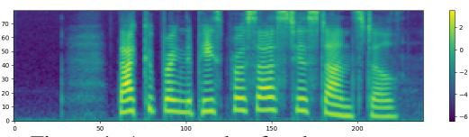

Figure 4: An example of mel-spectrogram.

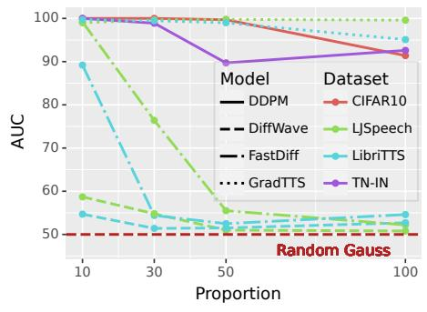

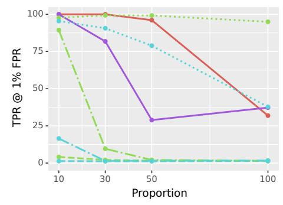

- (a) The results of PIA and PIAN on Grad-TTS for different training and evaluation sample numbers.
- (b) The results of PIA and PIAN on DDPM for different training and evaluation sample numbers.

Figure 5: The performance of our method for different training and evaluation sample numbers. The top row shows the results for AUC, and the bottom row displays the results for TPR @ 1% FPR.

We also explore the attack performance with various training and evaluation sample numbers. We select 10%, 30%, 50%, and 100% of the samples from the complete dataset. In each split, half of all samples are used for training, and the other half are utilized as a hold-out set. The results are presented in [Fig. 5.](#page-8-2) As we can see, when only 10% of the data is used, relatively high AUC and TPR @ 1% FPR can be achieved. Additionally, we find that the AUC and TPR @ 1% FPR decrease as the proportion of selected samples in the total dataset increases. However, for GradTTS and DDPM, the decrease is relatively gentle, while for DiffWave and FastDiff, the decrease is rapid. In other words, the robustness increases rapidly with the increase of training samples.

# 5 Conclusion

In this paper, we propose an efficient membership inference attack method for diffusion models, namely Proximal Initialization Attack (PIA) and its normalized version, PIAN. We demonstrate its effectiveness on a continuous-time diffusion model, GradTTS, and two discrete-time diffusion models, DDPM and Stable Diffusion. Experimental results indicate that our proposed method can achieve similar AUC performance to SecMI and significantly higher TPR @ 1% FPR with the cost of only 2 queries, which is much faster than the 12~62 queries required for SecMI in this paper. Additionally, we analyze the vulnerability of models in TTS, an audio generation tasks. The results suggest that diffusion models with the image-like output (mel-spectrogram) are more vulnerable than those with the audio output. Therefore, for privacy concerns, we recommend employing models with audio outputs in text-to-speech tasks.

Limitation and Broader Impacts The purpose of our method is to identify whether a given sample is part of the training set. This capability can be leveraged to safeguard privacy rights by detecting instances of personal information being unlawfully used for training purposes. However, it is important to note that our method could also potentially result in privacy leaking. For instance, this could occur when anonymous data is labeled by determining whether a sample is part of the training set or as a part of data reconstruction attack. It is worth mentioning that our method solely relies on the diffusion model's output as we discussed in the threat model, but it does require the intermediate output. This dependency on the intermediate output may pose a limitation to our method.

# References

[1] Rishi Bommasani, Drew A Hudson, Ehsan Adeli, Russ Altman, Simran Arora, Sydney von Arx, Michael S Bernstein, Jeannette Bohg, Antoine Bosselut, Emma Brunskill, et al. On the

- opportunities and risks of foundation models. *arXiv preprint [arXiv:2108.07258](http://arxiv.org/abs/2108.07258)*, 2021.
- [2] Nicholas Carlini, Steve Chien, Milad Nasr, Shuang Song, Andreas Terzis, and Florian Tramer. Membership inference attacks from first principles. In *IEEE Symposium on Security and Privacy*, pages 1897–1914. IEEE, 2022.
- [3] Nicholas Carlini, Jamie Hayes, Milad Nasr, Matthew Jagielski, Vikash Sehwag, Florian Tramer, Borja Balle, Daphne Ippolito, and Eric Wallace. Extracting training data from diffusion models. *arXiv preprint [arXiv:2301.13188](http://arxiv.org/abs/2301.13188)*, 2023.
- [4] Dingfan Chen, Ning Yu, Yang Zhang, and Mario Fritz. Gan-leaks: A taxonomy of membership inference attacks against generative models. In *SIGSAC Conference on Computer and Communications Security*, pages 343–362, 2020.
- [5] Nanxin Chen, Yu Zhang, Heiga Zen, Ron J. Weiss, Mohammad Norouzi, and William Chan. Wavegrad: Estimating gradients for waveform generation. In *International Conference on Learning Representations*, 2021.
- [6] CNN. Ai won an art contest, and artists are furious. Website, 2022. [https://www.cnn.com/](https://www.cnn.com/2022/09/03/tech/ai-art-fair-winner-controversy/index.html) [2022/09/03/tech/ai-art-fair-winner-controversy/index.html](https://www.cnn.com/2022/09/03/tech/ai-art-fair-winner-controversy/index.html).
- [7] Tim Dockhorn, Arash Vahdat, and Karsten Kreis. Score-based generative modeling with critically-damped langevin diffusion. In *International Conference on Learning Representations*, 2022.
- [8] Jeff Donahue, Philipp Krähenbühl, and Trevor Darrell. Adversarial feature learning. In *International Conference on Learning Representations*, 2017.
- [9] Jinhao Duan, Fei Kong, Shiqi Wang, Xiaoshuang Shi, and Kaidi Xu. Are diffusion models vulnerable to membership inference attacks? *International Conference on Machine Learning*, 2023.
- [10] Vincent Dumoulin, Ishmael Belghazi, Ben Poole, Alex Lamb, Martín Arjovsky, Olivier Mastropietro, and Aaron C. Courville. Adversarially learned inference. In *International Conference on Learning Representations*, 2017.
- [11] Ian Goodfellow, Jean Pouget-Abadie, Mehdi Mirza, Bing Xu, David Warde-Farley, Sherjil Ozair, Aaron Courville, and Yoshua Bengio. Generative adversarial networks. *Communications of the ACM*, 63(11):139–144, 2020.
- [12] Benjamin Hilprecht, Martin Härterich, and Daniel Bernau. Monte carlo and reconstruction membership inference attacks against generative models. *Proceedings on Privacy Enhancing Technologies*, 2019(4):232–249, 2019.
- [13] Jonathan Ho, Ajay Jain, and Pieter Abbeel. Denoising diffusion probabilistic models. In *Advances in Neural Information Processing Systems*, volume 33, pages 6840–6851, 2020.
- [14] Jonathan Ho, Tim Salimans, Alexey Gritsenko, William Chan, Mohammad Norouzi, and David J. Fleet. Video diffusion models. In *Advances in Neural Information Processing Systems*, 2022.
- [15] Kalin Hristov. Artificial intelligence and the copyright dilemma. *Idea*, 57:431, 2016.
- [16] Hailong Hu and Jun Pang. Membership inference of diffusion models. *arXiv preprint [arXiv:2301.09956](http://arxiv.org/abs/2301.09956)*, 2023.
- [17] Rongjie Huang, Max W. Y. Lam, Jun Wang, Dan Su, Dong Yu, Yi Ren, and Zhou Zhao. Fastdiff: A fast conditional diffusion model for high-quality speech synthesis. In *European Conference on Artificial Intelligence*, pages 4157–4163, 2022.
- [18] Keith Ito and Linda Johnson. The lj speech dataset. [https://keithito.com/](https://keithito.com/LJ-Speech-Dataset/) [LJ-Speech-Dataset/](https://keithito.com/LJ-Speech-Dataset/), 2017.
- [19] Yamagishi Junichi, Veaux Christophe, and MacDonald Kirsten. Cstr vctk corpus: English multi-speaker corpus for cstr voice cloning toolkit. [https://datashare.ed.ac.uk/handle/](https://datashare.ed.ac.uk/handle/10283/3443) [10283/3443](https://datashare.ed.ac.uk/handle/10283/3443), 2019.
- [20] Diederik P Kingma and Max Welling. Auto-encoding variational bayes. *arXiv preprint [arXiv:1312.6114](http://arxiv.org/abs/1312.6114)*, 2013.
- [21] Zhifeng Kong, Wei Ping, Jiaji Huang, Kexin Zhao, and Bryan Catanzaro. Diffwave: A versatile diffusion model for audio synthesis. In *International Conference on Learning Representations*, 2021.

- [22] Alex Krizhevsky, Geoffrey Hinton, et al. Learning multiple layers of features from tiny images, 2009.
- [23] Alexander C Li, Mihir Prabhudesai, Shivam Duggal, Ellis Brown, and Deepak Pathak. Your diffusion model is secretly a zero-shot classifier. *arXiv preprint [arXiv:2303.16203](http://arxiv.org/abs/2303.16203)*, 2023.
- [24] Tsung-Yi Lin, Michael Maire, Serge J. Belongie, Lubomir D. Bourdev, Ross B. Girshick, James Hays, Pietro Perona, Deva Ramanan, Piotr Dollár, and C. Lawrence Zitnick. Microsoft COCO: common objects in context. *CoRR*, abs/1405.0312, 2014.
- [25] Andreas Lugmayr, Martin Danelljan, Andres Romero, Fisher Yu, Radu Timofte, and Luc Van Gool. Repaint: Inpainting using denoising diffusion probabilistic models. In *Proceedings of the IEEE/CVF Conference on Computer Vision and Pattern Recognition*, pages 11461–11471, 2022.
- [26] Tomoya Matsumoto, Takayuki Miura, and Naoto Yanai. Membership inference attacks against diffusion models. *arXiv preprint [arXiv:2302.03262](http://arxiv.org/abs/2302.03262)*, 2023.
- [27] Dang Pham and Tuan M. V. Le. Auto-encoding variational bayes for inferring topics and visualization. In *International Conference on Computational Linguistics*, pages 5223–5234, 2020.
- [28] Vadim Popov, Ivan Vovk, Vladimir Gogoryan, Tasnima Sadekova, and Mikhail Kudinov. Gradtts: A diffusion probabilistic model for text-to-speech. In *International Conference on Machine Learning*, pages 8599–8608, 2021.
- [29] Aditya Ramesh, Prafulla Dhariwal, Alex Nichol, Casey Chu, and Mark Chen. Hierarchical text-conditional image generation with clip latents. *user-5f6bfffd92c7f9be21bbcc99*, 2022.
- [30] Robin Rombach, Andreas Blattmann, Dominik Lorenz, Patrick Esser, and Björn Ommer. Highresolution image synthesis with latent diffusion models. In *IEEE Conference on Computer Vision and Pattern Recognition*, pages 10674–10685, 2022.
- [31] Chitwan Saharia, William Chan, Saurabh Saxena, Lala Li, Jay Whang, Emily L Denton, Kamyar Ghasemipour, Raphael Gontijo Lopes, Burcu Karagol Ayan, Tim Salimans, et al. Photorealistic text-to-image diffusion models with deep language understanding. In *Advances in Neural Information Processing Systems*, volume 35, pages 36479–36494, 2022.
- [32] Tim Salimans, Ian Goodfellow, Wojciech Zaremba, Vicki Cheung, Alec Radford, and Xi Chen. Improved techniques for training gans. In *Advances in Neural Information Processing Systems*, volume 29, 2016.
- [33] Tim Salimans and Jonathan Ho. Progressive distillation for fast sampling of diffusion models. In *International Conference on Learning Representations*, 2022.
- [34] Christoph Schuhmann, Romain Beaumont, Richard Vencu, Cade Gordon, Ross Wightman, Mehdi Cherti, Theo Coombes, Aarush Katta, Clayton Mullis, Mitchell Wortsman, Patrick Schramowski, Srivatsa Kundurthy, Katherine Crowson, Ludwig Schmidt, Robert Kaczmarczyk, and Jenia Jitsev. Laion-5b: An open large-scale dataset for training next generation image-text models, 2022.
- [35] Reza Shokri, Marco Stronati, Congzheng Song, and Vitaly Shmatikov. Membership inference attacks against machine learning models. In *IEEE Symposium on Security and Privacy*, pages 3–18. IEEE, 2017.
- [36] Jiaming Song, Chenlin Meng, and Stefano Ermon. Denoising diffusion implicit models. In *International Conference on Learning Representations*, 2021.
- [37] Yang Song and Stefano Ermon. Generative modeling by estimating gradients of the data distribution. In *Advances in Neural Information Processing Systems*, pages 11895–11907, 2019.
- [38] Yang Song, Jascha Sohl-Dickstein, Diederik P. Kingma, Abhishek Kumar, Stefano Ermon, and Ben Poole. Score-based generative modeling through stochastic differential equations. In *International Conference on Learning Representations*, 2021.
- [39] WashingtonPost. He made a children's book using ai. then came the rage. Website, 2022. [https://www.washingtonpost.com/technology/2023/01/19/ai-childrens-/](https://www.washingtonpost.com/technology/2023/01/19/ai-childrens-/book-controversy-chatgpt-midjourney) [book-controversy-chatgpt-midjourney](https://www.washingtonpost.com/technology/2023/01/19/ai-childrens-/book-controversy-chatgpt-midjourney).
- [40] Zhisheng Xiao, Karsten Kreis, and Arash Vahdat. Tackling the generative learning trilemma with denoising diffusion gans. In *International Conference on Learning Representations*, 2022.

- [41] Kaidi Xu, Sijia Liu, Pu Zhao, Pin-Yu Chen, Huan Zhang, Quanfu Fan, Deniz Erdogmus, Yanzhi Wang, and Xue Lin. Structured adversarial attack: Towards general implementation and better interpretability. In *International Conference on Learning Representations*, 2018.
- [42] Kaidi Xu, Gaoyuan Zhang, Sijia Liu, Quanfu Fan, Mengshu Sun, Hongge Chen, Pin-Yu Chen, Yanzhi Wang, and Xue Lin. Adversarial t-shirt! evading person detectors in a physical world. In *European conference on computer vision*, pages 665–681. Springer, 2020.
- [43] Ruihan Yang, Prakhar Srivastava, and Stephan Mandt. Diffusion probabilistic modeling for video generation. *arXiv preprint [arXiv:2203.09481](http://arxiv.org/abs/2203.09481)*, 2022.
- [44] Samuel Yeom, Irene Giacomelli, Matt Fredrikson, and Somesh Jha. Privacy risk in machine learning: Analyzing the connection to overfitting. In *IEEE Computer Security Foundations Symposium*, pages 268–282. IEEE, 2018.
- [45] Chenxi Yuan, Tucker Marion, and Mohsen Moghaddam. Dde-gan: Integrating a data-driven design evaluator into generative adversarial networks for desirable and diverse concept generation. *Journal of Mechanical Design*, 145(4):041407, 2023.
- [46] Chenxi Yuan and Mohsen Moghaddam. Attribute-aware generative design with generative adversarial networks. *IEEE Access*, 8:190710–190721, 2020.
- [47] H. Zen, V. Dang, R. Clark, Y. Zhang, R. J. Weiss, Y. Jia, Z. Chen, and Y. Wu. Libritts: A corpus derived from librispeech for text-to-speech. In *Proceedings of Interspeech*, September 2019.
- [48] Huan Zhang, Shiqi Wang, Kaidi Xu, Yihan Wang, Suman Jana, Cho-Jui Hsieh, and Zico Kolter. A branch and bound framework for stronger adversarial attacks of relu networks. In *International Conference on Machine Learning*, pages 26591–26604. PMLR, 2022.
- [49] Yuheng Zhang, Ruoxi Jia, Hengzhi Pei, Wenxiao Wang, Bo Li, and Dawn Song. The secret revealer: Generative model-inversion attacks against deep neural networks. In *IEEE Conference on Computer Vision and Pattern Recognition*, pages 253–261, 2020.

# Appendix

# A Datasets and Diffusion Models

For TTS, we evaluate three commonly used datasets: LJSpeech, VCTK, and a subset of LibriTTS called libritts-lean-100. We test three models: GradTTS [1](#page-12-0) , FastDiff [2](#page-12-1) , and DiffWave [3](#page-12-2) . For image generation, we evaluate the CIFAR10, CIFAR100 and TinyImageNet datasets using the same DDPM model as [\[9\]](#page-9-6), and Laion5, COCO for stable diffusion [\[30\]](#page-10-2). Unless otherwise specified, we randomly select half of the samples as a training set and the other half as the hold-out set.

#### A.1 Implementations Details

For the audio generation models, we use their codes from the official repositories and apply the default hyperparameters for all models except for the hyperparameters we mentioned. The training iterations were set to 1,000,000, due to the default value for the three audio generative models are all around this. For DDPM, all settings are the same as those in [\[9\]](#page-9-6).

On GradTTS and DDPM, we utilized a consistent attack time t across different datasets for the same model. On DDPM, for Naive Attack, we set t = 200. For SecMI, we set t = 100, which is the same as their papers. For our proposed method, we set t = 200. On GradTTS, for Naive Attack, we set t = 0.8. For SecMI, we set t = 0.6. Because SecMI is not designed for continuous-time diffusion, we discretize [0, 1] into 1000 steps and then apply SecMI. For the proposed method, we adopt t = 0.3. We chose ℓ4-norm to compute Rt,p. For other models, we choose the best t because our focus is on the model's robustness. Moreover, as stated later, the difference between the best t and a fixed t is not significant.

To conduct the experiment on stable diffusion, we download the stable-diffusion-v1-5 from [4](#page-12-3) , without any further fine-tuning or any other modification. We select 2500 sample from 600M laion-aestheticsv2-5plus as the member set, since stable-diffusion-v1-5 is trained on this dataset as mentioned by HuggingFace. We randomly select 2500 images from the COCO2017-val as the hold-out set, since COCO2017-val is one of the official validation set to examine the performance of stable diffusion. For Naive Attach, we set t = 500. For SecMI, we set t = 100. For proposed method, we set t = 500. We also chose ℓ4-norm to compute Rt,p.

### B More Experimental Results

#### B.1 Robustness on FastDiff and DiffWave

[Table 6](#page-12-4) shows the AUC of different methods at FastDiff and DiffWave model on three datasets. The performance of all three MIA methods is very poor.

FastDiff DiffWave Method LJSpeech VCTK LibriTTS LJSpeech VCTK LibriTTS NA [\[26\]](#page-10-6) 52.6 55.1 53.7 52.7 53.8 51.2 SecMI [\[9\]](#page-9-6) 51.6 56.3 53.7 53.2 54.3 52.4

PIA 51.6 57.1 54.1 54.4 54.2 50.8 PIAN 52.4 57.0 54.6 50.0 50.5 50.7

Table 6: Performance of AUC on FastDiff and DiffWave across three datasets.

1 <https://github.com/huawei-noah/Speech-Backbones/tree/main/Grad-TTS>

<https://github.com/Rongjiehuang/FastDiff>

3 <https://github.com/lmnt-com/diffwave>

4 <https://huggingface.co/runwayml/stable-diffusion-v1-5>

#### B.2 Distribution for samples from training set and hold-out set.

[Fig. 6](#page-13-0) shows the Rt=0.3,p=4 distribution for samples from training set and hold-out set at GradTTS on different datasets of PIAN.

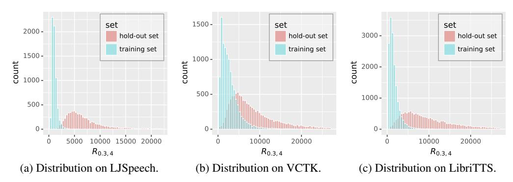

Figure 6: Rt=0.3,p=4 distribution for samples from training set and hold-out set at GradTTS on different datasets of PIAN.

#### B.3 Log-scaled ROC curve

As suggested by [\[2\]](#page-9-19), [Fig. 7](#page-13-1) and [Fig. 8](#page-14-0) display the log-scaled ROC curves. These curves demonstrate that the proposed method outperforms NA and SecMI at most of times.

Figure 7: The log-scaled ROC at DDPM of different methods on CIFAR10 and TinyImageNet.

#### B.4 Visualization of Reconstruction

Note [Eq. \(9\)](#page-4-0) is equal to the distance between ϵθ (x0, 0) and the predicted one ϵ ′ = ϵθ (xt, t) , where xt = √ a¯tx0 + √ 1 − a¯tϵθ (x0, 0). [Fig. 9](#page-15-0) and [Fig. 10](#page-16-0) show the reconstructed sample x ′ 0 = xt− √ 1−a¯tϵ ′ √ a¯t from xt using the predicted ϵ ′ at DDPM on CIFAR10 of PIAN. The reconstructed samples from t = 100 are clear for both the training set and the hold-out set. The reconstructed samples from t = 400 are blurry for both sets. However, for t = 200, the reconstructed samples are clear for the training set but blurry for the hold-out set.

For GradTTS, we use [Eq. \(12\)](#page-4-2) to reconstruct samples from xt. This reconstruction is not rigorous, but we just use it to give a visualization. [Fig. 11](#page-17-0) and [Fig. 12](#page-18-0) show the reconstructed samples on LJSpeech from PIA. The observed pattern is consistent with DDPM.

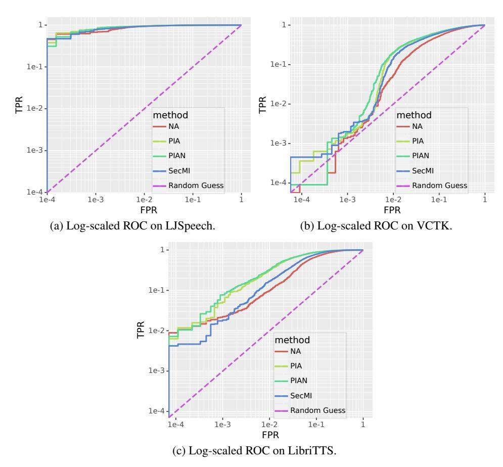

Figure 8: The log-scaled ROC at GradTTS of different methods on LJSpeech, VCTK and LibriTTS.

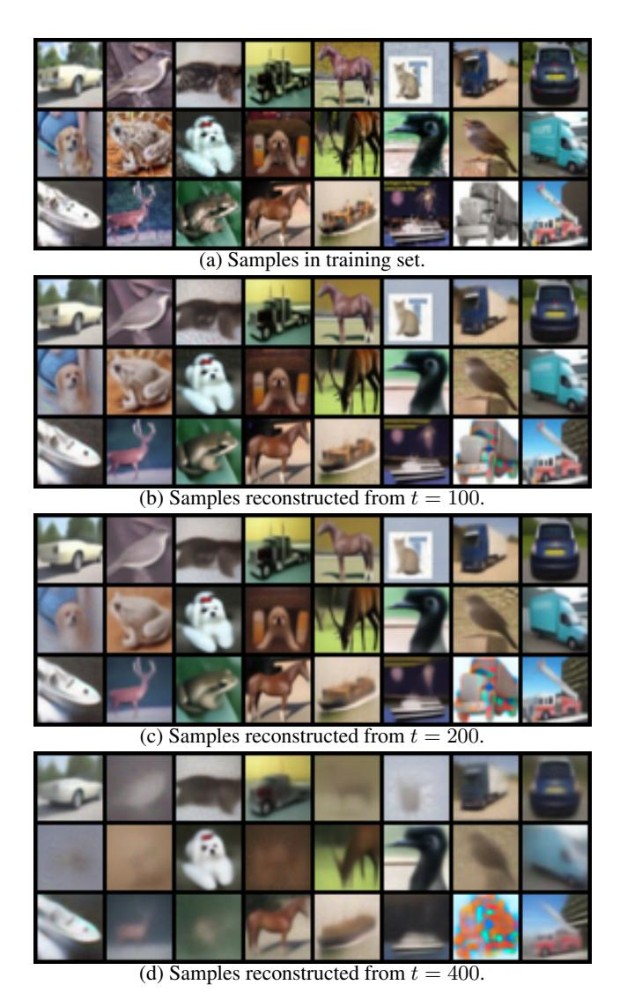

Figure 9: Samples in training set and the reconstructed samples at DDPM on CIFAR10 from PIAN.

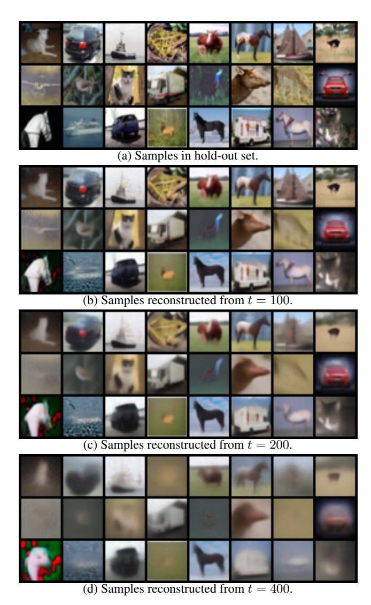

Figure 10: Samples in hold-out set and the reconstructed samples at DDPM on CIFAR10 from PIAN.

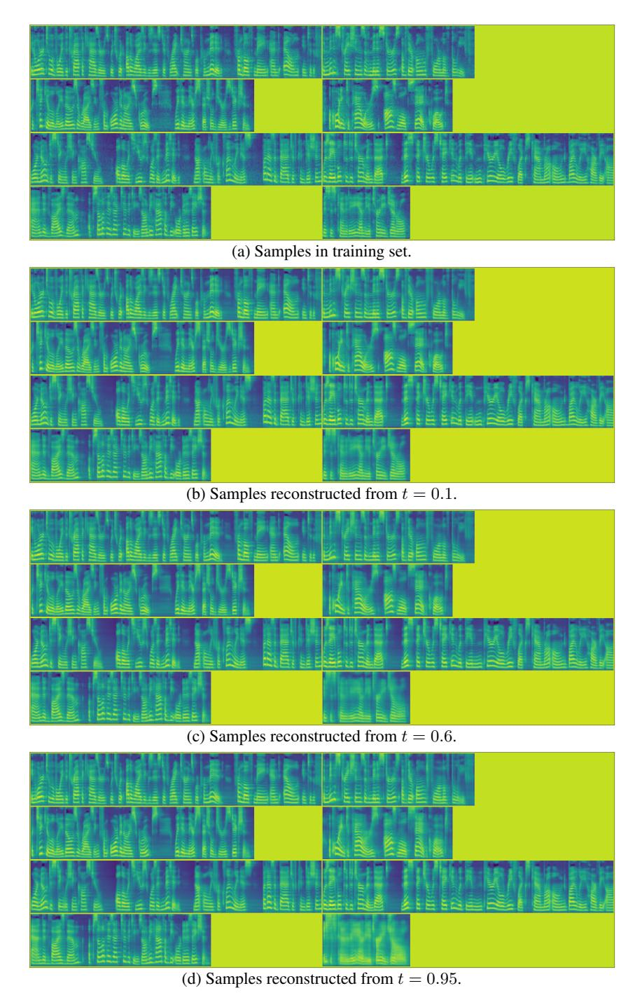

Figure 11: Samples in training set and the reconstructed samples at GradTTS on LJSpeech from PIA.

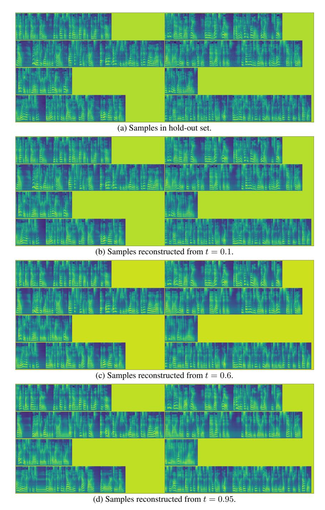

Figure 12: Samples in hold-out set and the reconstructed samples at GradTTS on LJSpeech from PIA.