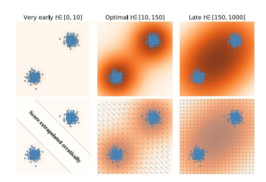

# 扩散模型的基于 score 的成员推断
SCORE-BASED MEMBERSHIP INFERENCE ON DIFFUSION MODELS

## 文档说明

- GitHub PDF：[2025-arxiv-sima-score-based-membership-inference-diffusion-models.pdf](https://github.com/DeliciousBuding/DiffAudit-Research/blob/main/references/materials/gray-box/2025-arxiv-sima-score-based-membership-inference-diffusion-models.pdf)
- 对应展示稿：[论文报告：SCORE-BASED MEMBERSHIP INFERENCE ON DIFFUSION MODELS](https://www.feishu.cn/docx/RN4ldU8uVo3gRyxBxQPcjSZQnhg)
- 开源实现：[mx-ethan-rao/SimA](https://github.com/mx-ethan-rao/SimA)
- 整理说明：本稿基于 born-digital Markdown 与原 PDF 交叉精修，保留论文主问题、关键公式、核心实验与对 DiffAudit 的直接结论，作为展示稿的本地源稿。

## 1. 论文定位

这是一篇 gray-box 扩散模型成员推断论文。作者并没有继续把攻击流程做复杂，而是反过来证明许多已有方法都在间接测量同一类 score-based 信号，因此可以退化成一个更简单的单查询攻击 SimA。

它同时还是一篇带机制解释色彩的论文。作者不仅比较了 DDPM、Guided Diffusion、LDM、Stable Diffusion 上的攻击效果，还把 latent diffusion 的弱泄露归因到 VAE 信息瓶颈，从而把“扩散模型成员推断”拆成了 pixel-space 与 latent-space 两种不同难度的子问题。

## 2. 核心问题

论文核心问题很具体：如果攻击者能在时间步 $t$ 上读到 denoiser 的预测噪声 $\hat{\epsilon}_{\theta}(x,t)$，那么这个向量的范数是否已经足够作为成员分数。进一步说，这个分数为什么有效，它到底对应的是训练样本附近的什么几何性质。

作者给出的答案是，预测噪声范数衡量的是查询点与局部 denoising mean 的偏离程度。成员样本在训练集诱导的局部核均值中更容易塌缩回自身，因此得到更小的范数；held-out 样本则通常不会满足这一点。

## 3. 威胁模型与前提

论文设定的攻击者可以访问目标扩散模型的中间接口，在给定样本 $x$ 和时间步 $t$ 的情况下查询 $\hat{\epsilon}_{\theta}(x,t)$。攻击者不读取训练集，也不依赖影子模型，但需要知道时间步接口与噪声日程，并拥有一个可用于标定阈值的成员 / 非成员验证集合。

论文不把结论外推到只有最终生成输出的弱黑盒 API，也不声称能覆盖 OOD 样本。作者明确指出，非常早的时间步会受到低密度区域 score 外推影响，非常晚的时间步又会因平滑过强而失去成员信号。

## 4. 方法总览

SimA 的形式非常简单：

$$
A(x,t)=\left\|\hat{\epsilon}_{\theta}(x,t)\right\|_p.
$$

攻击时只要扫描出一个较优时间步 $t$，对待测样本做一次查询，计算范数并与阈值比较即可。与 Loss、PFAMI、SecMI、PIA 相比，SimA 的定位不是取代所有方法，而是给出这些方法背后共同泄露机制的最直接测量形式。

## 5. 方法概览 / 流程

具体流程可以写成：先在验证集上扫时间步并选阈值，再对目标样本读取一次 $\hat{\epsilon}_{\theta}(x,t)$，最后根据范数大小做成员判定。作者在实现中对所有依赖时间步的攻击统一扫描了 $t=0:300$，并指出真正有区分度的通常不是最早时刻，而是中早期区间。

这张图非常适合当作流程理解图，而不是纯结果图。它说明了为什么过早和过晚的时间步都不好用，也解释了为何复现 SimA 时最应该投入精力的是时间步扫描，而不是先去堆多轮查询。

## 6. 关键技术细节

方法的理论支点，是把预测噪声与局部 denoising mean 联系起来。在 VP 扩散过程中，

$$
x_t=\sqrt{\bar{\alpha}_t}x_0+\sigma_t\epsilon,\qquad \epsilon\sim\mathcal{N}(0,I),
$$

并且有近似关系

$$
\hat{\epsilon}_{\theta}(x,t)\approx
\frac{x-\sqrt{\bar{\alpha}_t}\mu_t(x)}{\sigma_t}
=-\sigma_t\nabla_x \log p_t(x).
$$

若把有限训练集看成经验分布，则局部均值可写成训练样本的核加权和：

$$
\mu_t^{\mathrm{finite}}(x)=\sum_{i=1}^{N}w_i(x,t)x^{(i)},\qquad
w_i(x,t)\propto \exp\!\left(-\frac{\|x-\sqrt{\bar{\alpha}_t}x^{(i)}\|_2^2}{2\sigma_t^2}\right).
$$

于是，成员样本在 $t\to 0$ 时会让一个权重主导，满足 $\mu_t^{\mathrm{finite}}(x^{(k)})\to x^{(k)}$，从而 $\|\hat{\epsilon}_{\theta}(x^{(k)},t)\|\to 0$；held-out 样本则通常不会塌缩到自身。这就是 SimA 有效的核心原因。

## 7. 实验设置

主实验包括 DDPM 的 CIFAR-10、CIFAR-100、STL10-U、CelebA，均采用对半 member / held-out 划分；ImageNet-1K 上则比较 Guided Diffusion 与 LDM，并用 ImageNetV2 作为 held-out。附录还扩展到 Pokemon、COCO、Flickr30k 和 LAION 上的 Stable Diffusion。

基线为 PIA、PFAMIMet、SecMIstat、Loss，指标为 ASR、AUC、TPR@1%FPR 与查询次数。作者对 SimA、SecMI、PIA、Loss 都扫了 $t=0:300$，并指出 SimA 在实验中通常使用 $\ell_4$ 范数。

## 8. 主要结果

在 DDPM 上，SimA 的结果很强：CIFAR-10 / CIFAR-100 / STL10-U / CelebA 的 AUC 分别为 `90.45 / 89.85 / 96.34 / 82.85`，只需 `1` 次查询。特别是 STL10-U 上，TPR@1%FPR 达到 `72.75`，说明这种单查询分数并不只是整体 AUC 高，在低误报率下也能成立。

在 Guided Diffusion 的 ImageNet-1K 实验上，SimA 取得 `85.73` 的 ASR 和 `89.77` 的 AUC，明显强于大多数基线。相反，在同一成员 / 非成员划分上的 LDM，SimA 只剩 `55.78` ASR、`56.14` AUC 和 `1.97` TPR@1%FPR，其他方法也普遍接近随机。

作者随后用不同 $\beta$ 的 VAE 做受控实验，发现 KL 正则增强后，MIA AUC 会下降，而 FID 在一段区间内并没有同步恶化。这支持论文的核心判断：latent diffusion 的抗 MIA 性，很可能主要来自 VAE 编码器的信息瓶颈，而不是 diffusion process 自己天然更安全。

## 9. 优点

第一，方法极简且查询效率高。与需要多轮采样或多次 Monte Carlo 的方法相比，SimA 更像一个可直接部署的基线。

第二，理论与实验能互相闭环。作者没有停留在“成员样本 loss 更小”这种经验描述，而是给出 score 与局部均值之间的明确联系。

第三，论文包含重要负结果。它没有把所有扩散模型混成一个结论，而是清楚指出 latent diffusion 需要单独理解。

## 10. 局限与有效性威胁

局限一是接口假设偏强。若目标系统不暴露 denoiser 的中间输出，SimA 就不能直接使用。局限二是阈值标定依赖验证集，这让它更像研究型灰盒审计，而不是零先验攻击。

局限三是 latent diffusion 部分的解释仍偏经验。论文虽然把弱泄露归因到 VAE 信息瓶颈，但目前还没有把 diffusion、encoder、reconstruction error 三者完全拆开做因果隔离。

## 11. 对 DiffAudit 的价值

这篇论文对 DiffAudit 的第一价值，是提供 gray-box 路线的极简主基线。若仓库要先实现一个“最少查询、最少工程量、可解释”的成员推断方法，SimA 基本就是首选。

第二价值，是为路线分层提供证据。今后的 gray-box 文档和实验不应再把 DDPM 与 LDM 简单并列，而应明确区分 pixel-space 与 latent-space 两类攻击面。

## 12. 关键图使用方式

本稿只保留 1 张图，即关于 very early / optimal / late timestep 的示意图。原因是它最能帮助实现，而不是只展示数字。对 DiffAudit 来说，理解时间步为何不能贪图 $t=0$，比再插一张平均排名图更有用。

如果后续还要补第二张图，应优先补 Figure 3 的 DDPM vs LDM 与 $\beta$-VAE 对照图，因为那张图决定是否把 latent diffusion 作为单独路线。

## 13. 复现评估

复现 SimA 至少需要：目标扩散模型权重、任意时间步的 denoiser 查询接口、成员 / 非成员划分、时间步扫描脚本、阈值与 ROC 评估脚本。作者公开了检查点、划分和测试代码，因此纸面门槛不高。

真正的阻塞点有两个。其一，仓库若没有中间 denoiser 接口，就无法直接复现。其二，若继续做 latent diffusion，必须把 VAE 编码器一并纳入审计范围，否则就只能复现实验数字，解释不了原因。

## 14. 写回总索引用摘要

这篇论文研究扩散模型的 gray-box 成员推断，核心问题是攻击者能否只用一次 denoiser 查询，就判断图像是否属于训练集。

作者提出 SimA，把成员分数定义为预测噪声范数，并用局部核均值与 score 的关系解释其有效性。实验表明，该方法在 DDPM 和 Guided Diffusion 上表现很强，但在 LDM 与部分 Stable Diffusion 设定上明显退化。

对 DiffAudit 而言，这篇论文既是最适合先落地的 gray-box 极简基线，也是把扩散模型成员推断拆成 pixel-space 与 latent-space 两条路线的重要证据。
