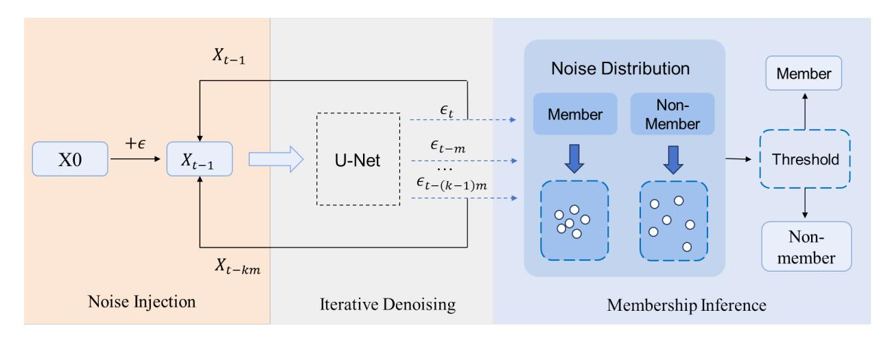
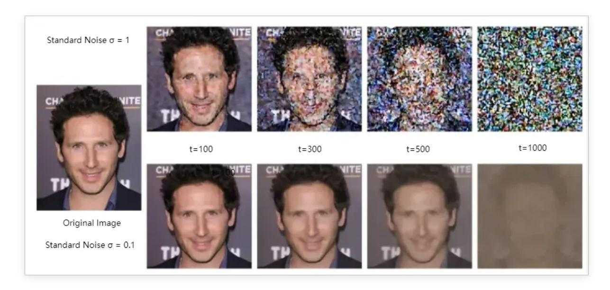
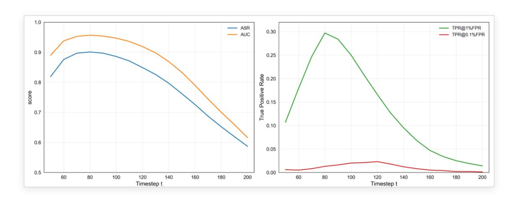
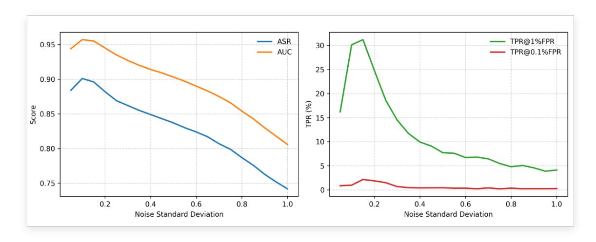
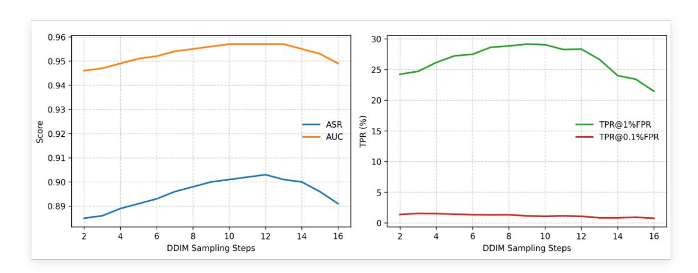

# Noise Aggregation Analysis Driven by Small-Noise Injection: Efficient Membership Inference for Diffusion Models

Guo Li, Yuyang Yu, Xuemiao Xu\* *South China University of Technology* Guangzhou, China 202321044843@mail.scut.edu.cn

*Abstract*—Diffusion models have demonstrated powerful performance in generating high-quality images. A typical example is text-to-image generator like Stable Diffusion. However, their widespread use also poses potential privacy risks. A key concern is membership inference attacks, which attempt to determine whether a particular data sample was used in the model training process. We propose an efficient membership inference attack method against diffusion models. This method is based on the injection of slight noise and the evaluation of the aggregation degree of the noise distribution. The intuition is that the noise prediction patterns of diffusion models for training set samples and non-training set samples exhibit distinguishable differences.Specifically, we suppose that member images exhibit higher aggregation of predicted noise around a certain time step of the diffusion process. In contrast, the predicted noises of nonmember images exhibit a more discrete characteristic around the certain time step. Compared with other existing methods, our proposed method requires fewer visits to the target diffusion model. We inject slight noise into the image under test and then determine its membership by analyzing the aggregation degree of the noise distribution predicted by the model. Empirical findings indicate that our method achieves superior performance across multiple datasets. At the same time, our method can also show better attack effects in ASR and AUC when facing large-scale text-to-image diffusion models, proving the scalability of our method.

*Index Terms*—diffusion models, membership inference attack, privacy, machine learning security, noise analysis

## I. INTRODUCTION

With the rapid development of generative models, highquality image synthesis has achieved significant success [1]– [5]. Today the most popular image generation methods are based on diffusion models. Diffusion models show strong generative abilities in many areas, such as artistic creation and medical image generation. Their superior performance comes from their unique training process. A diffusion model learns the training data distribution by gradually adding noise to the training data and training a model to denoise from it. This training scheme gives diffusion models better generalization than GANs or VAEs. Furthermore, text-to-image diffusion models(such as DALL-E 2,Midjourney,Stable Diffusion [3], [6])leverage text guidance and latent space encoding to improve the training and inference efficiency, which enables

\* Corresponding Author

the model to generate realistic images with semantic consistency [7], [8].

However, the wide use of diffusion models has also raised significant privacy concerns. Similar to other machine learning models, diffusion models are vulnerable to privacy attacks such as membership inference attacks (MIA). MIAs aim to determine whether a specific data sample was used during model training, which can result in severe privacy leakage [9]– [13]. For example, in medical scenarios, an adversary may infer whether a patient's data was included in the training set, which may result in severe privacy leakage. In commercial scenarios, competitors can exploit MIAs to identify whether proprietary data was used to train a target model, leading to training data leakage. As strict data protection regulations such as the General Data Protection Regulation (GDPR) [14] and the California Consumer Privacy Act (CCPA) [15], the ability to infer training set membership has direct consequences for societal trust in AI systems. Consequently, investigating MIAs against diffusion models is particularly important. Such research reveals the internal mechanisms of these black-box neural models. Also it pressures developers to adopt stronger privacy-preserving strategies during training to avoid potential risks.

Most existing MIAs is designed for classification models, while studies on generative models are largely limited to GANs and VAEs. However, those methods perform poorly when directly applied to diffusion models. Currently, membership inference attack methods for diffusion models remain scarce, and research in this area is still limited. Approaches based on loss functions [16] or likelihood estimation [17] typically achieve low accuracy. Query-based reconstruction [18] and prior-guided progressive [19] recovery methods require extensive model queries, leading to high computational costs. Methods designed specifically for text-to-image diffusion models [20], [21] rely on textual inputs and therefore do not generalize well to other diffusion frameworks.

To overcome these constraints, we propose a novel and efficient membership inference attack specifically designed for diffusion models. Our method leverages small noise injection and the evaluation of aggregation degree of the noise distribution to assess sample membership status, as illustrated in Figure. 1. The key intuition behind our approach is as follows:

Fig. 1. Overview of our proposed membership inference attack pipeline. The approach injects small noise into test images, predicts noise at selected timesteps, and evaluates the aggregation degree of predictions to determine sample membership.

(1) injecting small noise preserves the overall structure of the image, allowing the model to predict noise more accurately for member samples than non-member samples;(2) due to the progressive noise injection strategy, images denoised from adjacent time steps show high similarity. For member samples, the predicted noise across these timesteps shows stronger aggregation. In contrast, non-member samples, which the model has not learned, exhibit larger deviations under minor perturbations, leading to more dispersed noise predictions.

The main contributions of this paper are summarized as follows:

- We propose a new membership inference attack that injects low-intensity noise into input images and determines membership by evaluating the aggregation of predicted noise across specific timesteps.
- We show that the low-intensity noise injection strategy greatly reduces the number of accesses to the model. Our experiments show how varying noise levels affect attack performance, and the results indicate that this strategy amplifies the distinction between member and non-member samples. This not only enhances attack effectiveness but also offers critical insights into the inner workings of diffusion models.
- We perform extensive experiments on diverse datasets and benchmark our method against existing approaches. Results consistently demonstrate superior performance in key metrics such as AUC, ASR, and TPR at low FPR. We further extend our method to large scale text-to-image diffusion models, confirming its scalability.
- We conduct a systematic evaluation of multiple aggregation strategies and show that our method remains effective under most of them, with little dependence on the specific metric used. Beyond this, we provide a detailed analysis of how diffusion steps, DDIM sampling steps, and other factors influence performance.

The remainder of this paper is organized as follows. Section II reviews related work on diffusion models and membership inference attacks. Section III introduces the fundamentals of diffusion models and the concept of MIAs. Section IV presents the theoretical foundations and implementation details of our proposed approach. Section V reports experimental results, including comparisons with baselines and ablation studies. Section VI concludes the paper.

## II. RELATED WORK

## *A. Diffusion Models*

Recently,Diffusion models [22]–[24] have become one of the most popular methods in generating high-quality images. The main idea of Diffusion Models is to gradually add noise to the data, converting a complex distribution into a Gaussian distribution. Then the model will learn an inverse denoising process to recover the original data distribution. Compared with GANs [25] and VAEs [26], diffusion models show better training stability and higher generation quality. They can produce samples that are both high-quality and diverse [1]. In the application field, diffusion models have promoted the development of many fields, such as text-toimage generation, video synthesis [27], [28], speech synthesis [29]–[31], molecular design [32], [33] and so on. Their flexibility mainly comes from conditional control. They can guide the generation process with text, images, or other modal signals, enabling more precise control of content. At the same time, researchers have proposed many improvements to increase efficiency and quality of the diffusion models, such as accelerated sampling (DDIM [34]), latent space diffusion (LDM [6]), and architectural optimizations that combine attention mechanisms with large-scale pre-training [5], [6], [35]. These advances have greatly expanded the application scope of diffusion models and raised broad discussions on privacy, security, and copyright. Overall, diffusion models demonstrate powerful model generation capabilities and wide applicability with lasting research value.

#### *B. Membership Inference Attacks*

Membership Inference Attacks (MIA) aim to determine whether a sample belongs to the model's training set, initially focusing on classification models. Shokri et al. [9] proposed the shadow model approach. Then Salem et al. [11] and Yeom et al. [10] introduced loss-based metrics to reduce the attack costs. Long et al. [12], [13] pointed out that even if the model can generate well, the membership of some samples can still be correctly inferred.

With the popularity of GAN models, scholars shifted their attention to generative models. Hayes et al. [36] proposed the first white-box and black-box attack methods on GANs.They used the output of the generator to infer the membership of the sample. Then Hilprecht et al. [37] designed Monte Carlo integration and reconstruction attacks. They reveals differences between VAE and GAN in privacy leakage. Subsequently, Liu et al. [38] and Chen et al. [39] developed attack strategies based on reconstruction error.Their method became the most advanced method for attacking GANs.

With the widespread application of diffusion models in generative tasks, researchers have begun studying membership inference attacks against diffusion models. Duan et al. [18] first proposed that diffusion models still have a certain risk of membership information leakage in white-box scenarios, and that traditional methods targeting other generative models are ineffective against diffusion models. They proposed a membership inference method based on the posterior estimation error of the forward process, which became the state of the art method for attacking diffusion models. Matsumoto et al. [16] directly inferred membership relationships using the pixel error of the loss function at a specific time step. Hu et al. [17] proposed a method based on likelihood estimation for membership inference. In recent years, with the widespread application of text-to-image models, many scholars have begun to specifically study membership inference attack strategies for large-scale text-to-image models. Shengfang Zhai et al. [20]used the difference between the conditional and marginal likelihood (CliD) of samples to determine membership.The intuition is that member samples generally have larger CliD values. Qiao Li et al. [21]proposed using ssim similarity to determine differences between images. They added noise to images at specific time steps, then restored them, then compared the similarity before and after to determine the membership.

While the accuracy of MIA for generative models continues to improve, existing methods struggle to generalize across multiple datasets and often rely on a large number of queries, incurring high computational costs. Our approach significantly reduces the number of queries while maintaining the efficiency of membership inference attacks, and can be applied to multiple datasets and models, offering greater usability.

## III. PRELIMINARIES

#### *A. Diffusion Models*

Denoising Diffusion Probabilistic Models (DDPM [22]) define a stochastic Markov chain that gradually transforms an image into noise. The forward process, denoted as q, iteratively adds Gaussian noise to the data at each timestep. This process can be written as:

$$q(x_{1:T}|x_0) = \prod_{t=1}^{T} q(x_t|x_{t-1})$$
 (1)

$$q(x_t|x_{t-1}) = \mathcal{N}(x_t; \sqrt{1 - \beta_t} x_{t-1}, \beta_t I)$$
 (2)

where βt is a variance schedule that controls the noise level at step t. As t increases, α¯t approaches zero, making xt isotropic Gaussian noise. The reverse process aims to reconstruct the data distribution from Gaussian noise. This process can be expressed as:

$$p(x_{0:T}) = p(x_T) \prod_{t=1}^{T} p_{\theta}(x_{t-1}|x_t)$$
 (3)

$$p_{\theta}(x_{t-1}|x_t) = \mathcal{N}(x_{t-1}; \mu_{\theta}(x_t, t), \Sigma_{\theta}(x_t, t))$$
(4)

where Σθ(xt, t) is a constant depending on the variance schedule βt, and µθ(xt, t) is determined by a neural network. Through recursive application of reverse steps, Gaussian noise is converted back to the original image.

Training DDPM requires sampling image x0, timestep t, and random noise ϵ ∼ N (0, I). The forward process generates noisy image xt. A U-Net ϵθ predicts the noise in xt. The loss function for the denoising U-Net is:

$$L = \mathbb{E}_{x_0, t, \epsilon}[\|\epsilon - \epsilon_{\theta}(x_t, t)\|^2]$$
 (5)

To control the randomness of the reverse process, DDIM [34] modifies the noise added at each step:

$$x_{t-1} = \sqrt{\bar{\alpha}_{t-1}}\hat{x}_0 + \sqrt{1 - \bar{\alpha}_{t-1} - \sigma_t^2}\epsilon_{\theta}(x_t, t) + \sigma_t \epsilon_t \quad (6)$$

where xˆ0 is the estimated initial data, with expressions:

$$\hat{x}_0 = \frac{x_t - \sqrt{1 - \bar{\alpha}_t} \epsilon_{\theta}(x_t, t)}{\sqrt{\bar{\alpha}_t}}$$
 (7)

## *B. Membership Inference Attack*

Membership Inference Attack(MIA) is aim to identify whether a given data record was part of the model's training set. Let gϕ denote a diffusion model and the model is trained on a member set Dtrain ⊂ D. Then remaining data form the holdout set Dtest = D \ Dtrain. For any given data record x ⊂ D, the adversary's goal is to construct a decision model A that identifies whether x ∈ Dtrain.

The adversary does not access the model parameters directly. Instead, it queries the target diffusion model gϕ and obtains a membership indicator µ(x, gϕ) that reflects the model's response to x. A final prediction is obtained by comparing this value against a threshold τ :

$$\mathcal{A}(z, g_{\phi}) = \mathbb{1}[\mu(z, g_{\phi}) \ge \tau] \tag{8}$$

where ⊮[·] is an indicator function that outputs 1 if z is inferred to be a member and 0 if z is inferred to be a nonmember.

Fig. 2. Comparison of image diffusion effects under different noise intensities. The figure demonstrates how different noise levels affect image quality and the model's ability to distinguish between member and non-member samples.

## IV. METHODOLOGY

This section provides a detailed exposition of our proposed membership inference attack. As illustrated in Fig. 1, our approach consists of the following three stages: small-scale noise injection, iterative denoising prediction, and noise aggregation degree quantification analysis. Overall, we infer the membership by inject small-noise into the image and then quantifying the spatial aggregation degree of the predicted noise.

#### *A. Small-Scale Noise Injection Strategy*

Traditional methods employs DDIM for multi-step deterministic diffusion with high computational overhead. Our approach leverages the mathematical properties of the diffusion process to directly obtain noisy images at target timesteps by injecting single-step noise, which significantly reduces the number of accesses to the model.

Based on the reparameterization trick of the forward diffusion process, for Eq. (2), we can express the recursive diffusion process as:

$$x_t = \sqrt{1 - \beta_t} x_{t-1} + \sqrt{\beta_t} \epsilon_{t-1} \tag{9}$$

Defining αt = 1 − βt, α¯t = Qt s=1 αs, we obtain the direct mapping from initial image x0 to arbitrary timestep t:

$$x_{t} = \sqrt{\alpha_{t}} x_{t-1} + \sqrt{1 - \alpha_{t}} \epsilon_{t-1}$$

$$= \sqrt{\alpha_{t}} \left( \sqrt{\alpha_{t-1}} x_{t-2} + \sqrt{1 - \alpha_{t-1}} \epsilon_{t-2} \right) + \sqrt{1 - \alpha_{t}} \epsilon_{t-1}$$

$$= \sqrt{\alpha_{t} \alpha_{t-1}} x_{t-2} + \sqrt{\alpha_{t} (1 - \alpha_{t-1})} \epsilon_{t-2} + \sqrt{1 - \alpha_{t}} \epsilon_{t-1}$$

$$\vdots$$

$$= \left( \prod_{i=1}^{t} \sqrt{\alpha_{i}} \right) x_{0} + \sum_{i=1}^{t} \sqrt{(1 - \alpha_{i})} \prod_{j=i+1}^{t} \alpha_{j} \epsilon_{i-1}$$

$$= \sqrt{\bar{\alpha}_{t}} x_{0} + \sqrt{1 - \bar{\alpha}_{t}} \epsilon$$
(10)

where ϵ ∼ N (0, I) is standard Gaussian noise. This equation demonstrates that the multi-step noise addition process is mathematically equivalent to directly injecting Gaussian noise with variance 1 − α¯t into the original image. Based on this important property, we adopt a single-step noise injection strategy to directly obtain noisy images at target timesteps, avoiding the multi-step iterative process in traditional methods.

As illustrated in Figure. 2, small-scale noise injection strategy can preserving image structural information better, which means the model may predict the noise more accurately if the image is used to train the diffusion model. Based on this assumption, we employ a small-scale noise injection strategy to maximize the distinguishability between member and nonmember samples. Specifically, the inference achieves its best performance when the injected noise has a standard deviation of σ = 0.1.

### *B. Iterative Denoising Prediction Stage*

After obtaining the noisy image xt, we acquire noise predictions at different timesteps through an iterative denoising process to construct feature vectors for membership analysis. This process is based on the intuition that training set members, having been repeatedly optimized during model training, exhibit higher consistency and concentration in the model's noise predictions.

First, we input the noisy image xt into the target UNet denoising network to obtain the predicted noise at timestep t:

$$\hat{\epsilon}_t = \epsilon_\theta(x_t, t) \tag{11}$$

Based on the predicted noise, we can estimate the original image: √

$$\hat{x}_0 = \frac{x_t - \sqrt{1 - \bar{\alpha}_t} \hat{\epsilon}_t}{\sqrt{\bar{\alpha}_t}} \tag{12}$$

Based on Eq. (6), we set σt = 0, the process of denoising becomes deterministic. Then we can estimate the original image at timestep t − m:

$$x_{t-m} = \sqrt{\bar{\alpha}_{t-m}} \hat{x}_0 + \sqrt{1 - \bar{\alpha}_{t-m}} \hat{\epsilon}_t \tag{13}$$

where m is the stride between sampled timesteps. By repeating the above denoising process, we sequentially obtain predicted noise sequences for k consecutive timesteps {ϵˆt, ϵˆt−m, ϵˆt−2m, . . . , ϵˆt−(k−1)m}. This noise sequence constitutes the fundamental feature representation for subsequent membership analysis.

# *C. Noise Aggregation Degree Quantification Analysis*

Based on the obtained noise prediction sequence, we identify sample membership by quantifying the spatial aggregation degree of noise distributions. Our intuition is that training set members, having been repeatedly learned during model optimization, exhibit stronger aggregation in their corresponding noise predictions in the feature space, while non-member samples show greater dispersion due to model uncertainty.

To quantify noise aggregation degree, we define a aggregation metric function C(·) to evaluate the compactness of noise vector collections. Given noise sequence E = {ϵˆt−im} k−1 i=0 , we consider the following aggregation metrics:

• L1 Average Distance Metric:

$$C_{L1}(\mathcal{E}) = \frac{1}{|\mathcal{E}|^2} \sum_{i,j} \|\hat{\epsilon}_i - \hat{\epsilon}_j\|_1$$
 (14)

• MSE Average Distance Metric:

$$C_{MSE}(\mathcal{E}) = \frac{1}{|\mathcal{E}|^2} \sum_{i,j} \|\hat{\epsilon}_i - \hat{\epsilon}_j\|_2^2$$
 (15)

• Centroid Distance Metric:

$$C_{centroid}(\mathcal{E}) = \frac{1}{|\mathcal{E}|} \sum_{i} \|\hat{\epsilon}_{i} - \bar{\epsilon}\|_{2}$$
 (16)

where ϵ¯ = |E| P i ϵˆi is the centroid of noise vectors.

• Average Density Metric:

$$C_{density}(\mathcal{E}) = \frac{1}{|\mathcal{E}|} \sum_{i} \frac{1}{\sigma_i + \delta}$$
 (17)

Here, σi denotes the distance from ϵˆi to its nearest neighbor, and δ is a small constant to avoid division by zero.

• Convex Hull Volume Metric:

$$C_{volume}(\mathcal{E}) = \text{Volume}(\text{ConvexHull}(\mathcal{E}))$$
 (18)

The final membership score is defined through a logarithmic transformation to ensure numerical stability:

$$S_m = -\log(C(\mathcal{E}) + \delta) \tag{19}$$

where δ is a numerical stability constant. Lower aggregation metrics C(E) (i.e., more concentrated noise predictions) correspond to higher membership scores Sm, indicating higher likelihood of training set membership.

Our approach significantly reduces the number of queries to the target model. Existing methods [18], [19] typically rely on deterministic DDIM sampling, requiring frequent model accesses during the diffusion process to the target sampling step. When the number of sampling steps is large, the number of model calls increases, resulting in high computational overhead. In contrast, our approach only requires obtaining the predicted noise from k adjacent denoised images to complete inference, significantly reducing model reliance and effectively improving the efficiency of attacks against diffusion models.

From an information-theoretic perspective, training samples exhibit lower uncertainty in the model's representation space, which is reflected in more consistent noise predictions. Let H(ϵ|x) denote the entropy of noise prediction for a given sample x. We hypothesize that:

$$H(\epsilon|x_{member}) < H(\epsilon|x_{non-member})$$
 (20)

In other words, member samples tend to have lower prediction entropy than non-member samples, and this discrepancy can be captured and exploited through aggregation-based metrics.

#### V. EXPERIMENTS

#### *A. Experimental Setup*

Dataset Configuration: We conducted comprehensive evaluations on three widely used visual datasets: CIFAR-10, CIFAR-100, and Tiny-ImageNet (Tiny-IN). We employed a random partitioning strategy, allocating 50% of samples from each dataset as the training set and the remaining 50% for testing. Specifically, the training and test sets for CIFAR-10 and CIFAR-100 each contain 25,000 samples, while Tiny-IN contains 50,000 samples each.

For text-to-image model evaluation, as they trained on LAION datasets, we randomly sampled 1,000 images from it as the member set. For the non-member set, we randomly sampled 1,000 images from the COCO2017-Val dataset, which is commonly used for generative model evaluation.

Implementation Details: The training procedures and hyperparameter settings for diffusion models remain consistent with [18] to ensure fair comparison. Key parameter settings include: diffusion steps T = 80, noise prediction sampling

TABLE I COMPARISON OF ASR AND AUC ACROSS DIFFERENT DATASETS

| Methods   | Query Times | CIFAR-10 |       | CIFAR-100 |       | Tiny-IN |       |
|-----------|-------------|----------|-------|-----------|-------|---------|-------|
|           |             | ASR      | AUC   | ASR       | AUC   | ASR     | AUC   |
| GAN-leaks | 1000        | 0.615    | 0.646 | 0.513     | 0.459 | 0.545   | 0.457 |
| NaiveLoss | 1           | 0.663    | 0.718 | 0.654     | 0.709 | 0.646   | 0.700 |
| SecMI     | 12          | 0.811    | 0.881 | 0.798     | 0.868 | 0.821   | 0.894 |
| Ours      | 5           | 0.901    | 0.957 | 0.839     | 0.903 | 0.842   | 0.912 |

TABLE II COMPARISON OF TPR @ 1% FPR (%) AND TPR @ 0.1% FPR (%) ACROSS DIFFERENT DATASETS

| Methods   | CIFAR-10 |          |        | CIFAR-100 | Tiny-IN |          |
|-----------|----------|----------|--------|-----------|---------|----------|
|           | TPR@1%   | TPR@0.1% | TPR@1% | TPR@0.1%  | TPR@1%  | TPR@0.1% |
| GAN-leaks | 2.80     | 0.29     | 1.85   | 0.23      | 1.01    | 0.13     |
| NaiveLoss | 3.35     | 0.40     | 4.79   | 0.76      | 4.44    | 0.44     |
| SecMI     | 9.11     | 0.66     | 9.26   | 0.46      | 12.67   | 0.96     |
| Ours      | 28.7     | 1.22     | 9.65   | 0.78      | 14.58   | 1.03     |

Fig. 3. Attack performance across different timestep parameters. The figure shows the relationship between timestep selection and attack effectiveness, with optimal performance achieved in the intermediate range.

count k = 5, and DDIM accelerated sampling denoising steps m = 10. For text-to-image models, we directly employ pretrained Stable Diffusion v1.4 and v1.5 models from Hugging-Face as attack targets.

Evaluation Metric: We adopt standard evaluation metrics from membership inference attack research:

- ASR: Membership inference accuracy,measuring overall attack performance.
- AUC: Area under the ROC curve, evaluating classifier discrimination capability.
- TPR@1%FPR: True positive rate when false positive rate is fixed at 1%, measuring detection capability under low false alarm rates
- TPR@0.1%FPR: True positive rate when false positive rate is fixed at 0.1%, measuring detection capability under extremely low false alarm rates

#### *B. Baseline Method Comparison*

We compare against a suite of representative baselines, including GAN-Leaks [39], NaiveLoss [16], and SecMI [18]. To ensure a fair evaluation, we adopt a unified protocol based on a threshold decision rule without training on the test set. And we follow the implementation details reported in each method's original paper. We trained DDPM models on CIFAR-10, CIFAR-100, and Tiny-IN for comprehensive performance comparison.

As shown in Table I and II, our method outperforms all existing approaches on all metrics. Moreover, compared with SecMI, which achieves the best overall performance among existing approaches, our method significantly reduces the number of model queries, thereby greatly improving the efficiency of membership inference attacks.

Fig. 4. Impact of initial noise intensity on attack performance. The figure illustrates the optimal noise level that balances member/non-member distinguishability with image quality preservation.

Fig. 5. Impact of DDIM sampling step size on attack performance. The figure shows the relationship between sampling granularity and attack effectiveness.

TABLE III IMPACT OF DIFFERENT AGGREGATION DEGREE METRICS

| Aggregation Metrics  | ASR   | AUC   | TPR@1%FPR (%) | TPR@0.1%FPR (%) |
|----------------------|-------|-------|---------------|-----------------|
| Distance to centroid | 0.899 | 0.956 | 28.5          | 1.2             |
| Convex hull volume   | 0.771 | 0.839 | 5.9           | 0.36            |
| Average density      | 0.901 | 0.957 | 28.2          | 1.3             |
| L1 average distance  | 0.885 | 0.942 | 12.9          | 0.5             |
| L2 average distance  | 0.901 | 0.957 | 29.7          | 1.3             |

## *C. Ablation Studies*

*1) Timestep Parameter Impact Analysis:* We systematically examined the impact of different timesteps on attack performance. Empirical findings indicate that our method performs well within the T ∈ [50, 150] range. We think it is because within this range, images suffer relatively minimal noise interference and retain sufficient structural information, enabling diffusion models to effectively predict original noise based on preserved structural features. In corresponding neighborhoods, predicted noise distributions for member images are more concentrated compared to non-member images, which enables effective member differentiation through noise aggregation.

*2) Aggregation Degree Metrics Comparative Analysis:* As discussed in Section IV, we conducted systematic comparisons of multiple noise aggregation degree metrics, including average L1 distance, L2 distance, average distance to centroid, convex hull volume, and average density. Experimental results show that performance differences under different metrics are relatively small, which indicates that our method has good robustness to metric selection. Considering computational ef-

TABLE IV IMPACT OF DENOISING STEPS

| K | ASR   | TPR@1%FPR |
|---|-------|-----------|
| 2 | 0.888 | 25.5      |
| 3 | 0.892 | 26.9      |
| 4 | 0.897 | 28.6      |
| 5 | 0.901 | 29.7      |
| 6 | 0.900 | 26.9      |
| 7 | 0.893 | 22.0      |
| 8 | 0.875 | 17.7      |

TABLE V PERFORMANCE ON STABLE DIFFUSION MODELS

| Methods   |       | SD1.4 |        | SD1.5 |       |        |  |
|-----------|-------|-------|--------|-------|-------|--------|--|
|           | ASR   | AUC   | TPR@1% | ASR   | AUC   | TPR@1% |  |
| GAN-Leaks | 0.533 | 0.468 | 1.73   | 0.541 | 0.472 | 1.64   |  |
| NaiveLoss | 0.630 | 0.638 | 23.7   | 0.631 | 0.639 | 23.7   |  |
| SecMI     | 0.602 | 0.605 | 15.3   | 0.602 | 0.606 | 15.3   |  |
| Ours      | 0.701 | 0.652 | 8.0    | 0.696 | 0.661 | 8.3    |  |

ficiency comprehensively, we ultimately choose L2 average distance as the default measurement approach.

- *3) Initial Noise Intensity Impact Analysis:* We conducted a detailed investigation of the impact of different noise standard deviations on attack performance. As shown in Figure 4, the results exhibit a clear "rise-then-fall" trend: when the injected noise is too small, it cannot sufficiently amplify the differences between members and non-members; when the noise becomes too large, it severely degrades the semantic fidelity of the images, thereby hindering reliable model predictions.
- *4) Denoising Steps Impact:* We explored the impact of the denoising step size on the attack's effectiveness. As shown in Table IV, experiments show that as the denoising step size increases, performance initially improves and then decreases. We believe that the reason is that if the number of denoising steps is too small, the randomness of the aggregation measurement is large, making the prediction results unstable. If the number of denoising steps is too large, the difference between the first denoising image and the last denoising image is too large, making both the aggregation of members and non-members low and difficult to distinguish.
- *5) DDIM Sampling Steps Impact Analysis:* We further analyzed the impact of DDIM sampling steps on overall performance. As illustrated in Figure 5, experiments shows that increasing sampling steps can enhance attack performance, but performance stabilizes after reaching a certain range. We believe the reason is that if the sampling step is too short, the images will be too similar to identify. Both member and non-member images will predict similar noise within adjacent denoising steps, making it difficult to distance them. But if the sampling step is too long, the difference between the image and its denoised neighboring images will be too large. Even adjacent images denoised by the member image may be considered different images, resulting in large differences in noise predictions, which reduced the accuracy of

the attack model. Ultimately, we select step size=10 to balance performance and computational efficiency.

## *D. Large-Scale Text-to-Image Model Evaluation*

To validate the effectiveness of our method in practical application scenarios, we conducted attack testing on mainstream text-to-image generation models Stable Diffusion v1.4 and v1.5 provided by HuggingFace. We randomly sampled 1,000 images from the LAION-aesthetic-5plus dataset as the member set and sampled 1,000 images from the COCO2017- Val dataset as the non-member set.

As shown in Table 5, Our method outperforms existing approaches in terms of ASR and AUC, but the attack effectiveness decreases noticeably compared with DDPM. We attribute this to the VAE-based latent diffusion process, where encoding images into a lower-dimensional space reduces information diversity and weakens our method's ability to distinguish member samples. Moreover, the large-scale training dataset enhances the model's generalization capability, making it more resistant to MIA. In addition, our method performs significantly worse than the baseline NaiveLoss on TPR@1%FPR. We believe this is because NaiveLoss relies directly on the loss value for membership determination, making it less affected by components such as the VAE encoder.

#### VI. CONCLUSION

In this paper, we address the shortcomings of existing research on membership inference attacks against generative models and propose an efficient and versatile method for membership inference in diffusion models. Based on smallnoise injection and analysis of noise aggregation around specific time steps, our method significantly reduces the number of model queries while effectively distinguishing between members and non-members, providing a reference for more secure model design. Empirical findings indicate that our method outperforms existing methods on both standard diffusion models, e.g., DDPM and state-of-the-art text-to-image models, e.g., Stable Diffusion, demonstrating good applicability and scalability. Furthermore, we systematically analyze the impact of factors such as noise intensity and the number of accelerated sampling steps on attack performance, which not only verifies the robustness of our method but also provides valuable insights into the internal mechanisms of diffusion models.

## REFERENCES

- [1] P. Dhariwal and A. Nichol, "Diffusion models beat gans on image synthesis," *Advances in neural information processing systems*, vol. 34, pp. 8780–8794, 2021.
- [2] X. Liu, D. H. Park, S. Azadi, G. Zhang, A. Chopikyan, Y. Hu, H. Shi, A. Rohrbach, and T. Darrell, "More control for free! image synthesis with semantic diffusion guidance," in *Proceedings of the IEEE/CVF winter conference on applications of computer vision*, 2023, pp. 289– 299.
- [3] A. Ramesh, P. Dhariwal, A. Nichol, C. Chu, and M. Chen, "Hierarchical text-conditional image generation with clip latents," *arXiv preprint arXiv:2204.06125*, vol. 1, no. 2, p. 3, 2022.

- [4] N. Ruiz, Y. Li, V. Jampani, Y. Pritch, M. Rubinstein, and K. Aberman, "Dreambooth: Fine tuning text-to-image diffusion models for subjectdriven generation," in *Proceedings of the IEEE/CVF conference on computer vision and pattern recognition*, 2023, pp. 22 500–22 510.
- [5] C. Saharia, W. Chan, S. Saxena, L. Li, J. Whang, E. L. Denton, K. Ghasemipour, R. Gontijo Lopes, B. Karagol Ayan, T. Salimans *et al.*, "Photorealistic text-to-image diffusion models with deep language understanding," *Advances in neural information processing systems*, vol. 35, pp. 36 479–36 494, 2022.
- [6] R. Rombach, A. Blattmann, D. Lorenz, P. Esser, and B. Ommer, "Highresolution image synthesis with latent diffusion models," in *Proceedings of the IEEE/CVF conference on computer vision and pattern recognition*, 2022, pp. 10 684–10 695.
- [7] J. Ho and T. Salimans, "Classifier-free diffusion guidance," *arXiv preprint arXiv:2207.12598*, 2022. [Online]. Available: https://arxiv.org/abs/2207.12598
- [8] J. Ma, T. Hu, W. Wang, and J. Sun, "Elucidating the design space of classifier-guided diffusion generation," in *NeurIPS 2023 Workshop on Score-Based Methods*, 2023. [Online]. Available: https://arxiv.org/abs/2310.11311
- [9] R. Shokri, M. Stronati, C. Song, and V. Shmatikov, "Membership inference attacks against machine learning models," in *2017 IEEE symposium on security and privacy (SP)*. IEEE, 2017, pp. 3–18.
- [10] S. Yeom, I. Giacomelli, M. Fredrikson, and S. Jha, "Privacy risk in machine learning: Analyzing the connection to overfitting," in *2018 IEEE 31st computer security foundations symposium (CSF)*. IEEE, 2018, pp. 268–282.
- [11] A. Salem, Y. Zhang, M. Humbert, P. Berrang, M. Fritz, and M. Backes, "Ml-leaks: Model and data independent membership inference attacks and defenses on machine learning models," *arXiv preprint arXiv:1806.01246*, 2018.
- [12] Y. Long, V. Bindschaedler, L. Wang, D. Bu, X. Wang, H. Tang, C. A. Gunter, and K. Chen, "Understanding membership inferences on wellgeneralized learning models," *arXiv preprint arXiv:1802.04889*, 2018.
- [13] Y. Long, L. Wang, D. Bu, V. Bindschaedler, X. Wang, H. Tang, C. A. Gunter, and K. Chen, "A pragmatic approach to membership inferences on machine learning models," in *2020 IEEE European Symposium on Security and Privacy (EuroS&P)*. IEEE, 2020, pp. 521–534.
- [14] "Regulation (EU) 2016/679 of the European Parliament and of the Council of 27 April 2016 on the protection of natural persons with regard to the processing of personal data and on the free movement of such data (General Data Protection Regulation)," https://eurlex.europa.eu/eli/reg/2016/679/oj, 2016, official Journal of the European Union, L119, 1-88.
- [15] "California Consumer Privacy Act of 2018 (CCPA)," https://oag.ca.gov/privacy/ccpa, 2018, cal. Civ. Code §§1798.100– 1798.199.
- [16] T. Matsumoto, T. Miura, and N. Yanai, "Membership inference attacks against diffusion models," in *2023 IEEE Security and Privacy Workshops (SPW)*. IEEE, 2023, pp. 77–83.
- [17] H. Hu and J. Pang, "Membership inference of diffusion models," *arXiv preprint arXiv:2301.09956*, 2023.
- [18] J. Duan, F. Kong, S. Wang, X. Shi, and K. Xu, "Are diffusion models vulnerable to membership inference attacks?" in *International Conference on Machine Learning*. PMLR, 2023, pp. 8717–8730.
- [19] X. Fu, X. Wang, Q. Li, J. Liu, J. Dai, J. Han, and X. Gao, "Unlocking generative priors: A new membership inference framework for diffusion models," *IEEE Transactions on Information Forensics and Security*, 2025.
- [20] S. Zhai, H. Chen, Y. Dong, J. Li, Q. Shen, Y. Gao, H. Su, and Y. Liu, "Membership inference on text-to-image diffusion models via conditional likelihood discrepancy," *Advances in Neural Information Processing Systems*, vol. 37, pp. 74 122–74 146, 2024.
- [21] Q. Li, X. Fu, X. Wang, J. Liu, X. Gao, J. Dai, and J. Han, "Unveiling structural memorization: Structural membership inference attack for text-to-image diffusion models," in *Proceedings of the 32nd ACM International Conference on Multimedia*, 2024, pp. 10 554–10 562.
- [22] J. Ho, A. Jain, and P. Abbeel, "Denoising diffusion probabilistic models," *Advances in neural information processing systems*, vol. 33, pp. 6840– 6851, 2020.
- [23] J. Sohl-Dickstein, E. Weiss, N. Maheswaranathan, and S. Ganguli, "Deep unsupervised learning using nonequilibrium thermodynamics," in *International conference on machine learning*. pmlr, 2015, pp. 2256– 2265.

- [24] A. Q. Nichol and P. Dhariwal, "Improved denoising diffusion probabilistic models," in *Proceedings of the 38th International Conference on Machine Learning*, ser. Proceedings of Machine Learning Research, vol. 139. PMLR, 2021, pp. 8162–8171. [Online]. Available: http://proceedings.mlr.press/v139/nichol21a.html
- [25] I. J. Goodfellow, J. Pouget-Abadie, M. Mirza, B. Xu, D. Warde-Farley, S. Ozair, A. Courville, and Y. Bengio, "Generative adversarial nets," *Advances in neural information processing systems*, vol. 27, 2014.
- [26] D. P. Kingma and M. Welling, "Auto-encoding variational bayes," *arXiv preprint arXiv:1312.6114*, 2013.
- [27] O. Bar-Tal, H. Chefer, O. Tov, C. Herrmann, R. Paiss, S. Zada, A. Ephrat, J. Hur, G. Liu, A. Raj *et al.*, "Lumiere: A space-time diffusion model for video generation," in *SIGGRAPH Asia 2024 Conference Papers*, 2024, pp. 1–11.
- [28] X. Ma, Y. Wang, G. Jia, X. Chen, Z. Liu, Y.-F. Li, C. Chen, and Y. Qiao, "Latte: Latent diffusion transformer for video generation," *arXiv preprint arXiv:2401.03048*, 2024.
- [29] V. Popov, I. Vovk, V. Gogoryan, T. Sadekova, and M. Kudinov, "Gradtts: A diffusion probabilistic model for text-to-speech," in *International conference on machine learning*. PMLR, 2021, pp. 8599–8608.
- [30] M. Jeong, H. Kim, S. J. Cheon, B. J. Choi, and N. S. Kim, "Difftts: A denoising diffusion model for text-to-speech," *arXiv preprint arXiv:2104.01409*, 2021.
- [31] Y. Long, K. Yang, Y. Ma, and Y. Yang, "Mixdiff-tts: Mixture alignment and diffusion model for text-to-speech," *Applied Sciences*, vol. 15, no. 9, p. 4810, 2025.
- [32] L. Huang, T. Xu, Y. Yu, P. Zhao, X. Chen, J. Han, Z. Xie, H. Li, W. Zhong, K.-C. Wong *et al.*, "A dual diffusion model enables 3d molecule generation and lead optimization based on target pockets," *Nature Communications*, vol. 15, no. 1, p. 2657, 2024.
- [33] M. Oestreich, E. Merdivan, M. Lee, J. L. Schultze, M. Piraud, and M. Becker, "Drugdiff: small molecule diffusion model with flexible guidance towards molecular properties," *Journal of cheminformatics*, vol. 17, no. 1, p. 23, 2025.
- [34] J. Song, C. Meng, and S. Ermon, "Denoising diffusion implicit models," *arXiv preprint arXiv:2010.02502*, 2020.
- [35] A. Ramesh, M. Pavlov, G. Goh, S. Gray, C. Voss, A. Radford, M. Chen, and I. Sutskever, "Dall· e 2: Hierarchical text-conditional image generation with clip latents," in *Proceedings of the IEEE/CVF Conference on Computer Vision and Pattern Recognition (CVPR)*, 2022.
- [36] J. Hayes, L. Melis, G. Danezis, and E. De Cristofaro, "Logan: Membership inference attacks against generative models," *arXiv preprint arXiv:1705.07663*, 2017.
- [37] B. Hilprecht, M. Harterich, and D. Bernau, "Monte carlo and re- ¨ construction membership inference attacks against generative models," *Proceedings on Privacy Enhancing Technologies*, 2019.
- [38] K. S. Liu, C. Xiao, B. Li, and J. Gao, "Performing co-membership attacks against deep generative models," in *2019 IEEE International Conference on Data Mining (ICDM)*. IEEE, 2019, pp. 459–467.
- [39] D. Chen, N. Yu, Y. Zhang, and M. Fritz, "Gan-leaks: A taxonomy of membership inference attacks against generative models," in *Proceedings of the 2020 ACM SIGSAC conference on computer and communications security*, 2020, pp. 343–362.