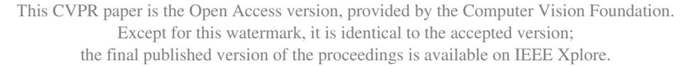
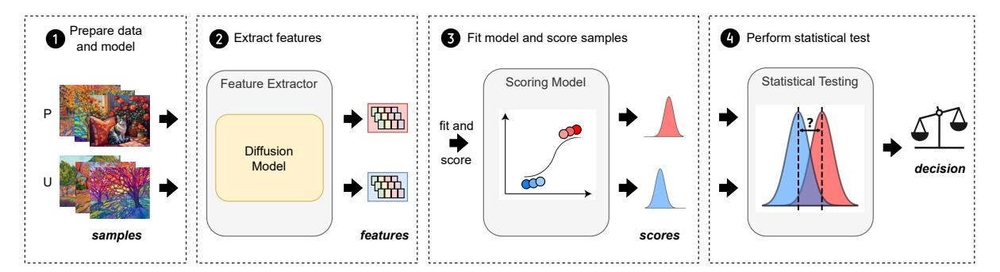
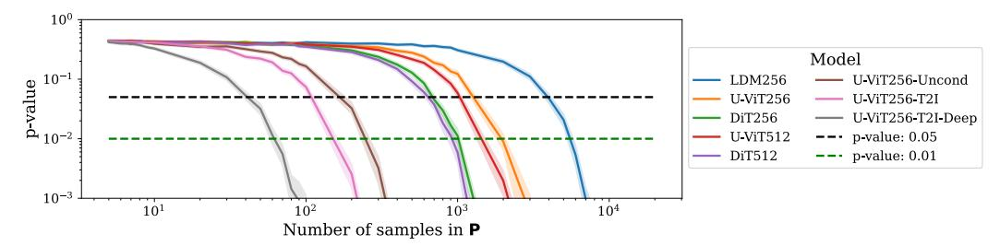
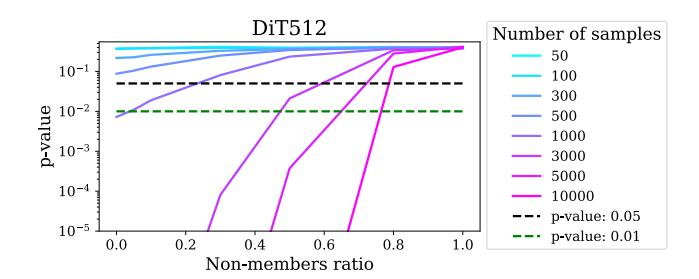

# CDI: Copyrighted Data Identification in Diffusion Models

Jan Dubinski ´ \* †

Warsaw University of Technology, IDEAS NCBR jan.dubinski.dokt@pw.edu.pl

#### Franziska Boenisch

CISPA Helmholtz Center for Information Security boenisch@cispa.de

#### Abstract

*Diffusion Models (DMs) benefit from large and diverse datasets for their training. Since this data is often scraped from the Internet without permission from the data owners, this raises concerns about copyright and intellectual property protections. While (illicit) use of data is easily detected for training samples perfectly re-created by a DM at inference time, it is much harder for data owners to verify if their data was used for training when the outputs from the suspect DM are not close replicas. Conceptually, membership inference attacks (MIAs), which detect if a given data point was used during training, present themselves as a suitable tool to address this challenge. However, we demonstrate that existing MIAs are not strong enough to reliably determine the membership of individual images in large, state-of-the-art DMs. To overcome this limitation, we propose Copyrighted Data Identification (CDI), a framework for data owners to identify whether their dataset was used to train a given DM. CDI relies on dataset inference techniques, i.e., instead of using the membership signal from a single data point, CDI leverages the fact that most data owners, such as providers of stock photography, visual media companies, or even individual artists, own datasets with multiple publicly exposed data points which might all be included in the training of a given DM. By selectively aggregating signals from existing MIAs and using new handcrafted methods to extract features from these datasets, feeding them to a scoring model, and applying rigorous statistical testing, CDI allows data owners with as little as 70 data points to identify with a confidence of more than 99% whether their data was used to train a given DM. Thereby, CDI represents a valuable tool for data owners to claim illegitimate use of their copyrighted data. We make our code available at [https://github.com/sprintml/](https://github.com/sprintml/copyrighted_data_identification) [copyrighted\\_data\\_identification](https://github.com/sprintml/copyrighted_data_identification).*

### Antoni Kowalczuk \*

CISPA Helmholtz Center for Information Security antoni.kowalczuk@cispa.de

#### Adam Dziedzic

CISPA Helmholtz Center for Information Security adam.dziedzic@cispa.de

# 1. Introduction

In recent years, large diffusion models (DMs) [\[56\]](#page-10-0) have rapidly gained popularity as a new class of generative models, surpassing the performance of prior approaches, such as Generative Adversarial Networks [\[23\]](#page-8-0). DMs now power several state-of-the-art image generators including Stable Diffusion [\[47\]](#page-9-0), Midjourney [\[60\]](#page-10-1), Runway [\[47\]](#page-9-0), Imagen [\[50\]](#page-9-1), and DALL-E 2 [\[41,](#page-9-2) [42\]](#page-9-3).

To reach their powerful performance, DMs need to be trained on large amounts of high-quality and diverse data. This data is usually scraped from the Internet, often without respecting the copyrights of the data owners. Especially since it has been shown that DMs are capable of generating verbatim copies of their training data at inference time [\[11\]](#page-8-1), this represents a violation of intellectual property rights. Recently, Getty Images, a leading visual media company, filed a lawsuit against Stability AI, the creators of Stable Diffusion, alleging the unauthorized use of copyright-protected images [\[5,](#page-8-2) [46\]](#page-9-4). This case has sparked a wave of additional lawsuits, with many more now addressing intellectual property infringement by generative AI companies [\[44,](#page-9-5) [45\]](#page-9-6). Unfortunately, as it becomes obvious during the lawsuits particularly for training data points that are not output in a verbatim form during inference time—verifying that these data points have been illegitimately used for training the DMs is a challenging task.

Membership inference attacks [\[55\]](#page-10-2) that aim at identifying whether a specific data point was used to train a given model, in theory, present themselves as a solution to the problem. Unfortunately, prior work [\[17\]](#page-8-3) indicates that performing a realistic MIA on large DMs is a very challenging task. One of the practical challenges lies in the prohibitive costs of training state-of-the-art DMs (*e.g.,* \$600.000 for Stable Diffusion) which renders potent MIAs utilizing multiple *shadow model* copies [\[10,](#page-8-4) [55\]](#page-10-2) infeasible. To further explore the practicality of MIAs for identifying copyrighted samples used to train large DMs, we perform an extensive study, evaluating the

\*Equal contribution.

†Work done while the author was at CISPA.

Figure 1. **CDI** Protocol for the Copyrighted Data Identification in Diffusion Models. Our approach consists of the following stages: 1 Prepare the query data to verify if the *published* suspect samples P were used to train the DM. The *unpublished* samples U from the same distribution as P serve as the validation set. 2 Run inference on all the inputs *{*P*,* U*}* to extract their membership features. Use current MIAs and our handcrafted features. 3 Find useful features and learn a discriminator. P and U sets are split into Pctrl, Ptest and Uctrl, Utest. The features for Pctrl and Uctrl are used to train a scoring model to selectively combine features and differentiate between the samples from Ptest and Utest. 4 Apply a statistical t-test to verify if the scores obtained for public suspect data point P are statistically significantly higher than scores for U, in which case, P is marked as being a part of the DM's training set. Otherwise, the test is inconclusive and the DM's training set is resolved as independent of P.

success of existing MIAs against DMs' training data for various open DMs. Our findings demonstrate that current MIAs for DMs are limited in confidently identifying DMs' training data points in case of models trained on large datasets—showcasing that individual MIAs cannot reliably support copyright claims.

In light of this result, we, however, observe that in most cases, data owners, such as stock photography, visual media companies, or even individual artists, typically seek to verify the use of not just a single data point but a collection of their work as training data for a given DM. This moves the idea of *dataset inference* [\[38\]](#page-9-7) (DI) into focus. DI was first proposed to detect stolen copies of supervised classifier models and then subsequently extended to self-supervised models [\[18\]](#page-8-5). It leverages the observation that, while MIAs on individual data points do not produce a strong signal, selectively aggregating signals across a subset of the training dataset and applying statistical testing can reveal a distinct signature of the model. This dataset-based signature allows for the detection of stolen model copies with a confidence level exceeding 95%. Yet, to date, it remains unexplored whether the principles of DI actually transfer to DMs and are suitable to identify subsets of their training data rather than resolving model ownership—given the vast amount of heterogeneous data DMs are initially trained on. Additionally, it is unclear how large the required training data subsets for verification would have to be. Finally, we do not know the specific features needed to extract a strong signal over the training data.

To close these gaps, we propose **Copyrighted Data Identification**, designed to answer the critical question: *Was this DM trained on a copyrighted collection of images?* The overall schema of our method is illustrated in Fig. [1.](#page-1-0) To design CDI, we move beyond simply aggregating features extracted by existing MIAs, as these often

produce signals that are too weak to achieve highly confident DI, rendering the approach impractical. Instead, we firstly, extend the feature extraction methods by our newly proposed features. Secondly, we design a scoring function which maps the extracted information into sample membership probability, learning the features relevant for each DM. Finally, in contrast to MIAs which usually refer to metrics like True Positive Rate (TPR) or Area Under Curve (AUC) which do not give any confidence estimate, we equip CDI with rigorous statistical testing as the final component.

We demonstrate the success of our method on diverse large-scale DM architectures (LDM [\[47\]](#page-9-0), DiT [\[39\]](#page-9-8), U-ViT [\[6\]](#page-8-6)), including unconditioned, class-conditioned and text-conditioned models, trained on various image resolutions. Our results show that CDI achieves a confident detection rate of data (illegitimately) used for training DMs. CDI remains effective when only a part of the investigated data was actually used in DM training. Moreover, we demonstrate that CDI does not yield false positives, making it a reliable tool for detecting and confidently claiming the use of copyrighted data in DMs.

In summary, we make the following contributions:

- We demonstrate that existing MIAs for DMs show limited effectiveness in confidently identifying the training data points of large, state-of-the-art models.
- To address this issue, we propose CDI, a method that empowers data owners to identify whether their data has been (illegitimately) used to train a DM, incorporating rigorous statistical testing to ensure confidence in the results.
- We perform thorough feature engineering to amplify the signal in CDI, proposing novel feature extraction methods and enabling data owners even with smaller datasets to benefit from our method.

• We evaluate CDI on a wide range of DMs and their pretraining datasets and provide a unified open-source codebas[e1](#page-2-0) with a common interface to all prior MIAs and our new CDI, serving as a valuable evaluation testbed for the community.

### 2. Background

Diffusion Models [\[24,](#page-8-7) [58\]](#page-10-3) are generative models trained by progressively adding noise to the data and then learning to reverse this process. The forward diffusion process adds Gaussian noise ω → *N* (0*, I*) to a clean image *x* in order to obtain a noised image *xt* ↑ ↓ε*tx* + ↓1 ↔ ε*t*ω, where *t* ↗ [0*, T*] is the diffusion timestep, and ε*t* ↗ [0*,* 1] is a decaying parameter such that ε0 = 1 and ε*T* = 0. The diffuser *f*ω is trained to predict the ω for various timesteps, by minimizing the objective 1 *N* ! *i* **E***t,*ε*L*(*xi, t,* ω; *f*ω), where *N* is the training set size, and

$$\mathcal{L}(x, t, \epsilon; f_{\theta}) = \|\epsilon - f_{\theta}(x_t, t)\|_2^2.$$
 (1)

The generation iteratively removes the noise prediction *f*ω(*xt, t*) from *xt* for *t* = *T,T* ↔1*, ...,* 0, starting from *xT* → *N* (0*, I*), and obtaining a generated image *xt*=0. To guide this process, for conditional image generation the diffuser *f*ω receives an additional input *y*, which represents a class label for the class-conditional DMs [\[24\]](#page-8-7) or a text embedding, obtained from a pretrained language encoder like CLIP [\[40\]](#page-9-9), for the text-to-image DMs [\[42,](#page-9-3) [47,](#page-9-0) [50\]](#page-9-1).

Latent diffusion models [\[47\]](#page-9-0) (LDMs) improve DMs by conducting the diffusion process in the latent space, which significantly reduces computational complexity, making training scalable and inference more efficient. For the LDMs, the encoder *E* transforms the input *x* to the latent representation *z* = *E*(*x*) and Equation [1](#page-2-1) becomes

$$\mathcal{L}(z,t,\epsilon;f_{\theta}) = \|\epsilon - f_{\theta}(z_t,t)\|_2^2.$$
 (2)

Membership Inference Attacks. MIAs aim to determine whether a specific data point was used to train a given machine learning model [\[55\]](#page-10-2). Extensive research has explored MIAs against supervised machine learning models [\[10,](#page-8-4) [49,](#page-9-10) [62,](#page-10-4) [70\]](#page-10-5). On the high level, MIAs operate on the premise of overfitting, assuming that training data points (members) exhibit smaller training loss compared to data points not encountered during training (non-members). Initial MIAs against DMs [\[9\]](#page-8-8) focus on assessing the membership of samples by evaluating the model's noise prediction loss. Their findings establish that the loss value at the *diffusion timestep t* = 100 proves most discriminative between member and non-member samples. Intuitively, if *t* is too small (*t <* 50), the noisy image resembles the original, making the noise prediction too easy. Otherwise, if *t* is too large

(*t >* 300), the noisy image resembles random noise, making the task overly challenging. Among the recent MIA approaches targeting DMs, the Step-wise Error Comparing Membership Inference (SecMI) attack [\[16\]](#page-8-9) infers membership by estimating errors between the sampling and inverse sampling processes applied to the input *x* also at timestep *t* = 100. Following the same overfitting principle, the Proximal Initialization Attack (PIA) [\[27\]](#page-8-10) enhances SecMI by assessing membership based on the difference in the model's noise prediction for a clean sample *x* at timestep *t* = 0 and a noised sample *xt* at *t* = 200, where the method was found to be most discriminative.

Protecting Intellectual Property in DMs Protecting intellectual property (IP) in DMs involves safeguarding against unauthorized usage of trained models and attributing generated data to their source models, while also protecting the IP of the data used for training. Several attribution methods focus on watermarking at both the model and input levels, embedding invisible watermarks into generated images or subtly influencing the sampling process to create model fingerprints [\[19,](#page-8-11) [33\]](#page-9-11). Other techniques explore fingerprinting methods, where unique patterns or signals are embedded into generated data for identification purposes [\[68,](#page-10-6) [71\]](#page-10-7). However, those methods protect the IP in trained models and generated data, leaving the IP of *training data* out of scope. To solve this issue, various approaches aim to protect against style mimicry and unauthorized data usage by adding perturbations to images or detecting unauthorized data usage through injected memorization or protective perturbations [\[22,](#page-8-12) [54,](#page-10-8) [63,](#page-10-9) [66,](#page-10-10) [67,](#page-10-11) [69\]](#page-10-12). However, existing methods have important drawbacks, such as limiting the data usage for consensual applications and providing no protection if the data IP has already been breached. Moreover, a malicious party may attempt to overcome the safety mechanism by image purification methods [\[7\]](#page-8-13). Our proposed method fills in those gaps by enabling data owners to identify whether their data has been illegitimately used for training, without any requirements to modify the protected content. While the previous work showed the possibility of computing the influence of the training data points on the generated outputs [\[73\]](#page-10-13), we propose to go a step further and exactly detect which data points are used for training.

# 3. Limitations of MIAs in Member Detection

We rigorously evaluate existing MIAs to test their ability to detect training members in large, complex DMs. Prior studies [\[16,](#page-8-9) [27\]](#page-8-10) reported success with MIAs in accurately identifying DMs training members; however, these results were often based on toy models or datasets (*e.g.,* CIFAR100 [\[29\]](#page-9-12)) that do not reflect the complexity of high-dimensional, diverse DM setups. Our analysis on state-of-the-art DMs trained on extensive datasets (*i.e.,* ImageNet-1k [\[14\]](#page-8-14) or

1[https://github.com/sprintml/copyrighted\\_data\\_](https://github.com/sprintml/copyrighted_data_identification) [identification](https://github.com/sprintml/copyrighted_data_identification)

COCO [\[64\]](#page-10-14)) reveals significant performance limitations of existing MIAs and key factors that contributed to overestimated effectiveness in previous work. Full details are provided in Appendix [D.](#page-0-0)

#### 3.1. Evaluated MIAs

- 1. *Denoising Loss* [\[11\]](#page-8-1): The loss is computed from Equation [2](#page-2-2) five times for the diffusion timestep *t* = 100, as indicated in the original paper. The final membership score is the average loss, where a lower value indicates that the sample is a member.
- 2. *SecMIstat* [\[16\]](#page-8-9): The membership score extracted by SecMI aims to approximate the posterior estimation error of *f*ω on the latent *z* (obtained from the image encoder part), claiming it should be lower for members than for non-members.
- 3. *PIA* [\[27\]](#page-8-10): The score extracted by PIA aims at capturing the discrepancy between the noise prediction on a clean sample's latent *z* and the noise prediction on its noised version *zt* at time *t*. This discrepancy should be lower for members.
- 4. *PIAN* [\[27\]](#page-8-10): This MIA is an adaptation of the original PIA to further strengthen the membership signal. The noise prediction on *z* is normalized, so it follows the Gaussian distribution. Similar to PIA, the scores returned from PIAN are expected to be lower for members than for non-members.

#### 3.2. Experimental Setup

Models. We evaluate class-conditioned, as well as textconditioned state-of-the-art DMs of various architectures, namely LDM [\[47\]](#page-9-0), U-ViT [\[6\]](#page-8-6), and DiT [\[39\]](#page-9-8). We employ already trained checkpoints provided by the respective papers [\[1,](#page-8-15) [2,](#page-8-16) [4\]](#page-8-17). For class-conditioned generative tasks, LDM offers one model checkpoint with the resolution of 256x256 (LDM256). For U-ViT and DiT, we have access to models operating on resolutions of 256x256 and 512x512 (U-ViT256, U-ViT512, DiT256, DiT512). Additionally, we conduct experiments on text-conditioned models based on U-ViT architecture (U-ViT256-T2I, U-ViT256-T2I-Deep) and a newly trained unconditional U-ViT256-Uncond model (see App. [I\)](#page-0-1).

Datasets. For the class-conditional evaluation, we use models trained on ImageNet-1k [\[14\]](#page-8-14). This dataset contains large-sized colored images with 1000 classes. There are 1,281,167 training images and 50,000 test images. For text-conditional task evaluation, we use models trained on COCO-Text dataset [\[64\]](#page-10-14), a large-scale object detection, segmentation, and captioning dataset which contains 80,000 training images and 40,000 test images, each with 5 captions.

#### 3.3. Performance of MIAs in Member Detection

Our results indicate that the existing MIAs achieve performance comparable to random guessing. We present the aggregated max and average TPR@FPR=1% across 8 DMs in Tab. [1,](#page-3-0) and defer the full evaluation to App. [U.](#page-0-2) For completeness, we provide AUC (Table [14\)](#page-0-3), accuracy (Table [13\)](#page-0-4), and ROC curves (Fig. [17\)](#page-0-5) of MIAs there.

Table 1. TPR@FPR=1% for MIAs. Performance of existing MIAs in identifying training members is limited.

| Attack              | Max TPR@FPR=1% | Mean TPR@FPR=1% |  |  |  |
|---------------------|----------------|-----------------|--|--|--|
| Denoising Loss [10] | 2.24           | 1.61            |  |  |  |
| SecMIstat [16]      | 2.44           | 1.50            |  |  |  |
| PIA [27]            | 5.57           | 2.18            |  |  |  |
| PIAN [27]           | 1.53           | 1.03            |  |  |  |

# 4. Our **CDI** Method

Recognizing the limitations of MIAs on large, state-of-theart DMs, we shift our focus to DI and introduce our CDI method. To achieve reliable and confident detection of data collections used in model training, we go beyond simply aggregating features from existing MIAs. Our CDI consists of four stages: (1) data and model preparation, (2) feature engineering and extraction, extended by our three newly proposed detection methods (3) a scoring function that maps these features to scores, and (4) a rigorous statistical hypothesis testing, enabling high-confidence decisions. We visualize and describe CDI in Figure [1.](#page-1-0)

Dataset Inference. DI was initially introduced as a tool for detecting model stealing attacks [\[61\]](#page-10-15). In the context of supervised models [\[38\]](#page-9-7), DI involves crafting features for a set of training data points, inputting them into a binary classifier, and applying statistical testing to establish model ownership. The features of supervised learning are based on the fact that classifiers are trained to maximize the distance of training examples from the model's decision boundaries while test examples typically lie closer to these boundaries, as they do not influence the model's weights during training. DI was extended to self-supervised learning (SSL) [\[18\]](#page-8-5) by observing that training data representations exhibit a markedly different distribution from test data representations. Building on this intuition, we design specific features based on the DM's behavior for a set of data points that we want to test for potential (illegitimate) use in training the DM. We then map those features to scores on which we apply statistical testing. Unlike traditional DI, which focuses on ownership resolution for the entire model, our approach is tailored for data verification, allowing owners of small subsets of the DM's training data to verify their use in model training.

Notation and Setup. We denote P as a set of samples that we suspect to be (illegitimately) used for training the DM. Those are *published* samples provided by the data owner who wants to make a claim for their intellectual property. Further, we refer to U as a set of *unpublished* samples, from the same distribution as P, that serves as the validation set. In real scenarios, U might come from a creator's unpublished data or sketches of their released work. We assume P to be *i.i.d.* with U.

Data Preparation and Processing. We split P and U into Pctrl, Ptest, and Uctrl, Utest. We extract the final full set of features for Pctrl and Uctrl and train the scoring model *s* to tell apart members from non-members, such that *s* eventually outputs higher values when presented with a member. Then, we apply *s* to the features extracted from Ptest and Utest. Finally, we perform statistical testing to find whether the scores returned by *s* on Ptest are significantly higher than those on Utest, which would indicate that P was, indeed, used to train the DM.

Threat Model. We design CDI as a tool for use in legal proceedings. Consequently, the CDI procedure is carried out by a third trusted party, referred to as an *arbitrator*. The arbitrator is approached by a victim, whose private data might have been potentially used in a training of a DM. The arbitrator executes CDI either in the gray-box model access, (can only obtain outputs, *i.e.,* noise predictions, for given inputs to a DM at an arbitrary timestep *t*) or in the white-box model access (where DM's internals and parameters can be inspected). The access type depends on the requirements of the features used in CDI (we provide more details in App. [N\)](#page-0-6).

#### 4.1. Features

We utilize MIAs (Sec. [3.1\)](#page-3-1) as the source of features for CDI. Additionally, to increase the discriminative capabilities of our CDI, we propose the following three novel features that can be extracted from a DM to provide additional information on a sample's membership score. Our final feature extractor implements a function *fe* : **R***C*→*H*→*W* ≃ **R***k*, with *C*, *H*, *W* denoting the channels, height, and width of an input sample, respectively, and *k* being the dimensionality of the extracted feature vector.

Gradient Masking (GM). This feature aims at capturing the difference in the ability to restore destroyed semantic information between members and non-members. It is inspired by the *Degrade, Restore, Compare* (DRC) idea from Fu et al. [\[20\]](#page-8-18) who identify that for members, a restoration is more successful. To compute the feature, we first capture the gradient g = *|*⇐*ztL*(*zt, t,* ω; *f*ω)*|*. Intuitively, g indicates the influence each feature value in the latent *zt* has on the loss *L*. We are interested in the features from *zt* that exhibit

the highest influence on the loss. Therefore, we create a binary mask M for the top 20% values in g. This mask indicates significant regions of the latent representation *zt*. Next, we obtain *z*ˆ*t* = ω *·* M + *zt · ¬*M, with the significant values of *zt* destroyed by replacing them with random noise ω → *N* (0*, I*), and the rest left unchanged. Finally, we compute *||*(ω ↔ *zt*) *·* M ↔ *f*ω( ˆ*zt, t*) *·* M*||*2 2 as the feature. This feature expresses the reconstruction loss over the semantically most relevant regions and should be lower for members. We calculate the feature at multiple diffusion timesteps *t*, to further strengthen the signal. Note that we differ in our feature computation from Fu et al. [\[20\]](#page-8-18) in two significant aspects. (1) While their DRC employs powerful third-party self-supervised vision encoders like DINO [\[12\]](#page-8-19) to identify semantically significant regions, we utilize only the information from within the DM to obtain the mask M. (2) Additionally, we utilize the model's loss as our final signal, instead of computing cosine similarity between representations returned from DINO for clean and restored samples, rendering our method more self-contained and independent of the signal from other models.

Multiple Loss (ML). To increase the membership signal from the model prediction loss, we compute Eq. [2](#page-2-2) at multiple (10) diffusion timesteps *t* = 0*,* 100*, ...,* 900 to provide more information to train the scoring function *s*.

Noise Optimization (NO). We leverage an insight initially observed in supervised classifiers, namely that the difficulty of changing the predicted label of a sample through adversarial perturbations differs between members and nonmembers [\[32\]](#page-9-13). In particular, it takes a stronger perturbation to change the prediction for members. The reason is that ML models return more confident predictions on training samples (members). To craft our feature, we adapt this intuition to DMs. We note that perturbing a noised sample *zt* to minimize the model noise prediction loss expressed in Equation [2](#page-2-2) achieves better results, *i.e.,* lower loss values for member samples. Specifically, we conduct an unbounded optimization of the perturbation ϑ applied to the noised latent representation *zt* at timestep *t* = 100. Our objective function is defined as: arg minϑ *||*ω ↔ *f*ω(*zt* + ϑ*, t*)*||*2 2. To optimize this objective, we employ the 5-step L-BFGS algorithm [\[74\]](#page-10-16) (which is commonly used to generate adversarial perturbations [\[8,](#page-8-20) [59\]](#page-10-17)). We use the resulting values of the noise prediction error *||*ω ↔ *f*ω(*zt* + ϑ*, t*)*||*2 2 and the amount of perturbation *||*ϑ*||*2 2 as features.

We provide further analysis of our features in App. [T.](#page-0-7)

### 4.2. Scoring Model

Based on the set of features extracted for Pctrl and Uctrl, we train a logistic regression model, *s* : **R***k* ≃ [0*,* 1]. We then apply *s* to the features extracted for Ptest and Utest and use the resulting logits *s*(*fe*(Ptest)) and *s*(*fe*(Utest)) as membership

Figure 2. Results of **CDI** on various DMs. Solid lines indicate p-values aggregated over 1000 randomized trials for each size of P, shaded areas around the lines are 95% confidence intervals. CDI confidently rejects *H*0 with as low as 70 suspect samples from the data owner. CDI's performance increases with larger model sizes and smaller training sets.

confidence scores, with higher values referring to higher confidence that the given input sample is a member.

The motivation behind relying on the feature vector extracted by *fe* is that a single feature-based score is prone to high variance [\[10\]](#page-8-4), in turn making it more difficult to perform successful data detection. In contrast, combining multiple features should amplify the signal and improve the performance. Our experiments confirm this intuition, as we show in Sec. [3.3](#page-3-2) and [5.1.](#page-5-0) Moreover, the scoring model addresses the challenge of determining which features provide the strongest membership signal for a given model. By aggregating information across multiple features, *s* highlights the most relevant signals for detecting membership.

#### 4.3. Statistical Testing

Finally, we perform a two-sample single-tailed Welch's ttest. Our null hypothesis expresses that mean scores for Ptest are not significantly higher than the ones for Utest, *i.e., H*0 : *s*(*fe*(Ptest)) ⇒ *s*(*fe*(Utest)), where *s*(*fe*(Ptest)) and *s*(*fe*(Utest)) are the mean of scores returned from *s* on the features of Ptest and Utest, respectively. Rejecting *H*0 at a significance level ε = 0*.*01, *i.e.,* obtaining p-value *<* 0*.*01, confirms that samples from Ptest has been (illegitimately) used to train the queried DM.

Our choice of such a low ε parameter is motivated by the TPR@FPR=1% metric established for MIAs [\[10\]](#page-8-4), based on the intuition that the false positives are more harmful than false negatives in real-world applications, *e.g.,* court cases. To improve the soundness of our statistical tests, we perform CDI 1000 times on randomly sampled subsets of P and U, and aggregate the obtained p-values [\[28,](#page-9-14) [65\]](#page-10-18) (we provide more details in App. [E\)](#page-0-8).

#### 5. Empirical Evaluation

Our CDI Setup. We use the diffusion models and datasets as specified in Sec. [3.2.](#page-3-3) To instantiate our CDI, we draw samples from the train sets to represent P and samples from the test sets to represent U. We set *|*P*|* = *|*U*|* for all experiments. The maximum total size of *|*P*|* + *|*U*|* we use for our experiments is 40,000 samples. Note, that this number is chosen only as a starting point and the number of data points

for P and U that CDI requires to confidently reject *H*0 is much lower and depends on the targeted model (see Fig. [2\)](#page-5-1).

To maximize the use of both P and U while minimizing the number of samples required for our method, we implement a *k*-fold cross-validation with *k* = 5. The features extracted from the public samples (P) and unpublished samples (U) are divided into 5 folds. In each iteration, one fold is designated as the test set, containing Ptest and Utest features, while the remaining *k* ↔ 1 folds form the control set, comprising Pctrl and Uctrl features, which are used to train the scoring model *s*. This process is repeated across all splits, ensuring that each sample in P and U is used exactly once in the test set as part of Ptest and Utest.

This procedure ensures that the statistical testing is performed with *|*Ptest*|* = *|*P*|* and *|*Utest*|* = *|*U*|*, allowing us to extract signals that identify training data from the entirety of the P and U sets.

#### 5.1. Our CDI Confidently Identifies Collection of Data Samples as Training Data

We summarize the success of our CDI for diverse DMs and datasets in Fig. [2](#page-5-1) (following the standard evaluation of DI as proposed in [\[38\]](#page-9-7)). We report p-values as the confidence in the correct verification for different sizes of suspect data sets P. Our results highlight that CDI already enables a confident (*p <* 0*.*01) dataset identification with as little as 70 samples (for instance, for U-ViT256-T2I-Deep DM trained on the COCO dataset) provided by the data owner. For DMs trained on larger datasets like ImageNet, we observe the need to increase the size of P to confidently reject the null hypothesis. More details on the impact of the size of P on the confidence of CDI can be found in App. [F.](#page-0-9) In general, in our results, we identify the following trends: (1) For a given DM architecture, trained on given dataset, the number of samples required for the confident identification of the training data decreases with increasing input resolution (see App. [J\)](#page-0-10). (2) The larger the overall training set of the model, the more samples are needed for a confident claim (see also App. [J\)](#page-0-10). (3) The higher the number of model training steps the stronger the signal for identifying training data as shown in Fig. [6](#page-0-11) in App. [K.](#page-0-12)

Table 2. Impact of the statistical testing. The values in the table are TPR@FPR=1% and are in %. Results represent the *set-level* MIA (without the statistical testing) vs CDI with the statistical testing. The size of P is 1000. Statistical testing is essential for CDI.

|                                         |  | LDM256         | U-ViT256       |  | DiT256         | U-ViT512 |               | DiT512 |       | U-ViT256-Uncond |  | U-ViT256-T2I    |  |                 | U-ViT256-T2I-Deep |
|-----------------------------------------|--|----------------|----------------|--|----------------|----------|---------------|--------|-------|-----------------|--|-----------------|--|-----------------|-------------------|
| Set-level MIA (no t-test) CDI (Ours) |  | 10.20 24.92 | 22.90 62.74 |  | 10.50 93.00 |          | 6.50 74.43 |        | 93.76 | 33.40 100.00 |  | 23.20 100.00 |  | 32.50 100.00 |                   |
|                                         |  |                |                |  |                |          |               |        |       |                 |  |                 |  |                 |                   |
|                                         |  |                |                |  |                |          |               |        |       |                 |  |                 |  |                 |                   |
|                                         |  |                |                |  |                |          |               |        |       |                 |  |                 |  |                 |                   |
|                                         |  |                |                |  |                |          |               |        |       |                 |  |                 |  |                 |                   |
|                                         |  |                |                |  |                |          |               |        |       |                 |  |                 |  |                 |                   |
|                                         |  |                |                |  |                |          |               |        |       |                 |  |                 |  |                 |                   |
|                                         |  |                |                |  |                |          |               |        |       |                 |  |                 |  |                 |                   |
|                                         |  |                |                |  |                |          |               |        |       |                 |  |                 |  |                 |                   |
|                                         |  |                |                |  |                |          |               |        |       |                 |  |                 |  |                 |                   |

Figure 3. Impact of feature selection. The values in the cells indicate the minimum size of P needed to reject *H*0. Blue vertical lines separate results by the complexity of the feature set used to fit *s*: (left) our novel individual features from Sec. [4.1](#page-4-0) and a joint existing MIAs feature, (second from left) all possible combinations of two, and of three features (second from right), and (right) all available features.

# 5.2. Analysis of the Success of CDI

We perform multiple ablations on CDI's building blocks to deepen understanding of its success. First, we show the importance of statistical testing as a core component of CDI. Then, we show that our features indeed boost the performance of CDI. Next, we demonstrate that our method remains effective even when not all samples from the suspect set were used in the DM's training set. Finally, we show that CDI does not return false positives. We include additional evaluation of CDI in App. [R](#page-0-13) and [S,](#page-0-14) analysis of scoring model *s* in App. [P,](#page-0-15) and time complexity in App. [I.2.](#page-0-16) In Appendix [H](#page-0-17) we evaluate CDI on additional DMs and showcase how CDI can be extended with additional feature extraction methods.

Statistical Testing is Crucial for DI. In this ablation study, we assess the impact of removing the t-test from CDI and demonstrate that simply aggregating the MIA results for multiple samples is insufficient to reliably identify data collections used in DM training. To conduct this comparison, we aggregate membership scores across a set of samples to determine if any members are present in the set. We define a *set membership score* as the highest membership score within a subset, hypothesizing that sets composed of members will yield higher scores than non-member sets. For evaluation, we sample 1000 subsets each from U (non-members) and P (members). We refer to this approach as *set-level MIA*, and execute this procedure for scores obtained from the scoring model component of CDI. We report TPR@FPR=1% in Tab. [2.](#page-6-0)

A direct comparison between CDI's p-values and TPR@FPR=1% for set-level MIA is challenging due to the differing metrics. To align them, we compute the power of the t-test with ε = 0*.*01, which is equivalent to TPR@FPR=1% (see App. [Q\)](#page-0-18). This approach allows us to directly compare set-level MIA to CDI without altering its methodology. The results in Tab. [2](#page-6-0) underscore the critical role of statistical testing in CDI. Set-level MIA without statistical testing underperforms, while CDI with its rigorous testing achieves near-perfect performance for most of the models.

Our Novel Features Significantly Decrease the Number of Samples Required for Verification. Our results in Fig. [3](#page-6-1) indicate that introducing our new features improves the efficiency of CDI substantially in comparison to the joint features extracted by the MIAs from Sec. [3.1,](#page-3-1) in the following referred to as *existing MIAs*. Applying our new features in CDI leads to a remarkable reduction of the number of samples needed to reject the null hypothesis with *p <* 0*.*01, especially in the initially most challenging cases of models trained on higher-resolution large datasets. For instance, for U-ViT512 the number of samples required from a data owner for confident verification decreases from 20000 to 2000. This makes CDI more practical and applicable to more users who have smaller datasets that they would like to verify.

Regarding our novel features, the most influential one is GM. We note that utilizing only existing MIAs + GM,

Table 3. Robustness of **CDI** against false positives. We depict averaged p-values returned by our method based on the data used within P with *|*P*|* = 10000. We sample 1000 P and U sets. The results show that when testing non-members (both P and U contain only nonmembers), we obtain high p-values, significantly above the significance level (ω = 0*.*01), *i.e.,* we cannot reject the null hypothesis and do not identify the data from P as members. In contrast, when testing with member data points (P contains members and U contains nonmembers), our results are always significant, *i.e., p <* 0*.*01, and we correctly identify the given set as members.

| Data in Ptest | LDM256 | U-ViT256 | DiT256 | U-ViT512 | DiT512 | U-ViT256-Uncond | U-ViT256-T2I | U-ViT256-T2I-Deep |
|---------------|--------|----------|--------|----------|--------|-----------------|--------------|-------------------|
| Members       | 10→6   | 10→21    | 10→59  | 10→31    | 10→66  | 10→266          | 0.00         | 0.00              |
| Non-members   | 0.40   | 0.39     | 0.39   | 0.39     | 0.40   | 0.40            | 0.39         | 0.38              |

we are able to obtain performance very close to CDI. The extension of the feature set only with NO yields the smallest improvement over the alternatives in most cases, however, discarding it entirely (see: existing MIAs + GM + ML vs All Features) results in worse performance in the case of U-ViT512, highlighting the need for a diverse source of the signal to obtain confident predictions. Our ML feature succeeds in capturing a better membership signal than its existing MIAs-based counterpart (Denoising Loss), striking a middle ground between GM and NO.

CDI is Effective Even When Not All Data Samples Were Used as Training Data. We investigate CDI 's behavior in cases where only a part of the samples in the suspect set P was used to train the DM, *i.e.,* P contains a certain ratio of non-members, while the remaining samples in P are members. Practically, this corresponds to the situation where a data owner has a set of publicly exposed data points and suspects that all of them might have been used to train the DM, whereas, in reality, some were not used. This can happen, *e.g.,* due to internal data cleaning on the side of the party who trained the DM. In particular, the data owner does not know which of their samples and how many of them have not been included into training. In Fig. [4](#page-7-0) (extended by Fig. [7](#page-0-19) in App. [L\)](#page-0-8), we present the success of CDI under different ratios of non-member samples in P. Note that our evaluation is the result of 1000 randomized experiments for each non-members ratio, model, and P size. We observe that CDI remains effective when the non-member ratio is over 0.5 and 0.8 for some models, *i.e.,* it still correctly identifies P as training data of the model. Overall CDI's robustness is higher when the data owner provides larger suspect datasets P. This is reflected in the p-value at the same non-member ratio decreasing as the number of samples in P increases.

#### CDI is Effective Even Under Gray-box Model Access.

We analyze the effectiveness of performing CDI in the graybox model access scenario, as defined in the threat model (Sec. [4\)](#page-3-4). Therefore, we include only the original MIA features and Multiple Loss in CDI. Even in this case, CDI remains effective under gray-box model access and can reject the null hypothesis. In this more difficult scenario, across the eight tested DMs, CDI requires on average one-third

Figure 4. Impact of non-members ratio in P on **CDI**. The lines represent p-values for a given non-member ratio while varying sizes of P.

more samples in P compared to the white-box access (where all features can be used). We refer to App. [O](#page-0-20) for a detailed comparison.

CDI is Robust Against False Positives. While CDI can correctly identify suspect datasets even when not all samples were used as training data, it raises the concern of false positives, *i.e.,* reporting data as used for training a DM when it was not. In particular, CDI should only reject the null hypothesis if P contains (some) members and yield inconclusive results otherwise. To show that CDI is robust against false positives, we instantiate P only with non-member samples. Our results in Table [3](#page-7-1) highlight CDI 's reliability in distinguishing between non-member and member sets without false positives.

### 6. Conclusions

We introduce CDI as a method for data owners to verify if their data has been (illegitimately) used to train a given DM. While existing MIAs alone are insufficient to confidently determine whether a specific data point was used during training, CDI overcomes this limitation. By selectively combining features extracted from MIAs with novel handcrafted features and applying them across a larger data set, we achieve a reliable discriminator for identifying datasets used in DM training. Our rigorous feature engineering amplifies the signal in CDI, enabling individual artists even with smaller collections of art to benefit from our method.

#### Acknowledgments

This work was supported by the German Research Foundation (DFG) within the framework of the Weave Programme under the project titled "Protecting Creativity: On the Way to Safe Generative Models" with number 545047250. This research was also supported by the Polish National Science Centre (NCN) grant no. 2023/51/I/ST6/02854 and 2020/39/O/ST6/01478 and by the Warsaw University of Technology within the Excellence Initiative Research University (IDUB) programme. Responsibility for the content of this publication lies with the authors.

# References

- [1] Code repository for latent diffusion models., 2021. [4](#page-3-5)
- [2] Code repository for dit models, 2022. [4](#page-3-5)
- [3] Stability diffusion vae checkpoint, 2022. [14](#page-0-21)
- [4] Code repository for u-vit models ., 2023. [4](#page-3-5)
- [5] Getty Images (US), Inc. v. Stability AI, Inc. In *1:23-cv-00135-JLH*, 2023. [1,](#page-0-21) [12](#page-0-21)
- [6] Fan Bao, Shen Nie, Kaiwen Xue, Yue Cao, Chongxuan Li, Hang Su, and Jun Zhu. All are worth words: A vit backbone for diffusion models. In *Proceedings of the IEEE/CVF Conference on Computer Vision and Pattern Recognition*, pages 22669–22679, 2023. [2,](#page-1-1) [4,](#page-3-5) [15](#page-0-21)
- [7] Bochuan Cao, Changjiang Li, Ting Wang, Jinyuan Jia, Bo Li, and Jinghui Chen. IMPRESS: Evaluating the resilience of imperceptible perturbations against unauthorized data usage in diffusion-based generative AI. In *Thirty-seventh Conference on Neural Information Processing Systems*, 2023. [3](#page-2-3)
- [8] Nicholas Carlini and David Wagner. Towards evaluating the robustness of neural networks. In *2017 ieee symposium on security and privacy (sp)*, pages 39–57. Ieee, 2017. [5](#page-4-1)
- [9] Nicholas Carlini, Florian Tramer, Eric Wallace, Matthew Jagielski, Ariel Herbert-Voss, Katherine Lee, Adam Roberts, Tom Brown, Dawn Song, Ulfar Erlingsson, et al. Extracting training data from large language models. In *USENIX Security Symposium*, 2021. [3,](#page-2-3) [12](#page-0-21)
- [10] Nicholas Carlini, Steve Chien, Milad Nasr, Shuang Song, Andreas Terzis, and Florian Tramer. Membership inference attacks from first principles. In *IEEE Symposium on Security and Privacy*. IEEE, 2022. [1,](#page-0-21) [3,](#page-2-3) [4,](#page-3-5) [6,](#page-5-2) [12,](#page-0-21) [17,](#page-0-21) [24](#page-0-21)
- [11] Nicolas Carlini, Jamie Hayes, Milad Nasr, Matthew Jagielski, Vikash Sehwag, Florian Tramer, Borja Balle, Daphne Ippolito, and Eric Wallace. Extracting training data from diffusion models. In *32nd USENIX Security Symposium (USENIX Security 23)*, pages 5253–5270, 2023. [1,](#page-0-21) [4,](#page-3-5) [12](#page-0-21)
- [12] Mathilde Caron, Hugo Touvron, Ishan Misra, Herve J ´ egou, ´ Julien Mairal, Piotr Bojanowski, and Armand Joulin. Emerging properties in self-supervised vision transformers. In *Proceedings of the IEEE/CVF international conference on computer vision*, pages 9650–9660, 2021. [5](#page-4-1)
- [13] Jacob Cohen. *Statistical Power Analysis for the Behavioral Sciences*. Lawrence Erlbaum Associates, Hillsdale, NJ, 2nd edition, 1988. [17](#page-0-21)

- [14] Jia Deng, Wei Dong, Richard Socher, Li-Jia Li, Kai Li, and Li Fei-Fei. Imagenet: A large-scale hierarchical image database. In *2009 IEEE conference on computer vision and pattern recognition*, pages 248–255. Ieee, 2009. [3,](#page-2-3) [4](#page-3-5)
- [15] Alexey Dosovitskiy, Lucas Beyer, Alexander Kolesnikov, Dirk Weissenborn, Xiaohua Zhai, Thomas Unterthiner, Mostafa Dehghani, Matthias Minderer, Georg Heigold, Sylvain Gelly, Jakob Uszkoreit, and Neil Houlsby. An image is worth 16x16 words: Transformers for image recognition at scale, 2021. [15](#page-0-21)
- [16] Jinhao Duan, Fei Kong, Shiqi Wang, Xiaoshuang Shi, and Kaidi Xu. Are diffusion models vulnerable to membership inference attacks? In *Proceedings of the 40th International Conference on Machine Learning*, pages 8717–8730. PMLR, 2023. [3,](#page-2-3) [4,](#page-3-5) [12,](#page-0-21) [13,](#page-0-21) [17,](#page-0-21) [24](#page-0-21)
- [17] Jan Dubinski, Antoni Kowalczuk, Stanis ´ !aw Pawlak, Przemyslaw Rokita, Tomasz Trzcinski, and Pawe ´ ! Morawiecki. Towards more realistic membership inference attacks on large diffusion models. In *Proceedings of the IEEE/CVF Winter Conference on Applications of Computer Vision*, pages 4860– 4869, 2024. [1,](#page-0-21) [13](#page-0-21)
- [18] Adam Dziedzic, Haonan Duan, Muhammad Ahmad Kaleem, Nikita Dhawan, Jonas Guan, Yannis Cattan, Franziska Boenisch, and Nicolas Papernot. Dataset inference for selfsupervised models. *Advances in Neural Information Processing Systems*, 35:12058–12070, 2022. [2,](#page-1-1) [4](#page-3-5)
- [19] Pierre Fernandez, Guillaume Couairon, Herve J ´ egou, Matthijs ´ Douze, and Teddy Furon. The stable signature: Rooting watermarks in latent diffusion models. In *Proceedings of the IEEE/CVF International Conference on Computer Vision (ICCV)*, pages 22466–22477, 2023. [3](#page-2-3)
- [20] Xiaomeng Fu, Xi Wang, Qiao Li, Jin Liu, Jiao Dai, and Jizhong Han. Model will tell: Training membership inference for diffusion models. *arXiv preprint arXiv:2403.08487*, 2024. [5,](#page-4-1) [12,](#page-0-21) [13](#page-0-21)
- [21] Shanghua Gao, Pan Zhou, Ming-Ming Cheng, and Shuicheng Yan. Masked diffusion transformer is a strong image synthesizer. In *Proceedings of the IEEE/CVF International Conference on Computer Vision (ICCV)*, pages 23164–23173, 2023. [14](#page-0-21)
- [22] Aditya Golatkar, Alessandro Achille, Ashwin Swaminathan, and Stefano Soatto. Training data protection with compositional diffusion models, 2024. [3](#page-2-3)
- [23] Ian J. Goodfellow, Jean Pouget-Abadie, Mehdi Mirza, Bing Xu, David Warde-Farley, Sherjil Ozair, Aaron Courville, and Yoshua Bengio. Generative adversarial networks, 2014. [1](#page-0-21)
- [24] Jonathan Ho, Ajay Jain, and Pieter Abbeel. Denoising diffusion probabilistic models. *Advances in Neural Information Processing Systems*, 2020. [3](#page-2-3)
- [25] Minguk Kang, Jun-Yan Zhu, Richard Zhang, Jaesik Park, Eli Shechtman, Sylvain Paris, and Taesung Park. Scaling up gans for text-to-image synthesis. In *Proceedings of the IEEE Conference on Computer Vision and Pattern Recognition (CVPR)*, 2023. [12](#page-0-21)
- [26] Diederik P Kingma and Max Welling. Auto-encoding variational bayes, 2022. [14](#page-0-21)
- [27] Fei Kong, Jinhao Duan, RuiPeng Ma, Heng Tao Shen, Xiaoshuang Shi, Xiaofeng Zhu, and Kaidi Xu. An efficient

- membership inference attack for the diffusion model by proximal initialization. In *The Twelfth International Conference on Learning Representations*, 2024. [3,](#page-2-3) [4,](#page-3-5) [12,](#page-0-21) [13,](#page-0-21) [17,](#page-0-21) [24](#page-0-21)
- [28] James T Kost and Michael P McDermott. Combining dependent p-values. *Statistics & Probability Letters*, 60(2):183–190, 2002. [6,](#page-5-2) [13](#page-0-21)
- [29] Alex Krizhevsky. Learning multiple layers of features from tiny images. Technical report, 2009. [3](#page-2-3)
- [30] Alex Krizhevsky et al. Learning multiple layers of features from tiny images. 2009. [13](#page-0-21)
- [31] Alina Kuznetsova, Hassan Rom, Neil Alldrin, Jasper Uijlings, Ivan Krasin, Jordi Pont-Tuset, Shahab Kamali, Stefan Popov, Matteo Malloci, Alexander Kolesnikov, et al. The open images dataset v4: Unified image classification, object detection, and visual relationship detection at scale. *International journal of computer vision*, 128(7):1956–1981, 2020. [14](#page-0-21)
- [32] Zheng Li and Yang Zhang. Membership leakage in labelonly exposures. In *Proceedings of the 2021 ACM SIGSAC Conference on Computer and Communications Security*, page 880–895, New York, NY, USA, 2021. Association for Computing Machinery. [5](#page-4-1)
- [33] Guan-Horng Liu, Tianrong Chen, Evangelos Theodorou, and Molei Tao. Mirror diffusion models for constrained and watermarked generation. In *Thirty-seventh Conference on Neural Information Processing Systems*, 2023. [3](#page-2-3)
- [34] Qihao Liu, Zhanpeng Zeng, Ju He, Qihang Yu, Xiaohui Shen, and Liang-Chieh Chen. Alleviating distortion in image generation via multi-resolution diffusion models and time-dependent layer normalization. In *Advances in Neural Information Processing Systems (NeurIPS) 37*, 2024. [14](#page-0-21)
- [35] Ilya Loshchilov and Frank Hutter. Decoupled weight decay regularization, 2019. [15](#page-0-21)
- [36] Scott M Lundberg and Su-In Lee. A unified approach to interpreting model predictions. *Advances in neural information processing systems*, 30, 2017. [17](#page-0-21)
- [37] Nanye Ma, Mark Goldstein, Michael S. Albergo, Nicholas M. Boffi, Eric Vanden-Eijnden, and Saining Xie. SiT: Exploring Flow and Diffusion-Based Generative Models with Scalable Interpolant Transformers. In *Proceedings of the 18th European Conference on Computer Vision (ECCV)*, pages 23–40. Springer, 2024. [14](#page-0-21)
- [38] Pratyush Maini, Mohammad Yaghini, and Nicolas Papernot. Dataset inference: Ownership resolution in machine learning. In *Proceedings of ICLR 2021: 9th International Conference on Learning Representationsn*, 2021. [2,](#page-1-1) [4,](#page-3-5) [6,](#page-5-2) [17](#page-0-21)
- [39] William Peebles and Saining Xie. Scalable diffusion models with transformers. In *Proceedings of the IEEE/CVF International Conference on Computer Vision*, pages 4195–4205, 2023. [2,](#page-1-1) [4,](#page-3-5) [15](#page-0-21)
- [40] Alec Radford, Jong Wook Kim, Chris Hallacy, Aditya Ramesh, Gabriel Goh, Sandhini Agarwal, Girish Sastry, Amanda Askell, Pamela Mishkin, Jack Clark, et al. Learning transferable visual models from natural language supervision. In *International Conference on Machine Learning*, 2021. [3](#page-2-3)
- [41] Aditya Ramesh, Mikhail Pavlov, Gabriel Goh, Scott Gray, Chelsea Voss, Alec Radford, Mark Chen, and Ilya Sutskever. Zero-shot text-to-image generation. In *International Conference on Machine Learning*, 2021. [1](#page-0-21)

- [42] Aditya Ramesh, Prafulla Dhariwal, Alex Nichol, Casey Chu, and Mark Chen. Hierarchical text-conditional image generation with CLIP latents. *arXiv preprint arXiv:2204.06125*, 2022. [1,](#page-0-21) [3](#page-2-3)
- [43] Ali Razavi, Aaron van den Oord, and Oriol Vinyals. Generating diverse high-fidelity images with vq-vae-2. In *Advances in Neural Information Processing Systems*. Curran Associates, Inc., 2019. [14](#page-0-21)
- [44] Reuters. Lawsuits accuse ai content creators of misusing copyrighted work. [https://www.reuters.com/](https://www.reuters.com/legal/transactional/lawsuits-accuse-ai-content-creators-misusing-copyrighted-work-2023-01-17/) [legal/transactional/lawsuits- accuse- ai](https://www.reuters.com/legal/transactional/lawsuits-accuse-ai-content-creators-misusing-copyrighted-work-2023-01-17/)[content - creators - misusing - copyrighted](https://www.reuters.com/legal/transactional/lawsuits-accuse-ai-content-creators-misusing-copyrighted-work-2023-01-17/)  [work-2023-01-17/](https://www.reuters.com/legal/transactional/lawsuits-accuse-ai-content-creators-misusing-copyrighted-work-2023-01-17/), 2023. [1](#page-0-21)
- [45] Reuters. Artists take new shot at stability, midjourney in updated copyright lawsuit. [https://www.reuters.com/](https://www.reuters.com/legal/litigation/artists-take-new-shot-stability-midjourney-updated-copyright-lawsuit-2023-11-30/) [legal/litigation/artists- take- new- shot](https://www.reuters.com/legal/litigation/artists-take-new-shot-stability-midjourney-updated-copyright-lawsuit-2023-11-30/)[stability- midjourney- updated- copyright](https://www.reuters.com/legal/litigation/artists-take-new-shot-stability-midjourney-updated-copyright-lawsuit-2023-11-30/)[lawsuit-2023-11-30/](https://www.reuters.com/legal/litigation/artists-take-new-shot-stability-midjourney-updated-copyright-lawsuit-2023-11-30/), 2023. [1](#page-0-21)
- [46] Reuters. Getty images lawsuit says stability ai misused photos to train AI. [https://www.reuters.com/legal/](https://www.reuters.com/legal/getty-images-lawsuit-says-stability-ai-misused-photos-train-ai-2023-02-06/) [getty-images-lawsuit-says-stability-ai](https://www.reuters.com/legal/getty-images-lawsuit-says-stability-ai-misused-photos-train-ai-2023-02-06/)[misused-photos-train-ai-2023-02-06/](https://www.reuters.com/legal/getty-images-lawsuit-says-stability-ai-misused-photos-train-ai-2023-02-06/), 2023. [1](#page-0-21)
- [47] Robin Rombach, Andreas Blattmann, Dominik Lorenz, Patrick Esser, and Bjorn Ommer. High-resolution image ¨ synthesis with latent diffusion models. In *IEEE/CVF Conference on Computer Vision and Pattern Recognition*, 2022. [1,](#page-0-21) [2,](#page-1-1) [3,](#page-2-3) [4,](#page-3-5) [13,](#page-0-21) [14,](#page-0-21) [15](#page-0-21)
- [48] Olaf Ronneberger, Philipp Fischer, and Thomas Brox. Unet: Convolutional networks for biomedical image segmentation. In *Medical Image Computing and Computer-Assisted Intervention – MICCAI 2015*, pages 234–241, Cham, 2015. Springer International Publishing. [15](#page-0-21)
- [49] Alexandre Sablayrolles, Matthijs Douze, Cordelia Schmid, Yann Ollivier, and Herve J ´ egou. White-box vs black-box: ´ Bayes optimal strategies for membership inference. In *International Conference on Machine Learning*, pages 5558–5567. PMLR, 2019. [3](#page-2-3)
- [50] Chitwan Saharia, William Chan, Saurabh Saxena, Lala Li, Jay Whang, Emily Denton, Seyed Kamyar Seyed Ghasemipour, Burcu Karagol Ayan, S Sara Mahdavi, Rapha Gontijo Lopes, et al. Photorealistic text-to-image diffusion models with deep language understanding. *arXiv preprint arXiv:2205.11487*, 2022. [1,](#page-0-21) [3](#page-2-3)
- [51] Ahmed Salem, Yang Zhang, Mathias Humbert, Pascal Berrang, Mario Fritz, and Michael Backes. Ml-leaks: Model and data independent membership inference attacks and defenses on machine learning models. In *Proceedings 2019 Network and Distributed System Security Symposium*. Internet Society, 2019. [12](#page-0-21)
- [52] Axel Sauer, Tero Karras, Samuli Laine, Andreas Geiger, and Timo Aila. StyleGAN-t: Unlocking the power of GANs for fast large-scale text-to-image synthesis. In *Proceedings of the 40th International Conference on Machine Learning*, pages 30105–30118. PMLR, 2023. [12](#page-0-21)
- [53] Christoph Schuhmann, Romain Beaumont, Richard Vencu, Cade Gordon, Ross Wightman, Mehdi Cherti, Theo Coombes,

- Aarush Katta, Clayton Mullis, Mitchell Wortsman, Patrick Schramowski, Srivatsa Kundurthy, Katherine Crowson, Ludwig Schmidt, Robert Kaczmarczyk, and Jenia Jitsev. Laion-5b: An open large-scale dataset for training next generation image-text models, 2022. [14](#page-0-21)
- [54] Shawn Shan, Jenna Cryan, Emily Wenger, Haitao Zheng, Rana Hanocka, and Ben Y. Zhao. Glaze: Protecting artists from style mimicry by Text-to-Image models. In *32nd USENIX Security Symposium (USENIX Security 23)*, pages 2187–2204, Anaheim, CA, 2023. USENIX Association. [3](#page-2-3)
- [55] Reza Shokri, Marco Stronati, Congzheng Song, and Vitaly Shmatikov. Membership inference attacks against machine learning models. In *IEEE Symposium on Security and Privacy*, 2017. [1,](#page-0-21) [3,](#page-2-3) [12](#page-0-21)
- [56] Jascha Sohl-Dickstein, Eric Weiss, Niru Maheswaranathan, and Surya Ganguli. Deep unsupervised learning using nonequilibrium thermodynamics. In *International Conference on Machine Learning*, 2015. [1](#page-0-21)
- [57] Jiaming Song, Chenlin Meng, and Stefano Ermon. Denoising diffusion implicit models. In *International Conference on Learning Representations*, 2020. [12](#page-0-21)
- [58] Yang Song and Stefano Ermon. Improved techniques for training score-based generative models. In *Advances in Neural Information Processing Systems*, 2020. [3](#page-2-3)
- [59] Christian Szegedy, Wojciech Zaremba, Ilya Sutskever, Joan Bruna, Dumitru Erhan, Ian Goodfellow, and Rob Fergus. Intriguing properties of neural networks. 2014. [5](#page-4-1)
- [60] Midjourney Team. <https://www.midjourney.com/>, 2022. [1](#page-0-21)
- [61] Florian Tramer, Fan Zhang, Ari Juels, Michael K Reiter, and ` Thomas Ristenpart. Stealing machine learning models via prediction *{*APIs*}*. In *25th USENIX security symposium (USENIX Security 16)*, pages 601–618, 2016. [4](#page-3-5)
- [62] Stacey Truex, Ling Liu, Mehmet Emre Gursoy, Lei Yu, and Wenqi Wei. Demystifying membership inference attacks in machine learning as a service. *IEEE transactions on services computing*, 14(6):2073–2089, 2019. [3](#page-2-3)
- [63] Thanh Van Le, Hao Phung, Thuan Hoang Nguyen, Quan Dao, Ngoc N. Tran, and Anh Tran. Anti-dreambooth: Protecting users from personalized text-to-image synthesis. In *Proceedings of the IEEE/CVF International Conference on Computer Vision (ICCV)*, pages 2116–2127, 2023. [3](#page-2-3)
- [64] Andreas Veit, Tomas Matera, Lukas Neumann, Jiri Matas, and Serge Belongie. Coco-text: Dataset and benchmark for text detection and recognition in natural images. *arXiv preprint arXiv:1601.07140*, 2016. [4,](#page-3-5) [13](#page-0-21)
- [65] Vladimir Vovk and Ruodu Wang. Combining p-values via averaging. 2019. [6,](#page-5-2) [13](#page-0-21)
- [66] Feifei Wang, Zhentao Tan, Tianyi Wei, Yue Wu, and Qidong Huang. Simac: A simple anti-customization method for protecting face privacy against text-to-image synthesis of diffusion models, 2024. [3](#page-2-3)
- [67] Zhenting Wang, Chen Chen, Lingjuan Lyu, Dimitris N. Metaxas, and Shiqing Ma. DIAGNOSIS: Detecting unauthorized data usages in text-to-image diffusion models. In *The Twelfth International Conference on Learning Representations*, 2024. [3](#page-2-3)

- [68] Yuxin Wen, John Kirchenbauer, Jonas Geiping, and Tom Goldstein. Tree-rings watermarks: Invisible fingerprints for diffusion images. In *Advances in Neural Information Processing Systems*, pages 58047–58063. Curran Associates, Inc., 2023. [3](#page-2-3)
- [69] Haotian Xue, Chumeng Liang, Xiaoyu Wu, and Yongxin Chen. Toward effective protection against diffusion-based mimicry through score distillation. In *The Twelfth International Conference on Learning Representations*, 2024. [3](#page-2-3)
- [70] Samuel Yeom, Irene Giacomelli, Matt Fredrikson, and Somesh Jha. Privacy risk in machine learning: Analyzing the connection to overfitting. In *IEEE Computer Security Foundations Symposium (CSF)*, 2018. [3,](#page-2-3) [13](#page-0-21)
- [71] Ning Yu, Vladislav Skripniuk, Sahar Abdelnabi, and Mario Fritz. Artificial fingerprinting for generative models: Rooting deepfake attribution in training data. In *IEEE International Conference on Computer Vision (ICCV)*, 2021. [3](#page-2-3)
- [72] Shengfang Zhai, Huanran Chen, Yinpeng Dong, Jiajun Li, Qingni Shen, Yansong Gao, Hang Su, and Yang Liu. Membership inference on text-to-image diffusion models via conditional likelihood discrepancy. In *Advances in Neural Information Processing Systems*, pages 74122–74146. Curran Associates, Inc., 2024. [14](#page-0-21)
- [73] Xiaosen Zheng, Tianyu Pang, Chao Du, Jing Jiang, and Min Lin. Intriguing properties of data attribution on diffusion models. In *International Conference on Learning Representations (ICLR)*, 2024. [3](#page-2-3)
- [74] Ciyou Zhu, Richard H. Byrd, Peihuang Lu, and Jorge Nocedal. Algorithm 778: L-bfgs-b: Fortran subroutines for large-scale bound-constrained optimization. *ACM Transactions on Mathematical Software*, 23(4):550–560, 1997. [5](#page-4-1)