# Noise as a Probe: Membership Inference Attacks on Diffusion Models Leveraging Initial Noise

### Puwei Lian 1 Yujun Cai 2 Songze Li 1 Bingkun Bao 3

# Abstract

Diffusion models have achieved remarkable progress in image generation, but their increasing deployment raises serious concerns about privacy. In particular, fine-tuned models are highly vulnerable, as they are often fine-tuned on small and private datasets. Membership inference attacks (MIAs) are used to assess privacy risks by determining whether a specific sample was part of a model's training data. Existing MIAs against diffusion models either assume obtaining the intermediate results or require auxiliary datasets for training the shadow model. In this work, we utilized a critical yet overlooked vulnerability: the widely used noise schedules fail to fully eliminate semantic information in the images, resulting in residual semantic signals even at the maximum noise step. We empirically demonstrate that the fine-tuned diffusion model captures hidden correlations between the residual semantics in initial noise and the original images. Building on this insight, we propose a simple yet effective membership inference attack, which injects semantic information into the initial noise and infers membership by analyzing the model's generation result. Extensive experiments demonstrate that the semantic initial noise can strongly reveal membership information, highlighting the vulnerability of diffusion models to MIAs.

# 1. Introduction

Diffusion models have shown outstanding performance in generating high-quality images. With the widespread release of large-scale pre-trained models, users can easily download and fine-tune them on downstream datasets. However, this convenience raises serious concerns about the copyright and privacy of training data [\(Wen et al.,](#page-9-0) [2024;](#page-9-0)

*Preprint. January 30, 2026.*

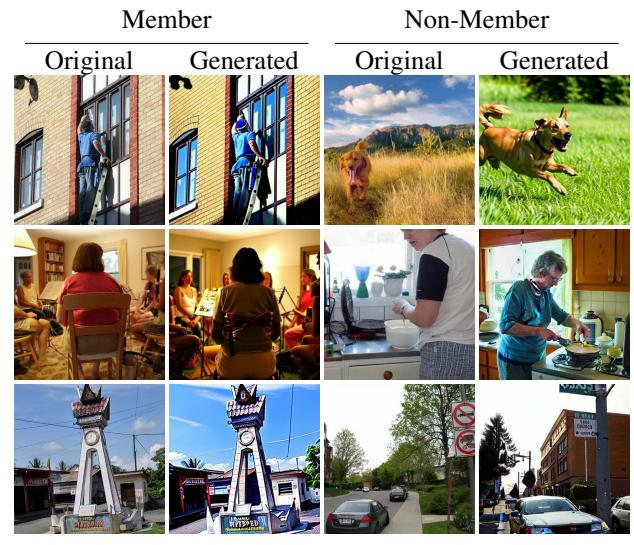

*Figure 1.* Visualization of generation. In our method, the generated images of members are clearly closer to their originals, and the non-members differ significantly from their original images.

[Ren et al.,](#page-9-1) [2024\)](#page-9-1). Membership inference attacks (MIAs) are crucial methods for assessing the privacy risks associated with machine learning models. In the context of diffusion models, MIAs aim to determine whether an image was used for training [\(Shokri et al.,](#page-9-2) [2017\)](#page-9-2). In particular, fine-tuning is widely regarded as the stage most prone to privacy leakage, since the datasets used are relatively small and often private (e.g., personal photos, proprietary artwork) [\(Li et al.,](#page-8-0) [2024b;](#page-8-0) [Pang & Wang,](#page-9-3) [2023\)](#page-9-3). Consequently, studying MIAs on fine-tuned diffusion models is significant for understanding and mitigating potential privacy risks.

Most existing studies [\(Matsumoto et al.,](#page-9-4) [2023;](#page-9-4) [Duan et al.,](#page-8-1) [2023;](#page-8-1) [Kong et al.,](#page-8-2) [2024;](#page-8-2) [Li et al.,](#page-8-3) [2024a;](#page-8-3) [Zhai et al.,](#page-10-0) [2024\)](#page-10-0) assumed the adversary can manipulate the intermediate denoising network (denoted as intermediate result attacks). However, this assumption is unrealistic in real-world diffusion systems, which typically expose only end-to-end generation interfaces. Previous end-to-end attacks [\(Pang](#page-9-3) [& Wang,](#page-9-3) [2023;](#page-9-3) [Wu et al.,](#page-9-5) [2022\)](#page-9-5) assumed the availability of auxiliary data drawn from the same distribution as the fine-tuning data, which is used to train shadow models and classifiers. However, such attacks depend heavily on the quality of the auxiliary data, and training shadow models

1 Southeast University 2The University of Queensland 3Nanjing University of Posts and Telecommunications. Correspondence to: Songze Li <songzeli@seu.edu.cn>.

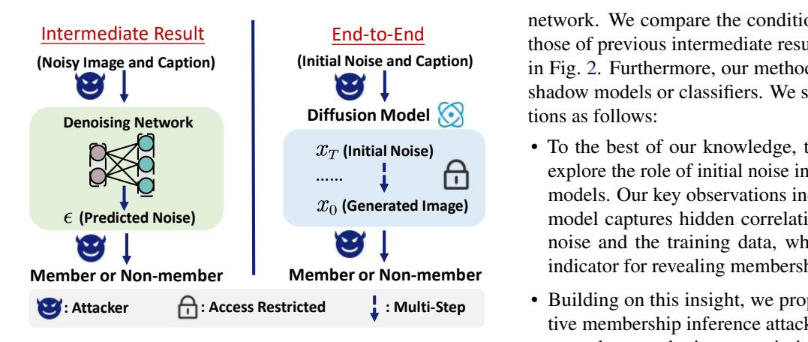

*Figure 2.* Left: the intermediate result attacks, where the adversary supplies inputs to the denoising network and attacks based on its predictions. *Note: the diffusion model includes the denoising network, scheduler, and other components.* Right: the end-to-end attacks, where the adversary provides inputs to the diffusion model and attacks based on the final generation.

and classifiers incurs substantial computational overhead.

We identify a fundamental vulnerability that enables end-toend attacks without training shadow models or classifiers: standard noise schedules fail to fully eliminate semantic information from images. Analyzing the widely used schedules, we find the signal-to-noise ratio (SNR) at the maximum noise timestep T remains non-zero (Tab. [2\)](#page-3-0), leaving residual semantic signals (Observation 1). More critically, via DDIM inversion [\(Dhariwal & Nichol,](#page-8-4) [2021\)](#page-8-4), we find that diffusion models inadvertently learn to exploit these residual signals during training, establishing hidden correlations between initial noise and training data, as evidenced by reconstruction fidelity (Tab. [3\)](#page-4-0) and cross-attention analysis (Fig. [4\)](#page-4-1) (Observation 2).

This presents an exploitable attack opportunity: if we can inject an image's semantic information into the initial noise, the model's generation behavior may reveal whether the image belongs to the training set. The key challenge is that adversaries cannot access the target model's denoising network to perform inversion. Fortunately, we observe that fine-tuned models preserve the semantic space of their pretrained counterparts (Fig. [4](#page-4-1) and Tab. [4\)](#page-4-2), enabling us to use publicly available pre-trained models for semantic injection via DDIM inversion (Observation 3).

Building on these insights, we propose leveraging a pretrained model to inject semantic information into the initial noise through a DDIM inversion procedure and determine membership by examining the model's generation from semantic initial noise. When the model generates images from this semantic noise, members produce outputs significantly closer to their originals than non-members (Fig. [1\)](#page-0-0). This method is an end-to-end attack that requires no access to the target model's parameters or intermediate denoising

network. We compare the conditions of our method with those of previous intermediate result attacks, as illustrated in Fig. [2.](#page-1-0) Furthermore, our method does not need to train shadow models or classifiers. We summarize our contributions as follows:

- …… • To the best of our knowledge, this is the first study to explore the role of initial noise in MIAs against diffusion models. Our key observations indicate that the diffusion model captures hidden correlations between the initial noise and the training data, which serves as a crucial indicator for revealing membership information.
  - Building on this insight, we propose a simple yet effective membership inference attack that uses the inversion procedure to obtain semantic initial noise. The attack analyzes the model's generation from initial noise containing the original image semantics, with membership determined by similarity to the original image.
  - Extensive experiments validate the effectiveness of our method, with an Area Under the Curve (AUC) of 90.46% and a True Positive Rate at 1% False Positive Rate (T@F=1%) of 21.80%. It demonstrates that the initial noise can strongly expose membership information, revealing the vulnerability of diffusion models to MIAs.

# 2. Related Work

Membership Inference Attacks. Shokri et al. [\(Shokri](#page-9-2) [et al.,](#page-9-2) [2017\)](#page-9-2) proposed membership inference attacks (MIAs), which primarily targeted classification models in machine learning. The attacks aim to determine whether a specific piece of data has been included in the training set of the target model. MIAs are typically categorized based on the adversary's access level to the target model. In the whitebox setting, the attacker is assumed to have full access to the model parameters [\(Leino & Fredrikson,](#page-8-5) [2020;](#page-8-5) [Nasr et al.,](#page-9-6) [2019;](#page-9-6) [Sablayrolles et al.,](#page-9-7) [2019;](#page-9-7) [Yeom et al.,](#page-10-1) [2018\)](#page-10-1). In contrast, black-box attacks assume no access to model parameters. Among them, some methods utilize confidence scores or logits provided by the model [\(Shokri et al.,](#page-9-2) [2017;](#page-9-2) [Salem](#page-9-8) [et al.,](#page-9-8) [2018;](#page-9-8) [Carlini et al.,](#page-8-6) [2022\)](#page-8-6). Other researchers have proposed attacks under a more restrictive assumption where only the final predicted labels are available [\(Choquette-Choo](#page-8-7) [et al.,](#page-8-7) [2021;](#page-8-7) [Li & Zhang,](#page-8-8) [2021;](#page-8-8) [Wu et al.,](#page-10-2) [2024\)](#page-10-2).

Membership Inference Attacks on Diffusion Models. Recently, MIAs on diffusion models have garnered increasing attention. Pang et al. [\(Pang et al.,](#page-9-9) [2023\)](#page-9-9) proposed executing an attack by utilizing gradient information. Recent works [\(Matsumoto et al.,](#page-9-4) [2023;](#page-9-4) [Duan et al.,](#page-8-1) [2023;](#page-8-1) [Kong et al.,](#page-8-2) [2024;](#page-8-2) [Li et al.,](#page-8-3) [2024a;](#page-8-3) [Zhai et al.,](#page-10-0) [2024;](#page-10-0) [Lian et al.,](#page-8-9) [2025\)](#page-8-9) assumed that the adversary has access to the model's intermediate denoising process and is allowed to modify the inputs of the denoising networks. This assumption enables queries on the denoising networks' prediction to infer membership

information. Some works [\(Pang & Wang,](#page-9-3) [2023;](#page-9-3) [Wu et al.,](#page-9-5) [2022\)](#page-9-5) relied on an auxiliary dataset drawn from the same distribution to train shadow models, and trained a classifier based on the behavioral differences of the shadow models for member and non-member samples.

### Denoising Diffusion Implicit Model (DDIM) Inversion.

DDIM Inversion is a technique that utilizes the reverse process of the diffusion model to obtain the initial state of the generated image [\(Dhariwal & Nichol,](#page-8-4) [2021\)](#page-8-4). In addition, it can be viewed as a noise addition process that integrates semantic information [\(Bai et al.,](#page-8-10) [2025;](#page-8-10) [Zhou et al.,](#page-10-3) [2024\)](#page-10-3). In contrast, naively adding random noise to the image is not connected to the model's understanding of the original image's semantics [\(Zhang et al.,](#page-10-4) [2023\)](#page-10-4). Due to the unique advantages of DDIM inversion, it shows great potential in applications such as image quality optimization [\(Bai et al.,](#page-8-10) [2025;](#page-8-10) [Zhou et al.,](#page-10-3) [2024\)](#page-10-3) and image editing [\(Zhang et al.,](#page-10-4) [2023;](#page-10-4) [Garibi et al.,](#page-8-11) [2024;](#page-8-11) [Dong et al.,](#page-8-12) [2023\)](#page-8-12).

# 3. Threat Model

MIAs aim to determine whether a specific sample was used during the model training. Formally, let Gθ be a fine-tuned diffusion model with parameters θ. Let D be a dataset drawn from the data distribution qdata and each sample xi in D has a caption ci . Following established conventions [\(Sablayrolles et al.,](#page-9-7) [2019;](#page-9-7) [Carlini et al.,](#page-8-6) [2022;](#page-8-6) [Duan et al.,](#page-8-1) [2023\)](#page-8-1), we split D into two subsets DM and DN , where DM denotes the member set used to fine-tune the diffusion model Gθ and DN denotes the non-member set, so that D = DM ∪ DN and DM ∩ DN = ∅. Each image sample xi is associated with a membership label mi , where mi = 1 if xi ∈ DM and mi = 0 otherwise. The adversary has access to the dataset D, but does not know the partition.

Adversary's Goal. The adversary's goal is to design a membership inference attack algorithm A that, for any sample xi , predicts its membership label:

$$\mathcal{A}(x_i, \theta) = \mathbb{1}\left[\mathbb{P}(m_i = 1 \mid \theta, x_i) \ge \tau\right],\tag{1}$$

where A(xi , θ) = 1 means xi comes from DM, 1[A] = 1 if A is true, and τ is the threshold.

Adversary's Capabilities. In this paper, the adversary is limited to performing end-to-end generation using the diffusion model. Specifically, the adversary can modify the model's initial noise and prompt, and can only observe the final generated image, but has no access to any model parameters or intermediate denoising steps. In the diffusers library [\(von Platen et al.,](#page-9-10) [2022\)](#page-9-10), pipeline interfaces can accept an initial noise input, which can be adjusted to guide the generation process. Moreover, tasks such as image editing [\(Zhou et al.,](#page-10-3) [2024;](#page-10-3) [Wang et al.,](#page-9-11) [2024;](#page-9-11) [Sun et al.,](#page-9-12) [2024\)](#page-9-12), and noise engineering [\(Guo et al.,](#page-8-13) [2024;](#page-8-13) [Mao et al.,](#page-9-13) [2023;](#page-9-13) [Garibi et al.,](#page-8-11) [2024\)](#page-8-11) also rely on interfaces that allow the

modification of the initial noise. The fine-tuned model is obtained by fine-tuning a pre-trained model on a downstream dataset. Following prior membership inference settings for fine-tuned models [\(Fu et al.,](#page-8-14) [2024;](#page-8-14) [Pang & Wang,](#page-9-3) [2023;](#page-9-3) [Zhai et al.,](#page-10-0) [2024;](#page-10-0) [Duan et al.,](#page-8-1) [2023\)](#page-8-1), we assume that the adversary has access to the pre-trained version of the finetuned model.[1](#page-2-0) We compare the capabilities of adversaries across different attack algorithms in Tab. [1.](#page-2-1)

*Table 1.* Adversary capabilities for different attacks. The top half does not apply to end-to-end generation; the bottom half is feasible. Pm: access to model parameters; Inter: control the inputs to the denoising network at intermediate timesteps; Shadow: train shadow models; Arch: known fine-tuning architecture version; cls: train classifiers. Symbols: ✓= required, ✗= not required.

| Method                        | Pm | Inter | Shadow | Arch | cls |
|-------------------------------|----|-------|--------|------|-----|
| GSA (Pang et al., 2023)       | ✓  | ✓     | ✓      | ✓    | ✓   |
| Loss (Matsumoto et al., 2023) | ✗  | ✓     | ✗      | ✓    | ✗   |
| SecMI (Duan et al., 2023)     | ✗  | ✓     | ✗      | ✓    | ✗   |
| PIA (Kong et al., 2024)       | ✗  | ✓     | ✗      | ✓    | ✗   |
| CLiD (Zhai et al., 2024)      | ✗  | ✓     | ✓      | ✓    | ✗   |
| NA-P (Wu et al., 2022)        | ✗  | ✗     | ✓      | ✓    | ✓   |
| Feature-T (Pang & Wang, 2023) | ✗  | ✗     | ✓      | ✗    | ✗   |
| Feature-C (Pang & Wang, 2023) | ✗  | ✗     | ✓      | ✓    | ✓   |
| Feature-D (Pang & Wang, 2023) | ✗  | ✗     | ✓      | ✓    | ✓   |
| Ours                          | ✗  | ✗     | ✗      | ✓    | ✗   |

# 4. Methodology

In this section, we present our three key observations systematically. Based on these observations, we propose a membership inference attack that leverages initial noise, which is performed in two steps, as shown in Fig. [3.](#page-3-1)

#### 4.1. Diffusion Models

Given an original image x0, the forward diffusion process gradually introduces noise over T timesteps, transforming x0 into a nearly Gaussian-distributed xT . The forward diffusion process at each timestep t is described as follows:

$$x_t = \sqrt{\bar{\alpha}_t} x_0 + \sqrt{1 - \bar{\alpha}_t} \epsilon, \tag{2}$$

where αt = Qt i=1 αi and (α1, . . . , αT ) are the noise schedules, ϵ ∼ N (0, I) represents Gaussian noise at each step. As t approaches T, α¯t diminishes, making xT ≈ ϵ closely resemble pure Gaussian noise. In this paper, we use ϵθ to denote the prediction of the denoising network.

### 4.2. The Semantics in Initial Noise

Observation 1. The widely adopted noise schedules fail to eliminate the semantic information in the original image, even at the maximum noise step.

Explanation 1. We begin with the forward noise addition process in diffusion models. We follow the definition of the

1 In the following sections, we demonstrate that our method remains effective even when the pre-trained version is unknown.

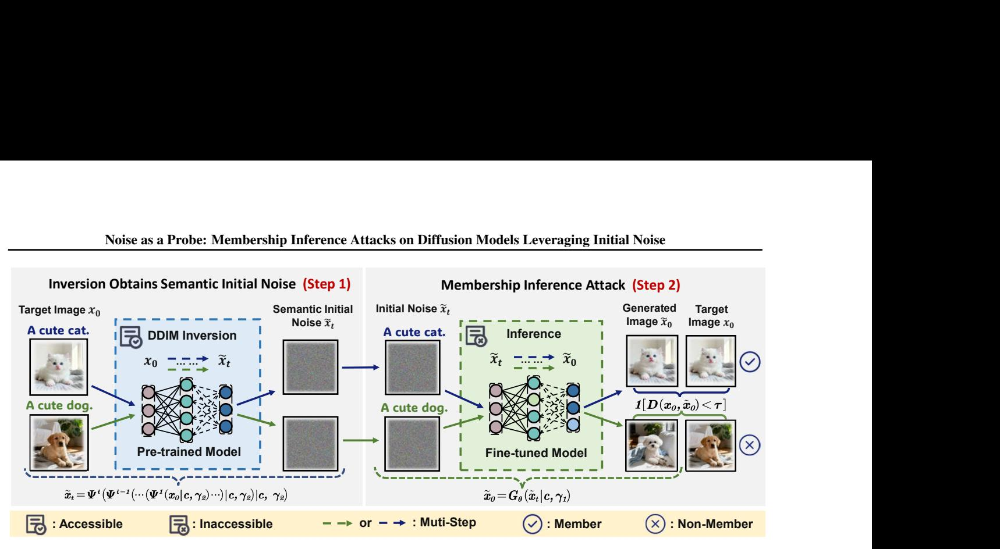

*Figure 3.* Overview of our method. Step 1: Use a pre-trained model for DDIM inversion to obtain initial noise with semantics. Step 2: Generate images using the noise and determine membership based on the generation results.

signal-to-noise ratio (SNR) in the diffusion model training process from prior work [\(Choi et al.,](#page-8-15) [2022\)](#page-8-15). For a given timestep t, SNR can be characterized as follows:

$$SNR(t) := \bar{\alpha}_t / (1 - \bar{\alpha}_t). \tag{3}$$

We compared the SNR of images at step T across different schedules in Tab. [2.](#page-3-0) Consistent with the analyses in prior work [\(Wang et al.,](#page-9-11) [2024;](#page-9-11) [Lin et al.,](#page-8-16) [2024\)](#page-8-16), noise injection at step T cannot eliminate the original signal.

*Table 2.* Comparison of different noise schedules in the final signal-to-noise ratio SNR(T) and the corresponding √ α¯T . The results show that, despite large differences across schedules (Linear [\(Song et al.,](#page-9-14) [2020\)](#page-9-14), Cosine [\(Nichol & Dhariwal,](#page-9-15) [2021\)](#page-9-15), and Stable Diffusion [\(Rombach et al.,](#page-9-16) [2022\)](#page-9-16)), residual signals consistently remain at the last step.

|                  |          | √          |
|------------------|----------|------------|
| Schedule         | SNR(T)   | α¯T        |
| Linear           | 4.04e-05 | 0.006353   |
| Cosine           | 4.24e-09 | 0.00004928 |
| Stable Diffusion | 4.68e-03 | 0.068265   |

The diffusion model's training process can be interpreted as learning a transformation from a Gaussian noise distribution to a Gaussian image distribution. Previous studies on noise engineering [\(Zhou et al.,](#page-10-3) [2024;](#page-10-3) [Wang et al.,](#page-9-11) [2024;](#page-9-11) [Bai et al.,](#page-8-10) [2025;](#page-8-10) [Sun et al.,](#page-9-12) [2024\)](#page-9-12) have shown that the initial noise contains semantic information that influences the generation process. Based on the evidence above, we speculate that the semantics of the initial noise may be linked to the training data, potentially revealing membership information. Our subsequent observation further supports this speculation.

Observation 2. The diffusion model inadvertently learns to exploit residual information in the initial noise, thereby establishing a hidden connection between the initial noise and the training data.

Explanation 2(a). As discussed in Sec. [2,](#page-1-1) DDIM inversion

can be regarded as a noise injection process that embeds the semantics of the original image into the initial noise. The inversion process Ψ can be expressed as follows:

$$\tilde{x}_{t} = \Psi^{t}(\tilde{x}_{t-1}|\mathbf{c}, \gamma_{2}) = \sqrt{\overline{\alpha}_{t}} \tilde{f}_{\theta}(\tilde{x}_{t-1}, t-1) + \sqrt{1 - \overline{\alpha}_{t}} \epsilon_{\theta}(\tilde{x}_{t-1}, t-1),$$

$$(4)$$

where ˜fθ(˜xt−1, t − 1) can be expressed as:

$$\tilde{f}_{\theta}(\tilde{x}_{t-1}, t-1) = \frac{\tilde{x}_{t-1} - \sqrt{1 - \overline{\alpha}_{t-1}} \epsilon_{\theta}(\tilde{x}_{t-1}, t-1)}{\sqrt{\overline{\alpha}_{t-1}}},$$
(5)

where ϵθ(˜xt−1, t − 1) = (1 + γ2)ϵθ(˜xt−1, c, t − 1) − γ2ϵθ(˜xt−1, ∅, t − 1), c is the text prompt, ∅ represents the null prompt and γ2 is the inversion guidance scale. Analyzing the diffusion model's training process and the characteristics of DDIM inversion, we attempt to use the target model for DDIM inversion to obtain semantic initial noise, which can be expressed as:

$$\tilde{x}_{t} = Inv_{\theta}^{t}(x_{0}|\mathbf{c}, \gamma_{2})$$

$$= \Psi^{t}\left(\Psi^{t-1}\left(\cdots\left(\Psi^{1}(x_{0} \mid \mathbf{c}, \gamma_{2})\cdots\right) \mid \mathbf{c}, \gamma_{2}\right) \mid \mathbf{c}, \gamma_{2}\right).$$
(6)

Then, we use the obtained noise as the starting point for image generation, which can be formulated as:

$$\tilde{x}_0 = G_\theta(\tilde{x}_t | \mathbf{c}, \gamma_1). \tag{7}$$

where γ1 is the guidance scale during generation. We compared the normalized ℓ2 distance between the original images and those generated from random noise or semantic noise (obtained via inversion). Tab. [3](#page-4-0) reports the statistical results for both member and non-member samples across different datasets. The results demonstrate that semantic initial noise leads to higher fidelity reconstructions of the training data. This confirms that diffusion models capture residual information from images, and when conditioned on

*Table 3.* Statistics of normalized ℓ2 distance across different datasets. Random: generate from random noise, Inversion: generate from semantic noise, ∆ = Inversion − Random.

| Method    |         | Pokemon ´ |         | MS-COCO | Flickr  |         |  |
|-----------|---------|--------------|---------|---------|---------|---------|--|
|           | Mem     | Non-Mem      | Mem     | Non-Mem | Mem     | Non-Mem |  |
| Random    | 0.3839  | 0.3961       | 0.4034  | 0.4963  | 0.3543  | 0.3972  |  |
| Inversion | 0.2779  | 0.5061       | 0.2469  | 0.5394  | 0.2722  | 0.4464  |  |
| ∆         | -0.1060 | +0.1100      | -0.1565 | +0.0431 | -0.0821 | +0.0492 |  |

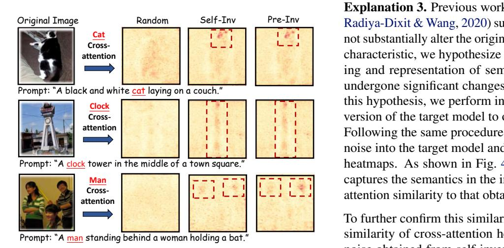

*Figure 4.* Visualization of cross-attention heatmaps. Heatmaps display the local contributions of the second attention modules in the third upsampling block. Random: generation using random noise; Self-Inv: generation using semantic noise obtained via inversion of the target model; Pre-Inv: generation using semantic noise obtained via inversion of the pre-trained model. The red boxes highlight regions with high attention, which precisely correspond to the locations of the main objects in the original images.

initial noise containing member semantics, they generate outputs that are closer to the original member images.

Explanation 2(b). Previously, we observed that DDIM inversion enables better reconstruction of member data. We attribute this to the model having learned correlations between residual semantics and the original images during training. To further validate this hypothesis, we analyze the cross-attention of the denoising network during the generation process. Specifically, we visualize the cross-attention heatmaps at the first denoising step, which compute the attention of the token corresponding to the main object in the image. As shown in Fig. [4,](#page-4-1) when using initial noise obtained via DDIM inversion, the denoising network immediately attends to the semantic regions of the image. In contrast, when initialized with random noise, the network exhibits no clear focus on specific regions. This phenomenon further proves that the model has established a hidden connection between the initial noise and the original image.

### 4.3. Semantic Injection via the Pre-trained Model

One major challenge is that the adversary cannot directly access the parameters of the target model, making it infeasible to perform DDIM inversion on the target itself. Despite these constraints, we observe a crucial aspect of fine-tuning in the context of membership inference attacks.

Observation 3. Models fine-tuned from pre-trained ones essentially preserve the original semantic space and representational capabilities.

Explanation 3. Previous works [\(Zhou & Srikumar,](#page-10-5) [2022;](#page-10-5) [Radiya-Dixit & Wang,](#page-9-17) [2020\)](#page-9-17) suggested that fine-tuning does not substantially alter the original distribution. Based on this characteristic, we hypothesize that the model's understanding and representation of semantic information have not undergone significant changes after fine-tuning. To verify this hypothesis, we perform inversion with the pre-trained version of the target model to obtain semantic initial noise. Following the same procedure as before, we then feed this noise into the target model and examine its cross-attention heatmaps. As shown in Fig. [4,](#page-4-1) the fine-tuned model still captures the semantics in the initial noise, with high crossattention similarity to that obtained from self-inversion[2](#page-4-3) .

To further confirm this similarity, we computed the cosine similarity of cross-attention heatmaps between the initial noise obtained from self-inversion and pre-inversion. As shown in Tab. [4,](#page-4-2) across different fine-tuning epochs, the cross-attention heatmaps of the noise from the two inversions exhibit a remarkably high degree of similarity. Additionally, we have provided an analysis of model parameter similarity in Appendix [C.4.](#page-12-0) All the findings provide evidence that the fine-tuned model retains the semantic space of its pre-trained version, making it possible to obtain semantic initial noise using a pre-trained model.

*Table 4.* Similarity of cross-attention heatmaps. Across different datasets and fine-tuning epochs, the cross-attention heatmaps during denoising show a remarkably high similarity between the noises obtained from self-inversion and pre-inversion.

| Epoch        | 50    | 100   | 150   | 200   | 250   | 300   |
|--------------|-------|-------|-------|-------|-------|-------|
| Pokemon ´ | 0.968 | 0.942 | 0.926 | 0.897 | 0.895 | 0.892 |
| T-to-I       | 0.970 | 0.954 | 0.924 | 0.899 | 0.893 | 0.893 |
| MS-COCO      | 0.973 | 0.953 | 0.937 | 0.897 | 0.895 | 0.895 |
| Flickr       | 0.978 | 0.953 | 0.934 | 0.904 | 0.902 | 0.903 |

### 4.4. MIAs Leveraging Initial Noise

Based on the above experiments and observations, we propose a simple yet effective membership inference attack that exploits the correlations between the semantic initial noise and the training data. This attack proceeds in two main steps: obtaining semantic initial noise and conducting the membership inference attack. *We provide the detailed algorithmic procedure in Appendix [B.](#page-11-0)*

For clarity, DDIM inversion with the target model is termed self-inversion, and that with the pre-trained model is termed preinversion.

*Table 5.* AUC and T@F=1% (TPR@1%FPR) on different datasets. The compared baselines are divided into two categories: intermediate result attacks (Upper part) and end-to-end attacks (Lower part). In each column, the best performance in the end-to-end attacks is displayed in bold, while the best performance across all attacks is underlined. Our method achieves the best performance in end-to-end attacks and demonstrates performance comparable to that of intermediate result attacks. Note that, unlike intermediate result attacks, our method does not require access to the denoising network's inputs or outputs in the diffusion model.

| Method    |       | Pokemon ´ |       | T-to-I |       | MS-COCO |       | Flickr | Average |        |
|-----------|-------|--------------|-------|--------|-------|---------|-------|--------|---------|--------|
|           | AUC   | T@F=1%       | AUC   | T@F=1% | AUC   | T@F=1%  | AUC   | T@F=1% | AUC     | T@F=1% |
| SecMI     | 83.26 | 12.88        | 88.26 | 26.66  | 89.37 | 16.79   | 76.42 | 14.40  | 84.33   | 17.68  |
| PIA       | 76.82 | 7.85         | 84.80 | 11.78  | 71.38 | 5.20    | 72.59 | 7.20   | 76.40   | 8.01   |
| NA-P      | 59.37 | 4.80         | 70.77 | 6.60   | 52.41 | 2.20    | 56.51 | 4.00   | 59.77   | 4.40   |
| GD        | 52.67 | 1.20         | 59.67 | 5.20   | 51.22 | 1.00    | 53.41 | 2.00   | 54.24   | 2.35   |
| Feature-T | 56.60 | 3.00         | 70.40 | 7.00   | 57.70 | 3.20    | 58.20 | 3.00   | 60.73   | 4.05   |
| Feature-C | 60.67 | 7.33         | 83.77 | 17.40  | 73.08 | 14.60   | 63.80 | 5.20   | 70.33   | 11.13  |
| Feature-D | 55.10 | 2.80         | 65.00 | 6.00   | 58.00 | 3.00    | 57.20 | 3.00   | 58.83   | 3.70   |
| Ours      | 82.44 | 14.00        | 89.24 | 21.60  | 90.46 | 21.80   | 76.23 | 16.00  | 84.59   | 18.35  |

Step 1: Given a target image x0 and its corresponding text prompt c, we first employ a pre-trained diffusion model to perform DDIM inversion, thereby obtaining a semantic initial noise x˜t.

Step 2: The adversary feeds the semantic initial noise x˜t and the same prompt c into the target model to generate a candidate image x˜0. If the target image x0 was part of the fine-tuning dataset, the generated candidate image tends to preserve its structural and semantic consistency, resulting in a smaller perceptual distance. Conversely, the non-member samples will yield larger deviations in the generated outputs. The membership inference decision is made by comparing the reconstruction distance using a metric D(·, ·). In summary, our method can be summarized as follows:

$$\begin{cases} \tilde{x}_t = Inv_{\theta_{pre-trained}}^t(x_0|\mathbf{c}, \gamma_2), & (Step \ 1) \\ \mathcal{A}(x_i, \theta) = \mathbb{1} \left[ D(x_0, G_{\theta}(\tilde{x}_t|\mathbf{c}, \gamma_1)) \le \tau \right]. & (Step \ 2) \end{cases}$$
(8)

where D(·, ·) represents the distance metric.

# 5. Experiments

### 5.1. Experiment Setup

Datasets and Models. We follow the previous stringent assumption that both member and non-member data are drawn from the same distribution [\(Duan et al.,](#page-8-1) [2023;](#page-8-1) [Kong et al.,](#page-8-2) [2024;](#page-8-2) [Zhai et al.,](#page-10-0) [2024;](#page-10-0) [Lian et al.,](#page-8-9) [2025\)](#page-8-9). We construct member/non-member datasets using 416/417 samples from Pokemon ( ´ [Lambda,](#page-8-17) [2023\)](#page-8-17), 500/500 samples from text-toimage-2M (T-to-I) [\(jackyhate,](#page-8-18) [2024\)](#page-8-18), 2500/2500 samples from MS-COCO [\(Lin et al.,](#page-9-18) [2014\)](#page-9-18), and 1000/1000 samples from Flickr [\(Young et al.,](#page-10-6) [2014\)](#page-10-6). We fine-tune Stable Diffusion-v1-4 (SD-v1-4) [\(CompVis,](#page-8-19) [2024\)](#page-8-19) using the official fine-tuning scripts from the Hugging-Face Diffusers library [\(Hugging-Face,](#page-8-20) [2024\)](#page-8-20). *The detailed fine-tuning configurations are provided in Appendix [C.1.](#page-11-1)*

Evaluation Metrics. We adopt the evaluation metrics commonly used in prior membership inference attacks for large models [\(Duan et al.,](#page-8-1) [2023;](#page-8-1) [Kong et al.,](#page-8-2) [2024;](#page-8-2) [Pang & Wang,](#page-9-3) [2023;](#page-9-3) [He et al.,](#page-8-21) [2025;](#page-8-21) [Fu et al.,](#page-8-14) [2024\)](#page-8-14). Specifically, we report the Area Under the Curve (denoted as AUC), which reflects the average success of membership inference attacks. In addition, we measure the True Positive Rate (TPR) at 1% False Positive Rate (FPR) (denoted as T@F=1%), which assesses attack efficacy under a strict decision threshold, emphasizing performance at an extremely low FPR.

Baselines. We compare our method with existing end-toend attacks, including NA-P [\(Wu et al.,](#page-9-5) [2022\)](#page-9-5), Feature-T [\(Pang & Wang,](#page-9-3) [2023\)](#page-9-3), Feature-D [\(Pang & Wang,](#page-9-3) [2023\)](#page-9-3), Feature-C [\(Pang & Wang,](#page-9-3) [2023\)](#page-9-3), and GD [\(Zhang et al.,](#page-10-7) [2024\)](#page-10-7). We also evaluate intermediate result attacks, including SecMI [\(Duan et al.,](#page-8-1) [2023\)](#page-8-1) and PIA [\(Kong et al.,](#page-8-2) [2024\)](#page-8-2).

Implementation Details. All fine-tuning and inference experiments were conducted on a single RTX 4090 GPU (24 GB). During the DDIM inversion step, we set the guidance scale γ2 = 1.0 and the number of steps istep = 100. For the membership inference step, we set the guidance scale γ1 = 3.5 and the number of inference steps to 50. We use the ℓ2 distance as the D(·, ·) by default.

### 5.2. Main Result

Overall Attack Performance. We report comprehensive attack results and compare the performance of our method against all baselines. As shown in Tab. [5,](#page-5-0) our method consistently achieves superior performance across different datasets, delivering significant improvements over existing end-to-end attacks. In particular, compared to the state-of-the-art (SOTA) end-to-end attack, Feature-C, our method can yield improvements of up to 21.77% in AUC and 11.80% in TPR@1%FPR. Notably, Feature-C requires auxiliary data to train shadow models and classifiers, re-

*Table 6.* Hyperparameter analysis of istep and γ2. The results show that our method achieves consistently high performance across a wide range of hyperparameter values, demonstrating its robustness.

| istep/γ2       | γ2    | = 0.0  | γ2    | = 1.0  | γ2 = 3.5 γ2 = 4.5 |        |       | γ2 = 7.5 |       |        |
|----------------|-------|--------|-------|--------|----------------------------|--------|-------|-------------|-------|--------|
|                | AUC   | T@F=1% | AUC   | T@F=1% | AUC                        | T@F=1% | AUC   | T@F=1%      | AUC   | T@F=1% |
| istep = 25  | 89.20 | 21.40  | 89.16 | 21.40  | 87.36                      | 21.00  | 87.46 | 21.20       | 87.25 | 21.00  |
| istep = 50  | 87.36 | 21.20  | 87.24 | 21.00  | 89.14                      | 21.20  | 89.36 | 21.60       | 89.33 | 21.40  |
| istep = 100 | 88.48 | 21.00  | 90.46 | 21.80  | 88.56                      | 21.00  | 88.61 | 21.00       | 90.12 | 21.80  |
| istep = 200 | 89.12 | 21.20  | 89.12 | 21.40  | 91.00                      | 22.00  | 91.04 | 22.00       | 89.31 | 21.20  |

*Table 7.* Ablation study on different datasets, showing the impact of semantic initial noise on attack performance.

| Method |        | Pokemon ´ |        | T-to-I |        | MS-COCO |        | Flickr |
|--------|--------|--------------|--------|--------|--------|---------|--------|--------|
|        | AUC    | T@F=1%       | AUC    | T@F=1% | AUC    | T@F=1%  | AUC    | T@F=1% |
| Naive  | 55.66  | 6.50         | 72.76  | 10.50  | 62.24  | 7.00    | 57.29  | 5.00   |
| Ours   | 82.44  | 14.00        | 89.24  | 21.60  | 90.46  | 21.80   | 76.23  | 16.00  |
| Gain   | +26.78 | +7.50        | +16.48 | +11.10 | +28.22 | +14.80  | +18.94 | +11.00 |

sulting in significant training overhead. In contrast, our method performs the attack solely through threshold setting, achieving superior performance with a lower computational cost. Moreover, our method remains highly competitive compared to intermediate result attacks, e.g., SecMI and PIA, and outperforms them on the MS-COCO dataset, all while not requiring access to the intermediate results.

Visual Analysis of Attack Performance. To further illustrate the effectiveness of our method, we compare it against Feature-T, the previous most potent threshold-based end-toend attack. As shown in Fig. [5,](#page-6-0) we visualize the membership score distributions of member and non-member data. The separation between the two distributions achieved by our method is substantially larger than that of Feature-T. This visualization provides intuitive evidence of the enhanced distinguishability achieved by our method.

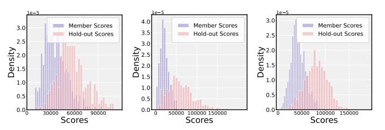

Membership score distribution of our method.

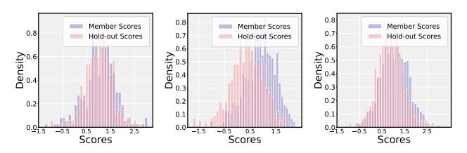

Membership score distribution of Feature-T.

*Figure 5.* Membership score distribution of member and nonmember data in the Pokemon, T-to-I, and MS-COCO dataset, ar- ´ ranged from left to right. The score distribution gap between member data and hold-out data is significantly larger in our method.

#### 5.3. Ablation Study

Contribution of Semantic Initial Noise. In this section, we define the Naive method, which generates images solely from the given caption using randomly initialized noise. The distance between the generated image and the target image is then measured to determine membership. The ablation results are reported in Tab. [7.](#page-6-1) On average, the AUC improved by 21.57% across different datasets, and T@F=1% increased by 10.63%. It clearly shows that injecting semantics into the initial noise substantially improves the attack performance. These results validate the effectiveness of our approach and underscore the importance of carefully managing and protecting initial noise.

Ablation on Hyperparameter. We validate the impact of hyperparameters istep and γ2 on the performance of our method. As shown in Tab. [6,](#page-6-2) our method demonstrates very low sensitivity to istep and γ2, with the best and worst AUC being 91.04% and 87.25%, respectively (a variation of only 3.79%). It provides strong confirmation of the robustness of our method. *Further analyses on hyperparameters are presented in Appendix [C.9](#page-13-0)*.

#### 5.4. A More Knowledge-Restricted Adversary

Without Access to the Model Architecture. In real-world scenarios, model publishers may deliberately withhold the architecture version of the pre-trained model used during fine-tuning, thereby increasing the difficulty of attacks. To evaluate performance under this condition, we use SD-v1-5 [\(RunwayML,](#page-9-19) [2024\)](#page-9-19), SD-2-1 [\(stabilityai,](#page-9-20) [2024a\)](#page-9-20), SDXLturbo [\(stabilityai,](#page-9-21) [2024b\)](#page-9-21), and Dreamshaper-XL [\(Lykon,](#page-9-22) [2024\)](#page-9-22) to perform inversion and obtain initial noise, where the architectural discrepancy from the SD-v1-4 gradually increases. And these models are used as shadow models for the baseline attacks. As shown in Tab. [9,](#page-7-0) our method remains effective even when the architecture version of the target model is unknown. Although all methods exhibit performance degradation as the architectural gap widens, our method achieves the best performance even using SDXLturbo and Dreamshaper-XL, whose architectures differ substantially from the target model. This finding aligns with the observations in [\(Wang et al.,](#page-9-11) [2024\)](#page-9-11), which indicate that the semantics of the initial noise can be transferred across

*Table 8.* Attack performance AUC under defenses. All attacks experience varying degrees of performance degradation under defense mechanisms. Nevertheless, our method achieves the best performance among all methods.

| SSei | DataAug | SecMI | PIA   | NA-P  | GD    | Feature-T | Feature-C | Feature-D | Ours  |
|------|---------|-------|-------|-------|-------|-----------|-----------|-----------|-------|
| ×    | ×       | 89.43 | 74.36 | 64.77 | 51.31 | 59.43     | 73.26     | 59.01     | 91.12 |
| ×    | ✓       | 89.37 | 71.38 | 63.41 | 51.22 | 57.70     | 73.08     | 58.00     | 90.46 |
| ✓    | ×       | 52.11 | 58.93 | 62.98 | 51.05 | 57.53     | 71.99     | 57.20     | 87.68 |
| ✓    | ✓       | 51.21 | 54.41 | 62.56 | 51.03 | 57.20     | 71.02     | 57.50     | 86.74 |

models due to the shared distributions learned during largescale pre-training. This further validates that semantic initial noise can be leveraged to reveal membership information.

*Table 9.* Attack performance using semantic initial noise obtained from different models, demonstrating that our method remains effective when the target model's architecture version is unknown. Intermediate result attacks are not applicable in this scenario.

| Method    | SD-v1-5 |        | SD-2-1 |        | SDXL-turbo |        | Dreamshaper |        |
|-----------|---------|--------|--------|--------|------------|--------|-------------|--------|
|           | AUC     | T@F=1% | AUC    | T@F=1% | AUC        | T@F=1% | AUC         | T@F=1% |
| NA-P      | 70.53   | 6.60   | 69.21  | 6.60   | 55.53      | 2.20   | 56.02       | 2.40   |
| Feature-C | 83.41   | 17.40  | 81.28  | 16.70  | 68.41      | 6.20   | 67.42       | 6.00   |
| Feature-D | 65.00   | 6.00   | 64.59  | 6.00   | 58.00      | 4.00   | 57.66       | 4.20   |
| Ours      | 89.03   | 20.20  | 88.04  | 19.60  | 76.91      | 8.40   | 76.87       | 8.20   |

Lacking Access to Image Captions. In reality, attackers may not have the image captions used for fine-tuning. Therefore, we also evaluate the attack performance when the image captions are unavailable. To address this, we employ BLIP [\(Li et al.,](#page-8-22) [2022\)](#page-8-22) to generate captions for the images and use these generated captions to conduct the attack. Experimental results show that our method remains effective even without access to the original captions. *The detailed experimental results are provided in Appendix [C.6.](#page-13-1)*

### 5.5. Impact of Defense

To assess the robustness of our method, we investigate the impact of the SOTA defense method SSei [\(Wen et al.,](#page-9-0) [2024\)](#page-9-0). This defense dynamically evaluates the model's memorization during training and adjusts the training process accordingly. Following this method, we set the SSei threshold to 4. Additionally, data augmentation techniques are commonly employed to mitigate MIAs. During the fine-tuning process of the diffusion model, Random-Crop and Random-Flip are applied by default [\(Hugging-Face,](#page-8-20) [2024\)](#page-8-20). Following previous work [\(Duan et al.,](#page-8-1) [2023;](#page-8-1) [Pang et al.,](#page-9-9) [2023;](#page-9-9) [Zhai et al.,](#page-10-0) [2024\)](#page-10-0), we also investigate the impact of data augmentation on the performance of attacks. We conduct an in-depth analysis of the performance changes of various attacks before and after applying defenses on the MS-COCO dataset, as shown in Tab. [8.](#page-7-1) Experimental results show that our method maintains excellent performance even against the advanced defense strategies. In the presence of both defense mechanisms, our method achieves substantially better performance than all the other methods. Specifically, the intermediate result attacks show a significant performance drop under defense. In our method, AUC and TPR@1%FPR decrease

by only 4.38% and 5.00%, respectively, compared to performance without any defense. These results underscore the strong robustness of our method. *We provide the results of T@F=1% in the Appendix [C.11](#page-14-0)*.

## 5.6. Visualization of Generated Results.

We present the generation results for member and nonmember samples in Fig. [6.](#page-7-2) The first three columns display the original member images alongside their generated counterparts, using both random and semantic initial noise. The last three columns show non-member images and their corresponding generated results. In Naive, the generated results, whether from member or non-member samples, significantly deviate from the originals. Our method generates member images that closely resemble their originals, and the generated non-member images differ more noticeably. This discrepancy is the primary reason for our high attack performance. *More visualizations are provided in Appendix [C.5](#page-12-1)*.

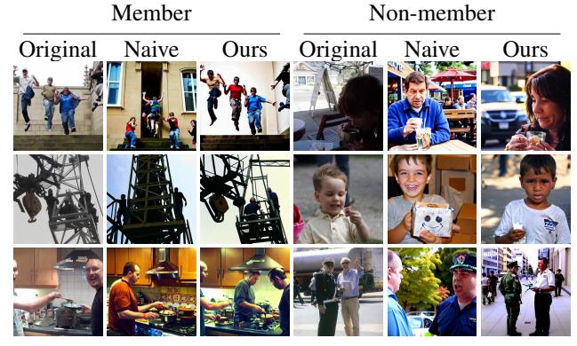

*Figure 6.* Visualization of generation results on the Flickr dataset. In our method, the generated images of members are clearly closer to their originals. In the Naive, both the generated member and non-member data differ significantly from their original images.

# 6. Conclusion

In this paper, we reveal that standard noise schedules in diffusion models retain residual semantic information in the initial noise, which the model inadvertently exploits to learn training data correlations. Leveraging this vulnerability, we propose a simple yet effective membership inference attack that uses DDIM inversion to inject semantics into the initial noise and analyzes the resulting generations. Our experiments confirm that these semantic residuals pose significant privacy risks in fine-tuned models.

# References

- Bai, L., Shao, S., Qi, Z., Xiong, H., Xie, Z., et al. Zigzag diffusion sampling: Diffusion models can self-improve via self-reflection. In *The Thirteenth International Conference on Learning Representations*, 2025.
- Carlini, N., Chien, S., Nasr, M., Song, S., Terzis, A., and Tramer, F. Membership inference attacks from first principles. In *2022 IEEE symposium on security and privacy (SP)*, pp. 1897–1914. IEEE, 2022.
- Choi, J., Lee, J., Shin, C., Kim, S., Kim, H., and Yoon, S. Perception prioritized training of diffusion models. In *Proceedings of the IEEE/CVF conference on computer vision and pattern recognition*, pp. 11472–11481, 2022.
- Choquette-Choo, C. A., Tramer, F., Carlini, N., and Papernot, N. Label-only membership inference attacks. In *International conference on machine learning*, pp. 1964– 1974. PMLR, 2021.
- CompVis. Stable diffusion v1-4. Huggingface, 2024.
- Dhariwal, P. and Nichol, A. Diffusion models beat gans on image synthesis. *Advances in neural information processing systems*, 34:8780–8794, 2021.
- Dong, W., Xue, S., Duan, X., and Han, S. Prompt tuning inversion for text-driven image editing using diffusion models. In *Proceedings of the IEEE/CVF International Conference on Computer Vision*, pp. 7430–7440, 2023.
- Duan, J., Kong, F., Wang, S., Shi, X., and Xu, K. Are diffusion models vulnerable to membership inference attacks? In *International Conference on Machine Learning*, pp. 8717–8730. PMLR, 2023.
- Fu, W., Wang, H., Gao, C., Liu, G., Li, Y., and Jiang, T. Membership inference attacks against fine-tuned large language models via self-prompt calibration. *Advances in Neural Information Processing Systems*, 37:134981– 135010, 2024.
- Garibi, D., Patashnik, O., Voynov, A., Averbuch-Elor, H., and Cohen-Or, D. Renoise: Real image inversion through iterative noising. In *European Conference on Computer Vision*, pp. 395–413. Springer, 2024.
- Guo, X., Liu, J., Cui, M., Li, J., Yang, H., and Huang, D. Initno: Boosting text-to-image diffusion models via initial noise optimization. In *Proceedings of the IEEE/CVF Conference on Computer Vision and Pattern Recognition*, pp. 9380–9389, 2024.
- He, Y., Li, B., Liu, L., Ba, Z., Dong, W., Li, Y., Qin, Z., Ren, K., and Chen, C. Towards label-only membership inference attack against pre-trained large language models. In *USENIX Security*, 2025.

- Ho, J. and Salimans, T. Classifier-free diffusion guidance. *arXiv preprint arXiv:2207.12598*, 2022.
- Hugging-Face. Fine-tuning stable diffusion, 2024.
- jackyhate. text-to-image-2m. Huggingface, 2024.
- Karras, T., Aittala, M., Aila, T., and Laine, S. Elucidating the design space of diffusion-based generative models. *Advances in neural information processing systems*, 35: 26565–26577, 2022.
- Kong, F., Duan, J., Ma, R., Shen, H. T., Shi, X., Zhu, X., and Xu, K. An efficient membership inference attack for the diffusion model by proximal initialization. In *The Twelfth International Conference on Learning Representations*, 2024.
- Lambda. Pokemon blip captions. Huggingface, 2023.
- Leino, K. and Fredrikson, M. Stolen memories: Leveraging model memorization for calibrated {White-Box} membership inference. In *29th USENIX security symposium (USENIX Security 20)*, pp. 1605–1622, 2020.
- Li, J., Li, D., Xiong, C., and Hoi, S. Blip: Bootstrapping language-image pre-training for unified vision-language understanding and generation. In *International conference on machine learning*, pp. 12888–12900. PMLR, 2022.
- Li, Q., Fu, X., Wang, X., Liu, J., Gao, X., Dai, J., and Han, J. Unveiling structural memorization: Structural membership inference attack for text-to-image diffusion models. In *Proceedings of the 32nd ACM International Conference on Multimedia*, pp. 10554–10562, 2024a.
- Li, Z. and Zhang, Y. Membership leakage in label-only exposures. In *Proceedings of the 2021 ACM SIGSAC Conference on Computer and Communications Security*, pp. 880–895, 2021.
- Li, Z., Hong, J., Li, B., and Wang, Z. Shake to leak: Finetuning diffusion models can amplify the generative privacy risk. In *2024 IEEE Conference on Secure and Trustworthy Machine Learning (SaTML)*, pp. 18–32. IEEE, 2024b.
- Lian, P., Cai, Y., and Li, S. Unveiling impact of frequency components on membership inference attacks for diffusion models. *arXiv preprint arXiv:2505.20955*, 2025.
- Lin, S., Liu, B., Li, J., and Yang, X. Common diffusion noise schedules and sample steps are flawed. In *Proceedings of the IEEE/CVF winter conference on applications of computer vision*, pp. 5404–5411, 2024.

- Lin, T.-Y., Maire, M., Belongie, S., Hays, J., Perona, P., Ramanan, D., Dollar, P., and Zitnick, C. L. Microsoft coco: ´ Common objects in context. In *Computer vision–ECCV 2014: 13th European conference, zurich, Switzerland, September 6-12, 2014, proceedings, part v 13*, pp. 740– 755. Springer, 2014.
- Liu, L., Ren, Y., Lin, Z., and Zhao, Z. Pseudo numerical methods for diffusion models on manifolds. *arXiv preprint arXiv:2202.09778*, 2022.
- Lu, C., Zhou, Y., Bao, F., Chen, J., Li, C., and Zhu, J. Dpm-solver: A fast ode solver for diffusion probabilistic model sampling in around 10 steps. *Advances in neural information processing systems*, 35:5775–5787, 2022.
- Lykon. dreamshaper-xl-v2-turbo. Huggingface, 2024.
- Mao, J., Wang, X., and Aizawa, K. Guided image synthesis via initial image editing in diffusion model. In *Proceedings of the 31st ACM International Conference on Multimedia*, pp. 5321–5329, 2023.
- Matsumoto, T., Miura, T., and Yanai, N. Membership inference attacks against diffusion models. In *2023 IEEE Security and Privacy Workshops (SPW)*, pp. 77–83. IEEE, 2023.
- Nasr, M., Shokri, R., and Houmansadr, A. Comprehensive privacy analysis of deep learning: Passive and active white-box inference attacks against centralized and federated learning. In *2019 IEEE symposium on security and privacy (SP)*, pp. 739–753. IEEE, 2019.
- Nichol, A. Q. and Dhariwal, P. Improved denoising diffusion probabilistic models. In *International conference on machine learning*, pp. 8162–8171. PMLR, 2021.
- Pang, Y. and Wang, T. Black-box membership inference attacks against fine-tuned diffusion models. *arXiv preprint arXiv:2312.08207*, 2023.
- Pang, Y., Wang, T., Kang, X., Huai, M., and Zhang, Y. White-box membership inference attacks against diffusion models. *arXiv preprint arXiv:2308.06405*, 2023.
- Radford, A., Kim, J. W., Hallacy, C., Ramesh, A., Goh, G., Agarwal, S., Sastry, G., Askell, A., Mishkin, P., Clark, J., et al. Learning transferable visual models from natural language supervision. In *International conference on machine learning*, pp. 8748–8763. PmLR, 2021.
- Radiya-Dixit, E. and Wang, X. How fine can fine-tuning be? learning efficient language models. In *International Conference on Artificial Intelligence and Statistics*, pp. 2435–2443. PMLR, 2020.

- Ren, J., Li, Y., Zeng, S., Xu, H., Lyu, L., Xing, Y., and Tang, J. Unveiling and mitigating memorization in textto-image diffusion models through cross attention. In *European Conference on Computer Vision*, pp. 340–356. Springer, 2024.
- Rombach, R., Blattmann, A., Lorenz, D., Esser, P., and Ommer, B. High-resolution image synthesis with latent diffusion models. In *Proceedings of the IEEE/CVF conference on computer vision and pattern recognition*, pp. 10684–10695, 2022.
- RunwayML. Stable diffusion v1-5. Huggingface, 2024.
- Sablayrolles, A., Douze, M., Schmid, C., Ollivier, Y., and Jegou, H. White-box vs black-box: Bayes optimal strate- ´ gies for membership inference. In *International Conference on Machine Learning*, pp. 5558–5567. PMLR, 2019.
- Salem, A., Zhang, Y., Humbert, M., Berrang, P., Fritz, M., and Backes, M. Ml-leaks: Model and data independent membership inference attacks and defenses on machine learning models. *arXiv preprint arXiv:1806.01246*, 2018.
- Shokri, R., Stronati, M., Song, C., and Shmatikov, V. Membership inference attacks against machine learning models. In *2017 IEEE symposium on security and privacy (SP)*, pp. 3–18. IEEE, 2017.
- Song, J., Meng, C., and Ermon, S. Denoising diffusion implicit models. *arXiv preprint arXiv:2010.02502*, 2020.
- stabilityai. stable-diffusion-2-1. Huggingface, 2024a.
- stabilityai. sdxl-turbo. Huggingface, 2024b.
- Sun, W., Li, T., Lin, Z., and Zhang, J. Spatial-aware latent initialization for controllable image generation. *arXiv preprint arXiv:2401.16157*, 2024.
- von Platen, P., Patil, S., Lozhkov, A., Cuenca, P., Lambert, N., Rasul, K., Davaadorj, M., Nair, D., Paul, S., Berman, W., Xu, Y., Liu, S., and Wolf, T. Diffusers: State-of-theart diffusion models, 2022.
- Wang, R., Huang, H., Zhu, Y., Russakovsky, O., and Wu, Y. The silent prompt: Initial noise as implicit guidance for goal-driven image generation. *arXiv e-prints*, pp. arXiv– 2412, 2024.
- Wen, Y., Liu, Y., Chen, C., and Lyu, L. Detecting, explaining, and mitigating memorization in diffusion models. In *The Twelfth International Conference on Learning Representations*, 2024.
- Wu, Y., Yu, N., Li, Z., Backes, M., and Zhang, Y. Membership inference attacks against text-to-image generation models. *arXiv preprint arXiv:2210.00968*, 2022.

- Wu, Y., Qiu, H., Guo, S., Li, J., and Zhang, T. You only query once: An efficient label-only membership inference attack. In *The Twelfth International Conference on Learning Representations*, 2024.
- Yeom, S., Giacomelli, I., Fredrikson, M., and Jha, S. Privacy risk in machine learning: Analyzing the connection to overfitting. In *2018 IEEE 31st computer security foundations symposium (CSF)*, pp. 268–282. IEEE, 2018.
- Young, P., Lai, A., Hodosh, M., and Hockenmaier, J. From image descriptions to visual denotations: New similarity metrics for semantic inference over event descriptions. *Transactions of the association for computational linguistics*, 2:67–78, 2014.
- Zhai, S., Chen, H., Dong, Y., Li, J., Shen, Q., Gao, Y., Su, H., and Liu, Y. Membership inference on text-to-image diffusion models via conditional likelihood discrepancy. *Advances in Neural Information Processing Systems*, 37: 74122–74146, 2024.
- Zhang, M., Yu, N., Wen, R., Backes, M., and Zhang, Y. Generated distributions are all you need for membership inference attacks against generative models. In *Proceedings of the IEEE/CVF winter conference on applications of computer vision*, pp. 4839–4849, 2024.
- Zhang, Y., Huang, N., Tang, F., Huang, H., Ma, C., Dong, W., and Xu, C. Inversion-based style transfer with diffusion models. In *Proceedings of the IEEE/CVF conference on computer vision and pattern recognition*, pp. 10146– 10156, 2023.
- Zhou, Y. and Srikumar, V. A closer look at how fine-tuning changes bert. In *Proceedings of the 60th Annual Meeting of the Association for Computational Linguistics (Volume 1: Long Papers)*, pp. 1046–1061, 2022.
- Zhou, Z., Shao, S., Bai, L., Zhang, S., Xu, Z., Han, B., and Xie, Z. Golden noise for diffusion models: A learning framework. *arXiv preprint arXiv:2411.09502*, 2024.

# A. More Details for Related Work

Classifier-free Guidance. Controllable generation can be achieved by adjusting the semantic representation during denoising. In classifier-free guidance training [\(Ho & Salimans,](#page-8-23) [2022\)](#page-8-23), the denoising network ϵθ is jointly trained under both conditional and unconditional settings. At inference time, for a sample xt at timestep t, the denoising result is obtained by interpolating between the conditional and unconditional predictions of ϵθ, which allows the guidance scale γ to be flexibly tuned:

$$\epsilon_{\theta}(x_t, t) = (1 + \gamma) \epsilon_{\theta}(x_t, \mathbf{c}, t) - \gamma \epsilon_{\theta}(x_t, \emptyset, t), \quad (9)$$

where ∅ represents the null prompt, corresponding to the unconditional denoising result.

Denoising Diffusion Implicit Model (DDIM). DDIM [\(Song et al.,](#page-9-14) [2020\)](#page-9-14) enables the diffusion model to skip timesteps, thereby greatly accelerating the sampling process. The denoising process Φ t (xt | c, γ1) can be expressed as:

$$x_{t-1} = \Phi^{t}(x_{t} \mid \mathbf{c}, \gamma_{1})$$

$$= \sqrt{\overline{\alpha}_{t-1}} f_{\theta}(x_{t}, t) + \sqrt{1 - \overline{\alpha}_{t-1}} \epsilon_{\theta}(x_{t}, t),$$
(10)

where fθ(xt, t) can be expressed as:

$$f_{\theta}(x_t, t) = \frac{x_t - \sqrt{1 - \overline{\alpha}_t} \epsilon_{\theta}(x_t, t)}{\sqrt{\overline{\alpha}_t}}, \quad (11)$$

where ϵθ(xt, t) = (1 + γ1)ϵθ(xt, c, t) − γ1ϵθ(xt, ∅, t).

Cross-Attention Layer. In diffusion models, text-image correspondence is established through the cross-attention mechanism, which enables text-guided generation. A given caption y = {y1, y2, · · · , yn} is first embedded into a sequential representation using the pre-trained CLIP text encoder [\(Radford et al.,](#page-9-23) [2021\)](#page-9-23), yielding the conditioning vector c = fCLIP(y), where c = {c1, c2, · · · , cm}. Linear projections are applied to extract the key K and value V from c, while the query Q is derived from the intermediate features of the denoising network. The cross-attention map Attentionc is then computed as:

$$\mathbf{Attention^c} = \operatorname{softmax}\left(\frac{\mathbf{Q}\mathbf{K}^T}{\sqrt{d}}\right), \tag{12}$$

where d denotes the dimension of the feature space. We use Attentionc yi as the attention map, which represents the probability of token yi at spatial location in the feature map of the denoising network.

Defense Against Exact Memorization. Wen et al. [\(Wen](#page-9-0) [et al.,](#page-9-0) [2024\)](#page-9-0) identified that when a model exactly memorizes training data, the noise prediction network exhibits a pronounced discrepancy between its conditional and unconditional predictions. Given a training data x, and the caption

embedding c consisting of N tokens, they formulate the minimization objective at step t as:

$$\mathcal{L}(x_t, \mathbf{c}) = \|\epsilon_{\theta}(x_t, \mathbf{c}, t) - \epsilon_{\theta}(x_t, \varnothing, t)\|_2.$$
 (13)

The memorization score for each token at position i ∈ [0, N − 1] is then defined as:

$$SS_{\mathbf{c}_i} = \frac{1}{T} \sum_{t=1}^{T} \left\| \nabla_{c_i} \mathcal{L}(x_t, \mathbf{c}) \right\|_2.$$
 (14)

To mitigate memorization, they propose excluding a sample from the mini-batch whenever the memorization score exceeds a predefined threshold, thereby skipping the loss computation for that sample. Since the model has already seen such samples during training, their removal is unlikely to degrade overall model performance. This method has been proven to significantly alleviate exact memorization of training samples, thereby protecting the privacy of the training set.

# B. Detailed Algorithm

We provide a detailed procedure for our method in Algorithm [1,](#page-11-2) which can be divided into two main steps.

# Algorithm 1 MIAs Leveraging Initial Noise

Input: Target model Gθ, pre-trained model Gθpre-trained , threshold τ , target data (x, c), distance metric D(·, ·), inference guidance scale γ1, inversion guidance scale γ2.

- 1: // Inversion obtains semantic initial noise. (Step 1)
- 2: Perform inversion x˜t = Invt (x|c, γ2).
- θpre-trained 3: // Membership inference attack. (Step 2)
- 4: Generate the image x˜ = Gθ(˜xt|c, γ1).
- 5: Compute the membership score: Score = D(x, x˜).
- 6: if Score > τ then
- 7: Conclude that 1 = 1, i.e., x is a member data.
- 8: else
- 9: Conclude that 1 = 0, i.e., x is a non-member data.
- 10: end if

Output: Membership status 1 ∈ {0, 1}.

## C. More Details about Experiment

## C.1. More Detailed settings

As shown in Tab. [10,](#page-12-2) we report the partition of member and non-member data for all datasets, ensuring that both subsets are independently and identically distributed with equal sizes. In addition, we provide the training configurations, including batch size, number of iterations, and learning rate.

### C.2. Threshold Choosing

The adversary can determine the threshold for membership inference based on specific performance requirements. For

*Table 10.* Detailed dataset settings and training settings.

| Dataset      | Resolution | Member | Hold-out | Learning rate | Iterations | Batch-size |
|--------------|------------|--------|----------|---------------|------------|------------|
| Pokemon ´ | 512        | 416    | 417      | 1e-04         | 15000      | 1          |
| T-to-I       | 512        | 500    | 500      | 1e-04         | 30000      | 1          |
| Flickr       | 512        | 1000   | 1000     | 1e-04         | 60000      | 1          |
| MS-COCO      | 512        | 2500   | 2500     | 1e-04         | 150000     | 1          |

instance, a higher (lower) threshold can be adopted to prioritize precision (recall), depending on the objective of the attack. In this study, we don't train a shadow models to obtain the threshold due to the expensive computational overhead. Instead, we follow the threshold choosing established in prior work [\(Salem et al.,](#page-9-8) [2018\)](#page-9-8). Specifically, [\(Salem et al.,](#page-9-8) [2018\)](#page-9-8) proposed that non-member data is readily accessible, as it can be easily obtained from the internet or generation. The adversary only requires prior access to a subset of non-member samples. Then, adversary queries the membership scores of these non-member samples and selects the k-th percentile as the threshold.

Following this strategy, we set k = 15 to determine the attack threshold across various datasets. We evaluate the effectiveness of the threshold selection using the Attack Success Rate (ASR), which is equivalent to the binary classification accuracy. Tab. [11](#page-12-3) presents a comparative analysis between our method and various baselines. The results demonstrate that such a straightforward thresholding approach yields good attack performance. Specifically, our method achieves best performance among end-to-end attacks and remains highly competitive against intermediate result attacks, particularly delivering superior performance on the T-to-I and MS-COCO datasets.

*Table 11.* ASR on different datasets. In each column, the best performance in the end-to-end attacks is displayed in bold, the best performance across all attacks is underlined.

| Dataset      | Pokemon        | T-to-I         | MS-COCO        | Flickr         | Average        |
|--------------|----------------|----------------|----------------|----------------|----------------|
| SecMI PIA | 76.21 72.14 | 81.10 77.49 | 81.70 68.30 | 71.45 68.60 | 77.62 71.63 |
| NA-P         | 57.47          | 67.47          | 52.03          | 53.58          | 57.64          |
| GD           | 51.26          | 57.91          | 51.10          | 52.20          | 53.12          |
| Feature-T    | 54,40          | 66.79          | 55.20          | 56.10          | 58.12          |
| Feature-C    | 62.55          | 77.42          | 70.04          | 60.32          | 67.58          |
| Feature-D    | 53.53          | 62.00          | 56.31          | 55.39          | 56.81          |
| Ours         | 75.33          | 81.30          | 82.49          | 70.11          | 77.31          |

#### C.3. Impact of Different Schedulers

After fine-tuning a pre-trained model, the model owner can select different schedulers depending on practical needs. Intuitively, varying the scheduler can affect the final image generation, making it essential to study its impact. Building on the default PNDM scheduler [\(Liu et al.,](#page-9-24) [2022\)](#page-9-24), we further evaluate the effects of DDIM [\(Song et al.,](#page-9-14) [2020\)](#page-9-14), DPMSolver [\(Lu et al.,](#page-9-25) [2022\)](#page-9-25), and Euler [\(Karras et al.,](#page-8-24) [2022\)](#page-8-24)

schedulers. As shown in Tab. [12,](#page-12-4) our attack achieves the best performance when DDIM is used as the scheduler, which can be attributed to the fact that our method leverages DDIM inversion to inject semantics into the initial noise. Additionally, our approach continues to demonstrate good performance across the other schedulers as well.

*Table 12.* Impact of different schedulers on attack performance.

| Scheduler | Pokemon ´ |        | T-to-I |        | MS-COCO |        | Flickr |        |
|-----------|--------------|--------|--------|--------|---------|--------|--------|--------|
|           | AUC          | T@F=1% | AUC    | T@F=1% | AUC     | T@F=1% | AUC    | T@F=1% |
| PNDM      | 82.44        | 14.00  | 89.24  | 21.60  | 90.46   | 21.80  | 76.23  | 16.00  |
| DDIM      | 84.16        | 14.40  | 88.99  | 21.40  | 92.04   | 22.00  | 77.88  | 16.10  |
| DPMSolver | 79.20        | 14.00  | 88.95  | 21.40  | 91.84   | 21.80  | 77.32  | 15.80  |
| Euler     | 77.16        | 13.80  | 88.71  | 20.80  | 89.64   | 19.80  | 74.88  | 16.00  |

#### C.4. Model Parameter Similarity

We present experimental results on the parameter cosine similarity between models at different fine-tuning epochs and the original pre-trained model. Taking the MS-COCO dataset as an example, as shown in Tab. [13,](#page-12-5) the findings indicate that the fine-tuned models exhibit a high degree of parameter similarity to the original pre-trained model, providing compelling evidence for the hypothesis that the semantic understanding and representational space of finetuned models undergo minimal changes.

*Table 13.* Parameter cosine similarity between models at different fine-tuning epochs and the original pre-trained model.

| Epoch  | 50    | 100   | 150   | 200   | 250   | 300   |
|--------|-------|-------|-------|-------|-------|-------|
| Cosine | 0.999 | 0.999 | 0.997 | 0.995 | 0.993 | 0.992 |

### C.5. More Visualization of Generated Results.

We further present generation results on the MS-COCO and Pokemon datasets. As shown in Fig. ´ [7](#page-12-6) and Fig. [8,](#page-13-2) consistent with our previous observations in our method, the generated member samples exhibit higher similarity to their corresponding originals, while non-member generations differ more significantly.

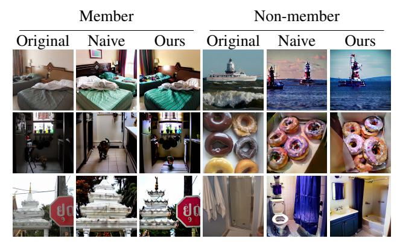

*Figure 7.* Visualization of generation on the MS-COCO dataset. In our method, the generated member samples exhibit greater similarity to their corresponding original images.

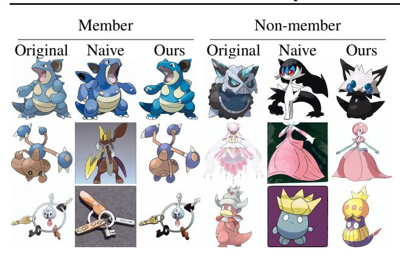

*Figure 8.* Visualization of generation on the Pokemon dataset. ´ *Table 14.* Attack performance using BLIP-generated captions.

| Method    |       | T-to-I |       | MS-COCO | Flickr |        |  |
|-----------|-------|--------|-------|---------|--------|--------|--|
|           | AUC   | T@F=1% | AUC   | T@F=1%  | AUC    | T@F=1% |  |
| NA-P      | 54.03 | 1.00   | 53.00 | 1.00    | 52.01  | 1.00   |  |
| GD        | 52.23 | 1.00   | 51.03 | 1.00    | 50.71  | 1.00   |  |
| Feature-T | 55.80 | 1.00   | 50.20 | 1.00    | 50.10  | 1.00   |  |
| Feature-C | 63.20 | 4.00   | 52.88 | 3.40    | 50.98  | 1.00   |  |
| Feature-D | 53.00 | 2.00   | 50.20 | 1.00    | 50.20  | 1.00   |  |
| Ours      | 71.47 | 6.80   | 63.54 | 5.60    | 57.82  | 4.80   |  |

### C.6. Lacking Access to Image Captions

As shown in Tab. [14,](#page-13-3) using the MS-COCO dataset as an example, our method outperforms the strongest competitor, Feature-C, with an AUC improvement of 10.66% and a T@F=1% improvement of 2.20%. The experiments reveal that end-to-end attacks are vulnerable to the absence of captions, leading to a noticeable degradation in performance. This is likely because end-to-end attacks generally rely on the initial captions to guide image generation. Although our method is also affected under this setting and exhibits a performance drop, it still achieves the best results.

### C.7. Different Metrics

To further validate the robustness of our method, we experiment with different distance metrics. In addition to the default ℓ2 distance, we also incorporate ℓ1 distance and cosine similarity as alternative metrics. As shown in Tab. [15,](#page-13-4) the results demonstrate that our method remains effective with various metrics, further confirming its robustness.

*Table 15.* Attack performance across different metrics.

| Metric | Pokemon ´ |        | T-to-I |        | MS-COCO |        | Flickr |        |
|--------|--------------|--------|--------|--------|---------|--------|--------|--------|
|        | AUC          | T@F=1% | AUC    | T@F=1% | AUC     | T@F=1% | AUC    | T@F=1% |
| ℓ2     | 82.44        | 14.00  | 89.24  | 21.60  | 90.46   | 21.80  | 76.23  | 16.00  |
| ℓ1     | 81.14        | 13.67  | 85.39  | 20.20  | 90.25   | 21.70  | 76.30  | 17.20  |
| Cosine | 78.84        | 13.33  | 83.44  | 18.10  | 86.67   | 18.90  | 73.61  | 12.90  |

### C.8. Different Fine-tuning Epochs

MIAs exploit the model's overfitting to the training data. The number of fine-tuning epochs influences how much the

model fits the training data. We investigated how the number of fine-tuning epochs affects attack performance, reporting the attack results for 100, 150, 200, 250, and 300 epochs. As shown in Fig. [9,](#page-13-5) our method achieves improved attack performance as the number of fine-tuning epochs increases. Moreover, our method continues to perform well even at lower epochs, demonstrating its robustness.

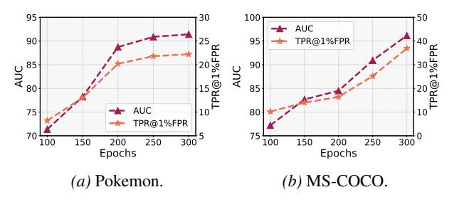

*Figure 9.* Attack performance across different fine-tuning epochs. Even with only a few fine-tuning epochs, our method yields good results. As the number of epochs increases, its attack performance improves progressively.

### C.9. Different Inference

In real-world scenarios, the number of inference steps of the target model varies depending on the model owner's configuration. We investigate how different inference steps affect our attack performance, evaluating our method on different datasets with 25, 50, 100, and 200 steps. As shown in Tab. [16,](#page-13-6) the attack performance exhibits an upward trend as the number of inference steps increases. These results demonstrate that our method consistently achieves strong performance across different inference settings, while further benefiting from longer inference.

*Table 16.* Attack performance across different inference steps of the target model.

| Inference Step | Pokemon ´ |        | T-to-I |        | MS-COCO |        | Flickr |        |
|----------------|--------------|--------|--------|--------|---------|--------|--------|--------|
|                | AUC          | T@F=1% | AUC    | T@F=1% | AUC     | T@F=1% | AUC    | T@F=1% |
| Step=25        | 76.96        | 13.60  | 89.02  | 21.60  | 86.56   | 20.20  | 74.36  | 15.00  |
| Step=50        | 82.44        | 14.00  | 89.24  | 21.60  | 90.46   | 21.80  | 76.23  | 16.00  |
| Step=100       | 78.56        | 13.89  | 90.88  | 22.00  | 92.20   | 22.40  | 77.56  | 17.33  |
| Step=200       | 78.88        | 13.79  | 90.93  | 22.00  | 92.68   | 22.40  | 77.88  | 17.20  |

#### C.10. Time overhead

We compare the time costs of different methods on the Flickr dataset, where the algorithm performs membership inference on a total of 2,000 samples. As shown in Tab. [17,](#page-13-7) the results indicate that our method achieves the lowest time cost and the highest efficiency.

*Table 17.* Time cost comparison across different methods.

| Method | NA-P  | GD     | Feature-T | Feature-C | Feature-D | Ours |
|--------|-------|--------|-----------|-----------|-----------|------|
| Time   | ≈ 13h | ≈ 9.3h | ≈ 13.7h   | ≈ 13.8h   | ≈ 13.7h   | ≈ 8h |

*Table 18.* Attack performance T@F=1% under defenses. Our method achieves the best performance among all methods.

| SSei | DataAug | SecMI | PIA  | NA-P | GD   | Feature-T | Feature-C | Feature-D | Ours  |
|------|---------|-------|------|------|------|-----------|-----------|-----------|-------|
| ×    | ×       | 16.99 | 6.40 | 5.57 | 1.00 | 4.00      | 14.60     | 3.60      | 22.90 |
| ×    | ✓       | 16.79 | 5.20 | 5.20 | 1.00 | 3.20      | 14.60     | 3.20      | 21.80 |
| ✓    | ×       | 2.10  | 3.20 | 4.00 | 1.00 | 3.20      | 13.40     | 3.00      | 18.00 |
| ✓    | ✓       | 1.90  | 1.50 | 4.00 | 1.00 | 3.20      | 13.20     | 2.60      | 17.90 |

### C.11. Impact of Defense

We present in Tab. [18](#page-14-1) the T@F=1% of different methods after applying defense measures. The experimental results demonstrate that our method achieves the best performance under these defenses

### C.12. Some Shadow Model-Based Attacks

Shadow model-based attacks require access to the architectural information of the target model and a partial auxiliary dataset to train the shadow model. As we mentioned in Sec. [1,](#page-0-1) such attacks suffer from excessive reliance on the quality of the auxiliary dataset. We evaluated two shadow model-based baseline attacks on the Stable Diffusion v1-4 model fine-tuned with the MS-COCO dataset. To investigate the influence of auxiliary data, we employed three different auxiliary datasets (MS-COCO, Flickr, and Pokemon), which ´ exhibit progressively larger distributional gaps from the original fine-tuned data. The experimental results, shown in Fig. [10,](#page-14-2) indicate that the attack performance declines notably as the distribution of the auxiliary dataset diverges further from that of the fine-tuning data.

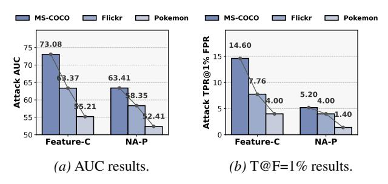

*Figure 10.* Some shadow model-based attacks' performance with different auxiliary datasets. The results show that attacks depend heavily on the distribution similarity between the auxiliary and finetuned data. As the distribution gap increases, their performance drops significantly.

# D. Limitations and Future Works.

This paper primarily focuses on membership inference attacks on fine-tuned diffusion models, highlighting the crucial role of initial noise in these attacks. Given that initial noise is widely used in noise engineering and image editing tasks, its potential privacy risks deserve greater attention. However, membership inference attacks on pre-trained models have not been sufficiently addressed. Therefore, future research should further explore attack methods and defense strategies for pre-trained models.

# E. Impact Statement

This study introduces a novel membership inference attack aimed at enhancing the ability to determine whether specific samples were used in the training of diffusion models. Membership inference attacks play a crucial role in auditing unauthorized data usage and serve as a key approach to protecting intellectual property. Our method is expected to contribute to advancements in both copyright protection and model privacy research within the domain of image generation. At the same time, we acknowledge that such techniques may also pose potential privacy risks to existing diffusion models. To mitigate misuse, all experiments in this work are conducted on publicly available datasets and open-source model architectures. Furthermore, we will make the implementation of our method publicly accessible.