# DIFFENCE: Fencing Membership Privacy With Diffusion Models

Yuefeng Peng University of Massachusetts Amherst yuefengpeng@cs.umass.edu

Ali Naseh University of Massachusetts Amherst anaseh@cs.umass.edu

Amir Houmansadr University of Massachusetts Amherst amir@cs.umass.edu

*Abstract*—Deep learning models, while achieving remarkable performances across various tasks, are vulnerable to membership inference attacks (MIAs), wherein adversaries identify if a specific data point was part of the model's training set. This susceptibility raises substantial privacy concerns, especially when models are trained on sensitive datasets. Although various defenses have been proposed, there is still substantial room for improvement in the privacy-utility trade-off. In this work, we introduce a novel defense framework against MIAs by leveraging generative models. The key intuition of our defense is to *remove the differences between member and non-member inputs*, which is exploited by MIAs, by re-generating input samples before feeding them to the target model. Therefore, our defense, called DIFFENCE, works *pre inference*, which is unlike prior defenses that are either training-time (modify the model) or post-inference time (modify the model's output).

A unique feature of DIFFENCE is that it works on input samples only, without modifying the training or inference phase of the target model. Therefore, it can be *cascaded with other defense mechanisms* as we demonstrate through experiments. DIFFENCE is specifically designed to preserve the model's prediction labels for each sample, thereby not affecting accuracy. Furthermore, we have empirically demonstrated that it does not reduce the usefulness of the confidence vectors. Through extensive experimentation, we show that DIFFENCE can serve as a robust plug-n-play defense mechanism, enhancing membership privacy without compromising model utility—both in terms of accuracy and the usefulness of confidence vectors—across standard and defended settings. For instance, DIFFENCE reduces MIA attack accuracy against an undefended model by 15.8% and attack AUC by 14.0% on average across three datasets, all without impacting model utility. By integrating DIFFENCE with prior defenses, we can achieve new state-of-the-art performances in the privacy-utility trade-off. For example, when combined with the state-of-the-art SELENA defense it reduces attack accuracy by 9.3%, and attack AUC by 10.0%. DIFFENCE achieves this by imposing a negligible computation overhead, adding only 57ms to the inference time per sample processed on average.

# I. INTRODUCTION

Deep learning has made remarkable achievements in recent years. However, it has been demonstrated that deep learning models can memorize information from their training [\[7\]](#page-14-0), [\[8\]](#page-14-1), [\[9\]](#page-14-2), making them susceptible to *membership inference attacks (MIAs)*. Such attacks seek to infer if a specific data point was part of a model's training set [\[10\]](#page-14-3). Given that deep learning models are often trained on sensitive data, such as facial images [\[11\]](#page-14-4) and medical records [\[12\]](#page-14-5), the potential success of MIAs poses a significant threat to privacy [\[10\]](#page-14-3).

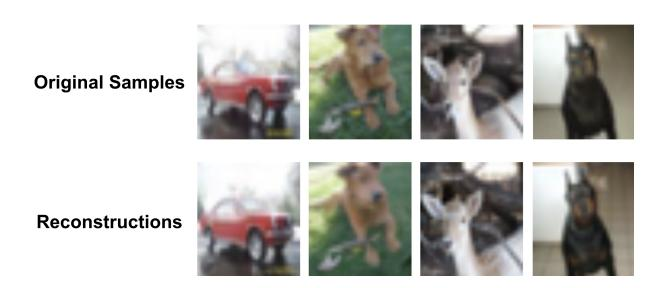

Fig. 1: Examples of original samples and their reconstructions on CIFAR-10. Original samples are successfully identified as members by the adversary, while the reconstructed samples are classified as non-members.

TABLE I: A comparison to prior works. ✓means the information is required by the adversary, - otherwise.

| Technique             | Requires Re-training | Requires Additional Data | Impact on Model Accuracy | Deployment Stage |  |
|-----------------------|-------------------------|--------------------------------|--------------------------------|---------------------|--|
| AdvReg [1]            | ✓                       | ✓                              | High                           | Training            |  |
| MemGuard [2]          | -                       | ✓                              | None                           | Post-Inference      |  |
| DPSGD [3]             | ✓                       | -                              | High                           | Training            |  |
| SELENA [4]            | ✓                       | -                              | Low                            | Training            |  |
| RelaxLoss [5]         | ✓                       | -                              | None                           | Training            |  |
| HAMP [6]              | ✓                       | -                              | Low                            | Training            |  |
| DIFFENCE (Scenario 1) | -                       | ✓                              | None                           | Pre-inference       |  |
| DIFFENCE (Scenario 2) | -                       | -                              | None                           | Pre-inference       |  |
| DIFFENCE (Scenario 3) | -                       | -                              | None                           | Pre-inference       |  |

The growing threat of MIAs has motivated the development of different defense strategies. Existing defense mechanisms can be categorized into two main classes based on their application phase in the machine learning pipeline. The first category includes defenses that operate *during the training phase*. These methods employ privacy-preserving techniques to train models in a way that reduces their memorization of training data, thereby mitigating privacy risks [\[3\]](#page-14-7), [\[1\]](#page-13-0), [\[4\]](#page-14-8), [\[5\]](#page-14-9), [\[6\]](#page-14-10). Key approaches within this category include Differential Privacy Stochastic Gradient Descent (DPSGD) [\[3\]](#page-14-7), adversarial regularization (AdvReg) [\[1\]](#page-13-0), and knowledge distillation [\[4\]](#page-14-8). The second category targets the *post-inference* phase, focusing on reducing membership privacy leakage by directly rectifying the disparities in the model's outputs between members and non-members. A representative defense in this category is MemGuard [\[2\]](#page-14-6), which modifies output confidence vectors to fool the adversary's attack model.

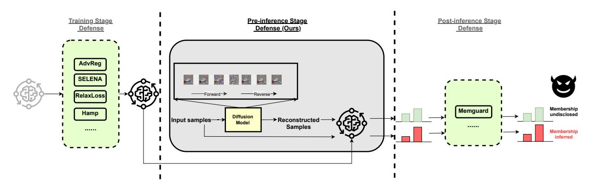

Fig. 2: An illustration of different MIA defense stages and our proposed DIFFENCE. Defenses are categorized according to their implementation stages in the machine learning pipeline: the training phase, pre-inference phase, and post-inference phase. Different defense strategies can be deployed at various stages for an integrated defense approach. DIFFENCE uniquely positioned in the pre-inference phase, is compatible with all other methods.

A new class of MIA defenses: In this paper, we introduce a third category of defense mechanisms that operate in the *preinference* stage. A pre-inference defense does *not* alter model outputs or the model itself, as with the two main categories introduced above. Instead, a pre-inference defense mechanism *modifies input samples* before they are sent to the target model for inference. To our best knowledge, no prior work has developed a pre-inference defense against MIAs. Figure [2](#page-1-0) compares the three categories of MIA defense techniques, and Table [I](#page-0-0) shows example mechanisms across these categories.

We introduce DIFFENCE, a novel pre-inference MIA defense that enhances privacy without sacrificing model accuracy. DIFF-ENCE uses diffusion models. Advanced generative models such as GANs [\[13\]](#page-14-11) and diffusion models [\[14\]](#page-14-12) have been previously employed during inference to safeguard deep learning models from adversarial attacks [\[15\]](#page-14-13). However, the application of generative models during inference to defend against privacy attacks, specifically MIA, remains largely unexplored. In this paper, we show that diffusion models can also serve as powerful tools integrated into the defense framework against MIAs, preserving membership privacy without harming model utility.

Intuitions behind DIFFENCE: The target model's memorization of members results in distinct behaviors when classifying seen (member) versus unseen (non-member) samples. MIAs exploit these behavioral discrepancies to distinguish between members and non-members, though different attack methods may leverage different features. In this work, we focus on black-box attacks, which typically infer membership by utilizing information from the sample outputs. He et al. [\[16\]](#page-14-14) categorized the information exploited in these attacks into two parts: prediction posteriors and labels. We contend that the fundamental cause of MIAs is the non-negligible gap between the model's outputs for members and non-members. Building on this, we divide the features exploitable by attacks into two categories: the train-to-test accuracy gap and the prediction distribution gap. These features, as utilized in existing attacks [\[10\]](#page-14-3), [\[17\]](#page-14-15), [\[18\]](#page-14-16), [\[1\]](#page-13-0), [\[19\]](#page-14-17), are summarized in

TABLE II: Summary of the features and information utilized by various MIAs. ✓means the specific gap is exploited by the attack, - otherwise. Regarding features, P denotes the use of prediction posteriors and L denotes the use of label.

| Attacks                          | Train-to-test Accuracy Gap | Prediction Distribution Gap | Features |
|----------------------------------|----------------------------------|-----------------------------------|----------|
| NN-based attacks [17], [10], [1] | ✓                                | ✓                                 | P,L      |
| Metric-corr [18]                 | ✓                                | -                                 | L        |
| Metric-loss [18]                 | ✓                                | ✓                                 | P,L      |
| Metric-conf [17]                 | -                                | ✓                                 | P        |
| Metric-ent [19]                  | -                                | ✓                                 | P        |
| Metric-ment [17]                 | ✓                                | ✓                                 | P,L      |
| Label-only attacks [20], [21]    | ✓                                | ✓                                 | P,L      |

Table [II.](#page-1-1) Note that some attacks which rely solely on labels [\[20\]](#page-14-18), [\[21\]](#page-14-19) may also indirectly exploit the prediction distribution gap through the robustness of the predicted labels.

A successful MIA defense should fundamentally eliminate/shrink the two gaps described above between members and nonmembers while preserving the model's utility. DIFFENCE primarily focuses on minimizing the prediction distribution gap without altering the samples' prediction labels, thus maintaining model accuracy. This is achieved by reconstructing the samples using a generative model before they are input into the target model. Through sample reconstruction, the model encounters samples in the inference stage that are not exact replicas of those observed during training, regardless of whether they are member or non-member samples, effectively reducing the discrepancy in the prediction distributions. Meanwhile, our reconstruction process retains the semantic information of the original samples, differing only in details, which allows the model's output confidence scores to accurately reflect the characteristics of the original sample. DIFFENCE includes generating multiple reconstructions for each sample and implementing various strategic selection techniques based on different assumptions about the defender. These techniques aim to align the prediction distributions of members and nonmembers as closely as possible while maintaining the prediction

label, further details are provided in Section [III-B2.](#page-5-0)

DIFFENCE's implementation: While our defense can be implemented using arbitrary generative models, we use diffusion models [\[22\]](#page-14-20) due to their state-of-the-art performances in generative tasks [\[14\]](#page-14-12) and compatibility with our defense strategy; we therefore call our mechanism DIFFENCE, i.e., a diffusion-based fence against MIAs. A diffusion model can be used to modify an original sample through forward diffusion and reverse denoising steps, creating a new sample that maintains the same semantic attributes while altering non-essential details, aligning with our defense objectives (details are discussed in Section [III-B\)](#page-3-0). Figure [1](#page-0-1) provides some example inputs and their selected reconstructions. The diffusion model employed for defense does not need to be exclusively designed for this purpose; hence, defenders can utilize off-the-shelf diffusion models. Additionally, our results demonstrate that defenders can employ diffusion models pretrained on different datasets to effectively defend and achieve comparable performance. For instance, a diffusion model trained on ImageNet can successfully provide defense for CIFAR10.

We evaluated DIFFENCE on three benchmark datasets (CIFAR-10 [\[23\]](#page-14-21), CIFAR-100 [\[23\]](#page-14-21), and SVHN [\[24\]](#page-14-22)) and two high-resolution image datasets (CelebA [\[25\]](#page-14-23) and UTK-Face [\[26\]](#page-14-24)) using four model architectures: ResNet18 [\[27\]](#page-14-25), DenseNet121 [\[28\]](#page-14-26), VGG16 [\[29\]](#page-14-27), and Vision Transformer (ViT) [\[30\]](#page-14-28). Our experiments comprehensively cover six state-of-theart MIAs and six state-of-the-art defenses. Note that DIFFENCE can be viewed as a membership privacy booster that can be cascaded with other (i.e., training or post-inference) defense mechanisms, due to its minimal deployment constraints and its plug-and-play flexibility. This also allows us to combine the strengths of other methods. For instance, DIFFENCE can be combined with defenses that address label-only attacks, enhancing their effectiveness against other stronger attacks. While DIFFENCE does not directly counter label-only threats, this combination creates a comprehensive defense strategy effective against all types of attacks. Our empirical results validate DIFFENCE's effectiveness in enhancing membership privacy without decreasing the model utility, irrespective of the model's operational context—be it a baseline (vanilla) or a defended setting. For example, we decreased attack accuracy for SELENA, Relaxloss and HAMP by 9.3%, 12.2%, and 14.4%, and attack AUC by 10.0%, 11.4%, and 14.4%, respectively, on average across three benchmark datasets. DIFFENCE also reduced the true positive rate (TPR) under 0.1% false positive rate (FPR) by 52.8% on average across six tested defenses on the SVHN dataset. All of this was achieved without any loss in model utility, with an average additional inference overhead of only 57ms.

In this context of utility, unlike previous studies on MIAs that focused solely on model accuracy, we recognize model utility encompasses not just accuracy, but also the meaningfulness of the output confidence scores or how well the confidences are calirbated [\[31\]](#page-14-29), [\[32\]](#page-14-30). Through our evaluation, we have also verified that DIFFENCE effectively maintains the meaningfulness

of confidence scores, which indicates that it indeed preserves the overall utility.

Summary of contributions: Our contributions are as follows:

- 1) We propose a novel diffusion model-based membership inference defense framework called DIFFENCE, which can boost the membership privacy of pre-existing (both undefended and defended) models without compromising the model utility.
- 2) We propose a new defense pipeline, which for the first time combines defenses deployed at different stages to achieve better defense performance.
- 3) We implemented the prototype of the DIFFENCE. Our extensive experiments show that DIFFENCE can effectively improve the membership privacy of existing models without utility loss. Furthermore, we show that in certain settings DIFFENCE can enhance both the model accuracy and privacy of the model.

# II. BACKGROUND AND PRELIMINARIES

#### *A. Diffusion Models*

Generative image modeling has seen remarkable advancements in recent years, with Generative Adversarial Networks (GANs) [\[13\]](#page-14-11) and Variational Autoencoders (VAEs) [\[33\]](#page-14-31) standing out as the pioneering architectures for synthesizing realistic images [\[34\]](#page-14-32), [\[35\]](#page-14-33), [\[36\]](#page-14-34), [\[37\]](#page-14-35). While these frameworks have laid the groundwork and achieved significant successes, diffusion models [\[38\]](#page-14-36) have recently emerged, surpassing their predecessors in terms of performance and establishing themselves as a leading approach in the domain of image synthesis [\[14\]](#page-14-12).

*Denoising Diffusion Probabilistic Models (DDPMs)* [\[22\]](#page-14-20) have emerged as a significant advancement in generative image modeling and operate by reversing a diffusion process. This diffusion mechanism can be expressed as

$$x_t = \sqrt{1 - \beta_t} x_{t-1} + \sqrt{\beta_t} \epsilon_t \tag{1}$$

where ϵt represents Gaussian noise, and βt dictates the magnitude of noise introduced at each iteration. After a set number of timesteps, typically denoted as T, the data xT becomes predominantly noise-infused.

Reconstructing meaningful samples involves reversing this process. A denoising function is trained by DDPM, which, when given a noised sample xt, predicts the less-noisy version from the preceding timestep xt−1. The optimization goal is to minimize the difference between the true and the predicted data, typically through a mean squared error loss. During the sampling phase, DDPM initiates with a noise distribution sample and employs the trained denoising function to reverse the diffusion, yielding samples that closely mirror the original data distribution.

# *B. Threat Model*

*1) Attacker:* Black-box Access: Following prior works [\[2\]](#page-14-6), [\[6\]](#page-14-10), we assume the attacker has black-box access to the target model. This means the attacker can query the target model using a black-box API and receive corresponding prediction vectors, while direct access to any intermediate results, including the reconstructions from the diffusion model and intermediate outputs from the target model remains restricted. Therefore, we assume there is no privacy leakage through the diffusion model or the intermediate results of the target model.

Partial Knowledge of Membership for Members: Like previous defenses [\[4\]](#page-14-8), [\[6\]](#page-14-10), we assume a strong attacker that knows a limited number of samples from both the training and test sets, i.e., they know the membership status of some members and some non-members. Therefore, the attacker can directly train their attack classifier using the known members and non-members of the target model without the need to train any shadow models. The goal of the attack is to infer the membership status of any other unexposed sample.

Full Knowledge of Defense Technique: We assume the attacker is fully aware of the deployment of the defense technique and the architecture of the target model. In the context of DIFFENCE, we assume the attacker has full knowledge of how the diffusion model is deployed. All attacks against DIFFENCE in our experiments can be considered adaptive attacks, as we assume the attacker can process samples in the same manner as DIFFENCE when training their attack classifier. This means the attacker can use reconstructions from the same diffusion model to train the attack classifier instead of using the original samples.

*2) Defender:* We assume the defender possesses a private dataset and uses it to train a target model. The defender's objective is to securely release the target model for user accessibility. The defender aims to strike a balance between achieving minimal membership privacy leakage and maintaining high classification accuracy.

# III. METHODOLOGY

Our main idea is to eliminate the differences in predictive behavior between members and non-members, thereby fundamentally mitigating membership privacy leakage. As described in Section [I,](#page-0-2) we categorize these disparities into the train-to-test accuracy gap and the prediction distribution gap. DIFFENCE primarily targets the elimination of the prediction distribution gap. However, DIFFENCE can seamlessly integrate with other defenses that reduce the train-to-test accuracy gap, such as SELENA [\[4\]](#page-14-8), enabling a comprehensive defense strategy that simultaneously addresses both gaps without sacrificing the model's utility, achieving state-of-the-art defense performance. In this section, we first explain how differences in predictive behavior can lead to privacy leakage. We then introduce how we design DIFFENCE to narrow these gaps.

#### *A. Intuition Behind* DIFFENCE

Prior studies on MIAs have highlighted a distinct model behavior concerning training and test data, pinpointing it as a key contributor to membership privacy leakage [\[39\]](#page-14-37). The gap in prediction distributions between members and nonmembers can be reflected in various features. These may include assigning higher confidence levels, lower loss, and reduced prediction entropy to members. The disparities in these

features are key factors leading to membership privacy leakage, with almost all effective MIAs exploiting one or several of these feature discrepancies [\[18\]](#page-14-16), [\[10\]](#page-14-3), [\[19\]](#page-14-17), [\[39\]](#page-14-37). Moreover, these features are interrelated; for instance, lower loss often implies reduced prediction entropy and higher confidence levels.

Carlini et al. [\[39\]](#page-14-37) proposed parametric modeling of prediction confidence to achieve a more Gaussian-like distribution. Such a distribution more effectively distinguishes the prediction distribution gap between members and non-members. In our subsequent discussions, we adopt this parametric modeling approach to represent the prediction gap. The only difference is that we use the maximum confidence from the output vector rather than the confidence of the correct class, as our focus is on the prediction distribution gap rather than the train-to-test accuracy gap. The parametric modeling function is shown in Equation [2.](#page-3-1)

$$\phi(p) = \log\left(\frac{p}{1-p}\right), \text{ for } p = \max(f(x))$$
 (2)

where f(x) is the model's output vector for input x. Figure [3](#page-4-0) plots histograms illustrating the differences in predictions for members and non-members on CIFAR-100 without defenses. It can be observed that there are significant disparities in the output distributions between members and non-members, especially in the parametrically modeled confidence, which we refer to as *logit* in this paper. Attackers can easily exploit these differences to distinguish between members and non-members.

To address these issues, we propose a novel method that leverages input reconstruction to eliminate the prediction disparity between members and non-members. Our core idea is that by reconstructing samples, the model, during classification, encounters samples that are distinct from those it has seen during the training phase, irrespective of whether they are from members or non-members, thereby reducing inconsistencies in predictions. Our proposed method, DIFFENCE, aims to reconstruct the finer details of samples without altering their semantic content. To this end, we employ diffusion models as our generative model, as they align well with our objectives.

Figure [4](#page-5-0) provides examples of how DIFFENCE narrows the prediction gap. By reconstructing the input, DIFFENCE ensures that the model's predictions for both members and nonmembers become more consistent, thereby mitigating the risk of membership inference attacks. This process reduces the gaps in confidence levels, prediction entropy, and the parametrically modeled confidence.

#### *B. Our Proposed* DIFFENCE

DIFFENCE involves generating multiple reconstructed images and selecting the best one that suits our purpose. Among the generated samples, only those with the same predicted label as the original sample are considered as candidates for selection. This ensures that the model's predictive outcomes remain unchanged, thereby maintaining the model accuracy. We designed different sample selection strategies for three scenarios based on the assumptions in the defender. These scenarios

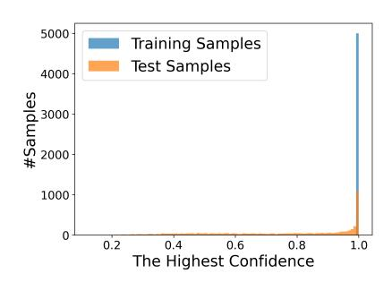

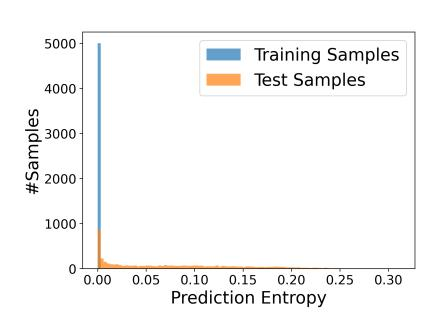

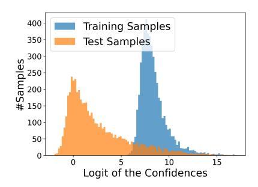

Fig. 3: Prediction distribution gap between members and non-members: The figure illustrates the disparities in prediction distributions with respect to confidence levels, prediction entropy, and parametrically modeled confidence (predicted logits).

include a defender having access to both some member and nonmember samples, having access only to members, and having access solely to a trained model without any knowledge of samples' memberships. With more information, defenders can perform a more nuanced analysis of the prediction distribution. This enables a more strategic selection of reconstructed images, forcing the prediction distributions of members and nonmembers to align more closely, thereby providing robust protection. We provide more details below.

*1) Sample Reconstruction:* For each input image, we apply a two-phase process to obscure and subsequently reconstruct its inherent details. First, we apply the forward diffusion procedure using the closed-formed expression in Equation [3](#page-4-1) provided by Ho et al. [\[22\]](#page-14-20) to add Gaussian noise to the image.

$$\mathbf{x}_t = \sqrt{\bar{\alpha}_t} \mathbf{x}_0 + \sqrt{1 - \bar{\alpha}_t} \boldsymbol{\epsilon}$$
 (3)

Where αt = 1 − βt and α¯t = Qt i=1 αi . Then, the reverse process is applied aiming to recover the original image from the noisified image.

The two-step reconstruction of the image aligns well with our defensive objectives. If we look into the frequency domain by using Fourier Transform to both input images x0 and noise ϵ, we get:

$$\mathcal{F}(\boldsymbol{x}_t) = \sqrt{\bar{\alpha}_t} \mathcal{F}(\boldsymbol{x}_0) + \sqrt{1 - \bar{\alpha}_t} \mathcal{F}(\boldsymbol{\epsilon})$$
 (4)

Typically, images display a high response to low-frequency content and a notably weaker response to high-frequency content. This is because of the inherent smoothness of most images. The dominant low-frequency components encapsulate essential visual information, while the high-frequency components, associated with fine details and edges, are comparatively subdued [\[40\]](#page-14-38).

Considering a small t, where α¯t closely approximates 1, the perturbations in the frequency domain are minor. Note that the Fourier transform of a Gaussian sampling is itself Gaussian. Consequently, at small t values, the forward process washes out the high-frequency content without perturbing the lowfrequency content much. This leads to a faster alteration of the high-frequency elements compared to the low-frequency ones in the forward process. This dynamic is also relevant in the context of the reverse process of denoising models. At lower t values, these models predominantly focus on reconstructing high-frequency content [\[41\]](#page-14-39).

We denote the diffusion step applied to each sample in DIFFENCE as T. By selecting an appropriate value for T, we can preserve the essential semantic content of each image while altering its finer details. The impact of the diffusion step T on the performance of DIFFENCE is further explored in Section [IV-C2.](#page-11-0) During the inference phase, the two-step reconstruction procedure reduces the gap between the prediction distributions of members and non-members.

*2) Sample Selection:* We observed that the stochastic nature of sample generation can lead to a decline in sample quality sometimes when only one reconstructed sample is generated for each image, potentially resulting in decreased model test accuracy. To address this issue, we propose generating multiple reconstructed images for each original image. Then in alignment with our defense objective, we carefully select the most appropriate samples to be utilized as the final input sample.

For each original image Ii requiring privacy protection, DIFFENCE generates N reconstructed versions, denoted as Ri = {Ri1, Ri2, . . . , RiN }. The model f outputs a prediction for each reconstructed image Rij , i.e., f(Rij ). From these, we identify a subset of reconstructions whose predicted labels match the predicted label of the original image Ii forming a set of candidate reconstructions, denoted as C. We then select the most appropriate reconstructed image from the candidates. Selecting a sample from this candidate set ensures that the original prediction label of the sample remains unchanged, guaranteeing that DIFFENCE does not impact the model's accuracy.

$$P_i = \text{select}(\{f(R_{ij}) \mid f(R_{ij}) = f(I_i), j = 1, \dots, N\})$$
 (5)

Here, Pi represents the final prediction for the original image Ii , derived from the model's prediction for the selected reconstruction. The selection function, denoted as select(·), chooses the optimal reconstruction from Ri based on a criterion that evaluates the predictions of all N reconstructions. This criterion is aligned with the defense's objectives and may take into account the defender's prior knowledge about the prediction distributions of members and non-members. We categorize DIFFENCE into three scenarios based on the information available to the defender and have accordingly designed distinct sample selection strategies for each.

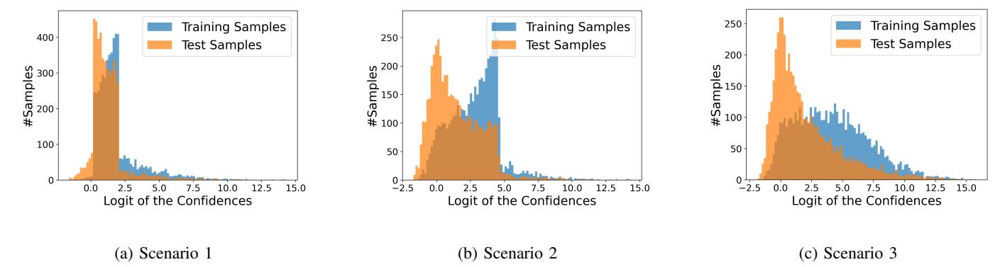

Fig. 4: Prediction distribution gap between members and non-members under DIFFENCE across the three scenarios. This figure displays the distribution of predicted logits on the CIFAR-100 dataset using ResNet18 with DIFFENCE in the three scenarios.

Scenario 1. In this scenario, we assume that the defender has access to subsets of both member and non-member data. The defender initially generates N reconstructed samples for each data point and then plots the prediction distributions for all these reconstructions. Through the analysis of these distribution plots, the defender can identify an optimal interval where the predictions should ideally fall to maximize the reduction of the prediction distribution gap between members and non-members. Specifically, a grid search is conducted over the overlapping regions of member and non-member prediction distribution [min(logitmem), max(logitnonmem)] to determine this interval. The chosen interval aims to minimize the Jensen-Shannon (JS) divergence [\[42\]](#page-14-40) between the prediction distributions of members and non-members within the selected range. This approach is based on the observation that a lower JS divergence between member and non-member prediction distributions typically indicates reduced membership privacy leakage [\[16\]](#page-14-14). This correlation has been confirmed by our experiments, as detailed in Section [IV-C1.](#page-10-0)

Defenders require only a small subset of samples to select the optimal interval. After the interval is determined, for each sample requiring protection, the defender randomly selects one sample from the candidate set C that falls within this interval based on the prediction. If none of the candidates are within the interval, the closest one is chosen. Another possible approach involves continuously generating reconstructions until the sample falls within the defined interval. However, we found this method to be inefficient. More details on this are discussed in Section [IV-C1.](#page-10-0)

Figure [4](#page-5-0) provides an example of DIFFENCE as applied to the CIFAR-100 dataset. It illustrates the prediction distribution of reconstructed samples for 1000 data points which is used to select the optimal interval. The figure also showcases the distribution of prediction logits for both members and nonmembers after the selection of the optimal interval using the steps outlined in DIFFENCE. This visualization demonstrates the effectiveness of DIFFENCE in aligning the prediction distributions of member and non-member data, thereby minimizing the potential for privacy leakage.

Scenario 2. In this scenario, the defender only has access to a subset of members, the interval selection must rely solely on the prediction distribution of member reconstructions. In such cases, where only the member prediction distribution is available, we set the interval as [min(logitmem), mean(logitmem)]. This is based on the observation that members typically exhibit higher confidence levels, and often, the lower half of the member distribution significantly overlaps with the upper half of the non-member distribution. By observing Figure [4](#page-5-0) this approach also significantly narrows the gap between the prediction logits of members and non-members.

Scenario 3. In this scenario, the defender is unaware of the membership status of any sample, typically occurring when the defender is tasked with protecting an already trained model without having been involved in its training process. DIFFENCE involves randomly selecting the prediction of one sample from the generated candidates as the output. Although this method does not deliberately restrict the prediction distribution, the reconstruction process inherently contributes to reducing the prediction distribution gap between members and non-members. This effect is achieved as the model encounters newly generated samples during the reconstruction phase, which are distinct from any data it was exposed to during training. This novelty in the samples ensures a more uniform response from the model, diminishing the likelihood of differential predictions between members and non-members.

- *3) Prediction Aggregation:* By default, we adopt the aforementioned sample selection strategy as it consistently provides privacy protection without altering the model's accuracy. An alternative option is to aggregate the predictions of all generated samples instead of selecting one. This approach may yield superior results in specific contexts; for example, we observed that direct averaging of predictions from generated samples can enhance both membership privacy and model accuracy when the diffusion model is trained on sufficient data. Further details on this are provided in Appendix [A-C.](#page-15-0)
- *4) Integration with Other Defenses in a Plug-and-Play Manner:* DIFFENCE employs off-the-shelf diffusion models, offering substantial flexibility in deployment. As outlined

in Section [I,](#page-0-2) we categorize defenses into three deployment phases. Defenses deployed in different stages are compatible and can be used concurrently. DIFFENCE, characterized by minimal defense assumptions, is unique in its deployment at the *pre-inference* stage and offers plug-and-play capability, allowing for integration with all other existing methods. As illustrated in Figure [2,](#page-1-0) when combined with training phase defenses, DIFFENCE can integrated into the inference pipeline immediately after the model has been trained using privacypreserving techniques.

When combined with post-inference defenses, DIFFENCE can be employed to reconstruct input samples within the inference pipeline, followed by the application of the post-inference defenses, such as MemGuard, to introduce noise into the output prediction vector. Our experiments validate the effectiveness of DIFFENCE in conjunction with other defenses, while also providing new perspectives for the deployment of future defense mechanisms.

#### *C. Defending against Label-Only Attacks*

DIFFENCE effectively reduces the prediction distribution gap while preserving the model's accuracy by not altering the predicted labels for samples. However, this design choice means that DIFFENCE is not directly effective against label-only attacks, which exploit the model's predicted labels rather than the prediction confidence. Label-only attacks are generally considered weaker and less of a priority in recent defense works. For instance, RelaxLoss [\[5\]](#page-14-9) excludes label-only attacks from their evaluation, arguing that these attacks are strictly weaker than the ones used to assess model privacy. Similarly, HAMP [\[6\]](#page-14-10) demonstrates that existing label-only attacks are unsuccessful in a low false positive/negative regime.

Nonetheless, it's worth noting that previous defenses, such as SELENA [\[4\]](#page-14-8) and HAMP [\[6\]](#page-14-10), have shown success in resisting label-only attacks. While DIFFENCE does not directly improve defense against label-only attacks, it can be seamlessly integrated with these existing defenses, enhancing overall protection without sacrificing the model's utility. Although DIFFENCE does not specifically target label-only attacks, it offers a flexible and non-intrusive approach to enhancing membership privacy that can be effectively combined with other defenses to achieve comprehensive protection.

## IV. EVALUATIONS

#### *A. Experimental Setup*

Datasets. We consider three benchmark datasets and two highresolution datasets :

- CIFAR-10 [\[23\]](#page-14-21): CIFAR-10 Comprising 60,000 32x32 color images across 10 classes, Each class contains 6,000 images.
- CIFAR-100 [\[23\]](#page-14-21): CIFAR-100 have the same data format as CIFAR-10, but it has 100 classes, so each class has only 600 images.
- SVHN [\[24\]](#page-14-22): SVHN contains 99,289 digit images of house numbers collected from Google Street View. Each image

- has a resolution of 32x32 and is labeled with the integer value of the digit it represents, from 0 to 9.
- CelebA [\[25\]](#page-14-23): CelebA contains over 200,000 highresolution celebrity images (178x218 pixels), each annotated with 40 attributes. Following prior work [\[43\]](#page-14-41), we selected 3 attributes to create 8-class labels.
- UTKFace [\[26\]](#page-14-24): A large-scale face dataset with over 20,000 images labeled by age, gender, and ethnicity (resolutions up to 200x200 pixels). We used images from the four largest races (White, Black, Asian, Indian) for race-based labels.

For the CIFAR-10 and CIFAR-100 datasets, we used 25,000 samples each for training the target models. For the SVHN dataset, we used 5,000 samples. For the CelebA and UTKFace datasets, we used 10,000 and 5,000 samples, respectively. The remaining samples from each dataset were reserved as nonmembers or references used by defenses or attacks.

Models. For target classifiers, we consider the widely used ResNet18 [\[27\]](#page-14-25) as the target model. Appendix [A-A](#page-15-1) provides experimental results on additional model architectures, including DenseNet121 [\[28\]](#page-14-26), VGG16 [\[29\]](#page-14-27), and ViT [\[30\]](#page-14-28).

In our default setup, each target model is trained for 100 epochs using the Adam optimizer with a learning rate of 0.001. We apply an L2 weight decay coefficient of 10−6 and use a batch size of 128. For ViT, we use a learning rate of 0.0001. As we found that the performance of some recent works can be affected by the training configurations of the target models, *we also employ their training settings to demonstrate that* DIFFENCE *enhances their best outcomes*.

For the diffusion models integrated into DIFFENCE, we train standard DDPMs from scratch using the default hyperparameters from the original DDPM paper [\[22\]](#page-14-20). Unless otherwise mentioned, DIFFENCE uses a diffusion model trained on the same training data as the associated defended target classifier, and generates N = 30 reconstructed images for each sample, with the number of diffusion steps T set to 160. Detailed discussions on the choice of these hyperparameters are provided in Section [IV-C2.](#page-11-0)

In addition to training diffusion models on the same distribution as the target classifier, we also demonstrate the effectiveness of DIFFENCE using publicly available pre-trained diffusion models trained on ImageNet [\[14\]](#page-14-12). This illustrates that the diffusion models in DIFFENCE and the target classifier's training data do not need to be from the same distribution. It also shows that when an off-the-shelf diffusion model for the same dataset is not available, using a pre-trained diffusion model on a different dataset can still provide effective protection. More details are provided in Section [IV-B5.](#page-9-0)

Attack and Defense Methods. For evaluation, we consider six state-of-the-art attack methods: NN-based attacks [\[1\]](#page-13-0), [\[17\]](#page-14-15), four threshold-based attacks (loss, confidence, entropy, M-entropy), and the recent LiRA attack [\[39\]](#page-14-37).

We consider six major defenses: AdvReg [\[1\]](#page-13-0), MemGuard [\[2\]](#page-14-6), SELENA [\[4\]](#page-14-8), RelaxLoss [\[5\]](#page-14-9), HAMP [\[6\]](#page-14-10), and DPSGD [\[3\]](#page-14-7). For all attack and defense methods, we follow the original

papers and setups unless otherwise stated. Detailed information is provided in Appendix [A-E.](#page-15-2)

Following previous practice [\[5\]](#page-14-9), we exclude label-only attacks in our comparative experiments. DIFFENCE primarily targets attacks beyond label-only attacks, aiming to avoid accuracy loss by not altering predicted labels, and thus does not directly defend against label-only attacks (more discussions are provided in Appendix [A-B\)](#page-15-3). However, *label-only attacks can be effectively countered by existing defenses such as SELENA [\[4\]](#page-14-8) and HAMP [\[6\]](#page-14-10), but defenses against other attacks still need improvement. Our approach is designed to complement these existing defenses on the stronger attacks (i.e., non labelonly MIAs), enabling a comprehensive defense strategy that addresses all types of attacks.*

Evaluation metrics. For privacy, we default to using five of the described attacks (excluding LiRA) to evaluate two common used metric: (i) attack accuracy and (ii) attack AUC. Additionally, we report the TPR (True Positive Rate) at 0.1% FPR and the TNR (True Negative Rate) at 0.1% FNR on SVHN dataset, using LiRA which is specifically designed to achieve superior results on this metric. We exclusively applied the LiRA attack on the SVHN dataset due to its high computational demands, as it requires the training of over 100 shadow models.

#### *B. Experimental Results*

*1) Comparison to Baselines:* We first conducted an extensive evaluation of DIFFENCE across three benchmark datasets. For each dataset, we evaluated the performance of models across seven different cases including one without any protection and six others, each employing a different defense mechanism. We tested the impact of DIFFENCE on the models' test accuracy and the changes in attack accuracy and attack AUC under three scenarios introduced in Section [III-B2.](#page-5-0) Our results show that DIFFENCE *consistently enhanced privacy protection across all settings without compromising the model accuracy.* We discuss the specific effects of DIFFENCE below.

Figure [5](#page-8-0) shows the performance of DIFFENCE against ResNet18 under Scenario 1. We can observe that DIFFENCE consistently reduces the attack's AUC and accuracy across all cases, particularly against those methods that preserve model usability but offer only limited protection. For instance, when applied to ResNet18, DIFFENCE managed to decrease the attack accuracy for undefended, HAMP, RelaxLoss, and SELENA models by 15.8%, 14.4%, 12.2%, and 9.3%, respectively, on average across three datasets. Similarly, the attack AUCs showed reductions of 14.0%, 14.4%, 11.4%, and 10.0% after employing DIFFENCE. The experimental results demonstrate that DIFFENCE can significantly reduce privacy threats, even with the reliance on only a small amount of additional data (1000 non-members in our experiments). Besides ResNet18, we also tested DIFFENCE on DenseNet121, VGG16, and ViT. The experiments show that DIFFENCE can effectively enhance membership privacy in all these settings (more details in Appendix [A-A\)](#page-15-1).

Our experiments suggest that the optimal defense practice is combining DIFFENCE with recent utility-preserving defenses. This combination leverages their advantages in maintaining utility while enhancing privacy protection. For instance, the best privacy-utility trade-offs achieved on VGG16 were from the integrations of DIFFENCE with SELENA and HAMP (Figure [12\)](#page-16-0).

Table [III](#page-8-1) presents the experimental results using ResNet18 under all three different scenarios. We show the average attack AUC and accuracy reduction of DIFFENCE across three datasets in each scenario. The average defense effectiveness in Scenarios 2 and 3 is weaker than in Scenario 1, due to stronger assumptions placed on the defender in these scenarios. However, it is observable that they still achieve significant privacy enhancements across all settings without compromising the model's accuracy. We observed that some recent defenses, such as HAMP and RelaxLoss, have not achieved satisfactory overall effectiveness. We found their performance heavily depends on the manual selection of hyperparameters. Following their claims about the impact on utility, we selected hyperparameters that matched the test accuracy of undefended models. However, this sometimes resulted in poor defense and even worsened privacy. DIFFENCE can address these privacy issues while maintaining their high utility.

In the research of MIA defense, balancing sufficient privacy protection with model utility has always been one of the most important objectives. Our results suggest that DIFFENCE represents a significant step forward towards the ideal defense.

*2) Evaluation of Confidence Calibration in Model Predictions:* DIFFENCE preserves the predicted label of the sample, thereby not affecting the model's accuracy. Nonetheless, the utility of a model also involves the value of information provided by the output confidence vector. As discussed in Section [III-B,](#page-3-0) DIFFENCE exploits diffusion model to generate reconstructions that closely resemble the original samples, differing only in subtle details (see Figure [1](#page-0-1) for examples). We propose that the confidence levels of these reconstructions are reliable indicators and provide a dependable measure of the original sample's characteristics.

Previous research [\[32\]](#page-14-30), [\[35\]](#page-14-33), [\[44\]](#page-14-42) emphasizes the importance of well-calibrated model outputs, where the predicted class probability should match its actual correctness likelihood. Expected Calibration Error (ECE) [\[31\]](#page-14-29), [\[32\]](#page-14-30), [\[44\]](#page-14-42) is a key metric in this context, quantifying the alignment between predicted probabilities and empirical accuracies. Essentially, ECE measures the average discrepancy between the confidence of a model's predictions and the true correctness of those predictions, providing a critical assessment of the reliability of the model's confidence estimates. A lower ECE suggests better alignment of confidence scores with true probabilities, indicating more reliable predictions. ECE is calculated as in equation [6:](#page-7-0)

$$ECE = \sum_{m=1}^{M} \frac{|B_m|}{n} \left| acc(B_m) - conf(B_m) \right|$$
 (6)

where M denotes the number of bins into which the predictions are grouped. Bm is the set of samples in the m-th bin. n

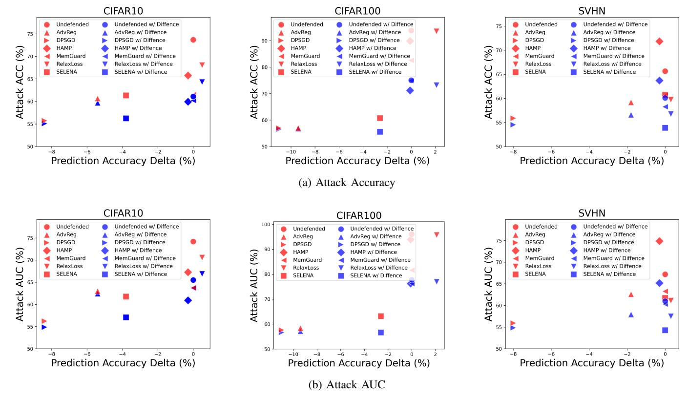

Fig. 5: Attack accuracy and AUC on three datasets against ResNet18 under Scenario 1. We report the highest attack accuracy and attack AUC across all attacks. The prediction accuracy delta indicates the prediction accuracy gap compared to the undefended models, with negative numbers indicating a decrease in model accuracy.

TABLE III: Average attack accuracy and AUC across three datasets under three scenarios on ResNet18. The best defense results in each case are highlighted in bold.

| Defenses   | Prediction Accuracy Delta (%) | w/o DIFFENCE      |                           | w/ DIFFENCE (Scenario 1) |                           | w/ DIFFENCE (Scenario 2) |                           | w/ DIFFENCE (Scenario 3) |                           |
|------------|----------------------------------|-------------------|---------------------------|-----------------------------|---------------------------|-----------------------------|---------------------------|-----------------------------|---------------------------|
|            |                                  | Attack AUC (%) | Attack Accuracy (%) | Attack AUC (%)           | Attack Accuracy (%) | Attack AUC (%)           | Attack Accuracy (%) | Attack AUC (%)           | Attack Accuracy (%) |
| Undefended | 0                                | 79.14             | 77.73                     | 68.08                       | 65.41                     | 70.79                       | 67.12                     | 69.12                       | 67.02                     |
| SELENA     | -2.13                            | 62.22             | 60.92                     | 56.00                       | 55.23                     | 60.30                       | 58.58                     | 57.81                       | 57.16                     |
| AdvReg     | -5.53                            | 61.32             | 58.94                     | 59.17                       | 57.68                     | 61.33                       | 58.58                     | 60.87                       | 58.62                     |
| HAMP       | -0.23                            | 78.96             | 76.08                     | 67.60                       | 65.10                     | 71.23                       | 66.61                     | 69.18                       | 66.31                     |
| RelaxLoss  | 0.97                             | 75.81             | 73.78                     | 67.13                       | 64.75                     | 69.56                       | 66.19                     | 68.60                       | 66.07                     |
| DP-SGD     | -9.13                            | 56.61             | 56.19                     | 55.47                       | 55.40                     | 58.40                       | 56.92                     | 56.60                       | 56.35                     |
| Memguard   | 0                                | 69.53             | 68.21                     | 66.76                       | 64.47                     | 67.23                       | 65.30                     | 67.48                       | 65.51                     |

represents the total number of samples. acc(Bm) is the accuracy within bin Bm. conf(Bm) is the average predicted confidence for samples in bin Bm.

Figure [6](#page-9-1) shows the ECE of the confidence vectors output by both undefended models and models employing various defenses across three datasets. It is observed that the ECE values of DIFFENCE are very similar to those of the undefended models. For instance, the ECE values for the undefended model and the three DIFFENCE scenarios are 0.139, 0.142, 0.126, and 0.131 on average, respectively. This suggests that DIFFENCE *not only maintains the accuracy of the model but also provides meaningful confidence scores.*

However, it was observed that some defenses could lead

to a significant increase in ECE. For example, compared to the undefended model, the average ECE of the HAMP is 222.3% higher. This could be attributed to HAMP's strategy of promoting high-entropy confidence vectors as a defense against MIAs, leading to more flattened confidence distributions. Such alterations, while serving a defensive purpose, can yield confidence scores that lack meaningful interpretation, potentially compromising the utility of the model.

In summary, our results validate the effectiveness of DIFF-ENCE in preserving the utility of confidence scores, and also highlight the importance of evaluating the meaningfulness of confidence scores in the field of MIA defenses.

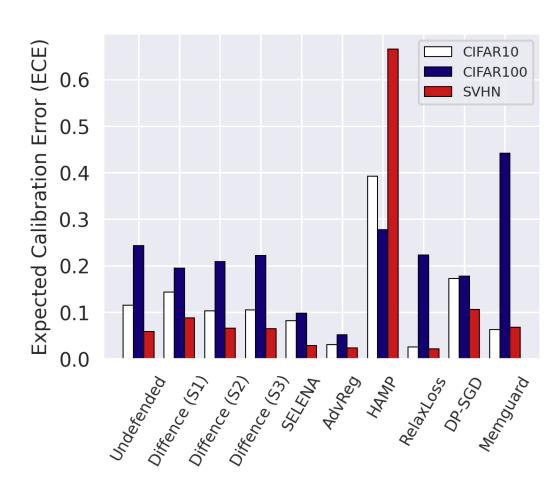

Fig. 6: Expected Calibration Error (ECE) of various defenses across three datasets. A lower ECE value indicates better-calibrated confidence scores.

*3) Effectiveness on Attack TPR and TNR Metrics:* Following the methodology of Carlini et al. [\[39\]](#page-14-37), we evaluate the reliability with which an adversary can compromise the privacy of even a few users in a sensitive dataset, using metrics such as TPR at 0.1% FPR and TNR at 0.1% FNR. We assess the defensive effectiveness of DIFFENCE under the third scenario against these metrics on the SVHN dataset, using six different attacks including LiRA.

As illustrated in Figure [7,](#page-9-2) DIFFENCE significantly reduces both the attack TPR and TNR in most cases. For example, DIFFENCE decreased the attack TPR under 0.1% FPR and TNR under 0.1% FNR against the undefended model by 63.9% and 56.8%, respectively. When cascaded with other defenses, DIFFENCE reduced the TPR under 0.1% FPR by 52.8% on average across six tested defenses.

DIFFENCE has a smaller impact on methods that already exhibit low TPR; however, these methods often compromise the model's utility. Consequently, DIFFENCE can be advantageously combined with other defenses that preserve model utility but are relatively weaker in defense effectiveness, to enhance overall protection without significantly sacrificing utility.

*4) Improving Performance Beyond Previous State-of-the-Art:* Recent advanced defenses like SELENA, RelaxLoss, and HAMP have been reported state-of-the-art defense performance in terms of privacy-utility trade-off in their respective papers. However, our experments suggest that the defensive robustness of RelaxLoss and HAMP is contingent upon the choice of training parameters, leading to variability in their effectiveness.

For a fair and accurate comparison, we adopted the experimental settings deployed in their original papers to assess the effectiveness of DIFFENCE. In our evaluations, DIFFENCE was configured with N = 10 and T = 50 in Scenario 3. The results are shown in Table [IV.](#page-10-1) Note that DIFFENCE maintains the original predicted labels of the model. While this does not eliminate the privacy risks posed by the accuracy gap between training and test sets, it significantly mitigates the risk

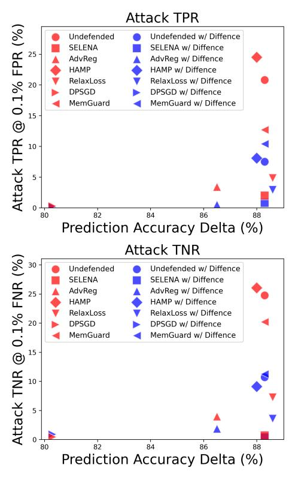

Fig. 7: Attack TPR and FPR on SVHN dataset. We report the highest attack TPR and attack FPR across all attacks.

of privacy leakage arising from other inconsistent prediction behaviors.

We observed that DIFFENCE can effectively enhance membership privacy in most settings. For instance, for HAMP, DIFFENCE successfully reduced attack AUC and accuracy from 67.4% and 65.9% to 64.7% and 61.5%, respectively. DIFFENCE did not show improvement in the RelaxLoss setting, as there was no room for privacy enhancement by reducing the prediction distribution gap. In this case, a simple attack assuming all correctly classified samples as members achieved the highest attack accuracy. Our experiments demonstrate that DIFFENCE can be applied to the best defense models proposed in prior works, further enhancing privacy by reducing the prediction distribution gap.

*5) Evaluating* DIFFENCE *with Publicly Available Diffusion Models :* Although DIFFENCE requires deploying a diffusion model, the model does not need to be trained on the same dataset as the target model. Therefore, defenders can leverage off-the-shelf diffusion models, including publicly available models trained on different datasets.

To demonstrate this, we evaluated DIFFENCE on two highresolution datasets: CelebA [\[25\]](#page-14-23) and UTKFace [\[26\]](#page-14-24) in Scenario 3 using a publicly available diffusion model trained on ImageNet by Dhariwal et al. [\[14\]](#page-14-12) with settings of N = 10 and T = 200. To the best of our knowledge, we are the first to conduct comprehensive MIA tests on these datasets using the original resolution without resizing, employing five attacks and

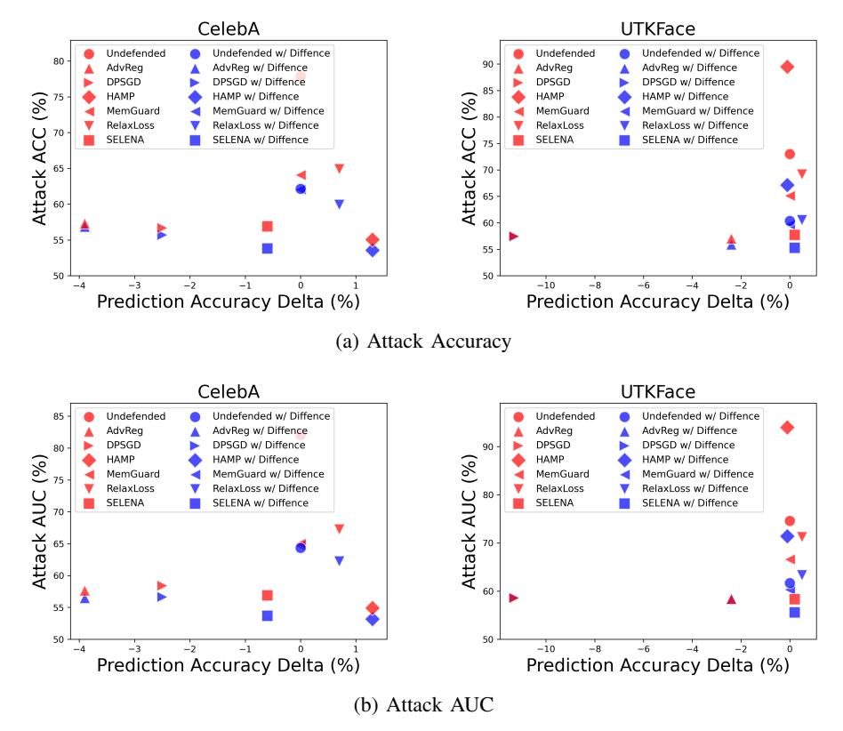

Fig. 8: Attack accuracy and AUC on two high-resolution datasets against ResNet18, where DIFFENCE employs a publicly released diffusion model trained on ImageNet.

TABLE IV: Performance of DIFFENCE on CIFAR-100. Here we directly adopted settings from previous papers.

| Defenses     | Training Accuracy (%) | Test Accuracy (%) | Attack AUC (%) | Attack Accuracy (%) |  |
|--------------|-----------------------------|-------------------------|-------------------|---------------------------|--|
|              |                             | SELENA                  |                   |                           |  |
| Undefended / | 100.0 /                     | 78.4 /                  | 76.2 /            | 74.5 /                    |  |
| +DIFFENCE    | 100.0                       | 78.4                    | 64.8              | 63.0                      |  |
| SELENA /     | 77.3 /                      | 75.0 /                  | 55.5 /            | 55.1 /                    |  |
| +DIFFENCE    | 77.3                        | 75.0                    | 51.8              | 52.7                      |  |
|              |                             | RelaxLoss               |                   |                           |  |
| Undefended / | 67.3 /                      | 34.1 /                  | 72.4 /            | 67.9 /                    |  |
| +DIFFENCE    | 67.3                        | 34.1                    | 69.5              | 67.0                      |  |
| RelaxLoss /  | 52.9 /                      | 36.6 /                  | 59.5 /            | 57.6 /                    |  |
| +DIFFENCE    | 52.9                        | 36.6                    | 59.7              | 57.7                      |  |
|              |                             | HAMP                    |                   |                           |  |
| Undefended / | 91.4 /                      | 58.7 /                  | 70.8 /            | 67.5 /                    |  |
| +DIFFENCE    | 91.4                        | 58.7                    | 67.9              | 66.1                      |  |
| HAMP /       | 78.6 /                      | 55.6 /                  | 67.4 /            | 65.9 /                    |  |
| +DIFFENCE    | 78.6                        | 55.6                    | 64.7              | 61.5                      |  |

seven defenses. The experimental results are shown in Figure [8.](#page-10-2) It can be observed that DIFFENCE effectively enhances membership privacy in all cases without compromising model accuracy. On CelebA, DIFFENCE decreases attack AUC by an average of 6.2% and attack accuracy by 6.0%. On UTKFace, DIFFENCE decreases attack AUC by 9.5% and attack accuracy by 9.9% on average. On CelebA and UTKFace, the combinations of HAMP + DIFFENCE and SELENA + DIFFENCE achieved the best utility-privacy trade-offs, respectively.

We also conducted experiments on three benchmark datasets—CIFAR-10, CIFAR-100, and SVHN-using the same public diffusion model. The results demonstrate that DIFFENCE with the pretrained diffusion model provides effective defense across all three datasets. On average, DIFFENCE reduces the attack AUC by 4.8% and attack accuracy by 5.3%. For more details, please refer to Figure [13](#page-17-0) in the Appendix. Additionally, the reconstructions generated by the diffusion model are nearly identical to the original samples, with only imperceptible visual differences, as shown in Figure [14.](#page-17-1)

#### *C. Ablation study*

As introduced in Section [III,](#page-3-2) DIFFENCE employs a diffusion model to reconstruct samples, protecting the membership privacy of the original samples. We generate multiple samples and select the prediction of the most suitable sample as the final output based on the defense objectives and the information available to the defender. This process involves considering several factors, including the choice of interval, the number of reconstructions N generated for each sample, and the diffusion step T. In this section, we delve further into discussing the impact of the parameters and sample selection strategy.

*1) Sample Selection Strategies:* In Scenario 1, the main idea of DIFFENCE involves setting an interval within which the prediction logits of both members and non-members are

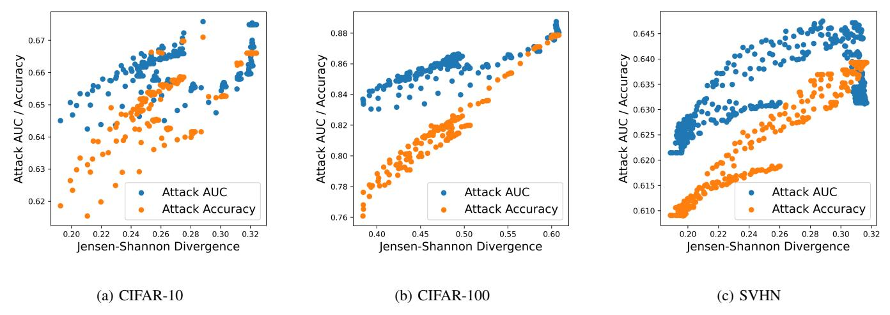

Fig. 9: Attack AUC and accuracy under different levels of Jensen-Shannon (JS) divergence between member and non-member prediction distributions. We tested it on three dataset using ResNet18 and set diffusion steps T = 40 and the number of reconstructions N to 50.

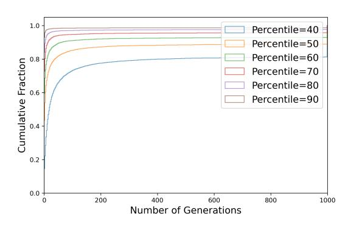

Fig. 10: Cumulative Distribution Function (CDF) of the number of generations required for reconstructions to fall within different intervals when T = 100 on CIFAR-100. The 'percentile' indicates the anticipated probability of reconstructions falling within the given interval, as determined by analyzing the samples available to the defender.

encouraged to fall. This strategy aims to align the prediction distributions of members and non-members towards a range in the middle. It is important to note that DIFFENCE uses a fixed number of reconstructions N and diffusion steps T as the basis for selecting the optimal interval. Given the fixed N, not all samples can fall within the chosen interval. For these outliers, we select the sample that is closest to the interval.

An alternative approach might involve continuously generating reconstructions for each sample after setting the interval, to force their predictions into this range. However, we found this method to be highly inefficient. Figure [10](#page-11-1) illustrates the cumulative distribution of samples falling within various intervals as the number of reconstructions increases. It reveals that if a sample does not fall within the interval in its initial generation, it is unlikely to do so in subsequent iterations. Therefore, continuously generating new samples is not a

practical solution.

In terms of interval selection, we tested various intervals and opted for the one where the JS divergence between members' and non-members' prediction logits is minimized. This approach is predicated on our observation that the JS divergence of prediction logits between member and non-member samples correlates significantly with attack performance. This correlation has also been noted by He et al. [\[16\]](#page-14-14) in their research.

Figure [9](#page-11-2) depicts attack AUC and accuracy on three datasets in relation to the different JS divergence between member and non-member prediction distributions when DIFFENCE is solely applied. Each point in the figure corresponds to a selectable interval, where choosing different intervals results in varying JS divergences. A key observation is the negative correlation between JS divergence and privacy protection – smaller JS divergences typically indicate stronger membership privacy protection. These results substantiate the effectiveness of our interval selection strategy.

*2) Effect of Hyperparameters:* We then varied the values of N and T to observe the changes in defense performance. Note that DIFFENCE does not alter the prediction labels, and therefore, does not impact the model's test accuracy.

An increase in T leads to a more substantial alteration of the original sample, thereby enlarging the divergence between the generated samples and the original ones. A higher N enhances the pool of alternative images, enriching the selection process for our sample selection strategy. This, in turn, mitigates randomness and enables a more consistent selection of suitable replacement samples.

As depicted in Figure [11,](#page-12-0) both the attack AUC and accuracy decrease as T and N increase and a more pronounced decrease is observed with larger T values. However, increasing T and N will also increase the time of sample generation, potentially increasing the latency of inference. This introduces a tradeoff: optimizing the defense's effectiveness versus minimizing

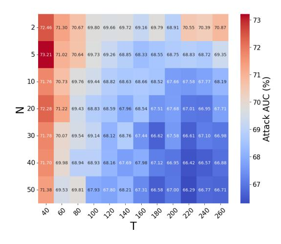

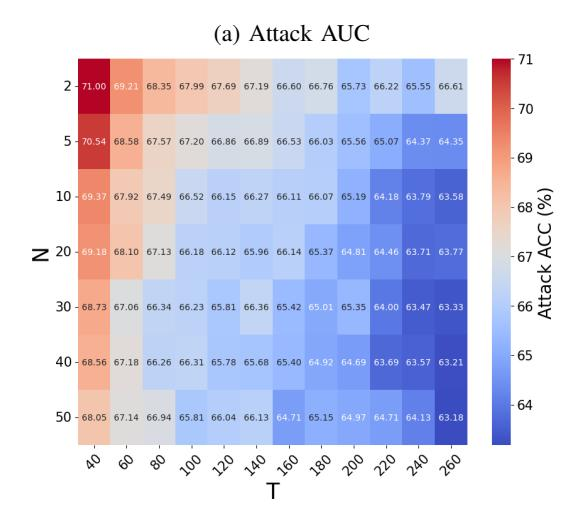

(b) Attack Accuracy

Fig. 11: Attack AUC and attack accuracy against DIFFENCE with different numbers of generated samples N and Diffusion Steps T on average across three datasets. We varies N from 2 to 50 and T from 40 to 260.

inference delay. The balance between improved privacy and reduced latency should be tailored to the requirements of the specific task in practice.

# V. DISCUSSIONS

# *A. Overhead of Different Defenses*

Our experiments include seven defense methods, where HAMP, SELENA, RelaxLoss, AdvReg, and DPSGD are training-phase defenses, and MemGuard and DIFFENCE operate during the inference phase. We evaluated the overhead of these defenses during training and testing based on their deployment phase. The training and inference overhead were measured on a single NVIDIA RTX-8000 GPU with 40GB of memory. Here, we primarily discuss the inference overhead, with Appendix [A-D](#page-15-4) reporting the results on training overhead comparison.

TABLE V: Inference overhead comparison of different defenses.

| Defenses   | CIFAR-10 (ms) | CIFAR-100 (ms) | SVHN (ms) |
|------------|---------------|----------------|-----------|
| Undefended | 26            | 24             | 24        |
| Memguard   | 732           | 612            | 586       |
| DIFFENCE   | 82            | 82             | 81        |

MemGuard generates adversarial noise for each sample's confidence vector to deceive the attacker's model, necessitating the solving of complex optimization problems for each sample. In contrast, DIFFENCE, which involves calculating optimal intervals for samples before inference, is a one-time task that does not add overhead during the inference phase. The primary overhead of DIFFENCE comes from processing the original samples with a diffusion model. To enhance this process, we utilize Denoising Diffusion Implicit Models (DDIM) [\[45\]](#page-14-43), which streamline the diffusion process by providing a means to skip sampling steps and directly estimate the denoised image from noisy observations, significantly reducing computational demands. Table [V](#page-12-1) reports the inference times for the undefended model, MemGuard, and DIFFENCE on three benchmark datasets. We measured the inference overhead by performing inference on 100 random member and nonmember samples and taking the average. As shown in Table [V,](#page-12-1) DIFFENCE outperforms MemGuard in terms of inference phase running time and only adds an average of 57ms to the inference time compared to the undefended model, highlighting DIFFENCE's efficiency and low overhead upon deployment.

#### *B. Pre-training MIA Defenses*

In Section [I,](#page-0-2) we categorized MIA defenses into three classes based on where they kick in during the ML pipeline: training phase defenses, pre-inference defenses, and postinference defenses. One could also consider techniques that work during ML *pre-training* as another class of MIA defense, e.g., techniques like dataset condensation (DC) [\[46\]](#page-14-44). However, we argue that these techniques tend to mitigate MIA more as a side effect than as a primary focus. Furthermore, their effectiveness in defending against MIA has been questioned in recent work [\[47\]](#page-14-45).

Also, one could consider these pre-training techniques as a sub-class of our training phase defenses. In fact, some training stage defenses, such as SELENA and HAMP, already incorporate specifically designed dataset processing. Therefore, we did not make pre-training a separate class of MIA defenses.

# VI. RELATED WORKS

A *membership inference attack* [\[10\]](#page-14-3) aims to determine if a specific sample was in a model's training data, posing risks of sensitive individual information leakage. This section overviews various such attacks and defenses, highlighting their diversity across scenarios.

#### *A. Membership Inference Attacks*

Shokri et al. [\[10\]](#page-14-3) introduced a *black-box* MIA that employs a shadow training technique to train an attack model to differentiate the model's output, categorizing it as either a member or non-member. In a different approach, Salem et al. [\[17\]](#page-14-15) streamlined the process by training only a single shadow model, assuming the attacker lacks access to similar distribution data as the training dataset, yet still achieving notable effectiveness. Expanding on these concepts, Nasr et al. [\[48\]](#page-15-5) presented a *white-box* MIA targeting ML models. For each data sample, they computed the corresponding gradients over the parameters of the white-box target classifier, utilized as features of the data sample for membership inference.

Choquette-Choo et al. [\[20\]](#page-14-18) developed a *label-only* MIA concept, where the target model reveals only the predicted label. Their attack's efficacy relies on the model's increased resilience to perturbations like augmentations and noise in the training data. Complementing this, Li et al. [\[21\]](#page-14-19) presented two specific label-only MIAs: the *transfer-based* MIA and the *perturbation-based* MIA. Remarkably, these label-only attacks achieve a balanced accuracy on par with that of the shadowmodel strategies.

Song [\[19\]](#page-14-17) employs a *modified entropy* measure, using shadow models to approximate the distributions of entropy values for members and non-members across each class. Essentially, the attacker conducts a hypothesis test between the distributions of (per-class) members and non-members, given a model f and a target sample (x, y). Yeom et al. [\[18\]](#page-14-16) proposed a *loss-based* membership inference attack, leveraging the tendency of machine learning models to minimize training loss. This attack identifies training examples by observing lower loss values. Carlini et al. [\[39\]](#page-14-37) forged ahead with the development of a *Likelihood Ratio-based* attack (LiRA). This attack has demonstrated success in outperforming previous attacks, especially at low False Positive Rates. In the LiRA approach, an attacker trains N shadow models using samples from distribution D. Half include the target point (x, y), and half do not. Two Gaussian fits are applied to these model confidences. The membership inference is then deduced for (x, y) in the target model using a Likelihood-ratio test based on these fits.

## *B. Existing Defenses*

Initial research on defenses against MIA showed that certain *regularization* techniques, like dropout [\[49\]](#page-15-6), can curb overfitting, resulting in modest privacy enhancements in neural networks [\[10\]](#page-14-3). Another method, *early stopping* [\[50\]](#page-15-7), also serves to prevent model overfitting, potentially reducing MIA accuracy, albeit at the cost of compromising model utility.

Several studies have proposed defenses during the training phase. Nasr et al. [\[1\]](#page-13-0) proposed an *adversarial regularization* technique, a min-max game-based training algorithm aiming to reduce training loss and increase MIA loss. Shejwalkar [\[51\]](#page-15-8) introduced a defense against MIAs through *knowledge distillation*, transferring knowledge from an undefended private-datasettrained model to another using a public dataset. Tang et al. [\[4\]](#page-14-8) proposed a knowledge distillation-based defense balancing privacy and utility. They partitioned the training dataset into K subsets, trained K sub-models on each, and used these to train

a separate public model with scores from non-training samples. Chen [\[5\]](#page-14-9) developed *RelaxLoss*, a training scheme balancing privacy and utility by minimizing loss distribution disparities to reduce membership privacy risks.

Some other defenses are applied separately from the training phase. Jia et al. [\[2\]](#page-14-6) proposed *MemGuard*, a method that operates in two stages. It first crafts a noise vector to transform confidence scores into adversarial examples under utility-loss constraints. Then, it integrates this noise into the confidence score vector based on a derived analytical probability. Chen [\[6\]](#page-14-10) introduced *HAMP*, a defense mechanism encompassing both training and test-time defenses. Its training component aims to lower model confidence on training samples, countering the overconfidence induced by hard labels in standard training.

*Differential privacy (DP)* [\[52\]](#page-15-9), [\[53\]](#page-15-10) is a prominent method extensively employed to offer theoretical privacy guarantees in ML models. Within this framework, noise can be introduced to both the objective function [\[54\]](#page-15-11) and gradients [\[3\]](#page-14-7), [\[55\]](#page-15-12). While DP provides robust privacy assurances, it has been observed to significantly compromise utility [\[1\]](#page-13-0).

# VII. CONCLUSION

In this work, we introduced DIFFENCE, a novel defense method that addresses the challenge of membership inference attacks (MIAs) in machine learning (ML). DIFFENCE effectively diminishes the distinction in prediction behaviors between members and non-members through input reconstruction using diffusion models. By generating multiple reconstructions and selectively utilizing predictions based on defined criteria, DIFFENCE significantly narrows the prediction distribution gaps exploited in MIAs.

We categorized defenses into three deployment phases and, for the first time, proposed integrating different defenses to enhance overall protection. DIFFENCE can be cascaded in a plug-and-play manner with other defenses. Although our strategy requires the use of a diffusion model, it does not necessarily require the diffusion model to be specifically trained for defense; instead, off-the-shelf diffusion models can be used—even those trained on datasets different from the target model's training dataset—thereby demonstrating considerable flexibility and effectiveness. By combining DIFFENCE with others, we effectively address both the train-to-test accuracy gap and the prediction distribution gap. Our extensive experiments across multiple datasets have validated DIFFENCE 's efficacy in enhancing membership privacy without sacrificing model utility—preserving both accuracy and the meaningfulness of confidence vectors.

## ACKNOWLEDGEMENTS

The work was supported in part by the NSF grant 2131910, and by DARPA under Grant DARPA-RA-21-03-09-YFA9-FP-003.

# REFERENCES

[1] M. Nasr, R. Shokri, and A. Houmansadr, "Machine learning with membership privacy using adversarial regularization," in *Proceedings of the 2018 ACM SIGSAC conference on computer and communications security*, 2018, pp. 634–646.

- [2] J. Jia, A. Salem, M. Backes, Y. Zhang, and N. Z. Gong, "Memguard: Defending against black-box membership inference attacks via adversarial examples," in *Proceedings of the 2019 ACM SIGSAC conference on computer and communications security*, 2019, pp. 259–274.
- [3] M. Abadi, A. Chu, I. Goodfellow, H. B. McMahan, I. Mironov, K. Talwar, and L. Zhang, "Deep learning with differential privacy," in *Proceedings of the 2016 ACM SIGSAC conference on computer and communications security*, 2016, pp. 308–318.
- [4] X. Tang, S. Mahloujifar, L. Song, V. Shejwalkar, M. Nasr, A. Houmansadr, and P. Mittal, "Mitigating membership inference attacks by {Self-Distillation} through a novel ensemble architecture," in *31st USENIX Security Symposium (USENIX Security 22)*, 2022, pp. 1433–1450.
- [5] D. Chen, N. Yu, and M. Fritz, "Relaxloss: Defending membership inference attacks without losing utility," *arXiv preprint arXiv:2207.05801*, 2022.
- [6] Z. Chen and K. Pattabiraman, "Overconfidence is a dangerous thing: Mitigating membership inference attacks by enforcing less confident prediction," *arXiv preprint arXiv:2307.01610*, 2023.
- [7] N. Carlini, C. Liu, U. Erlingsson, J. Kos, and D. Song, "The secret sharer: ´ Evaluating and testing unintended memorization in neural networks," pp. 267–284, 2019.
- [8] C. Song, T. Ristenpart, and V. Shmatikov, "Machine learning models that remember too much," in *Proceedings of the 2017 ACM SIGSAC Conference on Computer and Communications Security (CCS 17)*, 2017, p. 587–601.
- [9] K. Leino and M. Fredrikson, "Stolen memories: Leveraging model memorization for calibrated white-box membership inference," in *29th USENIX Security Symposium (USENIX Security 20)*, 2020, pp. 1605– 1622.
- [10] R. Shokri, M. Stronati, C. Song, and V. Shmatikov, "Membership inference attacks against machine learning models," in *2017 IEEE symposium on security and privacy (SP)*. IEEE, 2017, pp. 3–18.
- [11] Y. Gurovich, Y. Hanani, O. Bar, G. Nadav, N. Fleischer, D. Gelbman, L. Basel-Salmon, P. M. Krawitz, S. B. Kamphausen, M. Zenker *et al.*, "Identifying facial phenotypes of genetic disorders using deep learning," *Nature medicine*, vol. 25, no. 1, pp. 60–64, 2019.
- [12] B. J. Erickson, P. Korfiatis, Z. Akkus, and T. L. Kline, "Machine learning for medical imaging," *radiographics*, vol. 37, no. 2, pp. 505–515, 2017.
- [13] I. Goodfellow, J. Pouget-Abadie, M. Mirza, B. Xu, D. Warde-Farley, S. Ozair, A. Courville, and Y. Bengio, "Generative adversarial nets," *Advances in neural information processing systems*, vol. 27, 2014.
- [14] P. Dhariwal and A. Nichol, "Diffusion models beat gans on image synthesis," *Advances in neural information processing systems*, vol. 34, pp. 8780–8794, 2021.
- [15] W. Nie, B. Guo, Y. Huang, C. Xiao, A. Vahdat, and A. Anandkumar, "Diffusion models for adversarial purification," in *International Conference on Machine Learning, ICML 2022, 17-23 July 2022, Baltimore, Maryland, USA*, ser. Proceedings of Machine Learning Research, vol. 162. PMLR, 2022, pp. 16 805–16 827.
- [16] X. He, Z. Li, W. Xu, C. Cornelius, and Y. Zhang, "Membership-doctor: Comprehensive assessment of membership inference against machine learning models," 2022.
- [17] A. Salem, Y. Zhang, M. Humbert, P. Berrang, M. Fritz, and M. Backes, "Ml-leaks: Model and data independent membership inference attacks and defenses on machine learning models," *arXiv preprint arXiv:1806.01246*, 2018.
- [18] S. Yeom, I. Giacomelli, M. Fredrikson, and S. Jha, "Privacy risk in machine learning: Analyzing the connection to overfitting," in *2018 IEEE 31st computer security foundations symposium (CSF)*. IEEE, 2018, pp. 268–282.
- [19] L. Song and P. Mittal, "Systematic evaluation of privacy risks of machine learning models," in *30th USENIX Security Symposium (USENIX Security 21)*, 2021, pp. 2615–2632.
- [20] C. A. Choquette-Choo, F. Tramer, N. Carlini, and N. Papernot, "Labelonly membership inference attacks," in *International conference on machine learning*. PMLR, 2021, pp. 1964–1974.
- [21] Z. Li and Y. Zhang, "Membership leakage in label-only exposures," in *Proceedings of the 2021 ACM SIGSAC Conference on Computer and Communications Security*, 2021, pp. 880–895.
- [22] J. Ho, A. Jain, and P. Abbeel, "Denoising diffusion probabilistic models," *Advances in neural information processing systems*, vol. 33, pp. 6840– 6851, 2020.
- [23] A. Krizhevsky, G. Hinton *et al.*, "Learning multiple layers of features from tiny images," 2009.

- [24] Y. Netzer, T. Wang, A. Coates, A. Bissacco, B. Wu, and A. Y. Ng, "Reading digits in natural images with unsupervised feature learning," 2011.
- [25] Z. Liu, P. Luo, X. Wang, and X. Tang, "Deep learning face attributes in the wild," in *Proceedings of the IEEE international conference on computer vision*, 2015, pp. 3730–3738.
- [26] Z. Zhang, Y. Song, and H. Qi, "Age progression/regression by conditional adversarial autoencoder," in *Proceedings of the IEEE conference on computer vision and pattern recognition*, 2017, pp. 5810–5818.
- [27] K. He, X. Zhang, S. Ren, and J. Sun, "Deep residual learning for image recognition," in *Proceedings of the IEEE conference on computer vision and pattern recognition*, 2016, pp. 770–778.
- [28] G. Huang, Z. Liu, L. Van Der Maaten, and K. Q. Weinberger, "Densely connected convolutional networks," in *Proceedings of the IEEE conference on computer vision and pattern recognition*, 2017, pp. 4700–4708.
- [29] K. Simonyan and A. Zisserman, "Very deep convolutional networks for large-scale image recognition," *arXiv preprint arXiv:1409.1556*, 2014.
- [30] A. Dosovitskiy, L. Beyer, A. Kolesnikov, D. Weissenborn, X. Zhai, T. Unterthiner, M. Dehghani, M. Minderer, G. Heigold, S. Gelly *et al.*, "An image is worth 16x16 words: Transformers for image recognition at scale," in *International Conference on Learning Representations*, 2021.
- [31] M. P. Naeini, G. Cooper, and M. Hauskrecht, "Obtaining well calibrated probabilities using bayesian binning," in *Proceedings of the AAAI conference on artificial intelligence*, vol. 29, no. 1, 2015.
- [32] C. Guo, G. Pleiss, Y. Sun, and K. Q. Weinberger, "On calibration of modern neural networks," in *International conference on machine learning*. PMLR, 2017, pp. 1321–1330.
- [33] D. P. Kingma and M. Welling, "Auto-encoding variational bayes," *arXiv preprint arXiv:1312.6114*, 2013.
- [34] A. Brock, J. Donahue, and K. Simonyan, "Large scale gan training for high fidelity natural image synthesis," *arXiv preprint arXiv:1809.11096*, 2018.
- [35] T. Karras, S. Laine, M. Aittala, J. Hellsten, J. Lehtinen, and T. Aila, "Analyzing and improving the image quality of stylegan," in *Proceedings of the IEEE/CVF conference on computer vision and pattern recognition*, 2020, pp. 8110–8119.
- [36] D. P. Kingma and P. Dhariwal, "Glow: Generative flow with invertible 1x1 convolutions," *Advances in neural information processing systems*, vol. 31, 2018.
- [37] A. Vahdat and J. Kautz, "Nvae: A deep hierarchical variational autoencoder," *Advances in neural information processing systems*, vol. 33, pp. 19 667–19 679, 2020.
- [38] J. Sohl-Dickstein, E. Weiss, N. Maheswaranathan, and S. Ganguli, "Deep unsupervised learning using nonequilibrium thermodynamics," in *International conference on machine learning*. PMLR, 2015, pp. 2256– 2265.
- [39] N. Carlini, S. Chien, M. Nasr, S. Song, A. Terzis, and F. Tramer, "Membership inference attacks from first principles," in *2022 IEEE Symposium on Security and Privacy (SP)*. IEEE, 2022, pp. 1897–1914.
- [40] K. Kreis, R. Gao, and A. Vahdat, "Tutorial on denoising diffusion-based generative modeling: Foundations and applications," in *CVPR*, 2022.
- [41] X. Yang, D. Zhou, J. Feng, and X. Wang, "Diffusion probabilistic model made slim," in *Proceedings of the IEEE/CVF Conference on computer vision and pattern recognition*, 2023, pp. 22 552–22 562.
- [42] J. Lin, "Divergence measures based on the shannon entropy," *IEEE Transactions on Information theory*, vol. 37, no. 1, pp. 145–151, 1991.
- [43] Y. Liu, R. Wen, X. He, A. Salem, Z. Zhang, M. Backes, E. De Cristofaro, M. Fritz, and Y. Zhang, "{ML-Doctor}: Holistic risk assessment of inference attacks against machine learning models," in *31st USENIX Security Symposium (USENIX Security 22)*, 2022, pp. 4525–4542.
- [44] X. Wang, H. Liu, C. Shi, and C. Yang, "Be confident! towards trustworthy graph neural networks via confidence calibration," in *Advances in Neural Information Processing Systems*, M. Ranzato, A. Beygelzimer, Y. Dauphin, P. Liang, and J. W. Vaughan, Eds., vol. 34. Curran Associates, Inc., 2021, pp. 23 768–23 779.
- [45] J. Song, C. Meng, and S. Ermon, "Denoising diffusion implicit models," in *International Conference on Learning Representations*, 2021.
- [46] T. Dong, B. Zhao, and L. Lyu, "Privacy for free: How does dataset condensation help privacy?" in *International Conference on Machine Learning*. PMLR, 2022, pp. 5378–5396.
- [47] N. Carlini, V. Feldman, and M. Nasr, "No free lunch in" privacy for free: How does dataset condensation help privacy"," *arXiv preprint arXiv:2209.14987*, 2022.

- [48] M. Nasr, R. Shokri, and A. Houmansadr, "Comprehensive privacy analysis of deep learning: Passive and active white-box inference attacks against centralized and federated learning," in *2019 IEEE symposium on security and privacy (SP)*. IEEE, 2019, pp. 739–753.
- [49] N. Srivastava, G. Hinton, A. Krizhevsky, I. Sutskever, and R. Salakhutdinov, "Dropout: a simple way to prevent neural networks from overfitting," *The journal of machine learning research*, vol. 15, no. 1, pp. 1929–1958, 2014.
- [50] R. Caruana, S. Lawrence, and C. Giles, "Overfitting in neural nets: Backpropagation, conjugate gradient, and early stopping," *Advances in neural information processing systems*, vol. 13, 2000.
- [51] V. Shejwalkar and A. Houmansadr, "Membership privacy for machine learning models through knowledge transfer," in *Proceedings of the AAAI conference on artificial intelligence*, vol. 35, no. 11, 2021, pp. 9549–9557.
- [52] C. Dwork, "Differential privacy," in *International colloquium on automata, languages, and programming*. Springer, 2006, pp. 1–12.
- [53] C. Dwork, F. McSherry, K. Nissim, and A. Smith, "Calibrating noise to sensitivity in private data analysis," in *Theory of Cryptography: Third Theory of Cryptography Conference, TCC 2006, New York, NY, USA, March 4-7, 2006. Proceedings 3*. Springer, 2006, pp. 265–284.
- [54] R. Iyengar, J. P. Near, D. Song, O. Thakkar, A. Thakurta, and L. Wang, "Towards practical differentially private convex optimization," in *2019 IEEE Symposium on Security and Privacy (SP)*. IEEE, 2019, pp. 299– 316.
- [55] S. Song, K. Chaudhuri, and A. D. Sarwate, "Stochastic gradient descent with differentially private updates," in *2013 IEEE global conference on signal and information processing*. IEEE, 2013, pp. 245–248.

# APPENDIX A APPENDIX

# *A. Experimental Results on Different Model Architectures*

This section presents our additional experimental results on different model architectures, including DenseNet121 [\[28\]](#page-14-26), VGG16 [\[29\]](#page-14-27), and ViT [\[30\]](#page-14-28) [1](#page-15-13) . The results are illustrated in Figure [12.](#page-16-0) Consistent with our findings on ResNet18, DIFFENCE effectively reduces both attack accuracy and attack AUC without impacting model accuracy. For example, DIFFENCE reduces the attack AUC on average by 5.3% and the attack accuracy by 4.6% on average on the VGG16 model. On the ViT model, DIFFENCE achieves reductions of 7.7% in attack AUC and 6.6% in attack accuracy on average. Additionally, it can be observed that combining DIFFENCE with recent defenses such as SELENA and HAMP achieves the best privacy-utility trade-off.

#### *B. Impact of* DIFFENCE *on label-only MIAs*

In this section, we discuss the impact of DIFFENCE on label-only MIAs [\[20\]](#page-14-18), [\[21\]](#page-14-19) and defenses. Both DIFFENCE and label-only attacks rely on perturbations to the original images. Intuitively, DIFFENCE modifies the input only after the target model f has assigned a label to the noised inputs x ′ created by the label-only attack. This process alters the output confidence score without changing the predicted label f(x ′ ). Therefore, the target model with or without DIFFENCE responds the same to label-only attack queries. Consequently, DIFFENCE has no impact on label-only MIAs or defenses against them.

We used two types of label-only MIAs: the baseline gap attack [\[18\]](#page-14-16) and the state-of-the-art boundary attack [\[21\]](#page-14-19), [\[20\]](#page-14-18) to test the impact of DIFFENCE. As shown in Table [VI,](#page-16-1) as

1ViT contains layers that are incompatible with the DPSGD implementation in the Opacus library, so we omitted DPSGD from the experiments on ViT.

expected, DIFFENCE has no effect on the performance of labelonly attacks and defenses against them. In all settings, the results with and without DIFFENCE were nearly identical.

# *C. Defending with Stronger Diffusion Models*

In our previous experiments, we assumed that the training set size of the defender's diffusion model and the size of the classifier's training set are the same. Furthermore, to ensure no decrease in model accuracy, we only select reconstructed samples that match the original sample labels.

Interestingly, however, we discovered that when a stronger diffusion model is employed in the defense—specifically, a model trained on a dataset larger than that of the classifier, directly averaging the predictions of all generated samples can enhance both the classifier's privacy and its accuracy.

We utilized a publicly available diffusion model trained on 50,000 samples from CIFAR-10 to defend our classifiers, which were trained on 25,000 samples. The results, as shown in the Table [VII,](#page-17-2) indicate that in all cases, the classifiers not only achieved enhanced privacy but also exhibited higher test accuracy. Given that diffusion model training does not require labeled data, it can be performed on a large, public, unlabeled dataset. We leave a more detailed discussion on how diffusion models can improve classifiers' accuracy for future work.

# *D. Comparison of Defense Training Overhead*

In addition to the inference overhead discussed in Section [V-A,](#page-12-2) we also report the overhead of training-phase defenses during the training stage. The results are shown in Table [VIII.](#page-17-3)

# *E. Additional Experimental Details*

For all attacks, we randomly selected 2000 members and 2000 non-members as target samples to perform MIAs. For NN-based attacks, we used the same attack model architecture and training configuration as in previous work [\[6\]](#page-14-10), saving training checkpoints and using the attack model that achieved the highest attack AUC on the target samples.

For defenses, HAMP [\[6\]](#page-14-10) uses an entropy threshold γ and a regularizer parameter α, while RelaxLoss [\[5\]](#page-14-9) uses α to balance utility and privacy. However, automated parameter selection is not provided. Following their papers, we used grid search to train multiple models with different parameters and selected the models based on their claimed impact on utility. HAMP includes both training-phase regularization and testing-time output modification (retaining predicted labels while randomizing confidence scores). In our experiments, we included only the training-phase defense of HAMP because its testing-time output modification renders the confidence scores meaningless, as the generated confidence scores are entirely derived from randomly generated images. Adversarial regularization [\[1\]](#page-13-0) uses the α parameter to balance model accuracy and privacy protection. We set α to 6 for CIFAR-10, CIFAR-100, and SVHN, and 4 for CelebA and UTKFace. For DP-SGD [\[3\]](#page-14-7), we used PyTorch Opacus [2](#page-15-14) to train the DP-SGD model, fixing a norm clipping bound of 1.2 and setting a

2<https://github.com/pytorch/opacus>

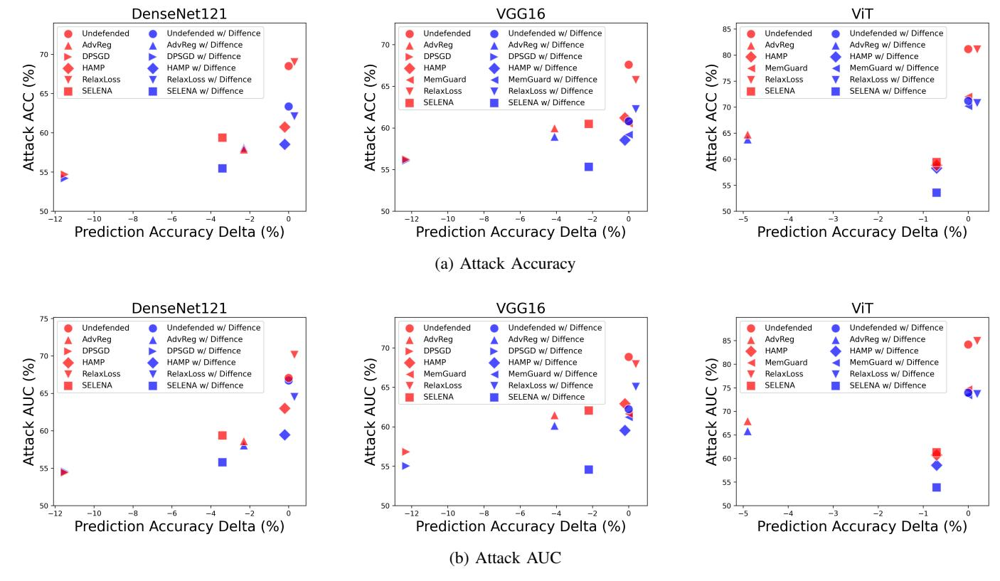

Fig. 12: Attack accuracy and AUC on CIFAR-10 against three models with three different architectures. We report the highest attack accuracy and attack AUC across all attacks. The prediction accuracy delta indicates the prediction accuracy gap compared to the undefended models, with negative numbers indicating a decrease in model accuracy.

TABLE VI: Comparison of Label-only MIAs against ResNet18 w/o and w/ DIFFENCE.

| Defenses   | Gap Attack                   |                             | Boundary Attack         |                              |                        |                             |  |
|------------|------------------------------|-----------------------------|-------------------------|------------------------------|------------------------|-----------------------------|--|
|            | Accuracy w/o DIFFENCE (%) | Accuracy w/ DIFFENCE (%) | AUC w/o DIFFENCE (%) | Accuracy w/o DIFFENCE (%) | AUC w/ DIFFENCE (%) | Accuracy w/ DIFFENCE (%) |  |
| Undefended | 58.5                         | 58.5                        | 70.8                    | 69.5                         | 70.9                   | 69.3                        |  |
| SELENA     | 52.9                         | 52.9                        | 59.7                    | 58.9                         | 59.7                   | 59.4                        |  |
| AdvReg     | 57.6                         | 57.6                        | 61.7                    | 59.7                         | 60.9                   | 59.4                        |  |
| HAMP       | 58.6                         | 58.6                        | 69.5                    | 66.8                         | 69.5                   | 67.3                        |  |
| RelaxLoss  | 58.2                         | 58.2                        | 67.6                    | 66.3                         | 67.7                   | 66.4                        |  |
| DPSGD      | 54.6                         | 54.6                        | 57.3                    | 56.5                         | 57.7                   | 57.1                        |  |
| MemGuard   | 58.5                         | 58.5                        | 70.8                    | 69.5                         | 70.9                   | 69.3                        |  |

noise multiplier of 0.1 for CIFAR-10, 0.05 for CIFAR-100 and SVHN, and 0.01 for CelebA and UTKFace. For SELENA [\[4\]](#page-14-8), we followed the original paper' settings with K = 25 and L = 10, where K is the total number of teacher models and L is the number of teacher models whose training sets do not contain a given member sample.

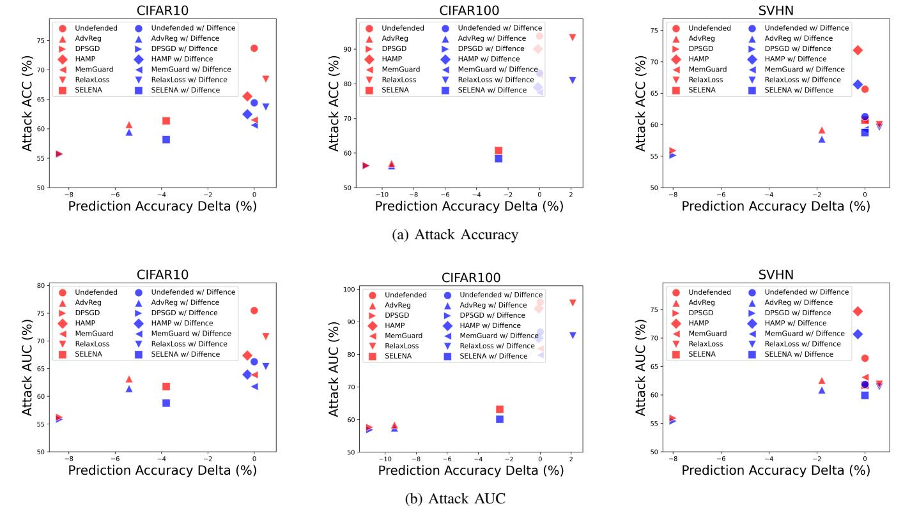

Fig. 13: Attack accuracy and AUC on three datasets against ResNet18, where DIFFENCE employs a publicly released diffusion model trained on ImageNet.

TABLE VII: Performance of DIFFENCE on CIFAR-10 when using a stronger diffusion model.

| Defenses     | Test Accuracy (%) | Attack Accuracy (%) | Attack AUC (%) |  |
|--------------|-------------------------|---------------------------|-------------------|--|
| Undefended / | 81.4 /                  | 73.0 /                    | 75.9 /            |  |
| +DIFFENCE    | 83.2                    | 66.2                      | 69.3              |  |
| AdvReg /     | 78.4 /                  | 60.3 /                    | 61.0 /            |  |
| +DIFFENCE    | 80.3                    | 57.5                      | 58.2              |  |
| DPSGD /      | 74.7 /                  | 55.3 /                    | 55.3 /            |  |
| +DIFFENCE    | 75.7                    | 54.4                      | 54.5              |  |
| SELENA /     | 79.2 /                  | 60.4 /                    | 60.1 /            |  |
| +DIFFENCE    | 79.8                    | 57.2                      | 57.0              |  |
| RelaxLoss /  | 81.2 /                  | 65.1 /                    | 69.5 /            |  |
| +DIFFENCE    | 82.1                    | 61.5                      | 63.7              |  |
| HAMP /       | 81.1 /                  | 65.2 /                    | 69.4 /            |  |
| +DIFFENCE    | 82.7                    | 62.5                      | 62.2              |  |

TABLE VIII: Training overhead comparison of different defenses.

| Defenses   | CIFAR-10 (h) | CIFAR-100 (h) | SVHN (h) |
|------------|--------------|---------------|----------|
| Undefended | 0.6          | 0.6           | 0.4      |
| SELENA     | 10.9         | 11.9          | 9.3      |
| AdvReg     | 10.9         | 12.6          | 6.8      |
| HAMP       | 0.8          | 0.8           | 0.5      |
| RelaxLoss  | 0.5          | 0.6           | 0.4      |
| DP-SGD     | 0.8          | 0.9           | 0.6      |

Fig. 14: Examples of original samples and their reconstructions on CIFAR-10, with reconstructions generated by a diffusion model pretrained on ImageNet.