# Finding NeMo : Localizing Neurons Responsible For Memorization in Diffusion Models

Dominik Hintersdorf <sup>∗</sup>1,<sup>2</sup> Lukas Struppek<sup>∗</sup> <sup>1</sup>,<sup>2</sup> Kristian Kersting1,2,3,<sup>4</sup> Adam Dziedzic<sup>5</sup> Franziska Boenisch<sup>5</sup> German Research Center for Artificial Intelligence (DFKI) Computer Science Department, Technical University of Darmstadt Hessian Center for AI (Hessian.AI) Centre for Cognitive Science, Technical University of Darmstadt CISPA Helmholtz Center for Information Security

# Abstract

Diffusion models (DMs) produce very detailed and high-quality images. Their power results from extensive training on large amounts of data—usually scraped from the internet without proper attribution or consent from content creators. Unfortunately, this practice raises privacy and intellectual property concerns, as DMs can memorize and later reproduce their potentially sensitive or copyrighted training images at inference time. Prior efforts prevent this issue by either changing the input to the diffusion process, thereby preventing the DM from generating memorized samples during inference, or removing the memorized data from training altogether. While those are viable solutions when the DM is developed and deployed in a secure and constantly monitored environment, they hold the risk of adversaries circumventing the safeguards and are not effective when the DM itself is publicly released. To solve the problem, we introduce NEMO, the first method to localize memorization of individual data samples down to the level of neurons in DMs' cross-attention layers. Through our experiments, we make the intriguing finding that in many cases, *single neurons* are responsible for memorizing particular training samples. By deactivating these *memorization neurons*, we can avoid the replication of training data at inference time, increase the diversity in the generated outputs, and mitigate the leakage of private and copyrighted data. In this way, our NEMO contributes to a more responsible deployment of DMs.

# 1 Introduction

In recent years, diffusion models (DMs) have made remarkable advances in image generation. In particular, text-to-image DMs, such as Stable Diffusion [\[32\]](#page-12-0), DALL-E [\[30\]](#page-11-0), or Deep Floyd [\[38\]](#page-12-1) enable the generation of complex images given a textual input prompt. Yet, DMs carry a significant risk to privacy and intellectual property, as the models have been shown to generate verbatim copies of their potentially sensitive or copyrighted training data at inference time [\[8,](#page-10-0) [36\]](#page-12-2). This ability has often been linked to their *memorization* of training data [\[48,](#page-13-0) [12,](#page-10-1) [1,](#page-10-2) [5\]](#page-10-3). Memorization in DMs recently received a lot of attention [\[16,](#page-10-4) [47,](#page-13-1) [49,](#page-13-2) [8\]](#page-10-0), and several mitigations have been proposed [\[46,](#page-12-3) [31,](#page-11-1) [36\]](#page-12-2). Those mitigations usually focus on either identifying potentially highly memorized samples and excluding them from training, monitoring inference and preventing their generation, or altering the inputs to prevent the verbatim output of training data [\[31,](#page-11-1) [36,](#page-12-2) [46\]](#page-12-3). While mitigations that rely on preventing the generation of memorized samples are effective when the DM is developed and deployed in a secure

<sup>∗</sup> equal contribution, corresponding authors: {hintersdorf, struppek}@cs.tu-darmstadt.de Code: [https://github.com/ml-research/localizing\\_memorization\\_in\\_diffusion\\_models](https://github.com/ml-research/localizing_memorization_in_diffusion_models)

<span id="page-1-0"></span>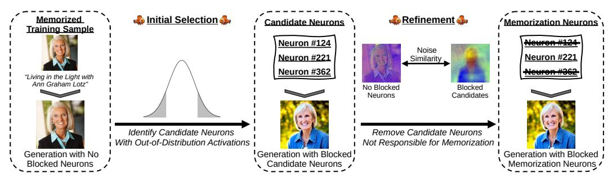

Figure 1: Overview of NeMo. For memorized prompts, we observe that the same (original training) image is constantly generated independently of the initial random seed. This yields severe privacy and copyright concerns. In the *initial stage*, NEMO first identifies candidate neurons potentially responsible for the memorization based on out-of-distribution activations. In a *refinement* step, NEMO detects the *memorization neurons* from the candidate set by leveraging the noise similarities during the first denoising step. Deactivating memorization neurons prevents unintended memorization behavior and induces diversity in the generated images.

environment, they hold the inherent risk of adversaries circumventing them. Additionally, they are not effective when the DMs are publicly released, such that users can freely interact with them.

As a first step to solving this problem, we propose FINDING NEURON MEMORIZATION (NEMO), a new method for localizing where individual data samples are memorized inside the DMs. NEMO's localization tracks the memorization of training data samples down to the level of individual neurons in the DMs' cross-attention layers. To achieve this, NEMO relies on analyzing the different activation patterns of individual neurons on memorized and non-memorized data samples and identifying memorization neurons by outlier activation detection (as visualized in Fig. [2b\)](#page-3-0). We empirically assess the success of NEMO on the publicly available DM Stable Diffusion [\[32\]](#page-12-0). Our findings indicate that most memorization happens in the value mappings of the cross-attention layers of DMs. Furthermore, they highlight that most training data samples are memorized by *just a few or even a single neuron*, which is surprising given the high resolution and complexity of the training data.

Based on the insights about where within the DMs individual data samples are memorized, we can prevent their verbatim output by deactivating the identified memorization neuron(s). We demonstrate the effect of NEMO in Fig. [1.](#page-1-0) Without our approach, the image generated for the memorized input prompt is the same, independent of the random seed for generation. By localizing the neuron responsible for the memorization through NEMO and deactivating it, we prevent the verbatim output of the training data and instead cause the generation of various non-memorized related samples. Hence, by relying on NEMO to localize and deactivate memorization neurons, we can limit memorization, which mitigates the privacy and copyright issues while keeping the overall performance intact.

In summary, we make the following contributions:

- We propose NEMO, the first method to localize where memorization happens within DMs down to the level of individual neurons.
- Our extensive empirical evaluation of localizing memorization within Stable Diffusion reveals that few or even single neurons are responsible for the memorization.
- We limit the memorization in DMs by deactivating the highly memorizing neurons and further show that this leads to a higher diversity in the generated outputs.

# 2 Background and Related Work

### <span id="page-1-1"></span>2.1 Text-to-Image Synthesis with Diffusion Models

Diffusion models (DMs) [\[37,](#page-12-4) [19\]](#page-11-2) are generative models trained by progressively adding random Gaussian noise to training images and having the model learn to predict the added noise. After the training is finished, new samples can be generated by sampling an initial noise image x<sup>T</sup> ∼ N (0, I) and then iteratively removing portions of the predicted noise ϵθ(xt, t, y) at each time step t = T, . . . , 1. This denoising process is formally defined by

$$x_{t-1} = \frac{1}{\sqrt{\alpha_t}} \left( x_t - \frac{1 - \alpha_t}{\sqrt{1 - \bar{\alpha}_t}} \epsilon_{\theta}(x_t, t, y) \right), \tag{1}$$

with variance scheduler β<sup>t</sup> ∈ (0, 1), α<sup>t</sup> = 1 − β<sup>t</sup> and α¯<sup>t</sup> = Q<sup>t</sup> <sup>i</sup>=1 αt. The noise predictor ϵθ(xt, t, y), usually a U-Net [\[33\]](#page-12-5), receives an additional input y for conditional image generation.

Common text-to-image DMs [\[32,](#page-12-0) [30,](#page-11-0) [34\]](#page-12-6) are conditioned on text embeddings y computed by pretrained text encoders like CLIP [\[29\]](#page-11-3). The typical way to incorporate the conditioning y into the denoising process is the cross-attention mechanism [\[41\]](#page-12-7). (Cross-)Attention consists of three main components: query matrices Q = ztWQ, key matrices K = yWK, and value matrices V = yW<sup>V</sup> . All three matrices are computed by applying learned linear projections WQ, WK, and W<sup>V</sup> to the hidden image representation z<sup>t</sup> and the text embeddings y. The attention outputs are computed by

$$\operatorname{Attention}(Q, K, V) = \operatorname{softmax}\left(\frac{QK^T}{\sqrt{d}}\right) \cdot V \,, \tag{2}$$

with scaling factor d. Importantly, in most text-to-image models, the noise predictor receives guidance only through the cross-attention layers, which renders them particularly relevant for memorization.

#### 2.2 Memorization in Deep Learning

Memorization. Memorization was extensively studied in supervised models and with respect to data labels [\[48,](#page-13-0) [1,](#page-10-2) [9\]](#page-10-5). Recently, studies have been extended to unlabeled self-supervised learning [\[25,](#page-11-4) [43\]](#page-12-8). In both setups, it was shown that memorization is required for generalization [\[12,](#page-10-1) [13,](#page-10-6) [43\]](#page-12-8). However, memorization also yields privacy risks [\[4,](#page-10-7) [7,](#page-10-8) [14,](#page-10-9) [40\]](#page-12-9) since it can expose sensitive training data. In particular for generative models, including DMs, it was shown that memorization enables the extraction of training data points [\[4–](#page-10-7)[6,](#page-10-10) [8,](#page-10-0) [36\]](#page-12-2).

Localizing Memorization. Early work on localizing where inside machine learning (ML) models memorization happens focuses on small neural networks. Initial findings suggested that in supervised models, memorization happens in the deeper layers [\[2,](#page-10-11) [39\]](#page-12-10). However, more fine-grained analyses contradict these findings and identify that individual units, *i.e.,* individual neurons or convolutional channels throughout the entire model, are responsible for memorization [\[24\]](#page-11-5). To identify these, Maini et al. [\[24\]](#page-11-5) deactivate units throughout the network until a label flip on the memorized training input image occurs. However, due to the unavailability of labels, this approach does not transfer to DMs.

Memorization in Diffusion Models. Recent empirical studies connect the model architecture, training data complexity, and the training procedure to the expected level of DM memorization [\[16\]](#page-10-4), while others connect memorization to the generalization of the generation process [\[47\]](#page-13-1). Two types of memorization are usually distinguished: Verbatim memorization that replicates the training image exactly. And template memorization that reproduces the general composition of the training image while having some non-semantic variations at fixed image positions [\[45\]](#page-12-11). Existing approaches for detecting memorized training samples are based on statistical differences in the model behavior when queried with memorized prompts. These approaches explore differences in predicted noise magnitudes [\[46\]](#page-12-3), the distribution of attention scores [\[31\]](#page-11-1), the amount of noise modification in one-step synthesis [\[45\]](#page-12-11), and the edge consistency in generated images [\[45\]](#page-12-11). Our work is orthogonal to these detection methods, focusing on the exact *localization of memorization* in the DM's U-Net rather than detecting memorized samples.

Previously proposed methods for mitigating memorization during inference either rescale the attention logits [\[31\]](#page-11-1) or adjust the text embeddings with a gradient-based approach to minimize the magnitude of noise predictions [\[46\]](#page-12-3). However, these inference time mitigation strategies are easy to deactivate in practice and provide no permanent mitigation strategies for publicly released models. In contrast, related training-based mitigation strategies [\[46,](#page-12-3) [31\]](#page-11-1) require re-training an already trained model like Stable Diffusion, which is time- and resource-intensive. We show that NEMO can reliably identify individual neurons responsible for memorizing specific training samples. Pruning these neurons effectively mitigates memorization, does not harm the general model performance, and provides a more permanent solution to avoid training data replication.

<span id="page-3-0"></span>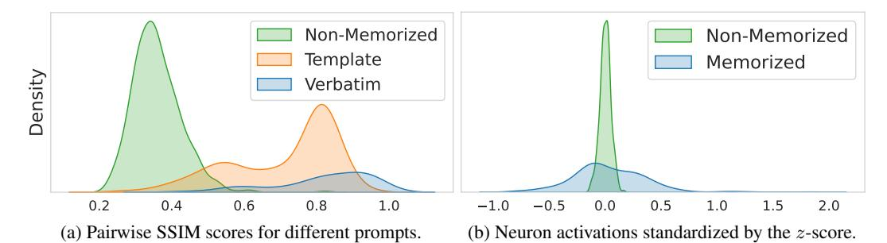

Figure 2: Differences Between Memorized and Non-memorized Prompts. (a) depicts the distribution of pairwise SSIM scores between initial noise differences starting from different seeds. Since the noise trajectories are more consistent for memorized samples, the score reflects the degree of memorization. (b) shows the distribution of the z-scores of each neuron in the first cross-attention value layer. Memorization neurons produce considerably higher activations, here depicted as standardized z-scores, for memorized prompts, allowing them to be identified by outlier detection.

# <span id="page-3-1"></span>3 NeMo: Localizing and Removing Memorization in Diffusion Models

NEMO, our method for detecting *memorization neurons*, consists of a two-step selection process:

- (1) Initial Selection: We first identify a broad set of candidate neurons that might be responsible for memorizing a specific training sample. This initial selection is coarse-grained to speed up the computation among the many neurons in DMs. Consequently, it might select false positives, *i.e.,* neurons not directly responsible for memorization.
- (2) Refinement: In the refinement step, we filter neurons out to reduce the size of the initial candidate set. After refinement, we deactivate the remaining *memorization neurons* to remove memorization.

In our study, we apply this two-step approach of NEMO to detect memorization neurons in the DM's cross-attention layers, the only components that directly process the text embeddings. Image editing research [\[17,](#page-11-6) [42,](#page-12-12) [10\]](#page-10-12) shows that cross-attention layers highly influence the generated content, so we expect them to be the driving force behind memorization. We analyze the impact of blocking individual key and value layers in Appx. [C.8](#page-27-0) and the influence of blocking neurons in the convolutional layers in Appx. [C.9.](#page-31-0) Our results show that the value layers in the down- and mid-blocks of the U-Net indeed have the highest memorization effect, whereas value layers in the up-blocks barely affect the memorization. Deactivating the outputs of neurons in value layers completely blocks the information flow of the guidance signal and, hence, potential memorization triggers. Deactivating the key layers in cross-attention also impacts memorization but often impedes the image-prompt alignment. Similarly, deactivating neurons in the convolutional layers of the U-Net did not mitigate memorization. Therefore, we limit our search on memorization neurons to the value layers of the U-Net's down- and mid-blocks. While the identified neurons effectively mitigate the data replication problem, we emphasize that other parts of the U-Net might also play a crucial role in memorizing training data. Specifically, the identified neurons trigger the data replication, which is then executed by other parts of the U-Net, such as convolutional and fully connected layers. Deactivating the memorization neurons in value layers effectively interrupts the memorization chain and replication process. Before detailing the two steps of NEMO's selection process in Sec. [3.2](#page-4-0) and Sec. [3.3,](#page-5-0) we first introduce how we quantify memorization strength in the next section. We provide detailed algorithmic descriptions for each of NEMO's components in Appx. [D.](#page-32-0)

#### 3.1 Quantifying the Memorization Strength

Intuitively, the denoising process of DMs for memorized prompts follows a rather consistent trajectory to reconstruct the corresponding training image, yielding image generations with little diversity. Conversely, the denoising trajectory highly depends on the initially sampled noise for non-memorized prompts [\[46\]](#page-12-3). We measure the similarity between the first denoising steps for different initial seeds as a proxy to compare the denoising trajectories and to quantify the memorization strength. The higher the similarity, the more consistent the denoising trajectories, which indicates stronger memorization. Let x<sup>T</sup> ∼ N (0, I) be the initial noise following the denoising process described in Sec. [2.1.](#page-1-1) Let ϵθ(x<sup>T</sup> , T, y) further denote the initial noise prediction. We found that the normalized difference between the initial noise and the first noise prediction δ = ϵθ(x<sup>T</sup> , T, y) − x<sup>T</sup> for memorized prompts is more consistent for different seeds than for non-memorized prompts. We visualize this phenomenon for some initial noise differences in Appx. [C.6.](#page-22-0)

To detect the grade of memorization, we, therefore, use the similarity between the noise differences δ (i) and δ (j) generated with seeds i and j as a proxy. We measure the similarity with the common structural similarity index measure (SSIM) [\[44\]](#page-12-13). A formal description of the SSIM ∈ [−1, 1] score and an additional experiment outlining how the SSIM score can be used to detect memorization in the first place is provided in Appx. [B.4.](#page-15-0)

A higher SSIM indicates higher similarity between the noise differences, reflecting a higher degree of memorization. Notably, the SSIM computation only requires a single denoising step per seed, which makes the process fast. To set a memorization threshold τmem, starting from which we define a sample as memorized, we first compute the mean SSIM on a holdout set of non-memorized prompts. We compute the pairwise SSIM between ten different initial noise samples for each prompt and take the maximum score. After that, we average the scores across all prompts and set the threshold τmem to the mean plus one standard deviation. We consider the current image generation non-memorized if the maximum pairwise SSIM scores are below this threshold τmem. Fig. [2a](#page-3-0) shows the distribution of SSIM scores for memorized and non-memorized prompts, demonstrating that memorized prompts lead to a substantially higher score.

# <span id="page-4-0"></span>3.2 Initial Candidate Selection for Memorization Neurons

With our measure for quantifying the strength of memorization defined, we move on to detail the first step of our NEMO' localization. Our initial neuron selection procedure is based on the observation that activation patterns of memorized prompts differ from the ones of non-memorized prompts on the neuron level. Fig. [2b](#page-3-0) underlines this observation by plotting the standardized activation scores for memorized and non-memorized samples in the first value layer. Leveraging this insight, we identify memorization neurons as the ones that exhibit an out-of-distribution (OOD) activation behavior. We first compute the standard activation behavior of neurons on a separate hold-out set of non-memorized prompts. Then, we compare the activation pattern of the neurons for memorized prompts and identify neurons with OOD behavior. Let the cross-attention value layers of a DM be l ∈ {1, . . . , L}. We denote the activation of the i-th neuron in the l-th layer for prompt y as a i (y). The activation values are averaged across the absolute neuron activations for each token vector in the text embedding. Let µ l i be the pre-computed mean activation and σ l i the corresponding standard deviation for this neuron. To detect neurons potentially responsible for the memorization of a memorized prompt y, we compute the standardized z-score [\[20\]](#page-11-7), defined as

$$z_i^l(y) = \frac{a_i^l(y) - \mu_i^l}{\sigma_i^l} \,. \tag{3}$$

The z-score quantifies the number of standard deviations σ l i by which the activation a l i (y) is above or below the mean activation µ l i . Here, the activation a i (y) is calculated by taking the mean over the absolute token activations. To identify a neuron as exhibiting an OOD activation behavior, we set a threshold θact and assume that neuron i in layer l has OOD behavior if |z l i (y)| > θact. The lower the threshold θact, the more neurons are labeled as OOD and added to the *memorization neuron* candidate set. An algorithmic description of the OOD detection step is provided in Alg. [2](#page-33-0) in Appx. [D.2.](#page-33-1)

Fig. [2a](#page-3-0) shows that the pairwise SSIM score can be used to measure the generated sample's degree of memorization. Hence, to get an initial selection of *memorization neurons*, we calculate the standardized z-scores for all neurons and start with a relatively high value of θact = 5. We deactivate all neurons with OOD activations given the current threshold θact, i.e., setting the output of a neuron to 0 if |z l i (y)| > θact, to reduce the memorization strength. If, after deactivating these neurons, the memorization score is not below the threshold τmem, we then iteratively decrease the activation threshold θact by 0.25 and update the candidate set until the target memorization score τmem is reached.

The activation patterns of some neurons in the network show high variance, even on non-memorized prompts. Such neurons can also be memorization neurons, but due to their high activation variance, they might not be detected by our OOD approach based solely on the z-scores. Therefore, we also add the top-k neurons of each layer with the highest absolute activation on the memorized prompt y

to our current candidate set to account for such high-variance neurons. We start by setting k = 0 and increase k at each iteration by one if the memorization score is still above the threshold τmem. We detail our initial selection process in Alg. [3](#page-34-0) in Appx. [D.3.](#page-34-1) All neurons identified by our OOD approach and the neurons with the k highest activations are then collected in the neuron set Sinitial. Since not all neurons in set Sinitial might be memorization neurons, we refine this set in the next step.

# <span id="page-5-0"></span>3.3 Refinement of the Candidate Set

In this step, we take the set of identified neurons Srefined = Sinitial and remove the neurons that are actually not responsible for memorization. To speed up this process, we first group the identified neurons layer-wise, leading to the neuron set S l refined for layer l. We iterate over the individual layers l ∈ {1, . . . , L} and re-activate all identified neurons S l refined from a single layer l while keeping the identified neurons in the remaining layers deactivated.

We then compute the SSIM-based memorization score and check if it is still below the threshold τmem. If the memorization score does not increase above the threshold τmem, we consider the candidate neurons S l refined of layer l as not memorizing and remove them from our set of neurons Srefined. After iterating over all layers, the set Srefined only contains neurons from layers that substantially influence the memorization score.

Next, we individually check each remaining neuron in the set Srefined by re-activating this particular neuron while keeping all other neurons in the set Srefined deactivated. Again, if the memorization score computed on the remaining deactivated neurons does not exceed the memorization threshold τmem, we remove this neuron from the set Srefined. After iterating over all neurons in Srefined, we consider the remaining neurons as memorizing and denote the final set of memorization neurons as Sfinal. We detail this refinement approach in Alg. [4](#page-35-0) in Appx. [D.4.](#page-35-1)

# <span id="page-5-1"></span>4 Experiments

We now empirically evaluate NEMO's localization in text-to-image DMs.

Models and Datasets: We follow current research on memorization in DMs [\[46,](#page-12-3) [31\]](#page-11-1) and investigate memorization in Stable Diffusion v1.4 [\[32\]](#page-12-0). Our set of memorized prompts consists of 500 LAION prompts [\[35\]](#page-12-14) provided by Wen et al. [\[46\]](#page-12-3). We analyzed the prompts using the Self-Supervised Descriptor (SSCD) score [\[28\]](#page-11-8), a model designed to detect and quantify copying in DMs. The lower the score, the less similar the contents in the image pairs. Additionally, we split the dataset into verbatim- (*VM*) and template-memorized (*TM*) samples to enable a more detailed analysis of results. The hyperparameter selection and experimental conduction are independent of the type of memorization. If not further specified, we used the same hyperparameters for all the experiments in the paper.

Images generated by VM prompts match the training image exactly, *i.e.,* pixel-wise, independent of the chosen seed. TM prompts, on the other hand, reproduce the general composition of the training image while having some non-semantic variations at fixed image positions. Details about the analysis and the annotation can be found in Appx. [C.1.](#page-16-0)

Other publicly available models, like Stable Diffusion v2 and Deep Floyd [\[38\]](#page-12-1), are trained on more carefully curated and deduplicated datasets. We thoroughly checked for memorized prompts using the tools by Webster [\[45\]](#page-12-11) and our SSIM-based memorization score but could not identify any properly memorized prompts. This result aligns with related research on memorization in DMs [\[46,](#page-12-3) [31\]](#page-11-1).

Metrics: We split our metrics into memorization, diversity, and quality metrics. The memorization metrics measure the degree of memorization still present in the generated images. We generate ten images for each memorized prompt with activated/deactivated memorization neurons and measure the cosine similarities between image pairs using SSCD embeddings to quantify the memorization. We denote this metric by SSCDGen. Since the generated images without deactivated neurons also differ in their degree of memorization from the original training images, we additionally measure the degree of memorization towards the original training images and denote this metric as SSCDOrig. Higher SSCD scores indicate a higher degree of memorization.

Our diversity metric assesses the variety of images generated for the same memorized prompt with different seeds. Diversity is usually low for memorized samples, and generated images almost always depict the same image. Deactivating memorization neurons increases the diversity in the generations.

<span id="page-6-0"></span>Table 1: Impact of Deactivating the Memorization Neurons. Keeping all neurons active (1st row) and randomly deactivating neurons (3rd row) has no impact on memorization. However, deactivating the memorization neurons located by NEMO (8th row) successfully mitigates memorization, increases diversity, and maintains prompt alignment. These results are comparable to the gradient-based mitigation strategies adjusting the prompt embeddings (2nd row) and the attention scaling (4th row). Adding random tokens also reduces memorization. However, for 1 or 4 tokens, the memorization, as quantified by the SSCD scores, is still higher than with deactivated memorization neurons. Adding 10 random tokens leads to comparable mitigation but also reduces the prompt alignment score.

| Setting                                         | Memorization Type | Deactivated Neurons ↓ SSCDOrig |             | ↓ SSCDGen   | ↓ DSSCD     | ↑ ACLIP     |
|-------------------------------------------------|-------------------|--------------------------------|-------------|-------------|-------------|-------------|
| All Neurons Activate (Default)                  | Verbatim          | 0                              | 0.83 ± 0.16 | 1.0 ± 0.0   | 0.99 ± 0.01 | 0.32 ± 0.02 |
|                                                 | Template          | 0                              | 0.04 ± 0.04 | 1.0 ± 0.0   | 0.17 ± 0.06 | 0.31 ± 0.02 |
| Prompt Embedding Adjustment (Wen et al. [46])   | Verbatim          | 0                              | 0.04 ± 0.02 | 0.08 ± 0.03 | 0.08 ± 0.03 | 0.30 ± 0.02 |
|                                                 | Template          | 0                              | 0.03 ± 0.02 | 0.08 ± 0.03 | 0.09 ± 0.03 | 0.31 ± 0.02 |
| Deactivating Random Neurons                     | Verbatim          | 4 ± 3                          | 0.80 ± 0.11 | 0.999 ± 0.0 | 0.99 ± 0.01 | 0.32 ± 0.02 |
|                                                 | Template          | 21 ± 18                        | 0.05 ± 0.04 | 0.997 ± 0.0 | 0.16 ± 0.06 | 0.31 ± 0.02 |
| Attention Scaling (Ren et al. [31])             | Verbatim          | 0                              | 0.08 ± 0.04 | 0.14 ± 0.07 | 0.15 ± 0.05 | 0.31 ± 0.02 |
|                                                 | Template          | 0                              | 0.05 ± 0.02 | 0.19 ± 0.12 | 0.12 ± 0.03 | 0.31 ± 0.02 |
| Adding 1 Random Token (Somepalli et al. [36])   | Verbatim          | 0                              | 0.59 ± 0.31 | 0.68 ± 0.31 | 0.67 ± 0.33 | 0.31 ± 0.02 |
|                                                 | Template          | 0                              | 0.04 ± 0.03 | 0.16 ± 0.05 | 0.17 ± 0.05 | 0.31 ± 0.02 |
| Adding 4 Random Tokens (Somepalli et al. [36])  | Verbatim          | 0                              | 0.09 ± 0.06 | 0.12 ± 0.09 | 0.15 ± 0.06 | 0.30 ± 0.02 |
|                                                 | Template          | 0                              | 0.04 ± 0.03 | 0.13 ± 0.04 | 0.15 ± 0.04 | 0.30 ± 0.02 |
| Adding 10 Random Tokens (Somepalli et al. [36]) | Verbatim          | 0                              | 0.03 ± 0.02 | 0.07 ± 0.05 | 0.11 ± 0.03 | 0.28 ± 0.03 |
|                                                 | Template          | 0                              | 0.03 ± 0.03 | 0.08 ± 0.05 | 0.12 ± 0.04 | 0.29 ± 0.03 |
| Deactivating Memorization Neurons (NEMO)        | Verbatim          | 4 ± 3                          | 0.09 ± 0.06 | 0.10 ± 0.07 | 0.16 ± 0.06 | 0.31 ± 0.02 |
|                                                 | Template          | 21 ± 18                        | 0.05 ± 0.03 | 0.05 ± 0.04 | 0.12 ± 0.05 | 0.31 ± 0.02 |

We quantify the sample diversity by computing the pairwise cosine similarity between the SSCD embeddings of different images generated for the same prompt. We refer to this metric as DSSCD, for which lower values indicate more image diversity.

To assess the overall image quality of a DM with activated/deactivated neurons, we compute the Fréchet Inception Distance (FID) [\[18\]](#page-11-9), the CLIP-FID [\[21\]](#page-11-10), and the Kernel Inception Distance (KID) [\[3\]](#page-10-13) on COCO [\[22\]](#page-11-11) prompts. All quality computations follow Parmar et al. [\[26\]](#page-11-12) to avoid biased results. Additionally, we compute the similarities between the generated images and the input prompts using CLIP scores [\[29\]](#page-11-3) to ensure the alignment ACLIP between generated images and their prompts. The higher the alignment, the better the generated images represent the concepts described in the prompt.

Importantly, we use different seeds for detecting memorization neurons with NEMO and the metric computations to avoid undesired biases during the evaluation due to seed overfitting. We always state each metric's median value and absolute deviation across ten seeds, except the quality metrics (FID, CLIP-FID, KID, and ACLIP), for which we used five different seeds.

Memorization Threshold: We set the memorization score threshold to τmem = 0.428, which corresponds to the mean plus one standard deviation of the pairwise SSIM score between initial noise differences measured on a holdout dataset of 50,000 LAION [\[35\]](#page-12-14) prompts.

Baselines: As a baseline, we repeated the image generations five times but replaced the deactivated memorization neurons with random neurons from the same layer. We also generated images using the inference mitigation strategy proposed by Wen et al. [\[46\]](#page-12-3), which performs a gradient-based adjustment of the text embeddings. Importantly, gradient-based mitigation strategies are memoryintensive, particularly for larger batch sizes. NEMO, however, computes no gradients, which enables the approach to also work on machines with limited computing resources. Additionally, we also selected the attention scaling method by Ren et al. [\[31\]](#page-11-1) and the addition of random tokens, proposed by Somepalli et al. [\[36\]](#page-12-2), as baselines.

#### 4.1 Localizing Memorization Down To Individual Neurons

We begin by demonstrating the effectiveness of our memorization localization method. Tab. [1](#page-6-0) presents the quantitative results for images generated with the identified memorization neurons deactivated. NEMO detected a median of 4 and 21 memorization neurons for VM and TM prompts, respectively. For VM prompts, deactivating these memorization neurons significantly decreases memorization, as reflected by low memorization metrics SSCDOrig and SSCDGen, while increasing the image diversity in terms of pairwise similarity DSSCD. However, the SSCDOrig does not change noticeably for TM prompts.

<span id="page-7-0"></span>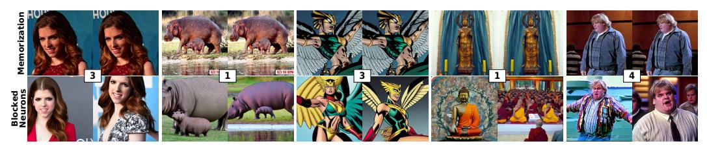

Figure 3: Impact of Deactivating Memorization Neurons. The top row shows images generated with memorized prompts, closely replicating the training images. The bottom row demonstrates that deactivating memorization neurons increases diversity and mitigates memorization. Notably, only a few neurons (counts indicated by digits in the boxes) are responsible for these memorizations.

<span id="page-7-1"></span>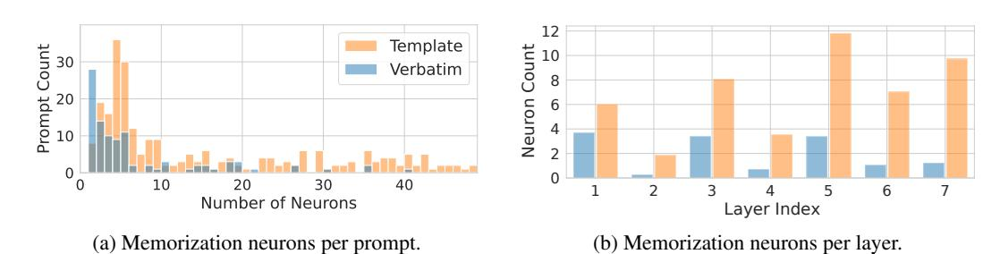

Figure 4: Distribution of Memorization Neurons. (a) shows the number of prompts that are memorized by a fixed number of neurons, e.g., the verbatim memorization of 28 prompts is located in single neurons. (b) depicts the average number of memorization neurons per layer and prompt.

This behavior results from the fact that TM prompts typically memorize specific parts of the original training image, such as objects or compositions, rendering the SSCDOrig metric less informative. In contrast, the SSCDGen score, which compares similarities between images generated with and without the deactivated neurons, provides a more accurate measure. This score highlights that deactivating the identified neurons effectively alters the images and mitigates memorization. Importantly, the imageprompt alignment ACLIP remains constant in all cases, indicating that deactivating memorization neurons does not result in misguided image generations. We visualize examples of deactivating memorization neurons to avoid data replication and increase diversity in Fig. [3.](#page-7-0)

Comparing the results of deactivating the neurons identified by NEMO with those obtained from randomly deactivated neurons highlights that only a specific subset of neurons is actually responsible for memorizing a prompt. While deactivating the identified memorization neurons significantly impacts both memorization and the diversity of the generated images, randomly deactivating neurons has no noticeable effect.

Moreover, the mitigation effect of deactivating memorization neurons is comparable to the stateof-the-art method of adjusting the prompt embeddings [\[46\]](#page-12-3). Yet, adjusting the prompt embeddings requires gradient computations for each seed and prompt, which are time- and memory-expensive, especially with large batch sizes. In contrast, once the memorization neurons are identified using our gradient-free NEMO, no additional computations are needed during image generations, thus adding no overhead to the generation process.

### 4.2 Analyzing the Distribution of Memorization Neurons

Next, we analyze the distribution of the memorization neurons. Fig. [4a](#page-7-1) shows the total number of neurons responsible for memorizing specific prompts. Typically, a small set of neurons is responsible for verbatim memorization. For instance, 28 VM prompts from our dataset are memorized by a *single neuron*. Additionally, five or fewer neurons replicate two-thirds of VM images, indicating that verbatim memorization can often be precisely localized within the model. Template memorization can also frequently be pinpointed to a small set of neurons, with about 30% of TV replication triggered by five or fewer neurons.

<span id="page-8-0"></span>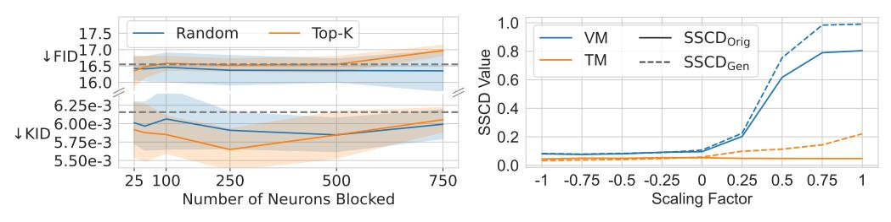

- (a) Assessing image quality using FID and KID.
- (b) Scaling the activations of memorization neurons.

Figure 5: Image Quality and Sensitivity to Scaling Factor. (a) assesses the generated images' quality when blocking an increasing number of neurons. As can be seen, the FID and KID values vary only slightly, indicating that blocking neurons identified by NEMO does not negatively affect image generation quality. Gray lines indicate the baseline without any neurons blocked. (b) investigates the effect of scaling the memorization neurons' activations by a scaling factor instead of deactivating them (scaling by zero). Whereas positively scaling memorization neuron activations only slightly reduces memorization, negative scaling reduces the memorization not any further.

However, approximately one-third of TM prompts are distributed across 50 or more neurons. We hypothesize that this broader distribution results from the higher variation in generated images for TM prompts, where memorization spread across multiple neurons leads to increased image diversity. In contrast, VM prompts, often memorized by a small group of neurons, consistently produce the same image without variation. More detailed plots of the identified neurons can be found in Appx. [C.2.](#page-16-1)

Interestingly, we identify two neurons in the first cross-attention value layer responsible for the verbatim memorization of multiple prompts. Neuron #25 in this layer is associated with depicting people, while neuron #221 is responsible for memorizing multiple podcast covers. Together, these neurons account for memorizing 17% of our dataset's VM prompts. Similarly, neurons #507 and #517 in the third value layer are responsible for multiple TM prompts describing iPhone cases. The impact of deactivating these neurons on the image generation of memorized prompts is visualized in Appx. [C.5.](#page-19-0) We also plot the distribution of the average layer-wise number of memorization neurons per prompt in Fig. [4b.](#page-7-1) Neurons responsible for VM prompts are primarily located in the value mappings of the first cross-attention layers within the U-Net's down-blocks (each block contains two cross-attention layers). A similar pattern appears for TM prompts, although value layers located deeper in the U-Net seem to play a more crucial role for TM prompts than for VM prompts.

### 4.3 Memorization Neurons Hardly Influence Non-Memorized Prompts

Until now, our focus has been on the impact of deactivating memorization neurons on memorized prompts. In this part, we investigate how these neurons influence non-memorized prompts and the overall image quality of the DM. To assess their impact, we deactivate varying numbers of memorization neurons, ordered by their frequency of occurrence as identified in our experiments, and compute the FID and KID scores on the COCO dataset. We also repeat the generations by deactivating the same number of randomly selected neurons that are not among the identified memorization neurons. As shown in Fig. [5a,](#page-8-0) there is no significant degradation in the image quality when blocking either the random neurons or the memorization neurons, even with up to 750 blocked neurons. This finding underscores the potential for pruning memorization neurons in DMs without compromising the overall image quality. The plot for the CLIP-FID metric and more detailed plots of the other two metrics, as well as an additional experiment measuring the disentanglement of the neurons in the value layers, can be found in Appx. [C.3.](#page-17-0)

# 4.4 Ablation Study and Sensitivity Analysis

We further analyze the impact of each component of NEMO and its sensitivity to hyperparameter selection. We discuss the most crucial insights here, with the complete study included in Appx. [C.7.](#page-23-0) First, we evaluate the impact of different memorization thresholds θmem. Lowering this threshold slightly increases the number of identified neurons but has a negligible effect on performance metrics. Selecting this threshold based on statistics computed on a holdout set provides a simple yet effective way for hyperparameter selection.

Additionally, we compare the results of using both stages of NEMO versus a setting where we only perform the initial candidate selection, skipping the refinement process. Although memorization is successfully mitigated by deactivating the initially selected neurons, the number of identified memorization neurons increases substantially, resulting in a median of 26.5 neurons (*+22.5 neurons*) for VM prompts and 674.5 neurons (*+653.5 neurons*) for TM prompts. This highlights the importance of the refinement stage in reducing the number of neurons necessary to mitigate memorization *efficiently*. To further test whether the assumptions about the statistics of memorization neurons hold, we applied NEMO to a set of 500 non-memorized prompts not used to calibrate our thresholds. As we further show, NEMO does not identify any neurons for most of the non-memorized prompts, underscoring the validity of our assumptions.

We also compared the effect of completely deactivating the identified memorization neurons to down-scaling their activations by a fixed factor. The SSCD scores in Fig. [5b,](#page-8-0) computed for different scaling factors, demonstrate that memorization is not fully mitigated when using a positive scaling factor. Conversely, negative scaling factors do not provide any additional mitigation compared to our default setting of deactivating the neurons (i.e., using a factor of zero).

# <span id="page-9-0"></span>5 Conclusion and Outlook

DMs have rapidly become a cornerstone of computer vision. Yet, problems like memorization of training samples can lead to undesired replication of potentially sensitive or copyrighted training images. Previous research has primarily focused on identifying memorized prompts and proposing mitigation strategies by adjusting the DM's input. However, there has been a lack of understanding regarding the precise location of memorization within the model.

Our research provides novel insights into the memorization mechanisms in text-to-image DMs. Unlike previous studies that focused on identifying memorized prompts, our approach, NEMO, is the first to *localize memorization* within the model and pinpoint *individual neurons* responsible for it. Traditional pruning methods [\[11\]](#page-10-14) are orthogonal to our approach by pruning only structures to reduce the total parameter count of the model. Our memorization localization algorithm enables model providers to prune these memorization neurons, effectively mitigating memorization permanently without additional model training, which can be costly in terms of data and resources. Our mitigation can be executed without compromising the model's overall performance or the quality of the generated images, allowing model providers to deploy the resulting models without additional safeguards to prevent memorization.

There are several directions to expand and build upon our method for detecting neurons responsible for memorization. One intriguing avenue is to investigate whether an adjusted version of NEMO can detect concept neurons [\[23\]](#page-11-13). These neurons are not responsible for memorizing a certain prompt but for generating a particular concept. Such an approach could enable model providers and users to perform knowledge editing [\[15\]](#page-10-15) and remove undesired concepts like violence and nudity. Another exciting application for NEMO is in large language models, also known for memorizing training samples [\[5\]](#page-10-3). Identifying neurons responsible for memorizing text from the training data could lead to new mitigation strategies.

Additionally, our insights could be interesting for developing new pruning algorithms for DMs to reduce the number of parameters while eliminating unintended memorization. As demonstrated in our experiments, pruning memorization neurons does not significantly impact the model's overall performance, which is crucial for effective pruning strategies.

# Acknowledgments and Disclosure of Funding

This work has been financially supported by the German Research Center for Artificial Intelligence (DFKI) project "SAINT". The project also received funding from the Initiative and Networking Fund of the Helmholtz Association in the framework of the Helmholtz AI project call under the name "PAFMIM" with funding number ZT-I-PF-5-227. Responsibility for the content of this publication lies with the author.

# References

- <span id="page-10-2"></span>[1] Devansh Arpit, Stanisław Jastrzebski, Nicolas Ballas, David Krueger, Emmanuel Bengio, Maxinder S Kanwal, Tegan Maharaj, Asja Fischer, Aaron Courville, Yoshua Bengio, et al. A closer look at memorization in deep networks. In *International conference on machine learning*, pages 233–242. PMLR, 2017.
- <span id="page-10-11"></span>[2] Robert Baldock, Hartmut Maennel, and Behnam Neyshabur. Deep learning through the lens of example difficulty. *Advances in Neural Information Processing Systems*, 34:10876–10889, 2021.
- <span id="page-10-13"></span>[3] Mikolaj Binkowski, Danica J. Sutherland, Michael Arbel, and Arthur Gretton. Demystifying MMD gans. In *International Conference on Learning Representations (ICLR)*, 2018.
- <span id="page-10-7"></span>[4] Nicholas Carlini, Chang Liu, Úlfar Erlingsson, Jernej Kos, and Dawn Song. The secret sharer: Evaluating and testing unintended memorization in neural networks. In *28th USENIX Security Symposium (USENIX Security 19)*, pages 267–284, 2019.
- <span id="page-10-3"></span>[5] Nicholas Carlini, Florian Tramer, Eric Wallace, Matthew Jagielski, Ariel Herbert-Voss, Katherine Lee, Adam Roberts, Tom Brown, Dawn Song, Ulfar Erlingsson, et al. Extracting training data from large language models. In *30th USENIX Security Symposium (USENIX Security 21)*, pages 2633–2650, 2021.
- <span id="page-10-10"></span>[6] Nicholas Carlini, Daphne Ippolito, Matthew Jagielski, Katherine Lee, Florian Tramer, and Chiyuan Zhang. Quantifying memorization across neural language models. In *The Eleventh International Conference on Learning Representations*, 2022.
- <span id="page-10-8"></span>[7] Nicholas Carlini, Matthew Jagielski, Chiyuan Zhang, Nicolas Papernot, Andreas Terzis, and Florian Tramer. The privacy onion effect: Memorization is relative. *Advances in Neural Information Processing Systems*, 35:13263–13276, 2022.
- <span id="page-10-0"></span>[8] Nicolas Carlini, Jamie Hayes, Milad Nasr, Matthew Jagielski, Vikash Sehwag, Florian Tramer, Borja Balle, Daphne Ippolito, and Eric Wallace. Extracting training data from diffusion models. In *32nd USENIX Security Symposium (USENIX Security 23)*, pages 5253–5270, 2023.
- <span id="page-10-5"></span>[9] Satrajit Chatterjee. Learning and memorization. In *International conference on machine learning*, pages 755–763. PMLR, 2018.
- <span id="page-10-12"></span>[10] Minghao Chen, Iro Laina, and Andrea Vedaldi. Training-free layout control with cross-attention guidance. In *Winter Conference on Applications of Computer Vision (WACV)*, pages 5331–5341, 2024.
- <span id="page-10-14"></span>[11] Gongfan Fang, Xinyin Ma, and Xinchao Wang. Structural pruning for diffusion models. In *Conference on Neural Information Processing Systems (NeurIPS)*, 2023.
- <span id="page-10-1"></span>[12] Vitaly Feldman. Does learning require memorization? a short tale about a long tail. In *Proceedings of the 52nd Annual ACM SIGACT Symposium on Theory of Computing*, pages 954–959, 2020.
- <span id="page-10-6"></span>[13] Vitaly Feldman and Chiyuan Zhang. What neural networks memorize and why: Discovering the long tail via influence estimation. *Advances in Neural Information Processing Systems*, 33: 2881–2891, 2020.
- <span id="page-10-9"></span>[14] Matt Fredrikson, Somesh Jha, and Thomas Ristenpart. Model inversion attacks that exploit confidence information and basic countermeasures. In *Proceedings of the 22nd ACM SIGSAC conference on computer and communications security*, pages 1322–1333, 2015.
- <span id="page-10-15"></span>[15] Rohit Gandikota, Hadas Orgad, Yonatan Belinkov, Joanna Materzynska, and David Bau. Unified concept editing in diffusion models. In *Winter Conference on Applications of Computer Vision (WACV)*, pages 5099–5108, 2024.
- <span id="page-10-4"></span>[16] Xiangming Gu, Chao Du, Tianyu Pang, Chongxuan Li, Min Lin, and Ye Wang. On Memorization in Diffusion Models. *arXiv preprint*, arXiv:2310.02664, 2023.

- <span id="page-11-6"></span>[17] Amir Hertz, Ron Mokady, Jay Tenenbaum, Kfir Aberman, Yael Pritch, and Daniel Cohen-Or. Prompt-to-prompt image editing with cross-attention control. In *Eleventh International Conference on Learning Representations (ICLR)*, 2023.
- <span id="page-11-9"></span>[18] Martin Heusel, Hubert Ramsauer, Thomas Unterthiner, Bernhard Nessler, and Sepp Hochreiter. Gans trained by a two time-scale update rule converge to a local nash equilibrium. In *Conference on Neural Information Processing Systems (NeurIPS)*, page 6629–6640, 2017.
- <span id="page-11-2"></span>[19] Jonathan Ho, Ajay Jain, and Pieter Abbeel. Denoising Diffusion Probabilistic Models. In *Conference on Neural Information Processing Systems (NeurIPS)*, pages 6840–6851, 2020.
- <span id="page-11-7"></span>[20] Erwin Kreyszig, Herbert Kreyszig, and E. J. Norminton. *Advanced Engineering Mathematics*. Wiley, tenth edition, 2011.
- <span id="page-11-10"></span>[21] Tuomas Kynkäänniemi, Tero Karras, Miika Aittala, Timo Aila, and Jaakko Lehtinen. The role of imagenet classes in fréchet inception distance. In *Eleventh International Conference on Learning Representations (ICLR)*, 2023.
- <span id="page-11-11"></span>[22] Tsung-Yi Lin, Michael Maire, Serge J. Belongie, James Hays, Pietro Perona, Deva Ramanan, Piotr Dollár, and C. Lawrence Zitnick. Microsoft coco: Common objects in context. In *European Conference on Computer Vision (ECCV)*, pages 740–755, 2014.
- <span id="page-11-13"></span>[23] Zhiheng Liu, Ruili Feng, Kai Zhu, Yifei Zhang, Kecheng Zheng, Yu Liu, Deli Zhao, Jingren Zhou, and Yang Cao. Cones: Concept Neurons in Diffusion Models for Customized Generation. In Andreas Krause, Emma Brunskill, Kyunghyun Cho, Barbara Engelhardt, Sivan Sabato, and Jonathan Scarlett, editors, *International Conference on Machine Learning (ICML)*, 2023.
- <span id="page-11-5"></span>[24] Pratyush Maini, Michael Curtis Mozer, Hanie Sedghi, Zachary Chase Lipton, J Zico Kolter, and Chiyuan Zhang. Can neural network memorization be localized? In *International Conference on Machine Learning*, pages 23536–23557. PMLR, 2023.
- <span id="page-11-4"></span>[25] Casey Meehan, Florian Bordes, Pascal Vincent, Kamalika Chaudhuri, and Chuan Guo. Do ssl models have déjà vu? a case of unintended memorization in self-supervised learning. *Advances in Neural Information Processing Systems*, 36, 2024.
- <span id="page-11-12"></span>[26] Gaurav Parmar, Richard Zhang, and Jun-Yan Zhu. On aliased resizing and surprising subtleties in gan evaluation. In *Conference on Computer Vision and Pattern Recognition (CVPR)*, pages 11400–11410, 2022.
- <span id="page-11-14"></span>[27] Adam Paszke, Sam Gross, Francisco Massa, Adam Lerer, James Bradbury, Gregory Chanan, Trevor Killeen, Zeming Lin, Natalia Gimelshein, Luca Antiga, Alban Desmaison, Andreas Köpf, Edward Yang, Zachary DeVito, Martin Raison, Alykhan Tejani, Sasank Chilamkurthy, Benoit Steiner, Lu Fang, Junjie Bai, and Soumith Chintala. PyTorch: An Imperative Style, High-Performance Deep Learning Library. In *Conference on Neural Information Processing Systems (NeurIPS)*, pages 8024–8035, 2019.
- <span id="page-11-8"></span>[28] Ed Pizzi, Sreya Dutta Roy, Sugosh Nagavara Ravindra, Priya Goyal, and Matthijs Douze. A self-supervised descriptor for image copy detection. In *Conference on Computer Vision and Pattern Recognition (CVPR)*, pages 14512–14522, 2022.
- <span id="page-11-3"></span>[29] Alec Radford, Jong Wook Kim, Chris Hallacy, Aditya Ramesh, Gabriel Goh, Sandhini Agarwal, Girish Sastry, Amanda Askell, Pamela Mishkin, Jack Clark, Gretchen Krueger, and Ilya Sutskever. Learning transferable visual models from natural language supervision. In *International Conference on Machine Learning (ICML)*, pages 8748–8763, 2021.
- <span id="page-11-0"></span>[30] Aditya Ramesh, Prafulla Dhariwal, Alex Nichol, Casey Chu, and Mark Chen. Hierarchical text-conditional image generation with CLIP latents. *arXiv preprint*, arXiv:2204.06125, 2022.
- <span id="page-11-1"></span>[31] Jie Ren, Yaxin Li, Shenglai Zeng, Han Xu, Lingjuan Lyu, Yue Xing, and Jiliang Tang. Unveiling and Mitigating Memorization in Text-to-image Diffusion Models through Cross Attention. *arXiv preprint*, arXiv:2403.11052, 2024.

- <span id="page-12-0"></span>[32] Robin Rombach, Andreas Blattmann, Dominik Lorenz, Patrick Esser, and Björn Ommer. Highresolution image synthesis with latent diffusion models. In *Conference on Computer Vision and Pattern Recognition (CVPR)*, pages 10684–10695, 2022.
- <span id="page-12-5"></span>[33] Olaf Ronneberger, Philipp Fischer, and Thomas Brox. U-net: Convolutional networks for biomedical image segmentation. In *Medical Image Computing and Computer-Assisted Intervention (MICCAI)*, pages 234–241, 2015.
- <span id="page-12-6"></span>[34] Chitwan Saharia, William Chan, Saurabh Saxena, Lala Li, Jay Whang, Emily L. Denton, Seyed Kamyar Seyed Ghasemipour, Raphael Gontijo Lopes, Burcu Karagol Ayan, Tim Salimans, Jonathan Ho, David J. Fleet, and Mohammad Norouzi. Photorealistic text-to-image diffusion models with deep language understanding. In *Conference on Neural Information Processing Systems (NeurIPS)*, 2022.
- <span id="page-12-14"></span>[35] Christoph Schuhmann, Romain Beaumont, Richard Vencu, Cade Gordon, Ross Wightman, Mehdi Cherti, Theo Coombes, Aarush Katta, Clayton Mullis, Mitchell Wortsman, Patrick Schramowski, Srivatsa Kundurthy, Katherine Crowson, Ludwig Schmidt, Robert Kaczmarczyk, and Jenia Jitsev. LAION-5B: An open large-scale dataset for training next generation image-text models. In *Conference on Neural Information Processing Systems (NeurIPS)*, 2022.
- <span id="page-12-2"></span>[36] Gowthami Somepalli, Vasu Singla, Micah Goldblum, Jonas Geiping, and Tom Goldstein. Understanding and mitigating copying in diffusion models. *Advances in Neural Information Processing Systems*, 36:47783–47803, 2023.
- <span id="page-12-4"></span>[37] Yang Song and Stefano Ermon. Improved Techniques for Training Score-Based Generative Models. In *Conference on Neural Information Processing Systems (NeurIPS)*, pages 12438– 12448, 2020.
- <span id="page-12-1"></span>[38] StabilityAI. DeepFloyd IF: a novel state-of-the-art open-source text-to-image model with a high degree of photorealism and language understanding. [https://www.deepfloyd.ai/](https://www.deepfloyd.ai/deepfloyd-if) [deepfloyd-if](https://www.deepfloyd.ai/deepfloyd-if), 2023. Retrieved on 2023-11-08.
- <span id="page-12-10"></span>[39] Cory Stephenson, Abhinav Ganesh, Yue Hui, Hanlin Tang, SueYeon Chung, et al. On the geometry of generalization and memorization in deep neural networks. In *International Conference on Learning Representations*, 2020.
- <span id="page-12-9"></span>[40] Lukas Struppek, Dominik Hintersdorf, Antonio De Almeida Correia, Antonia Adler, and Kristian Kersting. Plug & Play Attacks: Towards Robust and Flexible Model Inversion Attacks. In *International Conference on Machine Learning (ICML)*, pages 20522–20545, 2022.
- <span id="page-12-7"></span>[41] Ashish Vaswani, Noam Shazeer, Niki Parmar, Jakob Uszkoreit, Llion Jones, Aidan N. Gomez, Lukasz Kaiser, and Illia Polosukhin. Attention is all you need. In *Conference on Neural Information Processing Systems (NeurIPS)*, pages 5998–6008, 2017.
- <span id="page-12-12"></span>[42] Kai Wang, Fei Yang, Shiqi Yang, Muhammad Atif Butt, and Joost van de Weijer. Dynamic prompt learning: Addressing cross-attention leakage for text-based image editing. In *Conference on Neural Information Processing Systems (NeurIPS)*, 2023.
- <span id="page-12-8"></span>[43] Wenhao Wang, Muhammad Ahmad Kaleem, Adam Dziedzic, Michael Backes, Nicolas Papernot, and Franziska Boenisch. Memorization in Self-Supervised Learning Improves Downstream Generalization. In *International Conference on Learning Representations (ICLR)*, 2024.
- <span id="page-12-13"></span>[44] Zhou Wang, Alan C. Bovik, Hamid R. Sheikh, and Eero P. Simoncelli. Image quality assessment: from error visibility to structural similarity. *IEEE Transactions on Image Processing*, 13:600– 612, 2004.
- <span id="page-12-11"></span>[45] Ryan Webster. A reproducible extraction of training images from diffusion models. *arXiv preprint*, arXiv:2305.08694, 2023.
- <span id="page-12-3"></span>[46] Yuxin Wen, Yuchen Liu, Chen Chen, and Lingjuan Lyu. Detecting, Explaining, and Mitigating Memorization in Diffusion Models. In *International Conference on Learning Representations (ICLR)*, 2024.

- <span id="page-13-1"></span>[47] TaeHo Yoon, Joo Young Choi, Sehyun Kwon, and Ernest K. Ryu. Diffusion Probabilistic Models Generalize when They Fail to Memorize. In *ICML Workshop on Structured Probabilistic Inference & Generative Modeling*, 2023.
- <span id="page-13-0"></span>[48] Chiyuan Zhang, Samy Bengio, Moritz Hardt, Benjamin Recht, and Oriol Vinyals. Understanding deep learning requires rethinking generalization. In *International Conference on Learning Representations*, 2016.
- <span id="page-13-2"></span>[49] Xiaosen Zheng, Tianyu Pang, Chao Du, Jing Jiang, and Min Lin. Intriguing properties of data attribution on diffusion models. In *The Twelfth International Conference on Learning Representations*, 2024. URL <https://openreview.net/forum?id=vKViCoKGcB>.

# <span id="page-14-1"></span>A Limitations

Highly Memorized Prompts: For certain memorized prompts, our method identifies a set of over 100 neurons. Upon closer examination, we found that in these cases, memorization is distributed across many neurons in various layers, rather than being concentrated in a small group. Even deactivating a substantial number of neurons in the network does not eliminate memorization for these prompts. However, such instances, primarily TM prompts, were rare in our experiments. We provide examples of highly memorized prompts in Appx. [C.4.](#page-18-0)

Mitigating Template Memorization Is Harder Than Verbatim Memorization: Deactivating memorization neurons is effective for mitigating verbatim memorization, and often requires only a small number of neurons to be deactivated. In contrast, mitigating template memorization often requires deactivating more neurons, and even then, complete removal of memorization is not always possible in some rare cases. This difficulty arises because template memorization frequently results in diverse generations, with the memorized content corresponding to only certain aspects of the image. Distinguishing between these memorized parts and the remaining image parts is not always clearly achievable with our SSIM-based memorization strength. However, we emphasize that for the majority of prompts, deactivating the identified memorization neurons successfully removes template memorization.

Runtime: For most memorized prompts, NEMO detects the memorization neurons in a few seconds. We timed the runtime of NEMO and found that on average NEMO can identify memorization neurons for verbatim memorized prompts within 14.2 seconds, while for template memorized prompts memorization neurons are identified in 43.7 seconds on average. As discussed in the previous paragraph, mitigating and localizing memorization for template memorized prompts is harder. We suspect this is one reason why NEMO's runtime is slightly longer for template memorized prompts. To get further insight into how long the runtime of each part of our algorithm is, we also timed the runtime for the algorithms D1-D4 separately. The results can be seen in Tab. [2.](#page-14-0)

<span id="page-14-0"></span>Table 2: NEMO can localize the neurons responsible for memorization efficiently. The average runtime (in seconds) for Alg. [1](#page-32-1) and Alg. [2](#page-33-0) is below one second, while the runtime for Alg. [3](#page-34-0) is below 10 seconds. While the runtime for Alg. [4](#page-35-0) is longer than for the other parts of NEMO, the runtime is still only 45 seconds for TM. Alg. [4](#page-35-0) has the longest runtime for TM, since the initial candidate set is larger than for verbatim memorized samples.

| Memorization Type | A1   | A2   | A3   | A4    | Total |
|-------------------|------|------|------|-------|-------|
| VM                | 0.21 | 0.29 | 2.31 | 12.85 | 15.68 |
| TM                | 0.18 | 0.25 | 6.09 | 39.37 | 45.90 |

# <span id="page-14-2"></span>B Experimental Details

# <span id="page-14-3"></span>B.1 Hard- and Software Details

We performed all our experiments on NVIDIA DGX machines running NVIDIA DGX Server Version 5.2.0 and Ubuntu 20.04.5 LTS. The machines have 1.5 TB (machine 1) and 2 TB (machine 2) of RAM and contain NVIDIA Tesla V100 SXM3 32GB (machine 1) NVIDIA A100-SXM4-40GB (machine 2) GPUs with Intel(R) Xeon(R) Platinum 8174 (machine 1) and AMD EPYC 7742 64-core (machine 2) CPUs. We further relied on CUDA 12.1, Python 3.10.13, and PyTorch 2.2.2 with Torchvision 0.17.2 [\[27\]](#page-11-14) for our experiments. All investigated models are publicly available on Hugging Face. For access, we used the Hugging Face diffusers library with version 0.27.1.

We provide a Dockerfile with our code to make reproducing our results easier. In addition, all training and configuration files are available to reproduce the results stated in this paper.

#### <span id="page-14-4"></span>B.2 Model and Dataset Details

Experiments were mainly conducted on Stable Diffusion v1-4 [\[32\]](#page-12-0), publicly available at [https:](https://huggingface.co/CompVis/stable-diffusion-v1-4) [//huggingface.co/CompVis/stable-diffusion-v1-4](https://huggingface.co/CompVis/stable-diffusion-v1-4). All details regarding the data, training

parameters, limitations, and environmental impact are available at that URL. The model is available under the [CreativeML OpenRAIL M license.](https://huggingface.co/spaces/CompVis/stable-diffusion-license)

The investigated prompts originate from the LAION2B-en [\[35\]](#page-12-14) dataset used to train the DM. The set of memorized prompts is taken from Wen et al. [\[46\]](#page-12-3)[2](#page-15-1) , who collected the prompts by using the tool of Webster [\[45\]](#page-12-11). The LAION dataset itself is licensed under the [Creative Common CC-BY 4.0.](https://creativecommons.org/licenses/by/4.0/) The images of the LAION dataset might be under copyright, so we do not include them in our code base; we only provide URLs to retrieve the images directly from their source.

#### B.3 Experimental Details and Hyperparameters

All images depicted throughout the paper are generated with fixed seeds, 50 inference steps, and a classifier-free guidance strength of 7 using the default DDIM scheduler. Notably, the seeds used for generating the images and computing the evaluation metrics differ from those used for our detection method NEMO to avoid seed overfitting.

During detection with NEMO, no classifier-free guidance was used, which speeds up the detection since only a single forward pass per seed is required, compared to an additional forward pass on the null-text embedding with classifier-free guidance. We always used ten different seeds for each prompt. The threshold on the SSIM memorization score was set to τmem = 0.428 during the experiments in the main paper. We vary this threshold and analyze its impact in our sensitivity analysis in Appx. [C.7.](#page-23-0)

We run all experiments – detection with NEMO and the generations for the metric computations – with half-precision (float16) to reduce the memory consumption and speed up the computations.

# <span id="page-15-0"></span>B.4 Structural Similarity Index Measure (SSIM)

We quantify the memorization strength during our experiments using the structural similarity index measure commonly used in the computer vision domain to assess the similarity between image pairs. Our memorization score is computed as follows: Let x<sup>T</sup> ∼ N(0, I) be the initial noisy image. Let ϵθ(x<sup>T</sup> , T, y) further denote the initial noise prediction without any scaling by the scheduler. We found that the normalized difference between the initial noise and the first noise prediction δ = ϵθ(x<sup>T</sup> , T, y) − x<sup>T</sup> for memorized prompts is substantially more consistent for different seeds than for non-memorized prompts. To detect the grade of memorization, we, therefore, use the similarity between the noise differences δ (i) and δ (j) generated with seeds i and j as a proxy. We measure the similarity with the common structural similarity index measure (SSIM) [\[44\]](#page-12-13). The SSIM ∈ [0, 1] between two noise differences δ (i) and δ (j) is defined by

$$SSIM(\delta^{(i)}, \delta^{(j)}) = \frac{(2\mu_i \mu_j + C_1)(2\sigma_{ij} + C_2)}{(\mu_i^2 + \mu_j^2 + C_1)(\sigma_i^2 + \sigma_y^2 + C_2)}.$$
 (4)

The parameters µ<sup>i</sup> , µ<sup>j</sup> and σ 2 i , σ 2 j denote the mean and variance of the pixels in δ (i) an δ (j) , respectively. Likewise, σij denotes the covariance between the images. Following the original paper, C<sup>1</sup> and C<sup>2</sup> are small constants added for numerical stability.

A higher SSIM indicates higher similarity between the noise differences, reflecting a higher degree of memorization. Notably, the SSIM computation only requires a single denoising step per seed, which makes the process fast.

Indeed, the SSIM score itself can be used to detect memorization. We visualized the different SSIM score distributions for non-memorized and memorized prompts in Fig. [2a.](#page-3-0) To underline this observation with quantitative metrics, we ran additional experiments to explore the detection capabilities of our SSIM-based method. We measured the efficiency of the SSIM score for memorization detection on our dataset of memorized and non-memorized prompts. Without extensive hyperparameter tuning, this detection method achieves an AUROC of 98%, an accuracy of 94.2% (using a naive threshold of 0.5 on the SSIM similarity), and a TPR@1%FPR of 87.6%. Since the amount of memorization of template memorized prompts varies significantly, we repeated the computation for detecting the verbatim memorized prompts. Here, the SSIM approach even achieves an AUROC of 99.64%, an accuracy of 97.39% (with a threshold of 0.5), and a TPR@1%FPR of 98.21%. These results indicate that the SSIM score can also be used to detect memorization reliably in the first place. However, detection is not the focus of the paper but the localization on the neuron level.

<span id="page-15-1"></span><sup>2</sup>Available at [https://github.com/YuxinWenRick/diffusion\\_memorization](https://github.com/YuxinWenRick/diffusion_memorization).

# C Additional Results

# <span id="page-16-0"></span>C.1 Distinguishing Between Different Types of Memorization

Webster [\[45\]](#page-12-11) distinguished between *verbatim* and *template memorized* prompts. Verbatim memorized prompts lead to the exact reconstruction of training samples, while template-memorized prompts replicate the composition and structure of the training image. To provide a more fine-grained analysis of our results, we classify the prompts in our dataset into these two categories. We distinguish between both types by computing the SSCD [\[28\]](#page-11-8) scores between the original training image and ten generations with different seeds. We then classify a prompt as *verbatim memorized* if the maximum SSCD score computed as cosine similarity exceeds a threshold of 0.7 and as *template memorized* otherwise. Fig. [6](#page-16-2) plots the distribution of SSCD scores for both datasets. We manually inspected and classified the prompts where the original training image is no longer available (16 out of 500).

<span id="page-16-2"></span>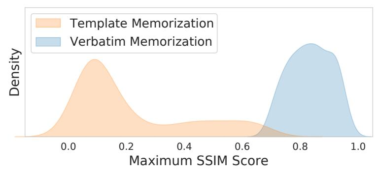

Figure 6: We compare the maximum SSCD score between ten generated images and the original training sample. We categorize the memorized prompts into verbatim memorized if the SSCD score exceeds 0.7 and into template memorized prompts otherwise.

### <span id="page-16-1"></span>C.2 Detailed Analysis of the Distribution of Memorization Neurons

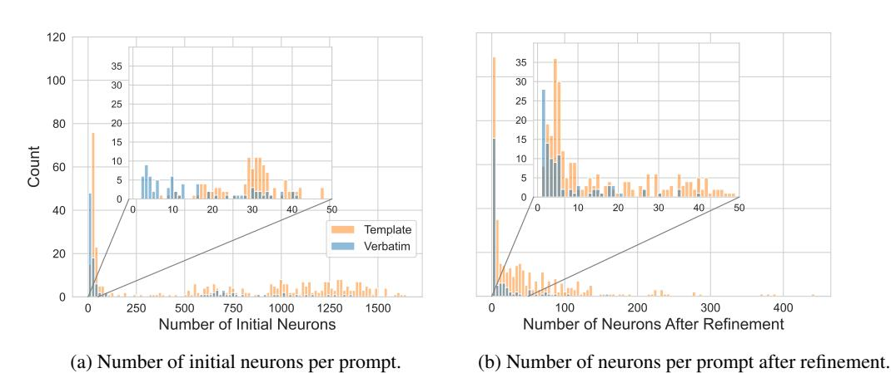

Figure 7: Distribution of Memorization Neurons. We show the number of prompts that are memorized by a fixed number of neurons. (a) plots the number of neurons found in the initial neuron selection. (b) shows the number of neurons after refinement. As we can observe, the refinement step drastically reduces the number of found memorization neurons for both the template and the verbatim memorized prompts.

#### <span id="page-17-0"></span>C.3 Detailed Quality Analysis

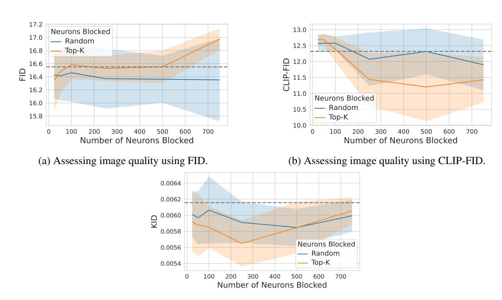

(c) Assessing image quality using KID.

Figure 8: Image Quality Does Not Degrade When Deactivating Memorization Neurons. Depicted are the generated images' FID, CLIP-FID (FID calculated using a CLIP model), and KID scores when blocking an increasing number of neurons. For all three metrics, smaller values are better. As can be seen, the FID, KID, and CLIP-FID values vary only slightly, indicating that blocking neurons identified by NEMO does not negatively affect image generation quality. Gray lines indicate baselines without any neurons blocked. We repeated the experiment with five different seeds. Depicted are the mean values and the standard deviation.

<span id="page-17-1"></span>Table 3: We measured the disentanglement of neurons for deactivating top-k memorization neurons or randomly selected neurons. More specifically, we collected and compared the attention layer outputs for 500 non-memorized prompts with and without neurons deactivated and 3 seeds. We then computed the average cosine similarity between corresponding outputs. The high similarities show that blocking neurons only has a negligible impact on the outputs of the attention layer, suggesting that other neurons can substitute the functionality of blocked neurons on non-memorized prompts.

| Num. Blocked<br>Neurons | 1      |       | 5      |       | 10     |       | 25     |       | 50     |       | 100    |       | 150    |       |
|-------------------------|--------|-------|--------|-------|--------|-------|--------|-------|--------|-------|--------|-------|--------|-------|
| Block<br>Neuron Type    | Random | Top-K | Random | Top-K | Random | Top-K | Random | Top-K | Random | Top-K | Random | Top-K | Random | Top-K |
| 1                       | 1.0    | 1.0   | 1.0    | 0.99  | 1.0    | 0.98  | 0.99   | 0.98  | 0.99   | 0.98  | 0.99   | 0.98  | 0.99   | 0.98  |
| 2                       | 1.0    | 0.99  | 1.0    | 0.99  | 1.0    | 0.99  | 0.99   | 0.98  | 0.99   | 0.98  | 0.99   | 0.98  | 0.99   | 0.98  |
| 3                       | 1.0    | 1.0   | 0.99   | 0.99  | 0.99   | 0.99  | 0.99   | 0.99  | 0.99   | 0.99  | 0.99   | 0.99  | 0.99   | 0.99  |
| 4                       | 1.0    | 1.0   | 1.0    | 0.99  | 0.99   | 0.99  | 0.99   | 0.99  | 0.99   | 0.99  | 0.99   | 0.99  | 0.99   | 0.99  |
| 5                       | 1.0    | 1.0   | 1.0    | 0.99  | 0.99   | 0.99  | 0.99   | 0.99  | 0.99   | 0.99  | 0.99   | 0.99  | 0.99   | 0.99  |
| 6                       | 1.0    | 0.99  | 0.99   | 0.99  | 0.99   | 0.99  | 0.99   | 0.99  | 0.99   | 0.99  | 0.99   | 0.99  | 0.99   | 0.99  |
| 7                       | 0.99   | 0.99  | 0.99   | 0.99  | 0.99   | 0.99  | 0.99   | 0.99  | 0.99   | 0.99  | 0.99   | 0.99  | 0.99   | 0.99  |

We ran additional experiments to analyze the impact and effects of deactivating neurons in the value layers. The result can be seen in Tab. [3.](#page-17-1) We deactivated a varying number of neurons, either randomly selected or the top memorization neurons, and measured the similarity between the outputs of the cross-attention blocks with deactivated neurons and all neurons activated. Our results, stated in the rebuttal PDF, show that even deactivating a large number of neurons only impacts the attention outputs marginally. We, therefore, conclude that other neurons can replace the functionality of specific neurons on non-memorized prompts and that neurons in the value layers act rather independently. Yet, for neurons memorizing specific prompts, this memorizing functionality is not replaced by other neurons, explaining the mitigation effect of deactivating these neurons.

#### <span id="page-18-0"></span>C.4 Highly Memorized Prompts

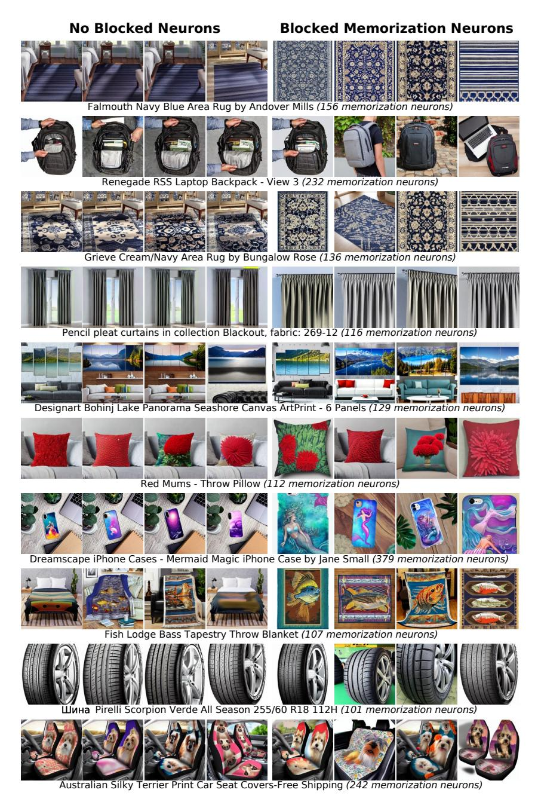

Figure 9: Memorization of highly memorized prompts is distributed across many neurons in various layers, rather than concentrated in a small group of neurons. We show examples of such prompts and the impact of deactivating the identified memorization neurons. The number of memorization neurons in each case is stated behind each prompt.

#### <span id="page-19-0"></span>C.5 Examples for Memorization of Single Neurons

To illustrate that some single neurons are responsible for memorizing multiple training prompts, we generated images with and without these specific neurons deactivated. In Fig. [10](#page-19-1) and Fig. [11,](#page-20-0) we only deactivate a single neuron each in the first value layer, whereas in Fig. [12,](#page-21-0) we deactivate two neurons in the third value layer.

<span id="page-19-1"></span>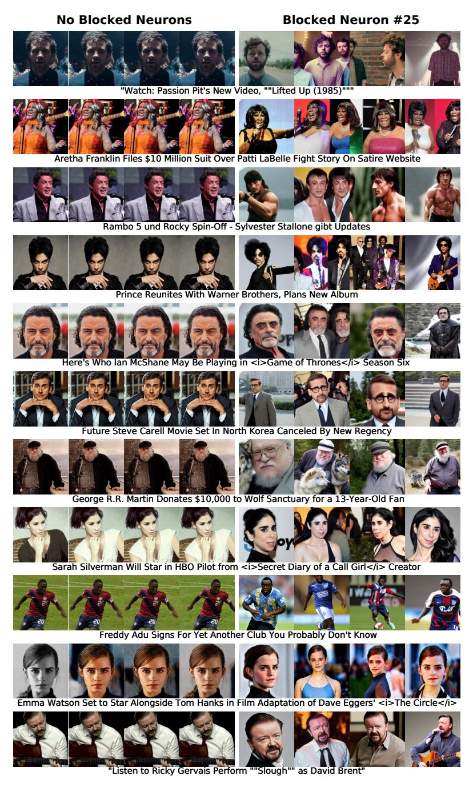

Figure 10: We found that neuron #25 in the first cross-attention layer's value mapping is responsible for verbatim memorization of multiple prompts, all associated with depicting people. Deactivating this single neuron mitigates the memorization and introduces diversity into the images (right columns) compared to images generated with all neurons active (left columns). Generations were conducted with seeds different from the seeds used for the neuron localization process.

<span id="page-20-0"></span>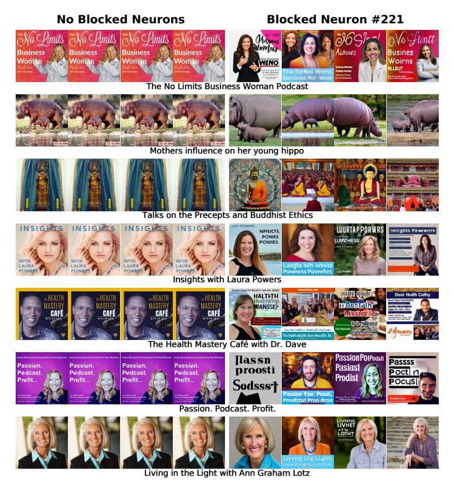

Figure 11: We found that neuron #25 in the first cross-attention layer's value mapping is responsible for verbatim memorization of multiple prompts, all associated with depicting people. Deactivating this single neuron mitigates the memorization and introduces diversity into the images (right columns) compared to images generated with all neurons active (left columns). Generations were conducted with seeds different from the seeds used for the neuron localization process.

<span id="page-21-0"></span>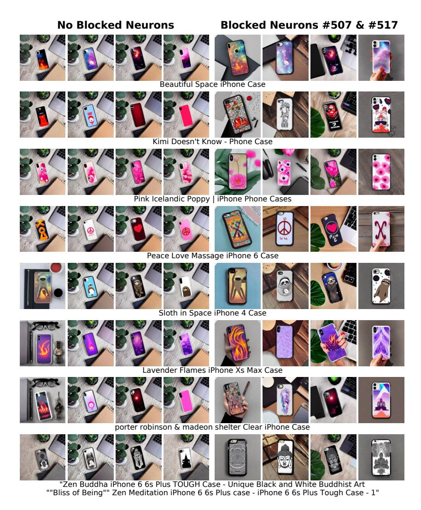

Figure 12: We found that neurons #507 and #517 in the third cross-attention layer's value mapping is responsible for template memorization of multiple prompts describing iPhone cases. Deactivating these two neurons mitigates the template memorization and introduces diversity into the images (right columns) compared to images generated with all neurons active (left columns). Image generations were conducted with a fixed seed different from the seed used for the neuron localization process.

#### <span id="page-22-0"></span>C.6 Comparison of Initial Noise Predictions

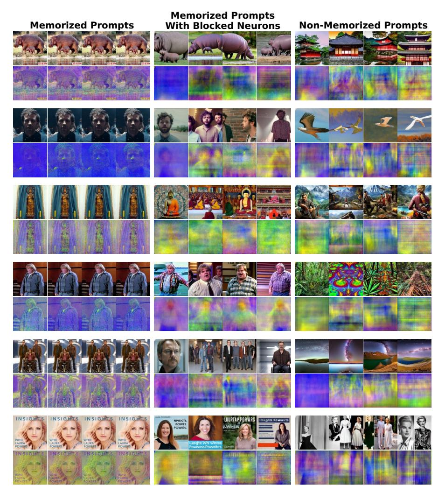

Figure 13: Visualizations for generated images and the noise differences between the predicted noise after the first denoising step and the initial Gaussian noise. Noise differences for memorized prompts (left column) have low diversity and are already structurally similar to the final image. The noise differences for non-memorized prompts (right column) show no clear structure and differ substantially for different noise initializations. Deactivating the memorization neurons detected with NEMO (middle column) removes the structure in the initial noise differences and adds more diversity, leading to diverse image generations.

# <span id="page-23-0"></span>C.7 Ablation Study and Sensitivity Analysis

We conduct an ablation study to investigate the impact of the individual components of NEMO. Additionally, we analyze the sensitivity of the memorization threshold τmem and explore alternatives to deactivating neurons by setting their activations to zero. The results for the various settings are presented in Tab. [4.](#page-24-0)

The first two rows provide evaluation results for the model with *all neurons active* and with *randomly deactivated neurons*. Both scenarios exhibit strong memorization. The third row shows the results of blocking the neurons identified as memorizing by NEMO, using the threshold τmem = 0.428 as specified in the main paper. This threshold corresponds to the mean SSIM memorization plus one standard deviation, calculated on a holdout set of 50,000 non-memorized LAION prompts. In row four, we repeat this setting using classifier-free guidance (*CFG*) with a guidance strength of 7.0, as opposed to our default setting without CFG. Detection with CFG further reduces the number of detected memorization neurons. However, the SSCD scores indicate slightly increased memorization after deactivating the identified neurons. Additionally, running NEMO with CFG doubles the number of forward passes in the U-Net since a separate noise prediction is generated for each initial seed.

Rows five to seven display the results of *varying the memorization threshold* τmem. Specifically, we adjust the threshold to one standard deviation below the mean SSIM score, to the mean, and two standard deviations above the mean. A lower threshold identifies more neurons. However, for lower thresholds, the metrics are comparable to those obtained with our default threshold value (τmem = 0.428). Increasing the threshold reduces the number of identified neurons but slightly increases memorization, as measured by the SSCD scores. Thus, a trade-off exists between reducing the number of identified memorization neurons and their memorization mitigation effect. In addition, we provide heat maps to directly compare the impact of different thresholds τmem used during the initial selection and the refinement step in Fig. [14.](#page-25-0) Fig. [15](#page-26-0) further compares the SSCD scores for varying the threshold values.

Rows eight and nine examine the impact of *removing the refinement step* or incorporating *no neurons with top-k activations* during the initial selection. As anticipated, without refinement, the number of identified neurons increases substantially. Despite this, the various metrics remain comparable to those obtained after the refinement step, even with more neurons deactivated. This underscores the robustness of image generations against pruning out-of-distribution (OOD) neurons. Without the top-k selection, NEMO identifies a larger set of neurons. However, deactivating these neurons does not mitigate memorization as effectively as with a top-k search. Notably, for template verbatim prompts, the SSCDGen is substantially higher without top-k, indicating increased memorization.

In the remaining rows, we explore the impact of *scaling the activations of memorization neurons* instead of deactivating them. With negative scaling factors, the results are comparable to those of completely deactivating the neurons. For positive scaling factors, however, the generated images demonstrate higher degrees of memorization, with a scaling factor of 0.75 having almost no influence on memorization.

We also apply NEMO to a set of 500 LAION *non-memorized prompts*, different from the 50,000 prompts used to set the memorization threshold. For 442 of these prompts, NEMO identified no memorization neurons, which is to be expected since these prompts show no memorization behavior. For the remaining prompts, a median of 62 ± 27 neurons was found.

Table 4: Quantitative Results of Our Ablation Study and Sensitivity Analysis.

<span id="page-24-0"></span>

| Setting                        | Memorization Type | Deactivated Neurons | ↓ SSCDOrig  | ↓ SSCDGen    | ↓ DSSCD     | ↑ ACLIP     |
|--------------------------------|-------------------|---------------------|-------------|--------------|-------------|-------------|
| All Neurons Activate (Default) | Verbatim          | 0                   | 0.83 ± 0.16 | 1.0 ± 0.0    | 0.99 ± 0.01 | 0.32 ± 0.02 |
|                                | Template          | 0                   | 0.04 ± 0.04 | 1.0 ± 0.0    | 0.17 ± 0.06 | 0.31 ± 0.02 |
| Deactivating Random Neurons    | Verbatim          | 4 ± 3               | 0.80 ± 0.11 | 0.999 ± 0.0  | 0.99 ± 0.01 | 0.32 ± 0.02 |
|                                | Template          | 21 ± 18             | 0.05 ± 0.04 | 0.997 ± 0.0  | 0.16 ± 0.06 | 0.31 ± 0.02 |
| = 0.428)                       | Verbatim          | 4 ± 3               | 0.09 ± 0.06 | 0.10 ± 0.07  | 0.16 ± 0.06 | 0.31 ± 0.02 |
| Default Values (τmem           | Template          | 21 ± 18             | 0.05 ± 0.03 | 0.05 ± 0.04  | 0.12 ± 0.05 | 0.31 ± 0.02 |
| With Classifier-Free Guidance  | Verbatim          | 3 ± 2               | 0.09 ± 0.06 | 0.14 ± 0.07  | 0.15 ± 0.06 | 0.31 ± 0.02 |
|                                | Template          | 6 ± 5               | 0.05 ± 0.03 | 0.12 ± 0.07  | 0.11 ± 0.04 | 0.32 ± 0.02 |
| τmem = µ − 1σ = 0.288          | Verbatim          | 10.5 ± 9.5          | 0.08 ± 0.06 | 0.14 ± 0.06  | 0.15 ± 0.05 | 0.32 ± 0.02 |
|                                | Template          | 32.0 ± 27           | 0.06 ± 0.03 | 0.10 ± 0.07  | 0.14 ± 0.05 | 0.31 ± 0.03 |
| τmem = µ = 0.358               | Verbatim          | 6 ± 5               | 0.10 ± 0.06 | 0.14 ± 0.07  | 0.16 ± 0.05 | 0.31 ± 0.02 |
|                                | Template          | 30 ± 25             | 0.06 ± 0.03 | 0.11 ± 0.07  | 0.13 ± 0.04 | 0.31 ± 0.02 |
| τmem = µ + 2σ = 0.498          | Verbatim          | 3 ± 2               | 0.10 ± 0.06 | 0.15 ± 0.07  | 0.15 ± 0.06 | 0.32 ± 0.02 |
|                                | Template          | 7 ± 6               | 0.06 ± 0.03 | 0.12 ± 0.04  | 0.12 ± 0.04 | 0.31 ± 0.03 |
| No Refinement                  | Verbatim          | 26.5 ± 22.5         | 0.07 ± 0.05 | 0.11 ± 0.06  | 0.15 ± 0.06 | 0.32 ± 0.02 |
|                                | Template          | 674.5 ± 624.5       | 0.04 ± 0.03 | 0.09 ± 0.05  | 0.13 ± 0.04 | 0.31 ± 0.02 |
| No top-k Selection             | Verbatim          | 11 ± 10             | 0.11 ± 0.05 | 0.21 ± 0.13  | 0.16 ± 0.04 | 0.32 ± 0.02 |
|                                | Template          | 30 ± 23             | 0.05 ± 0.03 | 0.41 ± 0.32  | 0.13 ± 0.03 | 0.31 ± 0.02 |
| Scaling Factor 0.75            | Verbatim          | 4 ± 3               | 0.79 ± 0.12 | 0.995 ± 0.00 | 0.96 ± 0.04 | 0.32 ± 0.02 |
|                                | Template          | 21 ± 18             | 0.05 ± 0.04 | 0.966 ± 0.03 | 0.15 ± 0.05 | 0.31 ± 0.02 |
| Scaling Factor 0.5             | Verbatim          | 4 ± 3               | 0.62 ± 0.29 | 0.97 ± 0.02  | 0.67 ± 0.33 | 0.32 ± 0.01 |
|                                | Template          | 21 ± 18             | 0.05 ± 0.03 | 0.83 ± 0.15  | 0.14 ± 0.04 | 0.31 ± 0.02 |
| Scaling Factor 0.25            | Verbatim          | 4 ± 3               | 0.20 ± 0.17 | 0.32 ± 0.25  | 0.21 ± 0.12 | 0.32 ± 0.02 |
|                                | Template          | 21 ± 18             | 0.05 ± 0.03 | 0.23 ± 0.16  | 0.12 ± 0.04 | 0.32 ± 0.02 |
| Scaling Factor −0.25           | Verbatim          | 4 ± 3               | 0.09 ± 0.06 | 0.12 ± 0.06  | 0.15 ± 0.05 | 0.32 ± 0.02 |
|                                | Template          | 21 ± 18             | 0.05 ± 0.03 | 0.09 ± 0.06  | 0.13 ± 0.04 | 0.31 ± 0.02 |
| Scaling Factor −0.5            | Verbatim          | 4 ± 3               | 0.08 ± 0.05 | 0.12 ± 0.06  | 0.17 ± 0.06 | 0.31 ± 0.02 |
|                                | Template          | 21 ± 18             | 0.05 ± 0.03 | 0.08 ± 0.05  | 0.13 ± 0.04 | 0.31 ± 0.02 |
| Scaling Factor −0.75           | Verbatim          | 4 ± 3               | 0.08 ± 0.05 | 0.11 ± 0.06  | 0.17 ± 0.06 | 0.31 ± 0.02 |
|                                | Template          | 21 ± 18             | 0.05 ± 0.03 | 0.08 ± 0.05  | 0.14 ± 0.05 | 0.31 ± 0.02 |
| Scaling Factor −1              | Verbatim          | 4 ± 3               | 0.08 ± 0.05 | 0.11 ± 0.07  | 0.16 ± 0.06 | 0.31 ± 0.02 |
|                                | Template          | 21 ± 18             | 0.04 ± 0.03 | 0.07 ± 0.05  | 0.14 ± 0.05 | 0.30 ± 0.02 |

<span id="page-25-0"></span>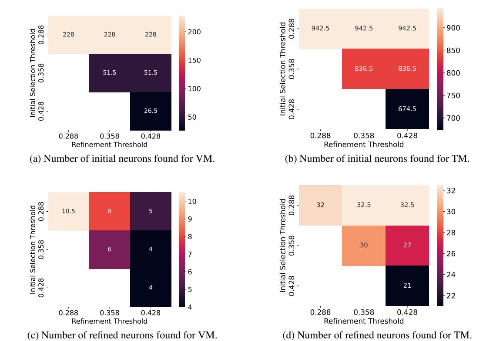

Figure 14: Number of neurons found with different initial and refinement thresholds τmem. The left plots show the results for verbatim memorization prompts, while the right plots show the results for template memorization prompts. The refinement step significantly reduces the number of identified neurons across all threshold combinations. Notably, using 0.428 for both the initial selection and refinement thresholds results in the smallest set of identified neurons.

<span id="page-26-0"></span>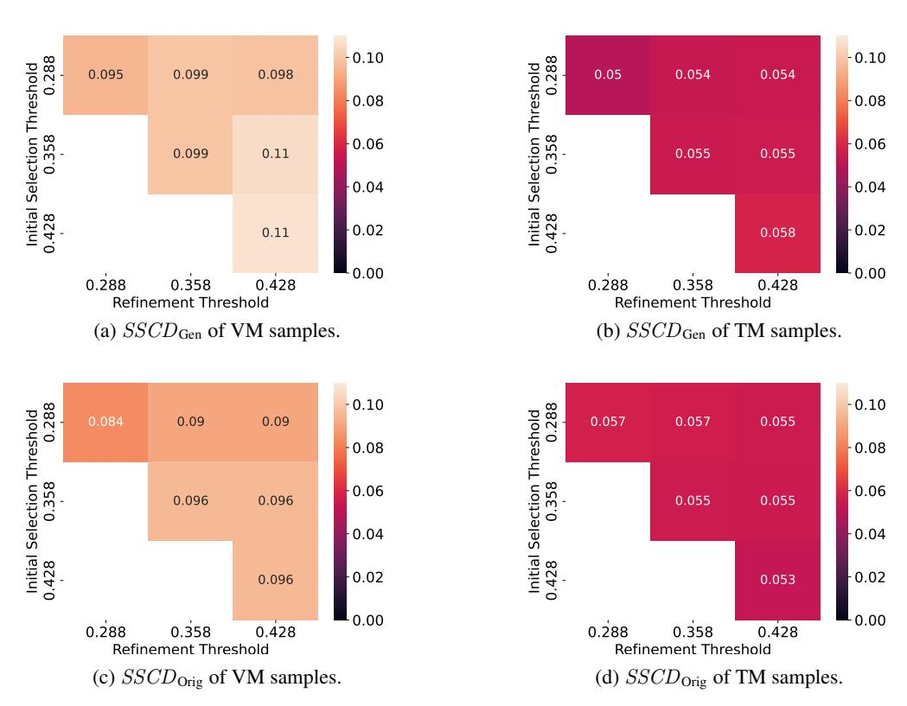

Figure 15: SSCD memorization scores with different initial and refinement thresholds τmem. The left plots show the results for verbatim memorization prompts, while the right plots show the results for template memorization prompts. The value of the thresholds does not seem to have a high impact on the memorization scores. Since higher thresholds identify much less memorization neurons, choosing a threshold of τmem = 0.428 is a valid choice.

#### <span id="page-27-0"></span>C.8 Ablation of Individual Key and Value Layers

During our experiments in the main paper, we limit our search with NEMO for memorization neurons to cross-attention value layers in the down- and mid-blocks of the U-Net. To motivate this decision, we perform an analysis of the influence of neurons in the individual key and value layers of different cross-attention blocks. Let us first recall the computation performed in attention layers:

$$\operatorname{Attention}(Q,K,V) = \operatorname{softmax}\left(\frac{QK^T}{\sqrt{d}}\right) \cdot V \,. \tag{5}$$

The computed key and query matrices K and Q are used to calculate the attention scores, i.e., the weighting of the components in the value matrix V . In the cross-attention layers, the query matrix Q is computed by linearly mapping the current feature maps from the previous U-Net layer. Therefore, information from the textual guidance is only indirectly contained, i.e., of earlier layers or the U-Nets input feature map after the first denoising step. Therefore, we can exclude neurons in the query mapping layers since we aim to identify neurons directly responsible for memorization. The neurons in the key mapping layers directly process the text embeddings to compute the attention scores. However, strong interdependencies exist between the activations of different neurons through the nature of the softmax function. The impact each neuron's activation has on the computed attention score also depends on the activations of all other neurons from the same layer. Removing a single neuron, i.e., setting its activation to zero, does not necessarily imply substantial changes in the attention scores and the corresponding weighting of features from the value mapping layer.

The value mapping layers, however, also directly process the text embeddings, but there is no direct interdependence between the activations of different neurons. Consequently, setting the activations of individual neurons in value layers to zero directly blocks the information flow from the text embeddings. We hypothesize that the neurons in the value layers are mainly responsible for memorizing the text embeddings of specific prompts.

We evaluate this assumption by taking a set of 100 memorized prompts, generating ten samples for each prompt, and comparing the impact of removing neurons from different layers. More specifically, we remove all activations of individual key and value mapping layers, i.e., setting the output vectors of these layers to zero while keeping all other parts of the model untouched. We then compare the generated images with removed activations to the original training images. Fig. [16](#page-28-0) plots the resulting SSCD similarity scores for deactivating individual value (top row) and key (bottom row) layers. We distinguish between verbatim (left column) and template (right column) prompts. The plots show the maximum and median SSCD scores and the deviations for the median scores. We decided not to plot deviations for the maximum score to improve readability. However, deviations are comparable to the median scores. Baselines computed without any deactivated neurons are plotted as dashed lines.

Stable Diffusion contains six cross-attention layers in the down-blocks, one in the mid-block, and nine in the up-blocks. The vertical lines indicate the separation between the different blocks. For the value layers, the layers with indexes 1 (down-lock) and 7 (mid-block) have the highest impact, whereas layers later in the network hardly change the SSCD scores. Also, the effect of the remaining layers in the down-blocks is small on their own. However, we expect there to be entwined effects between deactivating neurons in different layers, which is why we also searched for memorization neurons in these down-block layers.

For the key layers, particularly layers 4 and 6 in the down-blocks have the strongest impact on the generated images. However, removing these layers often produces images that no longer align with the concepts in the prompt or degrades the image quality, both leading to lower SSCD scores. We quantify this behavior by computing the alignments between the generated images and the corresponding input prompts in Fig. [17.](#page-28-1) While deactivating individual value layers only slightly decreases the alignment scores, deactivating some key layers substantially reduces the alignment. To further illustrate this fact, we plot some of the generated images for deactivating individual value layers in Fig. [18](#page-29-0) and for key layers in Fig. [19.](#page-30-0)

<span id="page-28-0"></span>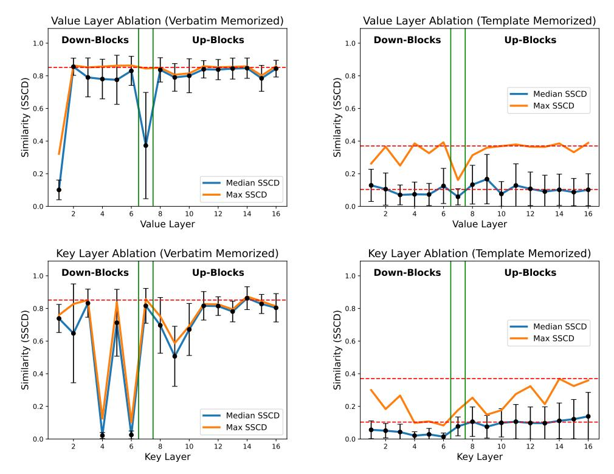

Figure 16: SSCD similarity scores between memorized generations and the corresponding training samples. Scores are computed for 100 prompts and ten different seeds per generation. We then take the maximum and median scores of each prompt. During the generation, we deactivated individual value and key layers of the cross-attention blocks in the network. A lower SSCD score indicates a lower similarity between generated and training images. Dashed lines denote the median and the maximum SSCD baselines for images generated without deactivating any neurons. For verbatim memorized prompts, both baselines are close, which is why we only plot the median SSCD baseline.

<span id="page-28-1"></span>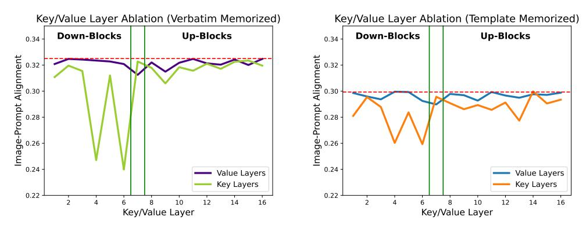

Figure 17: CLIP alignment scores between memorized generations and the corresponding input prompt. Scores are computed for 100 prompts and ten different seeds per generation. We then take the median alignment scores of each prompt. During the generation, we deactivated individual value and key layers of the cross-attention blocks in the network. A higher alignment score indicates a better representation of the prompt concepts in the generated images. Dashed lines denote the median alignment scores for images generated without deactivating any neurons. For both types of memorization, deactivating value layers decreases the alignment only slightly, whereas deactivating some key layers substantially reduces the alignment.

<span id="page-29-0"></span>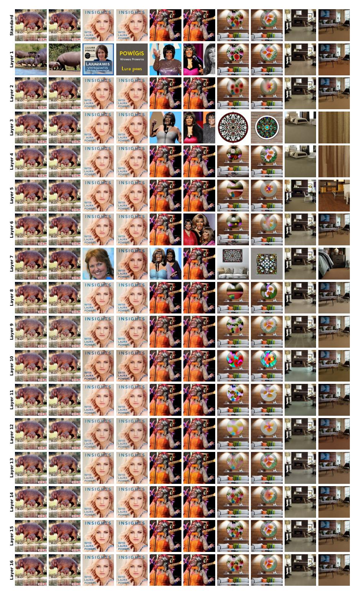

Figure 18: Images generated with memorized prompts with deactivated individual value layers. Whereas the *standard* row shows generations with keeping all neurons active, the following rows depict results for deactivating all neurons in a specific value layer.

<span id="page-30-0"></span>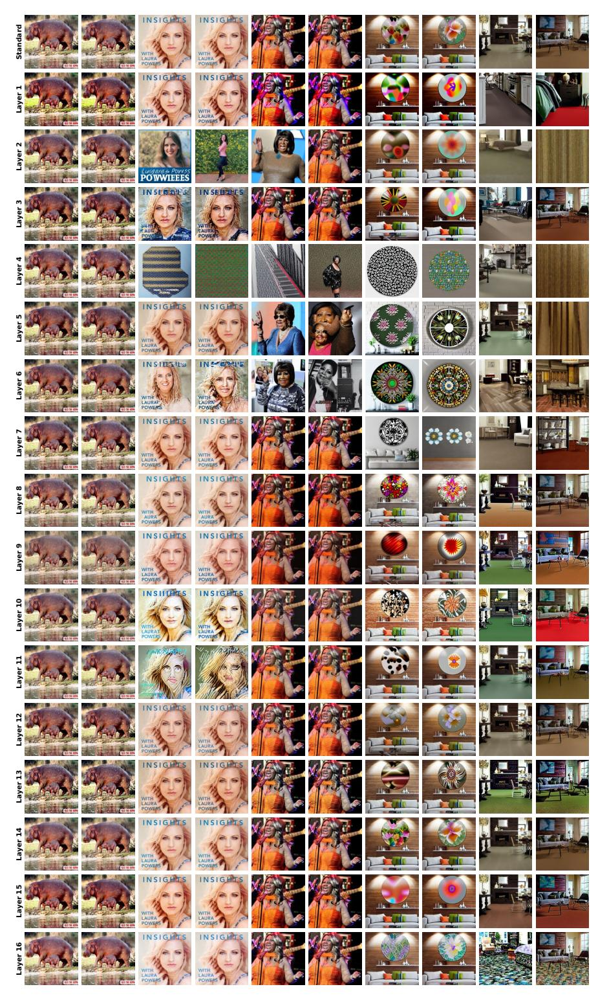

Figure 19: Images generated with memorized prompts with deactivated individual key layers. Whereas the *standard* row shows generations with keeping all neurons active, the following rows depict results for deactivating all neurons in a specific key layer.

#### <span id="page-31-0"></span>C.9 Ablation of Individual Convolutional Layers

We also experimented with deactivating neurons in other U-Net layers, including both convolutional and fully connected layers, but we did not find any indicators of memorization in these units. Even when deactivating numerous neurons in the convolutional and fully connected layers of the U-Net, the memorized training images were still faithfully reproduced. However, the quality of the images degraded, particularly when deactivating neurons in early layers, which are responsible for defining the image structure. We showcase in Fig. [20](#page-31-1) various examples of memorized images generated with 50% deactivated neurons in the convolutional layers to illustrate that these neurons have no noticeable impact on the memorization behavior. However, deactivating too many neurons in early layers can negatively affect the overall generation process. So, to conclude, deactivating other neurons in the U-Net didn't seem to impact memorization, which is why our choice to focus on the value layers seems reasonable.

<span id="page-31-1"></span>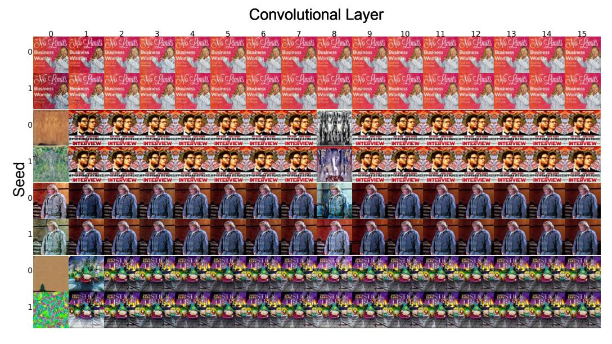

Figure 20: For each convolutional layer in the U-Net's down blocks, we randomly deactivated 50% of the neurons. The results demonstrate that blocking neurons in the convolutional layers does not mitigate memorization. Instead, deactivating the neurons reduces the quality of the generated images and, in some cases, causes the entire generation process to collapse, especially when neurons in the early layers are deactivated.

# <span id="page-32-0"></span>D Algorithmic Description of NeMo

# D.1 Computing Noise Differences

Alg. [1](#page-32-1) defines our algorithm to compute the differences between the initial noise samples and the noise predicted during the first denoising step. The resulting noise differences are used to compute our SSIM-based memorization score during the initial neuron selection and the refinement step. We compute the noise differences always for n = 10 different seeds to avoid undesired biases due to the random sampling process. We further remove noise differences from the set, which have low similarity with other noise differences. By this step, we remove noise differences for seeds that do not lead to memorization and might mislead the algorithm.

# <span id="page-32-1"></span>Algorithm 1 Compute Noise Differences Input: Prompt embedding y ▷ Text prompt (embedding) Neuron set Sneurons ▷ Set of neurons to deactivate Noise predictor ϵ<sup>θ</sup> ▷ Diffusion model Memorization threshold (SSIM) τmem ▷ Target memorization score Output: Noise differences ∆ Set ∆ as empty list ▷ Initialize list of noise differences ϵ˜<sup>θ</sup> ← deactivate\_neurons(ϵθ, SNeurons) ▷ Set activations of neurons in Sneurons to zero *// Compute noise differences for each random seed* for i = 1, . . . , 10 do ▷ Iterate over 10 seeds set\_seed(i) ▷ Set random seed to i sample x<sup>T</sup> ∼ N (0, I) ▷ Randomly initialize noise image x<sup>T</sup> <sup>−</sup><sup>1</sup> ← ϵ˜θ(x<sup>T</sup> , T, y) ▷ Compute noise prediction δ ← x<sup>T</sup> <sup>−</sup><sup>1</sup> − x<sup>T</sup> ▷ Compute noise difference δ ← <sup>δ</sup>−min(δ) max(δ)−min(δ) ▷ Normalize differences by min-max scaling append δ to ∆ ▷ Add current noise difference to list end for *// Remove noise differences not leading to memorization* for δ ∈ ∆ do ▷ Iterate over noise differences ∆¯ ← ∆ \ δ ▷ Get set of noise differences without δ d ← compute\_memorization(δ, ∆) ¯ ▷ Compute pairwise memorization scores (SSIM) if max(d) < τmem then ▷ Highest memorization score is below threshold ∆ ← ∆ \ δ ▷ Remove noise difference from set end if end for return ∆ ▷ Return list of noise differences

#### <span id="page-33-1"></span>D.2 Detecting Neurons with Out-of-Distribution Activations

Alg. [2](#page-33-0) describes our method to detect neurons with out-of-distribution (OOD) activations. Our method detects OOD neurons based on their activation distance for a memorized prompt to a neuron's mean activation computed on a hold-out dataset of non-memorized prompts. In addition, we also add the k neurons with the highest absolute activations within each layer to the set.

# <span id="page-33-0"></span>Algorithm 2 Get OOD Neurons

```
Input:
 Prompt embedding y ▷ Text prompt (embedding)
 Activation threshold θact ▷ Threshold for the OOD detection
 Top k ▷ Value of top-k detection
 Activation mean µ and standard deviation σ ▷ Activation statistics of hold-out dataset
Output: Set of neurons with OOD activations Sinitial
 Sactivations ← collect_activations(y) ▷ Collect activations on prompt
 Sinitial ← {} ▷ Initialize empty neuron set
 // Check each neuron in each layer for OOD activation
 for l ∈ {1, . . . , L} do ▷ Iterate over all layers
    for i ∈ {1, . . . , N} do ▷ Iterate over all N neurons in layer l
       z
       l
       i
        (y) = a
              i
              (y)−µ
                  i
               σ
                                           ▷ Compute z-score for current neuron
       if z
         l
         i
         (y) > θact then ▷ Activation above OOD threshold
         Sinitial ← Sinitial ∪ {neuronl
                            i
                            } ▷ Add OOD neuron to set
       end if
    end for
    // Add k neurons of layer l with the highest absolute activations to the candidate set
    Stopk ← top_k_activations(Sactivations, l, k) ▷ Get neurons with highest absolute activations
    Sinitial ← Sinitial ∪ Stopk ▷ Add top-k neurons to set
 end for
 return Sinitial ▷ Return set with OOD neurons
```

#### <span id="page-34-1"></span>D.3 Selecting Initial Candidates of Memorization Neurons

Alg. [3](#page-34-0) defines our algorithm to compute the initial set of memorization neurons. The resulting initial set of selected memorization neurons is then refined in a second step, shown in Alg. [4.](#page-35-0)

```
Algorithm 3 Initial Neuron Selection
Input:
 Prompt embedding y ▷ Text prompt embedding
 Memorization threshold (SSIM) τmem ▷ Target memorization score
 Minimum activation threshold θmin ▷ Threshold for stopping neuron search
Output: Set of neuron candidates Sinitial, refinement memorization threshold τmem_ref
 Candidate set of memorization neurons Sinitial ▷ Initial memorizing neuron set
 Memorization threshold (SSIM) τmem_ref ▷ Memorization threshold for refinement
 mem ← 1.0 ▷ Initialize memorization score as maximum
 θact ← 5 ▷ Initialize threshold of OOD activation detection
 k ← 0 ▷ Initialize k for top-k activation detection
 τmem_ref ← τmem ▷ Set refinement memorization threshold to current threshold
 ∆unblocked ← get_noise_diff(y, ∅) ▷ Noise differences with all neurons active
 // Increase set of candidate neurons until target memorization score is reached
 while mem > τmem do ▷ While memorization score above threshold
    Sinitial ← get_ood_neurons(y, θact, k) ▷ Detect neurons with OOD activations
    ∆blocked ← get_noise_diff(y, Sinitial) ▷ Compute noise differences
    mem ← compute_memorization(∆unblocked, ∆blocked) ▷ Compute memorization score (SSIM)
    if θact < θmin then ▷ Minimum activation threshold not reached
       τmem_ref ← mem ▷ Set refinement threshold to current memorization score
       break ▷ Stop if activation threshold is too low
    end if
    // Adjust OOD detection parameters to increase set of candidate neurons
    θact ← θact − 0.25 ▷ Decrease threshold for OOD detection
```

k ← k + 1 ▷ Increase k for top-k activation detection

end while

return Sinitial, τmem\_ref ▷ Return neuron candidates and refinement memorization threshold

# <span id="page-35-1"></span>D.4 Neuron Selection Refinement

end for end for

Alg. [4](#page-35-0) defines our algorithm to refine the set of candidate neurons identified from NEMO's initial selection step.

# <span id="page-35-0"></span>Algorithm 4 Neuron Selection Refinement Input: Initial memorization neuron candidate set Sinitial ▷ Given neuron candidate set Memorization threshold (SSIM) τmem\_ref ▷ Refinement memorization score threhsold Output: memorization neurons Srefined ▷ Refined set of memorization neurons Srefined ← Sinitial ∆unblocked ← get\_noise\_diff(y, ∅) ▷ Noise differences with all neurons active *// Check all candidate neurons of individual layers at once for memorization* for l ∈ {1, . . . , L} do ▷ Iterate over all layers to remove low impact layers Slayer ← get\_neurons\_in\_layer(Srefined, l) ▷ Get the neurons in the current layer l Sneurons ← Srefined \ Slayer ▷ Compute set of neurons from remaining layers ∆blocked ← get\_noise\_diff(y, Sneurons) ▷ Compute noise differences mem ← compute\_memorization(∆unblocked, ∆blocked) ▷ Compute memorization score (SSIM) if mem < τmem\_ref then ▷ Minimum memorization threshold not reached Srefined ← Srefined \ Slayer ▷ Remove neurons of layer l from neuron set end if end for *// Check all remaining candidate neurons individually* for l ∈ {1, . . . , L} do ▷ Iterate over each remaining layer Slayer ← get\_neurons\_in\_layer(Srefined, l) ▷ Get the neurons in the current layer l for n ∈ Slayer do Sneurons ← Srefined \ {n} ▷ Compute set of neurons without neuron n ∆blocked ← get\_noise\_diff(y, Sneurons) ▷ Compute noise differences mem ← compute\_memorization(∆unblocked, ∆blocked) ▷ Compute mem. score (SSIM) if mem < τmem\_ref then ▷ Minimum memorization threshold not reached Srefined ← Srefined \ {n} ▷ Remove current neuron from set end if

return Srefined ▷ Return refined set of memorization neurons

# NeurIPS Paper Checklist

# 1. Claims

Question: Do the main claims made in the abstract and introduction accurately reflect the paper's contributions and scope?

Answer: [Yes]

Justification: All claims and promises made in the abstract and introduction are accurately reflected in the paper by a clear formal description (Section [3\)](#page-3-1) and an extensive experimental evaluation (Section [4\)](#page-5-1).

# Guidelines:

- The answer NA means that the abstract and introduction do not include the claims made in the paper.
- The abstract and/or introduction should clearly state the claims made, including the contributions made in the paper and important assumptions and limitations. A No or NA answer to this question will not be perceived well by the reviewers.
- The claims made should match theoretical and experimental results, and reflect how much the results can be expected to generalize to other settings.
- It is fine to include aspirational goals as motivation as long as it is clear that these goals are not attained by the paper.

#### 2. Limitations

Question: Does the paper discuss the limitations of the work performed by the authors?

Answer: [Yes]

Justification: We discuss limitations in Appx. [A.](#page-14-1)

### Guidelines:

- The answer NA means that the paper has no limitation while the answer No means that the paper has limitations, but those are not discussed in the paper.
- The authors are encouraged to create a separate "Limitations" section in their paper.
- The paper should point out any strong assumptions and how robust the results are to violations of these assumptions (e.g., independence assumptions, noiseless settings, model well-specification, asymptotic approximations only holding locally). The authors should reflect on how these assumptions might be violated in practice and what the implications would be.
- The authors should reflect on the scope of the claims made, e.g., if the approach was only tested on a few datasets or with a few runs. In general, empirical results often depend on implicit assumptions, which should be articulated.
- The authors should reflect on the factors that influence the performance of the approach. For example, a facial recognition algorithm may perform poorly when image resolution is low or images are taken in low lighting. Or a speech-to-text system might not be used reliably to provide closed captions for online lectures because it fails to handle technical jargon.
- The authors should discuss the computational efficiency of the proposed algorithms and how they scale with dataset size.
- If applicable, the authors should discuss possible limitations of their approach to address problems of privacy and fairness.
- While the authors might fear that complete honesty about limitations might be used by reviewers as grounds for rejection, a worse outcome might be that reviewers discover limitations that aren't acknowledged in the paper. The authors should use their best judgment and recognize that individual actions in favor of transparency play an important role in developing norms that preserve the integrity of the community. Reviewers will be specifically instructed to not penalize honesty concerning limitations.

#### 3. Theory Assumptions and Proofs

Question: For each theoretical result, does the paper provide the full set of assumptions and a complete (and correct) proof?

Answer: [NA]

Justification: The paper does not include any theoretical proof but offers a practical method (Section [3\)](#page-3-1) to detect and localize memorization in diffusion models.

#### Guidelines:

- The answer NA means that the paper does not include theoretical results.
- All the theorems, formulas, and proofs in the paper should be numbered and cross-referenced.
- All assumptions should be clearly stated or referenced in the statement of any theorems.
- The proofs can either appear in the main paper or the supplemental material, but if they appear in the supplemental material, the authors are encouraged to provide a short proof sketch to provide intuition.
- Inversely, any informal proof provided in the core of the paper should be complemented by formal proofs provided in appendix or supplemental material.
- Theorems and Lemmas that the proof relies upon should be properly referenced.

# 4. Experimental Result Reproducibility

Question: Does the paper fully disclose all the information needed to reproduce the main experimental results of the paper to the extent that it affects the main claims and/or conclusions of the paper (regardless of whether the code and data are provided or not)?

Answer: [Yes]

Justification: We describe all settings, models, datasets, and hyperparameters used during our experiments in Section [4](#page-5-1) and in Appx. [B.](#page-14-2) Appx. [D](#page-32-0) further provides detailed algorithmic descriptions for all steps of our method. Therefore, we expect reproduction to be possible regardless of whether the code is provided.

#### Guidelines:

- The answer NA means that the paper does not include experiments.
- If the paper includes experiments, a No answer to this question will not be perceived well by the reviewers: Making the paper reproducible is important, regardless of whether the code and data are provided or not.
- If the contribution is a dataset and/or model, the authors should describe the steps taken to make their results reproducible or verifiable.
- Depending on the contribution, reproducibility can be accomplished in various ways. For example, if the contribution is a novel architecture, describing the architecture fully might suffice, or if the contribution is a specific model and empirical evaluation, it may be necessary to either make it possible for others to replicate the model with the same dataset, or provide access to the model. In general. releasing code and data is often one good way to accomplish this, but reproducibility can also be provided via detailed instructions for how to replicate the results, access to a hosted model (e.g., in the case of a large language model), releasing of a model checkpoint, or other means that are appropriate to the research performed.
- While NeurIPS does not require releasing code, the conference does require all submissions to provide some reasonable avenue for reproducibility, which may depend on the nature of the contribution. For example
  - (a) If the contribution is primarily a new algorithm, the paper should make it clear how to reproduce that algorithm.
  - (b) If the contribution is primarily a new model architecture, the paper should describe the architecture clearly and fully.
  - (c) If the contribution is a new model (e.g., a large language model), then there should either be a way to access this model for reproducing the results or a way to reproduce the model (e.g., with an open-source dataset or instructions for how to construct the dataset).
  - (d) We recognize that reproducibility may be tricky in some cases, in which case authors are welcome to describe the particular way they provide for reproducibility. In the case of closed-source models, it may be that access to the model is limited in some way (e.g., to registered users), but it should be possible for other researchers to have some path to reproducing or verifying the results.

#### 5. Open access to data and code

Question: Does the paper provide open access to the data and code, with sufficient instructions to faithfully reproduce the main experimental results, as described in supplemental material?

Answer: [Yes]

Justification: The code is publicly available, including all datasets required for reproduction. The README file within the code base explains each step, including the dataset, models, localization algorithm, and the computation of metrics, in detail.

### Guidelines:

- The answer NA means that paper does not include experiments requiring code.
- Please see the NeurIPS code and data submission guidelines ([https://nips.cc/public/](https://nips.cc/public/guides/CodeSubmissionPolicy) [guides/CodeSubmissionPolicy](https://nips.cc/public/guides/CodeSubmissionPolicy)) for more details.
- While we encourage the release of code and data, we understand that this might not be possible, so "No" is an acceptable answer. Papers cannot be rejected simply for not including code, unless this is central to the contribution (e.g., for a new open-source benchmark).
- The instructions should contain the exact command and environment needed to run to reproduce the results. See the NeurIPS code and data submission guidelines ([https://nips.cc/public/](https://nips.cc/public/guides/CodeSubmissionPolicy) [guides/CodeSubmissionPolicy](https://nips.cc/public/guides/CodeSubmissionPolicy)) for more details.
- The authors should provide instructions on data access and preparation, including how to access the raw data, preprocessed data, intermediate data, and generated data, etc.
- The authors should provide scripts to reproduce all experimental results for the new proposed method and baselines. If only a subset of experiments are reproducible, they should state which ones are omitted from the script and why.
- At submission time, to preserve anonymity, the authors should release anonymized versions (if applicable).
- Providing as much information as possible in supplemental material (appended to the paper) is recommended, but including URLs to data and code is permitted.

# 6. Experimental Setting/Details

Question: Does the paper specify all the training and test details (e.g., data splits, hyperparameters, how they were chosen, type of optimizer, etc.) necessary to understand the results?

Answer: [Yes]

Justification: We stated all experimental details in Section [4](#page-5-1) and provide additional details in Appx. [B.](#page-14-2) We also state all used hyperparameters within our code base.

#### Guidelines:

- The answer NA means that the paper does not include experiments.
- The experimental setting should be presented in the core of the paper to a level of detail that is necessary to appreciate the results and make sense of them.
- The full details can be provided either with the code, in appendix, or as supplemental material.

### 7. Experiment Statistical Significance

Question: Does the paper report error bars suitably and correctly defined or other appropriate information about the statistical significance of the experiments?

Answer: [Yes]

Justification: We provide results computed on a sufficiently large dataset, including the variability for all experimental results in the paper (Section [4\)](#page-5-1). All experiments were performed with ten seeds to provide statistically stable results. We also provide an ablation and sensitivity analysis to add further insights into the robustness and stability of our method and the results.

# Guidelines:

- The answer NA means that the paper does not include experiments.
- The authors should answer "Yes" if the results are accompanied by error bars, confidence intervals, or statistical significance tests, at least for the experiments that support the main claims of the paper.
- The factors of variability that the error bars are capturing should be clearly stated (for example, train/test split, initialization, random drawing of some parameter, or overall run with given experimental conditions).
- The method for calculating the error bars should be explained (closed form formula, call to a library function, bootstrap, etc.)

- The assumptions made should be given (e.g., Normally distributed errors).
- It should be clear whether the error bar is the standard deviation or the standard error of the mean.
- It is OK to report 1-sigma error bars, but one should state it. The authors should preferably report a 2-sigma error bar than state that they have a 96% CI, if the hypothesis of Normality of errors is not verified.
- For asymmetric distributions, the authors should be careful not to show in tables or figures symmetric error bars that would yield results that are out of range (e.g. negative error rates).
- If error bars are reported in tables or plots, The authors should explain in the text how they were calculated and reference the corresponding figures or tables in the text.

# 8. Experiments Compute Resources

Question: For each experiment, does the paper provide sufficient information on the computer resources (type of compute workers, memory, time of execution) needed to reproduce the experiments?

Answer: [Yes]

Justification: We state all hardware and software details in Appx. [B.1.](#page-14-3) We also provide our complete source code and a docker image for reproduction.

#### Guidelines:

- The answer NA means that the paper does not include experiments.
- The paper should indicate the type of compute workers CPU or GPU, internal cluster, or cloud provider, including relevant memory and storage.
- The paper should provide the amount of compute required for each of the individual experimental runs as well as estimate the total compute.
- The paper should disclose whether the full research project required more compute than the experiments reported in the paper (e.g., preliminary or failed experiments that didn't make it into the paper).

#### 9. Code Of Ethics

Question: Does the research conducted in the paper conform, in every respect, with the NeurIPS Code of Ethics <https://neurips.cc/public/EthicsGuidelines>?

Answer: [Yes]

Justification: Our research identifies neurons in text-to-image systems that are responsible for memorizing training samples. We strongly believe that our research has no negative societal impact or potentially harmful consequences. In stark contrast, our research tackles the memorization problem in diffusion models and might support the development of models and methods to mitigate such undesired memorization.

# Guidelines:

- The answer NA means that the authors have not reviewed the NeurIPS Code of Ethics.
- If the authors answer No, they should explain the special circumstances that require a deviation from the Code of Ethics.
- The authors should make sure to preserve anonymity (e.g., if there is a special consideration due to laws or regulations in their jurisdiction).

#### 10. Broader Impacts

Question: Does the paper discuss both potential positive societal impacts and negative societal impacts of the work performed?

Answer: [Yes]

Justification: We discuss our method's broader impact and advantages in localizing neurons responsible for memorization in diffusion models (Section [5\)](#page-9-0). Localizing such memorization neurons is an effective way of mitigating memorization. We do not expect any potential malicious or unintended uses of our method.

- The answer NA means that there is no societal impact of the work performed.
- If the authors answer NA or No, they should explain why their work has no societal impact or why the paper does not address societal impact.

- Examples of negative societal impacts include potential malicious or unintended uses (e.g., disinformation, generating fake profiles, surveillance), fairness considerations (e.g., deployment of technologies that could make decisions that unfairly impact specific groups), privacy considerations, and security considerations.
- The conference expects that many papers will be foundational research and not tied to particular applications, let alone deployments. However, if there is a direct path to any negative applications, the authors should point it out. For example, it is legitimate to point out that an improvement in the quality of generative models could be used to generate deepfakes for disinformation. On the other hand, it is not needed to point out that a generic algorithm for optimizing neural networks could enable people to train models that generate Deepfakes faster.
- The authors should consider possible harms that could arise when the technology is being used as intended and functioning correctly, harms that could arise when the technology is being used as intended but gives incorrect results, and harms following from (intentional or unintentional) misuse of the technology.
- If there are negative societal impacts, the authors could also discuss possible mitigation strategies (e.g., gated release of models, providing defenses in addition to attacks, mechanisms for monitoring misuse, mechanisms to monitor how a system learns from feedback over time, improving the efficiency and accessibility of ML).

#### 11. Safeguards

Question: Does the paper describe safeguards that have been put in place for responsible release of data or models that have a high risk for misuse (e.g., pretrained language models, image generators, or scraped datasets)?

Answer: [NA]

Justification: We do not develop or release any kind of new model or dataset. Instead, we only investigate existing, publicly available models and datasets.

# Guidelines:

- The answer NA means that the paper poses no such risks.
- Released models that have a high risk for misuse or dual-use should be released with necessary safeguards to allow for controlled use of the model, for example by requiring that users adhere to usage guidelines or restrictions to access the model or implementing safety filters.
- Datasets that have been scraped from the Internet could pose safety risks. The authors should describe how they avoided releasing unsafe images.
- We recognize that providing effective safeguards is challenging, and many papers do not require this, but we encourage authors to take this into account and make a best faith effort.

# 12. Licenses for existing assets

Question: Are the creators or original owners of assets (e.g., code, data, models), used in the paper, properly credited and are the license and terms of use explicitly mentioned and properly respected?

Answer: [Yes]

Justification: We explicitly state the origin of data and models in the paper and properly credit the source of these assets (Appx. [B.2\)](#page-14-4). The authors wrote the code for conducting the experiments by themselves. Any code snippets taken from external sources are explicitly marked.

# Guidelines:

- The answer NA means that the paper does not use existing assets.
- The authors should cite the original paper that produced the code package or dataset.
- The authors should state which version of the asset is used and, if possible, include a URL.
- The name of the license (e.g., CC-BY 4.0) should be included for each asset.
- For scraped data from a particular source (e.g., website), the copyright and terms of service of that source should be provided.
- If assets are released, the license, copyright information, and terms of use in the package should be provided. For popular datasets, <paperswithcode.com/datasets> has curated licenses for some datasets. Their licensing guide can help determine the license of a dataset.

- For existing datasets that are re-packaged, both the original license and the license of the derived asset (if it has changed) should be provided.
- If this information is not available online, the authors are encouraged to reach out to the asset's creators.

### 13. New Assets

Question: Are new assets introduced in the paper well documented and is the documentation provided alongside the assets?

Answer: [NA]

Justification: Our paper releases no new assets. All models and datasets used in our experiments are publicly available (Appx. [B.2\)](#page-14-4).

### Guidelines:

- The answer NA means that the paper does not release new assets.
- Researchers should communicate the details of the dataset/code/model as part of their submissions via structured templates. This includes details about training, license, limitations, etc.
- The paper should discuss whether and how consent was obtained from people whose asset is used.
- At submission time, remember to anonymize your assets (if applicable). You can either create an anonymized URL or include an anonymized zip file.

# 14. Crowdsourcing and Research with Human Subjects

Question: For crowdsourcing experiments and research with human subjects, does the paper include the full text of instructions given to participants and screenshots, if applicable, as well as details about compensation (if any)?

Answer: [NA]

Justification: We did not conduct any kind of crowdsourcing experiments or research with human subjects at any point.

### Guidelines:

- The answer NA means that the paper does not involve crowdsourcing nor research with human subjects.
- Including this information in the supplemental material is fine, but if the main contribution of the paper involves human subjects, then as much detail as possible should be included in the main paper.
- According to the NeurIPS Code of Ethics, workers involved in data collection, curation, or other labor should be paid at least the minimum wage in the country of the data collector.

# 15. Institutional Review Board (IRB) Approvals or Equivalent for Research with Human Subjects

Question: Does the paper describe potential risks incurred by study participants, whether such risks were disclosed to the subjects, and whether Institutional Review Board (IRB) approvals (or an equivalent approval/review based on the requirements of your country or institution) were obtained?

Answer: [NA]

Justification: We did not conduct any kind of crowdsourcing experiments or research with human subjects at any point.

# Guidelines:

- The answer NA means that the paper does not involve crowdsourcing nor research with human subjects.
- Depending on the country in which research is conducted, IRB approval (or equivalent) may be required for any human subjects research. If you obtained IRB approval, you should clearly state this in the paper.
- We recognize that the procedures for this may vary significantly between institutions and locations, and we expect authors to adhere to the NeurIPS Code of Ethics and the guidelines for their institution.

• For initial submissions, do not include any information that would break anonymity (if applica-

ble), such as the institution conducting the review.