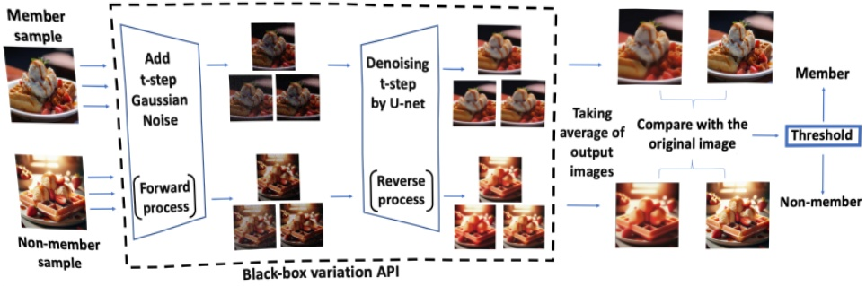
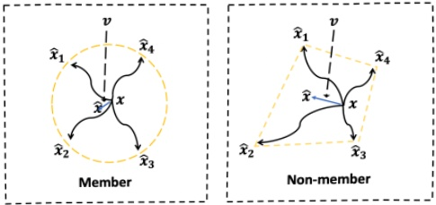

Figure 1: The overview of REDIFFUSE. We independently input the image to the variation API n times with diffusion step t. We take the average of the output images and compare them with the original ones. If the difference is below a certain threshold, we determine that the image is in the training set.

sample  $ x_0 $ and a time step  $ t \in \mathcal{T} $:

 $$ L(\theta)=\mathbb{E}_{\epsilon\sim\mathcal{N}(0,\mathbf{I})}\left[\left\|\epsilon-\epsilon_{\theta}\left(\sqrt{\bar{\alpha}_{t}}x_{0}+\sqrt{1-\bar{\alpha}_{t}}\epsilon,t\right)\right\|^{2}\right]. $$ 

Denote  $ x_t = \sqrt{\bar{\alpha}_t} x_0 + \sqrt{1 - \bar{\alpha}_t} \epsilon $, we assume that the denoise model is expressive enough (the neural network's dimensionality significantly exceeds that of the image data) such that for the input  $ x_0 \in \mathbb{R}^d $ and time step  $ t \in \mathcal{T} $, the Jacobian matrix  $ \nabla_{\theta} \epsilon_{\theta}(x_t, t) $ is full rank ( $ \geq d $). This suggests that the model can adjust the predicted noise  $ \epsilon_{\theta}(x_t, t) $ locally in any direction. Then for a well trained model, we would have  $ \nabla_{\theta} L(\theta) = 0 $. This implies

 $$ \begin{align*}&\Longrightarrow\nabla_{\theta}\epsilon_{\theta}(x_{t},t)^{T}\mathbb{E}_{\epsilon\sim\mathcal{N}(0,\mathbf{I})}\left[\epsilon-\epsilon_{\theta}\left(x_{t},t\right)\right]=0,\\&\Longrightarrow\mathbb{E}_{\epsilon\sim\mathcal{N}(0,\mathbf{I})}\left[\epsilon-\epsilon_{\theta}\left(x_{t},t\right)\right]=0.\end{align*} $$ 

This is intuitive because if the neural network noise prediction exhibits a high bias, the network can adjust to fit the bias term, further reducing the training loss.

Therefore, for images in the training set, we expect the network to provide an unbiased noise prediction. Since the noise prediction is typically inaccessible in practical applications, we use the reconstructed sample  $ \hat{x} $ as a proxy. By leveraging the unbiasedness of noise prediction, we show that averaging over multiple independent reconstructed samples  $ \hat{x}_i $ can significantly reduce estimation error (see Theorem 4.2). However, for images not in the training set, the neural network may not provide an unbiased prediction at these points. The intuition is illustrated in Figure 2.

With the above intuition, we introduce the details of our algorithm. We independently apply the variation API n times with our target image x as input, average the output images, and then compare the average result  $ \hat{x} $ with the original image. We will discuss the impact of the averaging number n in Section 5.5. We then evaluate the difference between the images using an indicator function:

 $$ f(x)=\mathbf{1}\left[D(x,\hat{x})<\tau\right]. $$ 

Figure 2: The intuition of our algorithm design. We denote $x$ as the target image, $\hat{x}_i$ as the $i$-th image generated by the variation API, and $\hat{x}$ as the average image of them. For member image $x$, the difference $v = x - \hat{x}$ will be smaller after averaging due to $x_i$ being an unbiased estimator.

Our algorithm classifies a sample as being in the training set if  $ D(x, \hat{x}) $ is smaller than a threshold  $ \tau $, where  $ D(x, \hat{x}) $ represents the difference between the two images. It can be calculated using traditional functions, such as the SSIM metric (Wang et al., 2004). Alternatively, we can train a neural network as a proxy. In Section 5, we will introduce the details of  $ D(x, \hat{x}) $ used in our experiment.

Our algorithm is outlined in Algorithm 1, and we name it REDIFFUSE. The key ideas of our algorithm are illustrated in Figure 1, and we also provide some theoretical analysis in Theorem 4.2 to support it.

Analysis We give a short analysis to justify why averaging over $n$ samples in REDIFFUSE can reduce the prediction error for training data. We have the following theorem showing that if we use the variation API to input a member $x \sim D_{\text{training}}$, then the error $\|\hat{x} - x\|$ from our method will be small with high probability.

Theorem 4.2. Suppose the DDIM model can learn a parameter  $ \theta $ such that, for any  $ x \sim D_{training} $ with dimension  $ d $, the prediction error  $ \epsilon - \epsilon_{\theta}(\sqrt{\bar{\alpha}_t}x + \sqrt{1 - \bar{\alpha}_t}\epsilon, t) $ is a ran-