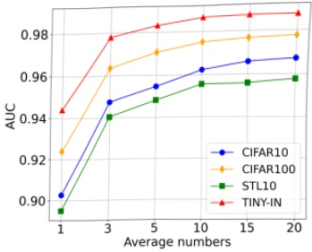
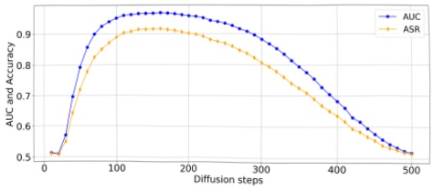

image.The results, presented in Table 2, demonstrate that our method outperforms baseline algorithms and does not require access to the Vision Transformer.

We also plot ROC curves for the DDIM train on CIFAR-10 and the Diffusion Transformer train on ImageNet in Appendix B. The curves further demonstrate the effectiveness of our method.

### 5.4. MIA with the Stable Diffusion Model

We conduct experiments on the original Stable Diffusion model, i.e., stable-diffusion-v1-4 provided by Huggingface, without further fine-tuning or modifications. We follow the experiment setup of (Duan et al., 2023; Kong et al., 2023), use the LAION-5B dataset (Schuhmann et al., 2022) as member and COCO2017-val (Lin et al., 2014) as non-member. We randomly select 2500 images in each dataset. We test two scenarios: Knowing the ground truth text, which we denote as Laion5; Not knowing the ground truth text and generating text through BLIP (Li et al., 2022), which we denote as Laion5 with BLIP.

For the difference function  $ D(x, \hat{x}) $, since the images in these datasets better correlate with human visual perception, we directly use the SSIM metric (Wang et al., 2004) to measure the differences between two images. The results, presented in Table 3, demonstrate that our methods achieve high accuracy in this setup, outperforming baseline algorithms by approximately 10%. Notably, our methods do not require access to U-Net.

### 5.5. Ablation Studies

In this section, we alter some experimental parameters to test the robustness of our algorithm. We primarily focus on the ablation study of DDIM and Diffusion Transformer, while the ablation study related to Stable Diffusion is provided in Appendix B.

The Impact of Average Numbers We test the effect of using different averaging numbers n on the results, as shown in Figure 3. It can be observed that averaging the images from multiple independent samples to generate the output  $ \hat{x} $ further improves accuracy. This observation validates the algorithm design intuition discussed in Section 4.2. Additional figures showing the ASR results are presented in Appendix B.

The Impact of Diffusion Steps We adjust the diffusion step t to examine its impact on the results. The experiments are conducted using the DDIM model on CIFAR-10 with diffusion steps for inference. The outcomes are presented in Figure 4. Our findings indicate that as long as a moderate step is chosen, the attack performance remains excellent, demonstrating that our algorithm is not sensitive to the choice of t. This further underscores the robustness of our algorithm. We also plot the change of diffusion step

Figure 3: The impact of average numbers. We train DDIM model on CIFAR-10. Averaging multiple independent samples proves to be effective in further improving the overall performance of our algorithm, which validates the intuition of our algorithm design.

for other diffusion models and datasets in the Appendix B.

Figure 4: The impact of diffusion steps on DDIM. We train a DDIM model on the CIFAR-10 dataset and use different diffusion steps for inference. We find that high accuracy can be achieved as long as a moderate step number is chosen. This opens up possibilities for practical applications in real-world scenarios.

The Impact of Sampling Intervals In DDIM and Diffusion Transformer, the model uses a set of steps denoted by  $ \tau_1 $,  $ \tau_2 $, ...,  $ \tau_T $. It samples each of these steps to create the image. The spacing between these steps is referred to as the sampling interval. We change the sampling interval  $ k $ and check the influence on the results. As shown in Figure 5, we adjust this parameter for attacks on both DDIM and Diffusion Transformer. We find that our method achieves high AUC values across different sampling intervals, demonstrating that our detection capabilities are not significantly limited by this parameter. Additionally, in Appendix B, we plot the effect of different sampling intervals on ASR and find that the impact is minimal.

## 6. An Application to DALL-E's API

In this section, we conduct a small experiment with online API services to test the effectiveness of our algorithm. We test with the DALL-E 2 (Ramesh et al., 2022) model since