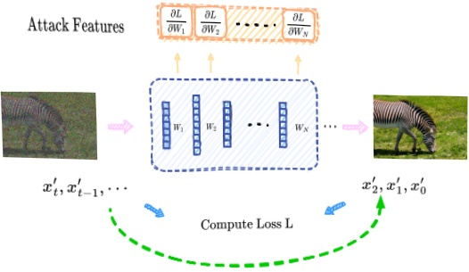

Figure 1: High-level pipeline of our attack: Given the target sample  $ x_{0} $, we first add noise based on Equation 1 and feed it to the target model shaded in blue. At each sample step, we can compute a loss L using Equation 2 to derive the gradients. Gradients from all sample steps (with appropriate subsampling and aggregation operations) are used as features to train the attack model for MIA.

Table 2: Impact of three different timestep-level sampling methods on attack accuracy and their respective time consumption.

<table border=1 style='margin: auto; word-wrap: break-word;'><tr><td style='text-align: center; word-wrap: break-word;'>Method</td><td style='text-align: center; word-wrap: break-word;'>ASR</td><td style='text-align: center; word-wrap: break-word;'>AUC</td><td style='text-align: center; word-wrap: break-word;'>TPR@1%FPR</td><td style='text-align: center; word-wrap: break-word;'>TPR@0.1%FPR</td><td style='text-align: center; word-wrap: break-word;'>Time (seconds)</td></tr><tr><td style='text-align: center; word-wrap: break-word;'>Effective</td><td style='text-align: center; word-wrap: break-word;'>0.947</td><td style='text-align: center; word-wrap: break-word;'>0.992</td><td style='text-align: center; word-wrap: break-word;'>0.663</td><td style='text-align: center; word-wrap: break-word;'>0.311</td><td style='text-align: center; word-wrap: break-word;'>21587</td></tr><tr><td style='text-align: center; word-wrap: break-word;'>Poisson</td><td style='text-align: center; word-wrap: break-word;'>0.801</td><td style='text-align: center; word-wrap: break-word;'>0.882</td><td style='text-align: center; word-wrap: break-word;'>0.270</td><td style='text-align: center; word-wrap: break-word;'>0.053</td><td style='text-align: center; word-wrap: break-word;'>2422</td></tr><tr><td style='text-align: center; word-wrap: break-word;'>Equidistant</td><td style='text-align: center; word-wrap: break-word;'>0.932</td><td style='text-align: center; word-wrap: break-word;'>0.981</td><td style='text-align: center; word-wrap: break-word;'>0.641</td><td style='text-align: center; word-wrap: break-word;'>0.304</td><td style='text-align: center; word-wrap: break-word;'>2398</td></tr></table>

range 1, ..., T, a separate loss and set of gradients are generated, further increasing the dimensionality of the overall gradients.

### 3.2 Gradient Dimensionality Reduction

We propose a general attack framework for reducing the dimensionality of the gradients while trying to keep the useful information for differentiating members vs non-members. It is composed of two common techniques: (1) subsampling, which chooses the most informative gradients in a principled way, and (2) aggregation, which combines/compresses those informative gradients data. We name the framework Gradient attack based on Subsampling and Aggregation (GSA).

We then present a three-level taxonomy outlining where these two techniques can be applied: at the timestep level, across different layers within the target model, and within specific gradients of each layer, as detailed below.

(1) Timestep Level: As corroborated by prior studies [4, 12, 27, 30, 35], diffusion models display distinct reactions to member and non-member samples depending on the timestep. For instance, Carlini et al. [4] identified a ‘Goldilock’s zone’, which yielded the most effective results in their attack, to be within the range  $ t \in [50, 300] $. We believe that the importance of gradient data also varies across different timesteps. Therefore, sampling the timesteps that contain the most useful information will undoubtedly result in more accurate attack outcomes. We refer to the attacks conducted on the most effective gradient data within the ‘Gold zone’ as effective sampling. However, implementing effective sampling requires detecting the ‘Gold zone’ in the target model each time, and the optimal timesteps for achieving the best attack accuracy may vary across different models. As a result, we propose two alternative sampling methods: equidistant sampling and poisson sampling. In equidistant sampling, the denoising steps are selected at intervals of  $ T/|K| $ (K refer to the sampled timesteps set) for any given model. In poisson sampling, an average rate parameter  $ \lambda(|K|/T) $ is used to randomly generate intervals following an exponential distribution, thereby selecting  $ |K| $ steps from a total of T steps. We then present a simple case study to test and compare these three different sampling methods.

(2) Layer-wise Selection and Aggregation: Beyond timesteps, the layers within the model present another pivotal dimension for subsampling and aggregation. Recognizing the nuances captured across layers—from basic patterns in shallower layers to intricate details in deeper ones—it is deemed essential to selectively harness gradients from these layers, especially the informative ones, to optimize the attack model's training.

(3) Gradients within Each Layer: Within each layer of a neural network, there is typically no specific ordering of the gradient data. Therefore, it is more reasonable to treat these gradients as a set [15].

Case Study. Since existing attacks [4, 12, 27, 30, 35] heavily focus on timestep-level selection, we designed a case study to better examine how different subsampling methods impact attack performance. We evaluated the attack accuracy using three sampling methods: effective sampling, equidistant sampling, and poisson sampling. For effective sampling, it is necessary to first identify the 'Gold zone'. To achieve this, we recorded the attack results in every 20 step across the T denoising steps. The timestep with the best attack performance, along with the 10 surrounding timesteps, was then selected as the sampling points for effective sampling. For equidistant sampling, we set step 1 as the initial step and then sample timesteps at fixed intervals of  $ T/|K| $. In contrast, poisson sampling uses  $ |K|/T $ as the parameter  $ \lambda $ to sample from the T steps.

We select 5000 samples from CIFAR-10 dataset to train DDPM as target model. For each sampling method, we set the number of sampling steps  $ (|K|) $ to 10. In Table 2, we found that effective sampling achieves the highest attack accuracy, while poisson sampling has the lowest. This result aligns with our initial assumption that using gradient data sampled from the 'Gold zone'—the interval yielding the best attack results on individual timesteps—would lead to optimal performance. In contrast, poisson sampling's randomness may lead to poor attack outcomes if the sampled timesteps cannot effectively discriminate between members and non-members.

However, in table 2, we also present the time consumption for implementing different sampling methods. We found that although effective sampling achieves high attack accuracy, it takes nearly 8 times longer compared to equidistant and poisson sampling. This is because effective sampling requires precomputing the attack performance for numerous timesteps to identify the 'Gold zone'. Meanwhile, equidistant sampling only slightly reduces the ASR by 0.015 and the AUC by 0.011 compared to effective sampling, while being