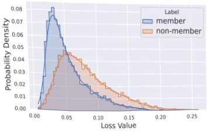
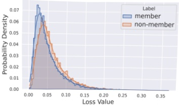
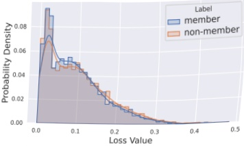

Figure 2: Loss distribution for member vs. non-member samples across CIFAR-10, ImageNet, and MS COCO (from left to right), used by existing work [4, 27, 35]. Models use default settings from Table 3.

to utilize the ImageNet test set as the training set for training the models in our work.

CIFAR-10 dataset comprises 10 categories of  $ 32 \times 32 $ color images, with each category containing 6,000 images. These categories include airplanes, automobiles, birds, cats, deer, dogs, frogs, horses, ships, and trucks. In total, the dataset consists of 60,000 images, of which 50,000 are designated for training and 10,000 for testing. The CIFAR-10 dataset is commonly employed as a benchmark for image classification and object recognition tasks in the fields of machine learning and computer vision.

MS COCO dataset contains over 200,000 labeled high-resolution images collected from the internet, with a total of 1.5 million object instances and 80 different object categories. The categories cover a wide range of common objects, including people, animals, vehicles, and household items, among others. The MS COCO dataset is noteworthy for its diversity and the complexity of its images and annotations. Images in the MS COCO dataset depict a wide variety of scenes and object layouts. In this experiment, we utilize all images from the MS COCO training set for model training. The first caption from the five associated with each image is selected as the corresponding textual description.

### 4.2 Training Setup

Table 3: Default parameters used for the experiments.

<table border=1 style='margin: auto; word-wrap: break-word;'><tr><td style='text-align: center; word-wrap: break-word;'>Parameters</td><td style='text-align: center; word-wrap: break-word;'>Unconditional Diffusion</td><td style='text-align: center; word-wrap: break-word;'>Unconditional Diffusion</td><td style='text-align: center; word-wrap: break-word;'>Imagen</td></tr><tr><td style='text-align: center; word-wrap: break-word;'>Channels</td><td style='text-align: center; word-wrap: break-word;'>128</td><td style='text-align: center; word-wrap: break-word;'>128</td><td style='text-align: center; word-wrap: break-word;'>128</td></tr><tr><td style='text-align: center; word-wrap: break-word;'>Diffusion steps</td><td style='text-align: center; word-wrap: break-word;'>1000</td><td style='text-align: center; word-wrap: break-word;'>1000</td><td style='text-align: center; word-wrap: break-word;'>1000</td></tr><tr><td style='text-align: center; word-wrap: break-word;'>Dataset</td><td style='text-align: center; word-wrap: break-word;'>CIFAR-10</td><td style='text-align: center; word-wrap: break-word;'>ImageNet</td><td style='text-align: center; word-wrap: break-word;'>MS COCO</td></tr><tr><td style='text-align: center; word-wrap: break-word;'>Training data size</td><td style='text-align: center; word-wrap: break-word;'>8000</td><td style='text-align: center; word-wrap: break-word;'>8000</td><td style='text-align: center; word-wrap: break-word;'>30000</td></tr><tr><td style='text-align: center; word-wrap: break-word;'>Resolution</td><td style='text-align: center; word-wrap: break-word;'>32</td><td style='text-align: center; word-wrap: break-word;'>64</td><td style='text-align: center; word-wrap: break-word;'>64</td></tr><tr><td style='text-align: center; word-wrap: break-word;'>Learning rate</td><td style='text-align: center; word-wrap: break-word;'>$ 1 \times 10^{-4} $</td><td style='text-align: center; word-wrap: break-word;'>$ 1 \times 10^{-4} $</td><td style='text-align: center; word-wrap: break-word;'>$ 1 \times 10^{-4} $</td></tr><tr><td style='text-align: center; word-wrap: break-word;'>Batch size</td><td style='text-align: center; word-wrap: break-word;'>64</td><td style='text-align: center; word-wrap: break-word;'>64</td><td style='text-align: center; word-wrap: break-word;'>64</td></tr><tr><td style='text-align: center; word-wrap: break-word;'>Noise schedule</td><td style='text-align: center; word-wrap: break-word;'>linear</td><td style='text-align: center; word-wrap: break-word;'>linear</td><td style='text-align: center; word-wrap: break-word;'>linear, cosine</td></tr><tr><td style='text-align: center; word-wrap: break-word;'>Learning rate schedule</td><td style='text-align: center; word-wrap: break-word;'>cosine</td><td style='text-align: center; word-wrap: break-word;'>cosine</td><td style='text-align: center; word-wrap: break-word;'>cosine</td></tr><tr><td style='text-align: center; word-wrap: break-word;'>Training time</td><td style='text-align: center; word-wrap: break-word;'>400 epochs</td><td style='text-align: center; word-wrap: break-word;'>400 epochs</td><td style='text-align: center; word-wrap: break-word;'>600,000 steps</td></tr></table>

We tabulated the default training parameters for the unconditional diffusion model on CIFAR-10 and ImageNet, and for Imagen on MS COCO, in Table 3. Given that we have employed ASR (Accuracy) as our evaluation metric, we endeavor to maintain a balance between the quantities of the member set and the non-member set to ensure the precision of model validation. The structure for the unconditional diffusion model aligns with those from the diffusers library [60] in Huggingface. Imagen is based on the open-source implementation by Phil Wang et al. $ ^{3} $, and we have retained consistency in its configuration. All experiments were conducted using two NVIDIA A100 GPUs.

### 4.3 Metrics

In the process of comparing experimental results, we employ Attack Success Rate (ASR) [6], Area Under the ROC Curve (AUC), and True-Positive Rate (TPR) values under fixed low False-Positive Rate (FPR) as evaluation metrics.

In our experiments, we ensure an equal number of member and non-member image samples. Given the balanced nature of our dataset and the stability of ASR in such contexts, we employ ASR as our primary evaluation metric.

We note that most instances MIAs on diffusion models use the AUC metric for evaluation [4, 12, 27, 30, 35]. Likewise, in assessing the merits of our work in Section 5.1, we will also use AUC as one of our assessment metrics. Additionally, as Carlini et al. [3] argued that TPR under a low FPR scenario is a key evaluation criterion, we also use TPR at 1% FPR and 0.1% FPR, respectively.

## 5 Evaluation Results

### 5.1 Comparison with Existing Methods

Table 4: Existing white-box attacks on the CIFAR-10 dataset are benchmarked using four distinct metrics. LiRA $ ^{*} $, LSA $ ^{*} $, GSA $ _{1} $, and GSA $ _{2} $ are all obtained under the same conditions.

<table border=1 style='margin: auto; word-wrap: break-word;'><tr><td rowspan="2">Attack method</td><td colspan="4">CIFAR-10</td></tr><tr><td style='text-align: center; word-wrap: break-word;'>ASR $ ^{\dagger} $</td><td style='text-align: center; word-wrap: break-word;'>AUC $ ^{\dagger} $</td><td style='text-align: center; word-wrap: break-word;'>TPR@1%FPR(\%)^{ $ \dagger $}</td><td style='text-align: center; word-wrap: break-word;'>TPR@0.1%FPR(\%)^{ $ \dagger $}</td></tr><tr><td style='text-align: center; word-wrap: break-word;'>Baseline</td><td style='text-align: center; word-wrap: break-word;'>0.736</td><td style='text-align: center; word-wrap: break-word;'>0.801</td><td style='text-align: center; word-wrap: break-word;'>5.65</td><td style='text-align: center; word-wrap: break-word;'>-</td></tr><tr><td style='text-align: center; word-wrap: break-word;'>LiRA</td><td style='text-align: center; word-wrap: break-word;'>-</td><td style='text-align: center; word-wrap: break-word;'>0.982</td><td style='text-align: center; word-wrap: break-word;'>5(5M) 99(102M)</td><td style='text-align: center; word-wrap: break-word;'>7.1</td></tr><tr><td style='text-align: center; word-wrap: break-word;'>Strong LiRA</td><td style='text-align: center; word-wrap: break-word;'>-</td><td style='text-align: center; word-wrap: break-word;'>0.997</td><td style='text-align: center; word-wrap: break-word;'>-</td><td style='text-align: center; word-wrap: break-word;'>29.4</td></tr><tr><td style='text-align: center; word-wrap: break-word;'>LiRA $ ^{*} $</td><td style='text-align: center; word-wrap: break-word;'>0.626</td><td style='text-align: center; word-wrap: break-word;'>0.71</td><td style='text-align: center; word-wrap: break-word;'>1.45</td><td style='text-align: center; word-wrap: break-word;'>0.25</td></tr><tr><td style='text-align: center; word-wrap: break-word;'>LSA $ ^{*} $</td><td style='text-align: center; word-wrap: break-word;'>0.83</td><td style='text-align: center; word-wrap: break-word;'>0.909</td><td style='text-align: center; word-wrap: break-word;'>13.77</td><td style='text-align: center; word-wrap: break-word;'>0.925</td></tr><tr><td style='text-align: center; word-wrap: break-word;'>GSA $ _{1} $</td><td style='text-align: center; word-wrap: break-word;'>0.993</td><td style='text-align: center; word-wrap: break-word;'>0.999</td><td style='text-align: center; word-wrap: break-word;'>99.7</td><td style='text-align: center; word-wrap: break-word;'>82.9</td></tr><tr><td style='text-align: center; word-wrap: break-word;'>GSA $ _{2} $</td><td style='text-align: center; word-wrap: break-word;'>0.988</td><td style='text-align: center; word-wrap: break-word;'>0.999</td><td style='text-align: center; word-wrap: break-word;'>97.88</td><td style='text-align: center; word-wrap: break-word;'>58.57</td></tr></table>

 $ ^{3} $Code available at https://github.com/lucidrains/imagen-pytorch