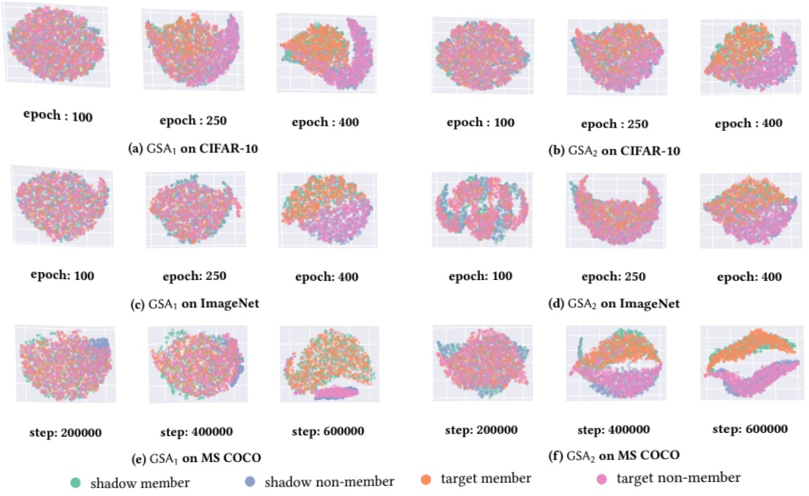

Figure 3: The left and right columns display the visualization of high-dimensional gradient information using t-SNE after GSA₁ and GSA₂ have respectively executed attacks on the three datasets (using the output from the last layer of our attack model). For all six attacks, it is observed that member and non-member samples are distinctly differentiated when reaching the training steps defined by the default settings (as referenced in Table 3).

We benchmark GSA₁ and GSA₂ against existing methodologies, maintaining all other model parameters consistent. Contrasting traditional loss-based white-box attacks such as LiRA [4] and others techniques [27, 35], we provide a thorough evaluation highlighting the superior efficacy of GSA₁ and GSA₂. The baseline approach [27, 35, 64] depicted in Table 4 is the most intuitive, which predicts the sample as a non-member if the loss exceeds a certain value and vice versa [35]. This also represents the most traditional judgment method in MIA, utilized here as the baseline.

5.1.1 Feature Informative. LSA $ ^{*} $ refers to the results of training the attack model using the loss under the same training conditions and sampling frequency as GSA $ _{1} $ and GSA $ _{2} $. The sole distinction between LSA $ ^{*} $ and GSA lies in their features: while LSA $ ^{*} $ utilizes loss as its attack feature, GSA employs the gradient. Comparative results between them substantiate that the gradient information of the diffusion model is more aptly suited as attack features.

It is apparent from Table 4 that both GSA₁ and GSA₂ exceed other techniques in terms of all evaluation metrics. Under the AUC criterion, LiRA [4] also attains a high attack accuracy, attributed to excessive training steps and many shadow models. However, when ensuring an equivalent quantity of shadow models and training epochs for the LiRA based on the LiRA framework, its ASR, TPR, and AUC scores are significantly lower compared to GSA₁ and GSA₂. In the original paper, the LiRA framework achieves TPRs of 5% after training for 200 epochs, with the FPRs fixed at 1%. Remarkably, after training for 4080 epochs, the TPR increases to 99%. In contrast, for GSA₁ and GSA₂, TPRs of 99.7% and 78.75% are respectively achieved after only 400 epochs, underscoring a more efficient attack strategy. This essentially corroborates our core proposition that gradient information of the model exhibits a more pronounced response to member set samples than loss.

5.1.2 Timestep Selection. Moreover, the ‘time zone’ demonstrating discernible differences in the loss distribution between members and non-members vary across different models and datasets [4, 12, 27, 35]. Consequently, to achieve a more potent attack, it becomes imperative to extract the loss and establish thresholds or distributions for each timestep using shadow models, aiming to pinpoint the most efficacious ‘time zone’. In contrast, both GSA₁ and GSA₂ execute attacks by solely harnessing the gradient information derived from equidistant sampling timesteps across the T diffusion steps, achieving similar attack accuracy in just one-thirtieth of the time. Given a consistent dataset size and model architecture, extracting loss across T steps takes 36 hours. In contrast, GSA₁ and GSA₂ achieve the same accuracy level in less than 1 hour by extracting gradients from 10 equidistant sampling timesteps.

To further demonstrate that the optimal timestep for distinguishing between member and non-member samples using loss varies across different datasets and models. We plot the loss distribution