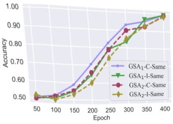
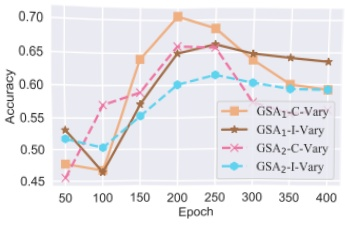
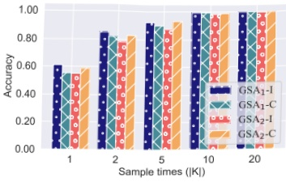

(a) Impact of training epoch

(b) Impact of  $ |K| $

Figure 4: “-I-” and “-C-” denote experiments with ImageNet and CIFAR-10 datasets. Panel (a) (left) reveals that attacks are more effective when shadow and target models closely fit the training data; (right) however, increased fitting disparities between them weaken the attack. Panel (b) shows that greater sampling frequency boosts the attack’s effectiveness, possibly due to acquiring finer data and getting more informative timestep.

for three distinct datasets used in our experiment: CIFAR-10, ImageNet, and MS COCO. Following the methodology of LiRA in attacking diffusion models [4], we identified the optimal timestep for each of the three distinct datasets that best distinguishes member from non-member samples. For this, we equidistantly sampled 10 timesteps from shadow models (the training times of these shadow models align with those presented in Table 3). However, we observed that the identified timesteps across the three datasets were not consistent. Upon visualizing the loss distribution at these specific timesteps in Figure 2, we found that even at these optimal points, the loss distribution did not effectively differentiate between member and non-member samples. DDPM trained on the CIFAR-10 dataset clearly differentiates between member and non-member loss distributions. However, such a difference is not pronounced for models trained on ImageNet and MS COCO datasets. For models to execute attacks on the ImageNet and MS COCO datasets, it is essential to compute the loss distribution across a broader range of timesteps and increase their training time.

Using the same model parameters and sampling frequency as in Figure 2, we tried attacks with GSA₁ and GSA₂. The attack features were derived from the gradients of timesteps sampled from T using the same sampling frequency as previously employed. We visualized this high-dimensional gradient information using t-SNE [59] in Figure 3. It can be observed quite intuitively, that across all datasets, both GSA₁ and GSA₂ can effortlessly differentiate between target member and target non-member data using the features derived from the gradients of shadow models.

• In the first scenario, the attacker knows the target model's training epochs and matches the shadow model's training accordingly.

### 5.2 Attacking Unconditional Diffusion Model

In this section, we trained six shadow models to facilitate the attack. We focus on unconditional diffusion models and test on CIFAR-10 and ImageNet datasets.

Training on Different Epochs. Our first goal is to understand how varying training epochs for target and shadow models influence our attacks. We considered two possible scenarios.

• In the second scenario, the attacker is unaware of the target model's training details and varies only the shadow model's training epochs for experimentation.

In Figure 4a, we present the experimental results under the first scenario. These findings indicate that as the training epochs for both the target and shadow models increase, the attack success rate for GSA₁ and GSA₂ consistently improves. In this context, the suffixes “-I” and “-C-” refer to experiments on ImageNet and CIFAR-10, respectively. We postulate that with an increasing number of epochs, the model tends to fit the training data more closely after convergence. This amplifies the gradient discrepancy between member and non-member samples, subsequently bolstering the efficacy of the attack.

In the second scenario setting, when the training epochs of the target model are fixed at 200 epochs, the attack accuracy is optimal when the shadow model's training epochs closely match those of the target model. Furthermore, observations from Figure 4a suggest that the overall efficacy of membership inference attacks is closely tied to the consistency in the degree of fit between the shadow models and their training data as compared to that of the target model with its training data. When shadow models exceed the target model in data fitting, it does not invariably lead to an improved attack performance. Contrarily, the attack's success rate might diminish due to disparities in their fitting levels.

Then, our experiments explore the influence of the degree of overfitting in both shadow and target models on attack accuracy. Moreover, we examine the impact of discrepancies in data-fitting levels between the target and shadow models on the performance of the attack.

Sampling Frequency Variation Analysis. In both GSA₁ and GSA₂, the term 'sample times' (|K|) refers to the number of elements in the set K, derived through the equidistant sampling of timesteps from T. GSA₁ and GSA₂ employ statistical methods on distinct pieces of information; the former determines the mean loss over the |K| timesteps, while the latter computes the average gradient value. Our initial hypothesis was that an increased number of sampling instances, providing the attack model with more information and potentially capturing distinct timesteps that clearly