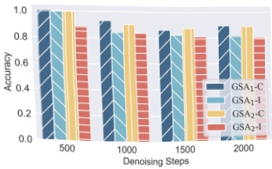
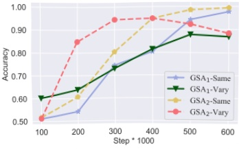
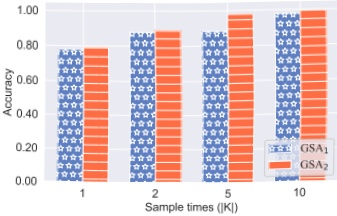
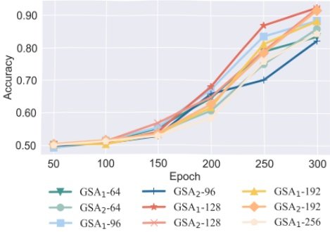

(a) Impact of diffusion steps

(b) Impact of training epoch

(c) Impact of  $ |K| $

Figure 5: Notations “-I-” and “-C-” are consistent with those in Figure 4a. Panel (a) suggests that increasing the number of diffusion steps, which decelerates convergence, results in a reduced attack success rate. Panel (b) reinforces findings from Figure 4a: enhanced data-fitting by both the shadow and target models boosts the attack’s efficacy. However, when there are disparities in the data fitting, the efficacy diminishes. Panel (c) shows that augmenting the sampling steps for Imagen—thus acquiring more information—significantly improves the attack’s success rate.

Table 5: The table presents the performance results of GSA₁ and GSA₂, trained on three different datasets and evaluated using four distinct evaluation metrics.

<table border=1 style='margin: auto; word-wrap: break-word;'><tr><td rowspan="2">Attack method</td><td colspan="2">ASR $ \uparrow $</td><td colspan="3">AUC $ \uparrow $</td><td colspan="3">TPR@1%FPR $ \uparrow $</td><td colspan="3">TPR@0.1%FPR $ \uparrow $</td></tr><tr><td style='text-align: center; word-wrap: break-word;'>CIFAR-10</td><td style='text-align: center; word-wrap: break-word;'>ImagetNet</td><td style='text-align: center; word-wrap: break-word;'>MS COCO</td><td style='text-align: center; word-wrap: break-word;'>CIFAR-10</td><td style='text-align: center; word-wrap: break-word;'>ImagetNet</td><td style='text-align: center; word-wrap: break-word;'>MS COCO</td><td style='text-align: center; word-wrap: break-word;'>CIFAR-10</td><td style='text-align: center; word-wrap: break-word;'>ImagetNet</td><td style='text-align: center; word-wrap: break-word;'>MS COCO</td><td style='text-align: center; word-wrap: break-word;'>CIFAR-10</td><td style='text-align: center; word-wrap: break-word;'>ImagetNet</td></tr><tr><td style='text-align: center; word-wrap: break-word;'>LSA</td><td style='text-align: center; word-wrap: break-word;'>0.822</td><td style='text-align: center; word-wrap: break-word;'>0.702</td><td style='text-align: center; word-wrap: break-word;'>0.684</td><td style='text-align: center; word-wrap: break-word;'>0.896</td><td style='text-align: center; word-wrap: break-word;'>0.766</td><td style='text-align: center; word-wrap: break-word;'>0.746</td><td style='text-align: center; word-wrap: break-word;'>0.146</td><td style='text-align: center; word-wrap: break-word;'>0.034</td><td style='text-align: center; word-wrap: break-word;'>0.073</td><td style='text-align: center; word-wrap: break-word;'>0.021</td><td style='text-align: center; word-wrap: break-word;'>0.004</td></tr><tr><td style='text-align: center; word-wrap: break-word;'>GSA $ _{1} $</td><td style='text-align: center; word-wrap: break-word;'>0.993</td><td style='text-align: center; word-wrap: break-word;'>0.992</td><td style='text-align: center; word-wrap: break-word;'>0.977</td><td style='text-align: center; word-wrap: break-word;'>0.999</td><td style='text-align: center; word-wrap: break-word;'>0.999</td><td style='text-align: center; word-wrap: break-word;'>0.997</td><td style='text-align: center; word-wrap: break-word;'>0.997</td><td style='text-align: center; word-wrap: break-word;'>0.995</td><td style='text-align: center; word-wrap: break-word;'>0.954</td><td style='text-align: center; word-wrap: break-word;'>0.829</td><td style='text-align: center; word-wrap: break-word;'>0.937</td></tr><tr><td style='text-align: center; word-wrap: break-word;'>GSA $ _{2} $</td><td style='text-align: center; word-wrap: break-word;'>0.988</td><td style='text-align: center; word-wrap: break-word;'>0.983</td><td style='text-align: center; word-wrap: break-word;'>0.994</td><td style='text-align: center; word-wrap: break-word;'>0.999</td><td style='text-align: center; word-wrap: break-word;'>0.999</td><td style='text-align: center; word-wrap: break-word;'>0.999</td><td style='text-align: center; word-wrap: break-word;'>0.979</td><td style='text-align: center; word-wrap: break-word;'>0.964</td><td style='text-align: center; word-wrap: break-word;'>0.998</td><td style='text-align: center; word-wrap: break-word;'>0.586</td><td style='text-align: center; word-wrap: break-word;'>0.743</td></tr></table>

Figure 6: Results from ImageNet represent the resolution of the image can influence the attack's training accuracy by affecting the model's convergence rate.

model and shadow models. Precisely, the more the target model overfits the data, the higher the success rate of the MIA, even if the overfitting phenomenon during the shadow model's training is not notably pronounced. For example, Figure 5b shows that when deploying the GSA₂ method with the shadow model trained for 200,000 steps, an attack success rate of up to 84.9% can be achieved if the target model has been trained for 400,000 steps. However, if the target model's training steps are only 200,000, the attack success rate drops to merely 60.7%, representing a nearly 25% decrease in accuracy. Hence, the degree to which the target model fits the data profoundly influences the effectiveness of the attack. Surprisingly, when the training steps of the shadow models exceed those of the target model, further increasing the training steps for the shadow models leads to a decline in the success rate of MIA attacks. This finding is similar to the phenomenon observed in Section 5.2 (i.e., the efficacy of the attack is intimately linked to the disparity in data-fitting degrees between the shadow models and their training datasets and the target model with its respective training data.).

Sampling Frequency Variation Analysis. It is evident, as depicted in Figure 5c, that the frequency of information extraction from a single sample by the model plays a pivotal role in influencing the success rate of the attack. Specifically for Imagen, when both shadow models have undergone extensive training iterations, the attack model trained with  $ |K| = 10 $ achieves a remarkable accuracy of 99.4%. More intriguingly, when the FPR is controlled at 1% and 0.1%, the TPR is recorded at 99.78% and 97.52% respectively. These remarkable findings highlight a substantial increase in accuracy, forming a significant discrepancy compared to the basic accuracy level of 78.1% achieved with  $ |K| = 1 $.

Through the utilization of two approaches, GSA₁ and GSA₂, we seek to elucidate the impact of equidistant timestep sampling frequency on MIA, mainly when applied to large-scale models such as