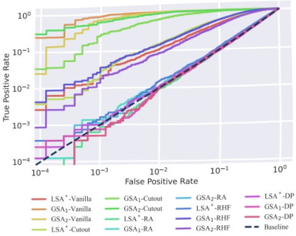

Imagen. The ultimate goal is to ascertain if we can conserve computational resources without compromising attack effectiveness.

In Figure 5c, we maintain consistent training iterations for both the target and shadow models. This graph depicts how different equidistant timestep sampling frequencies affect the success rate of GSA₁ and GSA₂. We experimented with four distinct frequencies: 1, 2, 5, and 10. Evidently, when restricted to one sampling time, the attack success rate plummets to the lowest. When the sampling frequency doubles, the attack success rate sees a notable increase. The outcome difference between two and five sampling times is minimal for GSA₁. Nevertheless, at a frequency of five times, GSA₂ achieves a success rate comparable to GSA₁ with ten sample times Impressively, ten sampling times boosts GSA₂'s success rate to nearly 100%, indicating a marked improvement. Given the high accuracy achieved by sampling ten times for each sample, further sampling appears unnecessary.

Takeaways: We tested our two attacks primarily on the large-scale model, Imagen, taking into account two factors: the number of training epochs and the timestep sampling frequency. We have examined how overfitting and timestep selection frequency affect the efficacy of our attack strategies.

## 6 Ablation Study

Following the framework described in Section 3.2, our approach effectively subsamples and aggregates gradients across various dimensions. As evident in Table 5, both GSA₁ and GSA₂ demonstrate exemplary performance on all experiments. Subsequently, we further explore the potential for subsampling and aggregating information from the model layer dimension. We aim to ascertain how gradient data from the model layer influences the attack success rates of GSA₁ and GSA₂. Initially, both GSA₁ and GSA₂ extracted gradient information from every layer of the model for the training of the attack model. However, with the increasing size of dataset and growing model complexity, the computational overhead also rises. Thus, we aim to investigate whether it is feasible to ensure the attack success rates of GSA₁ and GSA₂ without necessarily extracting gradient information from all layers of the model.

Pursuant to this idea, We once again conducted experiments using GSA₁ and GSA₂ on datasets, including CIFAR-10, ImageNet, and MS COCO, while maintaining all other settings according to the default configuration in Table 3. We gradually increased the depth of layers from which we collected gradient information. As illustrated in Figure 9, the x-axis denotes the cumulative number of layers from which gradients are gathered, starting from the top layer. The y-axis employs the True Positive Rate (TPR) at a False Positive Rate (FPR) of 0.1% as the evaluative criterion. The results indicate that as we collect gradient information from increasing layers, the attack success rate correspondingly escalates due to enhanced information accessibility. Remarkably, attaining the highest attack success rate can be achieved merely by gathering gradient data from the top 80% layers of the models. Accordingly, it may not be essential to extract gradient information from each distinct layer of the model, potentially leading to significant computational resource savings.

Figure 7: The performance of LSA $ ^{*} $, GSA $ _{1} $ and GSA $ _{2} $ under varying defensive strategies is displayed. ‘Vanilla’ refers to the model without any defense methods. ‘RA’ represents RandAugment, and ‘RHF’ denotes RandomHorizontalFlip.

## 7 Defenses

Membership inference attacks are significantly fueled by the overfitting of models to their training data. Thus, mitigating overfitting, such as through data augmentation, could reduce the success rate of these attacks. We employed various methods of data augmentation [8, 9] methods and DP-SGD [1, 13], a strong privacy-preserving method, as defensive mechanisms against the LSA $ ^{*} $, GSA $ _{1} $ and GSA $ _{2} $ attacks. The results following the implementation of these defense mechanisms are presented in Table 6.

Firstly, fundamental data augmentation techniques such as Cutout [9] and RandomHorizontalFlip (RHF) were employed as defensive measures. All experiments against LSA*, GSA₁, and GSA₂ were conducted using DDPM [21] trained on the CIFAR-10 dataset. In these experiments, the model parameters for LSA* were identical to those for GSA₁ and GSA₂, with the only difference being that LSA* used the loss value as attack features. As shown in Table 6, without any added defense mechanisms, all three attacks achieved high success rates, with GSA₁ and GSA₂ outperforming LSA* (aligned with Section 5.1). When Cutout and RandomHorizontalFlip were applied, LSA* was much more affected than GSA₁ and GSA₂. Specifically, LSA*’s ASR and AUC dropped to around 50% with RHF, while GSA₁ and GSA₂ maintained ASR near 0.80 and AUC scores are above 0.80. This represents that when defending against fundamental data augmentations, the gradient-based GSA₁ and GSA₂ are more robust compared to the loss-based LSA*.

Then, we evaluated the attack performance of LSA*, GSA₁, and GSA₂ using more powerful defensive strategies: DP-SGD [1, 13] and RandAugment [8]. DP-SGD, a widely used method, protects training datasets in machine learning by adding noise to the gradient of each sample, thereby ensuring data privacy. In our experiment, we set the clipping bound C to 1 and the failure probability δ to  $ 1 \times 10^{-5} $, keeping the experimental settings consistent with the