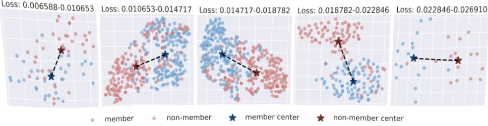

Figure 8: Use t-SNE to represent the member and non-member data pair with the same loss value (rounded to  $ 1e^{-7} $) across five loss intervals. The input to t-SNE is the output of each sample from the last layer of the attack model.

### B Additional Likelihood Ratio Attack Details

Carlini et al. [3] contend that it is erroneous to consider the ramifications of misclassifying a sample as a member of the set as identical to those of incorrect non-member set designation. As a result, they proposed a new evaluation metric and introduced their improved method, LiRA, which proved to be far more effective than previous MIA attack methods in experiments, with up to ten times more efficacy under low False Positive Rates (FPRs). The shadow training technique is also needed here, but it involves creating  $ D_{in} $ and  $ D_{out} $ based on each shadow model's response to the same sample depending on whether the sample was used in the model's training or not. This attack method is white-box as it requires access to the model's output loss and some prior knowledge of the target member's dataset, necessitating the use of target points in the shadow model's training.

 $$ \Lambda=\frac{p(\mathrm{conf_{obs}}\mid\mathbb{D}_{\mathrm{in}}(x,y))}{p(\mathrm{conf_{obs}}\mid\mathbb{D}_{\mathrm{out}}(x,y))} $$ 

The term 'confobs' refers to the value generated by applying negative exponentiation and logit scaling to the loss produced by the target model for an observed image. 'D_{in}' represents the distribution derived from the processed loss for the member set, while 'D_{out}' stands for the distribution established based on the loss generated for the non-member set samples.

Evidently, the form of LiRA's online attack necessitates retraining the shadow model each time a target point  $ (x, y) $ is obtained. This approach represents a substantial and arguably uneconomical consumption of resources.

Hence, after proposing this online attack form with many constraints, Carlini et al [3]. suggested an improved offline attack form that does not require target points in shadow models' training and modifies the attack form to:

 $$ \Lambda=1-\operatorname{P r}[Z>\operatorname{c o n f}_{\mathrm{o b s}}],\mathrm{w h e r e}Z\sim\mathbb{D}_{\mathrm{o u t}}(x,y)). $$ 

However, the success rate of offline attacks is considerably lower compared to online attacks.

### C Additional Information for Methodology

In Section 3, we establish the theoretical foundation for GSA₁ and GSA₂. Specifically, we emphasize that the loss-based attack faces a challenge: when member and non-member samples have the same loss value, the attack loses effectiveness. We demonstrate that, in this situation, the gradient data differ between the two samples.

Therefore, we aim to provide experimental evidence to support this claim in this section. Following the attack pipeline, we continue to use gradient data from the shadow model to train an attack model. Then, we compare the loss values of member and non-member samples in the target model. When the loss values of member and non-member samples are the same, we collect them as a data pair. After collecting all data pairs in the target model member/non-member set, we feed all data pairs into the attack model and extract embeddings from the last layer as inputs to do the t-SNE visualization. In Figure 8, we divide the range of loss values into five intervals and present the data pairs in each interval. It is clear that members and non-members can have different gradients in each data pair. Moreover, the member and non-member samples can form distinct clusters. These results indicate that the challenge posed by identical loss values can be overcome by using gradient data, and that gradient data can serve as better features for the attack.

### D A $ ^{n} $ - - - -

Drawing from the deterministic reversing and sampling techniques in diffusion models as presented by Song et al. [57] and Kim et al. [29], Duan et al. [12] proposed a query-based method that leverages the sampling process and reverse sampling process error at timestep t as the attack feature. The approximated posterior estimation error can be expressed as:

 $$ \tilde{\ell}_{t,x_{0}}=\|\psi_{\theta}(\phi_{\theta}(\tilde{x}_{t},t),t)-\tilde{x}_{t}\|^{2} $$ 

where

 $$ \psi_{\theta}(x_{t},t)=\sqrt{\bar{\alpha}_{t-1}}f_{\theta}(x_{t},t)+\sqrt{1-\bar{\alpha}_{t-1}}\epsilon_{\theta}(x_{t},t) $$ 

represents the deterministic denoising step, and

 $$ \phi_{\theta}(x_{t},t)=\sqrt{\bar{\alpha}_{t+1}}f_{\theta}(x_{t},t)+\sqrt{1-\bar{\alpha}_{t+1}}\epsilon_{\theta}(x_{t},t) $$ 

signifies the deterministic reverse step(also called DDIM deterministic forward process [29]) at time t, as defined in the original work [29, 54, 57].  $ \tilde{x}_t $ is obtained from the recursive application of  $ \phi_\theta $, given by  $ \phi_\theta(\ldots \phi_\theta(\phi_\theta(x_0,0),1),t-1) $.

Based on  $ \tilde{\ell}_{t,x_0} $, the authors proposed SecMI $ _{stat} $ and SecMI $ _{NNs} $, which employs the threshold-based attack approach [64] and neural network-based attack method [52], respectively.