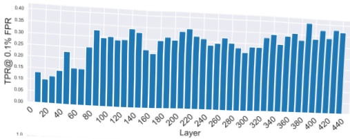
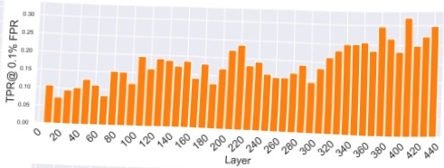
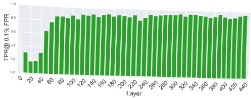
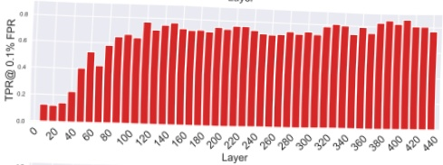
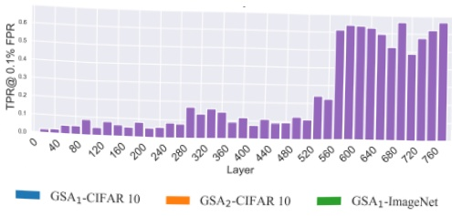
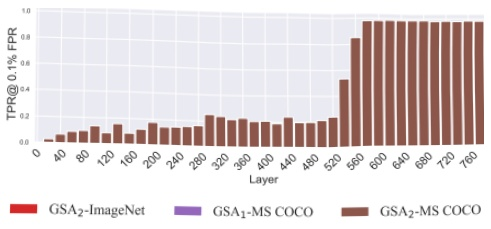

Figure 9: Using GSA₁ and GSA₂ on CIFAR-10, ImageNet, and MS COCO, we can reduce the layers needed for gradient extraction without compromising attack effectiveness. Notably, for attacks on ImageNet-trained DDPM, only 30% of the layers are required for a successful attack.

